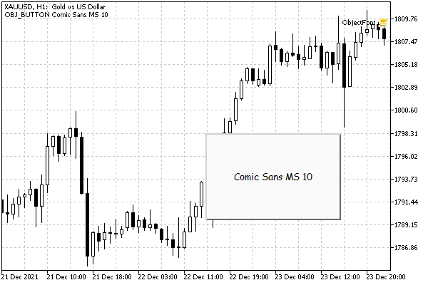

# Font settings

All types of objects enable the setting of certain texts for them (OBJPROP_TEXT). Many of them display the specified text directly on the chart, for the rest it becomes an informative part of the tooltip.

When text is displayed inside an object (for types OBJ_TEXT, OBJ_LABEL, OBJ_BUTTON, and OBJ_EDIT), you can choose a font name and size. For objects of other types, the font settings are not applied: their descriptions are always displayed in the chart's standard font.

| Identifier | Description | Type |
| --- | --- | --- |
| OBJPROP_FONTSIZE | Font size in pixels | int |
| OBJPROP_FONT | Font | string |

You cannot set the font size in [printing points](/en/book/advanced/resources/resources_textout) here.

The test script ObjectFont.mq5 creates objects with text and changes the name and font size. Let's use the ObjectBuilder class from the previous script.

At the beginning of OnStart, the script calculates the middle of the window both in screen coordinates and in the time/price axes. This is required because objects of different types participating in the test use different coordinate systems.

```
void OnStart()
{
   const string name = "ObjFont-";
   
   const int bars = (int)ChartGetInteger(0, CHART_WIDTH_IN_BARS);
   const int first = (int)ChartGetInteger(0, CHART_FIRST_VISIBLE_BAR);
   
   const datetime centerTime = iTime(NULL, 0, first - bars / 2);
   const double centerPrice =
      (ChartGetDouble(0, CHART_PRICE_MIN)
      + ChartGetDouble(0, CHART_PRICE_MAX)) / 2;
   
   const int centerX = (int)ChartGetInteger(0, CHART_WIDTH_IN_PIXELS) / 2;
   const int centerY = (int)ChartGetInteger(0, CHART_HEIGHT_IN_PIXELS) / 2;
   ...

```

The list of tested object types is specified in the types array. For some of them, in particular OBJ_HLINE and OBJ_VLINE, the font settings will have no effect, although the text of the descriptions will appear on the screen (to ensure this, we turn on the CHART_SHOW_OBJECT_DESCR mode).

```
   ChartSetInteger(0, CHART_SHOW_OBJECT_DESCR, true);
   
   ENUM_OBJECT types[] =
   {
      OBJ_HLINE,
      OBJ_VLINE,
      OBJ_TEXT,
      OBJ_LABEL,
      OBJ_BUTTON,
      OBJ_EDIT,
   };
   int t = 0; // cursor
   ...

```

The t variable will be used to sequentially switch from one type to another.

The fonts array contains the most popular standard Windows fonts.

```
   string fonts[] =
   {
      "Comic Sans MS",
      "Consolas",
      "Courier New",
      "Lucida Console",
      "Microsoft Sans Serif",
      "Segoe UI",
      "Tahoma",
      "Times New Roman",
      "Trebuchet MS",
      "Verdana"
   };
   
   int f = 0; // cursor
   ...

```

We will iterate over them using the f variable.

Inside the demo loop, we instruct ObjectBuilder to create an object of the current type types[t] in the middle of the window (for unification, the coordinates are specified in both coordinate systems, so as not to make differences in the code depending on the type: coordinates not supported by the object simply will not have an effect).

```
   while(!IsStopped())
   {
      
      const string str = EnumToString(types[t]);
      ObjectBuilder *object = new ObjectBuilder(name + str, types[t]);
      object.set(OBJPROP_TIME, centerTime);
      object.set(OBJPROP_PRICE, centerPrice);
      object.set(OBJPROP_XDISTANCE, centerX);
      object.set(OBJPROP_YDISTANCE, centerY);
      object.set(OBJPROP_XSIZE, centerX / 3 * 2);
      object.set(OBJPROP_YSIZE, centerY / 3 * 2);
      ...

```

Next, we set up the text and font (the size is chosen randomly).

```
      const int size = rand() * 15 / 32767 + 8;
      Comment(str + " " + fonts[f] + " " + (string)size);
      object.set(OBJPROP_TEXT, fonts[f] + " " + (string)size);
      object.set(OBJPROP_FONT, fonts[f]);
      object.set(OBJPROP_FONTSIZE, size);
      ...

```

For the next pass, we move the cursors in the arrays of object types and font names.

```
      t = ++t % ArraySize(types);
      f = ++f % ArraySize(fonts);
      ...

```

Finally, we update the chart, wait 1 second, and delete the object to create another one.

```
      ChartRedraw();
      Sleep(1000);
      delete object;
   }
}

```

The image below shows the moment the script is running.



Button with custom font settings
