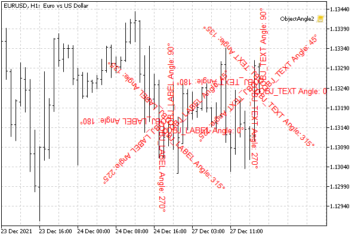

# Rotating text at an arbitrary angle

Objects of text types — label OBJ_TEXT (in quotation coordinates) and panel OBJ_LABEL (in screen coordinates) — allow you to rotate the text label at an arbitrary angle. For this purpose, there is the OBJPROP_ANGLE property of type double. It contains the angle in degrees relative to the object's normal position. Positive values rotate the object counterclockwise, and negative values rotate it clockwise.

However, it should be borne in mind that angles with a difference that is a multiple of 360 degrees are identical, that is, for example, +315 and -45 are the same. Rotation is performed around the anchor point on the object (by default, top left).



Rotate OBJ_LABEL and OBJ_TEXT objects by angles that are multiples of 45 degrees

You can check the effect of the OBJPROP_ANGLE property on an object using the ObjectAngle.mq5 script. It creates a text label OBJ_LABEL in the center of the window, after which it begins to periodically rotate 45 degrees until the user stops the process.

```
void OnStart()
{
   const string name = "ObjAngle";
   ObjectCreate(0, name, OBJ_LABEL, 0, 0, 0);
   const int centerX = (int)ChartGetInteger(0, CHART_WIDTH_IN_PIXELS) / 2;
   const int centerY = (int)ChartGetInteger(0, CHART_HEIGHT_IN_PIXELS) / 2;
   ObjectSetInteger(0, name, OBJPROP_XDISTANCE, centerX);
   ObjectSetInteger(0, name, OBJPROP_YDISTANCE, centerY);
   ObjectSetInteger(0, name, OBJPROP_ANCHOR, ANCHOR_CENTER);
   
   int angle = 0;
   while(!IsStopped())
   {
      ObjectSetString(0, name, OBJPROP_TEXT, StringFormat("Angle: %d°", angle));
      ObjectSetDouble(0, name, OBJPROP_ANGLE, angle);
      angle += 45;
     
      ChartRedraw();
      Sleep(1000);
   }
   ObjectDelete(0, name);
}

```

The text displays the current value of the angle.
