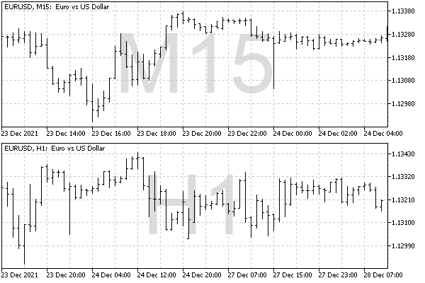

# Visibility of objects in the context of timeframes

MetaTrader 5 users know about the Display tab in the object properties dialog where you can use the switches to select on which timeframes the object will be displayed and on which it will be hidden. In particular, you can temporarily hide the object completely on all timeframes.

MQL5 has a similar program property, OBJPROP_TIMEFRAMES, which controls the object visibility on a timeframe. The value of this property can be any combination of special integer flags: each flag (constant) contains a bit corresponding to one timeframe (see the table). To set/get the OBJPROP_TIMEFRAMES property, use the ObjectSetInteger/ObjectGetInteger functions.

| Constant | Value | Visibility in timeframes |
| --- | --- | --- |
| OBJ_NO_PERIODS | 0 | The object is hidden in all timeframes |
| OBJ_PERIOD_M1 | 0x00000001 | M1 |
| OBJ_PERIOD_M2 | 0x00000002 | M2 |
| OBJ_PERIOD_M3 | 0x00000004 | M3 |
| OBJ_PERIOD_M4 | 0x00000008 | M4 |
| OBJ_PERIOD_M5 | 0x00000010 | M5 |
| OBJ_PERIOD_M6 | 0x00000020 | M6 |
| OBJ_PERIOD_M10 | 0x00000040 | M10 |
| OBJ_PERIOD_M12 | 0x00000080 | M12 |
| OBJ_PERIOD_M15 | 0x00000100 | M15 |
| OBJ_PERIOD_M20 | 0x00000200 | M20 |
| OBJ_PERIOD_M30 | 0x00000400 | M30 |
| OBJ_PERIOD_H1 | 0x00000800 | H1 |
| OBJ_PERIOD_H2 | 0x00001000 | H2 |
| OBJ_PERIOD_H3 | 0x00002000 | H3 |
| OBJ_PERIOD_H4 | 0x00004000 | H4 |
| OBJ_PERIOD_H6 | 0x00008000 | H6 |
| OBJ_PERIOD_H8 | 0x00010000 | H8 |
| OBJ_PERIOD_H12 | 0x00020000 | H12 |
| OBJ_PERIOD_D1 | 0x00040000 | D1 |
| OBJ_PERIOD_W1 | 0x00080000 | W1 |
| OBJ_PERIOD_MN1 | 0x00100000 | MN1 |
| OBJ_ALL_PERIODS | 0x001fffff | All timeframes |

The flags can be combined using the bitwise OR operator ("|"), for example, the superposition of flags OBJ_PERIOD_M15 | OBJ_PERIOD_H4 means that the object will be visible on the 15-minute and 4-hour timeframes.

Note that each flag can be obtained by shifting by 1 to the left by the number of bits equal to the number of the constant in the table. This makes it easier to generate flags dynamically when the algorithm operates in multiple timeframes rather than one particular one.

We will use this feature in the test script ObjectTimeframes.mq5. Its task is to create a lot of large text labels on the chart with the names of the timeframes, and each title should be displayed only in the corresponding timeframe. For example, a large label "D1" will be visible only on the daily chart, and when switching to H4, we will see "H4".

To get the short name of the timeframe, without the "PERIOD_" prefix, a simple auxiliary function is implemented.

```
string GetPeriodName(const int tf)
{
   const static int PERIOD_ = StringLen("PERIOD_");
   return StringSubstr(EnumToString((ENUM_TIMEFRAMES)tf), PERIOD_);
}

```

To get the list of all timeframes from the ENUM_TIMEFRAMES enumeration, we will use the EnumToArray function which was presented in the section on conversion of [Enumerations](/en/book/common/conversions/conversions_enums).

```
#include "ObjectPrefix.mqh"
#include <MQL5Book/EnumToArray.mqh>
 
void OnStart()
{
   ENUM_TIMEFRAMES tf = 0;
   int values[];
   const int n = EnumToArray(tf, values, 0, USHORT_MAX);
   ...

```

All labels will be displayed in the center of the window at the moment the script is launched. Resizing the window after the script ends will cause the created captions to no longer be centered. This is a consequence of the fact that MQL5 supports anchoring only to the corners of the window, but not to the center. If you want to automatically maintain the position of objects, you should implement a similar algorithm in the indicator and respond to [window resize events](/en/book/applications/events/events_chart). Alternatively, we could display labels in a corner, for example, the lower right.

```
   const int centerX = (int)ChartGetInteger(0, CHART_WIDTH_IN_PIXELS) / 2;
   const int centerY = (int)ChartGetInteger(0, CHART_HEIGHT_IN_PIXELS) / 2;
   ...

```

In the cycle through timeframes, we create an OBJ_LABEL object for each of them, and place it in the middle of the window anchored in the center of the object.

```
   for(int i = 1; i < n; ++i)
   {
      // create and setup text label for each timeframe
      const string name = ObjNamePrefix + (string)i;
      ObjectCreate(0, name, OBJ_LABEL, 0, 0, 0);
      ObjectSetInteger(0, name, OBJPROP_XDISTANCE, centerX);
      ObjectSetInteger(0, name, OBJPROP_YDISTANCE, centerY);
      ObjectSetInteger(0, name, OBJPROP_ANCHOR, ANCHOR_CENTER);
      ...

```

Next, we set the text (name of the timeframe), large font size, gray color and display property in the background.

```
      ObjectSetString(0, name, OBJPROP_TEXT, GetPeriodName(values[i]));
      ObjectSetInteger(0, name, OBJPROP_FONTSIZE, fmin(centerY, centerX));
      ObjectSetInteger(0, name, OBJPROP_COLOR, clrLightGray);
      ObjectSetInteger(0, name, OBJPROP_BACK, true);
      ...

```

Finally, we generate the correct visibility flag for the i-th timeframe and write it to the OBJPROP_TIMEFRAMES property.

```
      const int flag = 1 << (i - 1);
      ObjectSetInteger(0, name, OBJPROP_TIMEFRAMES, flag);
   }

```

See what happened on the chart when switching timeframes.



Labels with timeframe names

If you open the Object List dialog and enable All objects in the list, it is easy to make sure that there are generated labels for all timeframes and check their visibility flags.

To remove objects, you can run the ObjectCleanup1.mq5 script.
