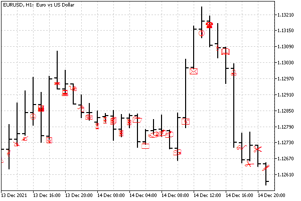

# Assigning a character code to a label

As mentioned in the review of [Objects linked to time and price](/en/book/applications/objects/objects_time_price), the OBJ_ARROW label allows you to display an arbitrary Wingdings font symbol on the chart (the full list of available symbols is provided in the [MQL5 documentation](https://www.mql5.com/en/docs/constants/objectconstants/wingdings)). The character code for the object itself is determined by the integer property OBJPROP_ARROWCODE.

Script allows to demonstrate all characters of the ObjectWingdings.mq5 font. In it, we create labels with different characters in a loop, placing them one by one on the bar.

```
#include "ObjectPrefix.mqh"
   
void OnStart()
{
   for(int i = 33; i < 256; ++i) // character codes
   {
      const int b = i - 33; // bar number
      const string name = ObjNamePrefix + "Wingdings-"
         + (string)iTime(_Symbol, _Period, b);
      ObjectCreate(0, name, OBJ_ARROW,
         0, iTime(_Symbol, _Period, b), iOpen(_Symbol, _Period, b));
      ObjectSetInteger(0, name, OBJPROP_ARROWCODE, i);
   }
   
   PrintFormat("%d objects with arrows created", 256 - 33);
}

```

How it looks on the chart is shown in the following screenshot.



Wingdings characters in OBJ_ARROW labels
