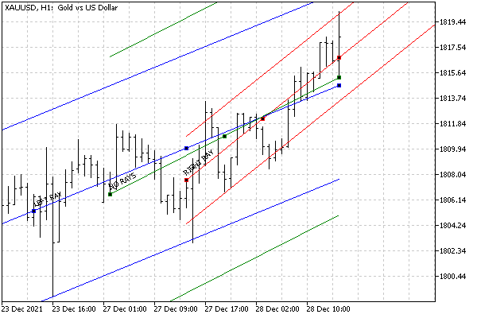

# Ray properties for objects with straight lines

Among graphical objects, there are several types in which the lines between anchor points can be displayed either as segments (i.e., strictly between a pair of points) or as endless straight lines continuing in one or another direction across the entire window visibility area. Such objects are:

- Trend line
- Trendline by angle
- All types of channels (equidistant, standard deviations, regression, Andrews pitchfork)
- Gann line
- Fibonacci lines
- Fibonacci channel
- Fibonacci expansion

For them, you can separately enable line continuation to the left or right using the OBJPROP_RAY_LEFT and OBJPROP_RAY_RIGHT properties, respectively. In addition, for a vertical line, you can specify whether it should be drawn in all chart subwindows or only in the current one (where the anchor point is located): the OBJPROP_RAY property is responsible for this. All properties are boolean, meaning they can be enabled (true) or disabled (false).

| Identifier | Description |
| --- | --- |
| OBJPROP_RAY_LEFT | Ray continues to the left |
| OBJPROP_RAY_RIGHT | Ray continues to the right |
| OBJPROP_RAY | Vertical line extends to all chart windows |

You can check the operation of the rays using the ObjectRays.mq5 script. It creates 3 standard deviation channels with different ray settings.

One specific object is created and configured by the helper function SetupChannel. Through its parameters, the channel length in bars and the channel width (deviation) are set, as well as options for displaying rays to the left and right, and color.

```
#include "ObjectPrefix.mqh"
   
void SetupChannel(const int length, const double deviation = 1.0,
   const bool right = false, const bool left = false,
   const color clr = clrRed)
{
   const string name = ObjNamePrefix + "Channel"
      + (right ? "R" : "") + (left ? "L" : "");
   // NB: Anchor point 0 must have an earlier time than anchor point 1,
   // otherwise the channel will degenerate
   ObjectCreate(0, name, OBJ_STDDEVCHANNEL, 0, iTime(NULL, 0, length), 0);
   ObjectSetInteger(0, name, OBJPROP_TIME, 1, iTime(NULL, 0, 0));
   // deviation
   ObjectSetDouble(0, name, OBJPROP_DEVIATION, deviation);
   // color and description
   ObjectSetInteger(0, name, OBJPROP_COLOR, clr);
   ObjectSetString(0, name, OBJPROP_TEXT, StringFormat("%2.1", deviation)
      + ((!right && !left) ? " NO RAYS" : "")
      + (right ? " RIGHT RAY" : "") + (left ? " LEFT RAY" : ""));
   // properties of rays
   ObjectSetInteger(0, name, OBJPROP_RAY_RIGHT, right);
   ObjectSetInteger(0, name, OBJPROP_RAY_LEFT, left);
   // lighting up objects by highlighting
   // (besides, it's easier for the user to remove them)
   ObjectSetInteger(0, name, OBJPROP_SELECTABLE, true);
   ObjectSetInteger(0, name, OBJPROP_SELECTED, true);
}

```

In the OnStart function, we call SetupChannel for 3 different channels.

```
void OnStart()
{
   SetupChannel(24, 1.0, true);
   SetupChannel(48, 2.0, false, true, clrBlue);
   SetupChannel(36, 3.0, false, false, clrGreen);
}

```

As a result, we get a chart of the following form.



Channels with different OBJPROP_RAY_LEFT and OBJPROP_RAY_RIGHT property settings

When rays are enabled, it becomes possible to request the object to extrapolate time and price values using the functions that we will describe in the [Getting time or price at given points on lines](/en/book/applications/objects/objects_get_time_value) section.
