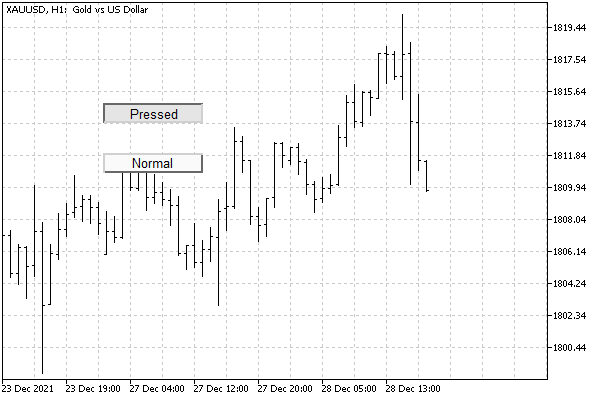

# Managing object pressed state

For objects like buttons (OBJ_BUTTON) and panels with an image (OBJ_BITMAP_LABEL), the terminal supports a special property that visually switches the object from the normal (released) state to the pressed state and vice versa. The OBJPROP_STATE constant is reserved for this. The property is of a Boolean type: when the value is true, the object is considered to be pressed, and when it is false, it is considered to be released (by default).

For OBJ_BUTTON, the effect of a three-dimensional frame is drawn by the terminal itself, while for OBJ_BITMAP_LABEL the programmer must specify two images (as files or [resources](/en/book/advanced/resources)) that will provide a suitable external representation. Because this property is technically just a toggle, it's easy to use it for other purposes, and not just for "press" and "release" effects. For example, with the help of appropriate images, you can implement a flag (option).

The use of images in objects will be discussed in the next section.

The object state usually changes in interactive MQL programs that respond to user actions, in particular mouse clicks. We will discuss this possibility in the chapter on [events](/en/book/applications/events).

Now let's test the property on simple buttons, in static mode. The ObjectButtons.mq5 script creates two buttons on the chart: one in the pressed state, and the other in the released state.

The setting of a single button is given to the SetupButton function with parameters that specify the name and text of the button, as well as its coordinates, size, and state.

```
#include "ObjectPrefix.mqh"
   
void SetupButton(const string button,
   const int x, const int y,
   const int dx, const int dy,
   const bool state = false)
{
   const string name = ObjNamePrefix + button;
   ObjectCreate(0, name, OBJ_BUTTON, 0, 0, 0);
   // position and size
   ObjectSetInteger(0, name, OBJPROP_XDISTANCE, x);
   ObjectSetInteger(0, name, OBJPROP_YDISTANCE, y);
   ObjectSetInteger(0, name, OBJPROP_XSIZE, dx);
   ObjectSetInteger(0, name, OBJPROP_YSIZE, dy);
   // label on the button
   ObjectSetString(0, name, OBJPROP_TEXT, button);
   
   // pressed (true) / released (false)
   ObjectSetInteger(0, name, OBJPROP_STATE, state);
}

```

Then in OnStart we call this function twice.

```
void OnStart()
{
   SetupButton("Pressed", 100, 100, 100, 20, true);
   SetupButton("Normal", 100, 150, 100, 20);
}

```

The resulting buttons might look like this.



Pressed and released OBJ_BUTTON buttons

Interestingly, you can click on any of the buttons with the mouse, and the button will change its state. However, we have not yet discussed how to intercept a notification about this.

It is important to note that this automatic state switching is performed only if the option Disable selection is checked in the object properties, but this condition is the default for all objects created programmatically. Recall that, if necessary, this selection can be enabled: for this, you must explicitly set the OBJPROP_SELECTABLE property to true. We used it in some previous examples.

To remove buttons that have become unnecessary, use the ObjectCleanup1.mq5 script.
