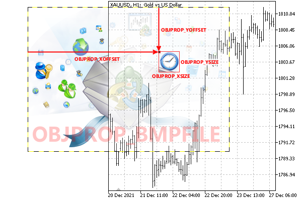
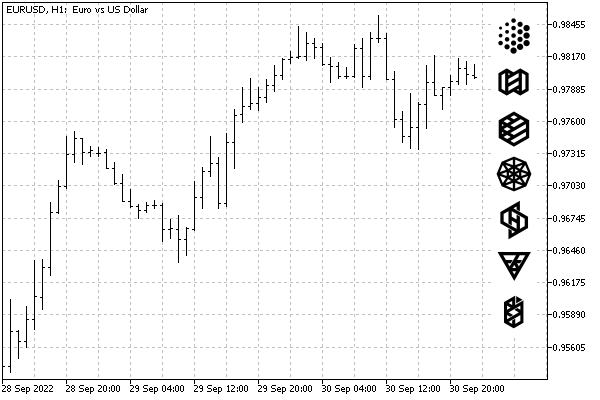

# Cropping (outputting part) of an image

For graphical objects with pictures (OBJ_BITMAP_LABEL and OBJ_BITMAP), MQL5 allows you to enable the display of a part of the image specified by the property [OBJPROP_BMPFILE](/en/book/applications/objects/objects_bitmap). To do this, you need to set the size of the object ([OBJPROP_XSIZE and OBJPROP_YSIZE](/en/book/applications/objects/objects_width_height)) smaller than the image size and set the coordinates of the upper left corner of the visible rectangular fragment using the integer properties OBJPROP_XOFFSET and OBJPROP_YOFFSET. These two properties set, respectively, the indent along X and Y in pixels from the left and top borders of the original image.



Outputting part of an image to an object

Typically, a similar technique using part of a large image is used for toolbar icons (sets of buttons, menus, etc.): a single file with all the icons provides more efficient resource consumption than many small files with individual icons.

The test script ObjectBitmapOffset.mq5 creates several panels with pictures (OBJ_BITMAP_LABEL), and for all of them the same graphic file is specified in the OBJPROP_BMPFILE property. However, due to the OBJPROP_XOFFSET and OBJPROP_YOFFSET properties, all objects display different parts of the image.

```
void SetupBitmap(const int i, const int x, const int y, const int size,
   const string imageOn, const string imageOff = NULL)
{
   // create an object
   const string name = ObjNamePrefix + "Tool-" + (string)i;
   ObjectCreate(0, name, OBJ_BITMAP_LABEL, 0, 0, 0);
   ObjectSetInteger(0, name, OBJPROP_CORNER, CORNER_RIGHT_UPPER);
   ObjectSetInteger(0, name, OBJPROP_ANCHOR, ANCHOR_RIGHT_UPPER);
   // position and size
   ObjectSetInteger(0, name, OBJPROP_XDISTANCE, x);
   ObjectSetInteger(0, name, OBJPROP_YDISTANCE, y);
   ObjectSetInteger(0, name, OBJPROP_XSIZE, size);
   ObjectSetInteger(0, name, OBJPROP_YSIZE, size);
   // offset in the original image, according to which the i-th fragment is read
   ObjectSetInteger(0, name, OBJPROP_XOFFSET, i * size);
   ObjectSetInteger(0, name, OBJPROP_YOFFSET, 0);
   // generic image (file)
   ObjectSetString(0, name, OBJPROP_BMPFILE, imageOn);
}
   
void OnStart()
{
   const int icon = 46; // size of one icon
   for(int i = 0; i < 7; ++i) // loop through the icons in the file
   {
      SetupBitmap(i, 10, 10 + i * icon, icon,
         "\\Files\\MQL5Book\\icons-322-46.bmp");
   }
}

```

The original image contains several small icons 46 x 46 pixels each. The script "cuts" them out one by one and places them vertically at the right edge of the window.

The following shows a generic file (/Files/MQL5Book/icons-322-46.bmp), and what happened on the chart.


BMP file with icons



Button objects with icons on the chart
