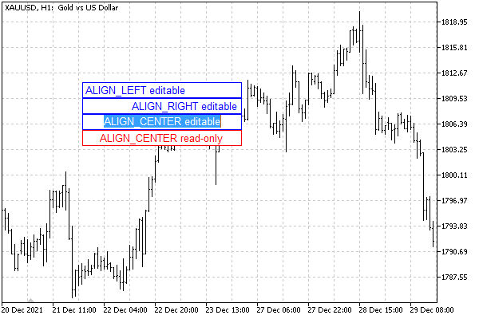

# Input field properties: text alignment and read-only

For objects of type OBJ_EDIT (input field), an MQL program can set two specific properties defined using the ObjectSetInteger/ObjectGetInteger functions.

| Identifier | Description | Value type |
| --- | --- | --- |
| OBJPROP_ALIGN | Horizontal text alignment | ENUM_ALIGN_MODE |
| OBJPROP_READONLY | Ability to edit text | bool |

The ENUM_ALIGN_MODE enumeration contains the following members.

| Identifier | Description |
| --- | --- |
| ALIGN_LEFT | Left alignment |
| ALIGN_CENTER | Center alignment |
| ALIGN_RIGHT | Right alignment |

Note that, unlike OBJ_TEXT and OBJ_LABEL objects, the input field does not automatically resize itself to fit the text entered, so for long strings, you may need to explicitly set the OBJPROP_XSIZE property.

In the edit mode, horizontal text scrolling works inside the input field.

The ObjectEdit.mq5 script creates four OBJ_EDIT objects: three of them are editable with different text alignment methods and the fourth one is in the read-only mode.

```
#include "ObjectPrefix.mqh"
   
void SetupEdit(const int x, const int y, const int dx, const int dy,
   const ENUM_ALIGN_MODE alignment = ALIGN_LEFT, const bool readonly = false)
{
   // create an object with a description of the properties
   const string props = EnumToString(alignment)
      + (readonly ? " read-only" : " editable");
   const string name = ObjNamePrefix + "Edit" + props;
   ObjectCreate(0, name, OBJ_EDIT, 0, 0, 0);
   // position and size
   ObjectSetInteger(0, name, OBJPROP_XDISTANCE, x);
   ObjectSetInteger(0, name, OBJPROP_YDISTANCE, y);
   ObjectSetInteger(0, name, OBJPROP_XSIZE, dx);
   ObjectSetInteger(0, name, OBJPROP_YSIZE, dy);
   // specific properties of input fields
   ObjectSetInteger(0, name, OBJPROP_ALIGN, alignment);
   ObjectSetInteger(0, name, OBJPROP_READONLY, readonly);
   // colors (different depending on editability)
   ObjectSetInteger(0, name, OBJPROP_BGCOLOR, clrWhite);
   ObjectSetInteger(0, name, OBJPROP_COLOR, readonly ? clrRed : clrBlue);
   // content
   ObjectSetString(0, name, OBJPROP_TEXT, props);
   // tooltip for editable
   ObjectSetString(0, name, OBJPROP_TOOLTIP,
      (readonly ? "\n" : "Click me to edit"));
}
   
void OnStart()
{
   SetupEdit(100, 100, 200, 20);
   SetupEdit(100, 120, 200, 20, ALIGN_RIGHT);
   SetupEdit(100, 140, 200, 20, ALIGN_CENTER);
   SetupEdit(100, 160, 200, 20, ALIGN_CENTER, true);
}

```

The result of the script is shown in the image below.



Input fields in different modes

You can click on any editable field and change its content.
