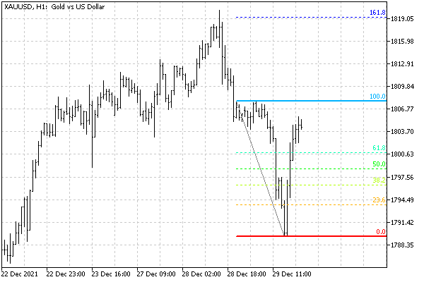

# Setting levels in level objects

Some graphical objects are built using multiple levels (repetitive lines). These include:

- Andrews pitchfork OBJ_PITCHFORK
- Fibonacci tools:
 OBJ_FIBO levels
 Time zones OBJ_FIBOTIMES
 Fan OBJ_FIBOFAN
 Arcs OBJ_FIBOARC
 Channel OBJ_FIBOCHANNEL
 Extension OBJ_EXPANSION

MQL5 allows you to set level properties for such objects. The properties include their number, colors, values, and labels.

| Identifier | Description | Type |
| --- | --- | --- |
| OBJPROP_LEVELS | Number of levels | int |
| OBJPROP_LEVELCOLOR | Level line color | color |
| OBJPROP_LEVELSTYLE | Level line style | ENUM_LINE_STYLE |
| OBJPROP_LEVELWIDTH | Level line width | int |
| OBJPROP_LEVELTEXT | Level description | string |
| OBJPROP_LEVELVALUE | Level value | double |

When calling the ObjectGet and ObjectSet functions for all properties except OBJPROP_LEVELS, it is required to provide an additional modifier parameter with the number of a specific level.

As an example, let's consider the indicator ObjectHighLowFibo.mq5. For a given range of bars, which is defined as the number of the last bar (baroffset) and the number of bars (BarCount) to the left of it, the indicator finds the High and Low prices and then creates the OBJ_FIBO object for these points. As new bars form, Fibonacci levels will shift to the right to more current prices.

```
#property indicator_chart_window
#property indicator_buffers 0
#property indicator_plots   0
   
#include <MQL5Book/ColorMix.mqh>
   
input int BarOffset = 0;
input int BarCount = 24;
   
const string Prefix = "HighLowFibo-";
   
int OnCalculate(const int rates_total,
                const int prev_calculated,
                const int begin,
                const double &price[])
{
   static datetime now = 0;
   if(now != iTime(NULL, 0, 0))
   {
      const int hh = iHighest(NULL, 0, MODE_HIGH, BarCount, BarOffset);
      const int ll = iLowest(NULL, 0, MODE_LOW, BarCount, BarOffset);
   
      datetime t[2] = {iTime(NULL, 0, hh), iTime(NULL, 0, ll)};
      double p[2] = {iHigh(NULL, 0, hh), iLow(NULL, 0, ll)};
    
      DrawFibo(Prefix + "Fibo", t, p, clrGray);
   
      now = iTime(NULL, 0, 0);
   }
   return rates_total;
}

```

The direct setting of the object is done in the auxiliary function DrawFibo. In it, in particular, the levels are painted in rainbow colors, and their style and thickness are determined based on whether the corresponding values are "round" (without a fractional part).

```
bool DrawFibo(const string name, const datetime &t[], const double &p[],
   const color clr)
{
   if(ArraySize(t) != ArraySize(p)) return false;
   
   ObjectCreate(0, name, OBJ_FIBO, 0, 0, 0);
   // anchor points
   for(int i = 0; i < ArraySize(t); ++i)
   {
      ObjectSetInteger(0, name, OBJPROP_TIME, i, t[i]);
      ObjectSetDouble(0, name, OBJPROP_PRICE, i, p[i]);
   }
   // general settings
   ObjectSetInteger(0, name, OBJPROP_COLOR, clr);
   ObjectSetInteger(0, name, OBJPROP_RAY_RIGHT, true);
   // level settings
   const int n = (int)ObjectGetInteger(0, name, OBJPROP_LEVELS);
   for(int i = 0; i < n; ++i)
   {
      const color gradient = ColorMix::RotateColors(ColorMix::HSVtoRGB(0),
         ColorMix::HSVtoRGB(359), n, i);
      ObjectSetInteger(0, name, OBJPROP_LEVELCOLOR, i, gradient);
      const double level = ObjectGetDouble(0, name, OBJPROP_LEVELVALUE, i);
      if(level - (int)level > DBL_EPSILON * level)
      {
         ObjectSetInteger(0, name, OBJPROP_LEVELSTYLE, i, STYLE_DOT);
         ObjectSetInteger(0, name, OBJPROP_LEVELWIDTH, i, 1);
      }
      else
      {
         ObjectSetInteger(0, name, OBJPROP_LEVELSTYLE, i, STYLE_SOLID);
         ObjectSetInteger(0, name, OBJPROP_LEVELWIDTH, i, 2);
      }
   }
   
   return true;
}

```

Here is a variant of what an object might look like on a chart.



Fibonacci object with level settings
