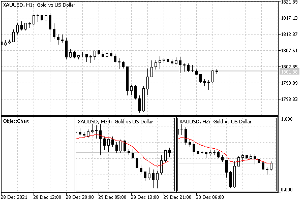

# Chart object

The chart object OBJ_CHART allows you to create thumbnails of other charts inside the chart for other instruments and timeframes. Chart objects are included in the general [chart list](/en/book/applications/charts/charts_list), which we obtained programmatically using the ChartFirst and ChartNext functions. As mentioned in the section on [Checking the main window status](/en/book/applications/charts/charts_window_state), the special chart property CHART_IS_OBJECT allows you to find out by identifier whether it is a full-fledged window or a chart object. In the latter case, calling ChartGetInteger(id, CHART_IS_OBJECT) will return true.

The chart object has a set of properties specific only to it.

| Identifier | Description | Type |
| --- | --- | --- |
| OBJPROP_CHART_ID | Chart ID (r/o) | long |
| OBJPROP_PERIOD | Chart Period | ENUM_TIMEFRAMES |
| OBJPROP_DATE_SCALE | Show the time scale | bool |
| OBJPROP_PRICE_SCALE | Show the price scale | bool |
| OBJPROP_CHART_SCALE | Scale (value in the range 0 - 5) | int |
| OBJPROP_SYMBOL | Symbol | string |

The identifier obtained through the OBJPROP_CHART_ID property allows you to manage the object like a regular chart using the functions from the chapter [Working with charts](/en/book/applications/charts). However, there are some limitations:

- The object cannot be closed with [ChartClose](/en/book/applications/charts/charts_open_close)
- It is not possible to change the symbol/period in the object using the [CartSetSymbolPeriod](/en/book/applications/charts/charts_set_symbol_period) function
- Properties [CHART_SCALE](/en/book/applications/charts/charts_scale_time), [CHART_BRING_TO_TOP](/en/book/applications/charts/charts_window_state),[CHART_SHOW_DATE_SCALE](/en/book/applications/charts/charts_show_elements) and [CHART_SHOW_PRICE_SCALE](/en/book/applications/charts/charts_show_elements) are not modified in the object.

By default, all properties (except OBJPROP_CHART_ID) are equal to the corresponding properties of the current window.

The demonstration of chart objects is implemented as a bufferless indicator ObjectChart.mq5. It creates a subwindow with two chart objects for the same symbol as the current chart but with adjacent timeframes above and below the current one.

Objects snap to the upper right corner of the subwindow and have the same predefined sizes:

```
#define SUBCHART_HEIGHT 150
#define SUBCHART_WIDTH  200

```

Of course, the height of the subwindow must match the height of the objects, until we can respond adaptively to resize events.

```
#property indicator_separate_window
#property indicator_height SUBCHART_HEIGHT
#property indicator_buffers 0
#property indicator_plots   0

```

One mini-chart is configured in the SetupSubChart function, which takes the number of the object, its dimensions, and the required timeframe as inputs. The result of SetupSubChart is the identifier of the chart object, which we just output into the log for reference.

```
void OnInit()
{
   Print(SetupSubChart(0, SUBCHART_WIDTH, SUBCHART_HEIGHT, PeriodUp(_Period)));
   Print(SetupSubChart(1, SUBCHART_WIDTH, SUBCHART_HEIGHT, PeriodDown(_Period)));
}

```

Macros PeriodUp and PeriodDown use the helper function PeriodRelative.

```
#define PeriodUp(P) PeriodRelative(P, +1)
#define PeriodDown(P) PeriodRelative(P, -1)
   
ENUM_TIMEFRAMES PeriodRelative(const ENUM_TIMEFRAMES tf, const int step)
{
   static const ENUM_TIMEFRAMES stdtfs[] =
   {
      PERIOD_M1,  // =1 (1)
      PERIOD_M2,  // =2 (2)
      ...
      PERIOD_W1,  // =32769 (8001)
      PERIOD_MN1, // =49153 (C001)
   };
   const int x = ArrayBsearch(stdtfs, tf == PERIOD_CURRENT ? _Period : tf);
   const int needle = x + step;
   if(needle >= 0 && needle < ArraySize(stdtfs))
   {
      return stdtfs[needle];
   }
   return tf;
}

```

Here is the main working function SetupSubChart.

```
long SetupSubChart(const int n, const int dx, const int dy,
   ENUM_TIMEFRAMES tf = PERIOD_CURRENT, const string symbol = NULL)
{
   // create an object
   const string name = Prefix + "Chart-"
      + (symbol == NULL ? _Symbol : symbol) + PeriodToString(tf);
   ObjectCreate(0, name, OBJ_CHART, ChartWindowFind(), 0, 0);
   
   // anchor to the top right corner of the subwindow
   ObjectSetInteger(0, name, OBJPROP_CORNER, CORNER_RIGHT_UPPER);
   // position and size
   ObjectSetInteger(0, name, OBJPROP_XSIZE, dx);
   ObjectSetInteger(0, name, OBJPROP_YSIZE, dy);
   ObjectSetInteger(0, name, OBJPROP_XDISTANCE, (n + 1) * dx);
   ObjectSetInteger(0, name, OBJPROP_YDISTANCE, 0);
   
   // specific chart settings
   if(symbol != NULL)
   {
      ObjectSetString(0, name, OBJPROP_SYMBOL, symbol);
   }
   
   if(tf != PERIOD_CURRENT)
   {
      ObjectSetInteger(0, name, OBJPROP_PERIOD, tf);
   }
   // disable the display of lines
   ObjectSetInteger(0, name, OBJPROP_DATE_SCALE, false);
   ObjectSetInteger(0, name, OBJPROP_PRICE_SCALE, false);
   // add the MA indicator to the object by its id just for demo
   const long id = ObjectGetInteger(0, name, OBJPROP_CHART_ID);
   ChartIndicatorAdd(id, 0, iMA(NULL, tf, 10, 0, MODE_EMA, PRICE_CLOSE));
   return id;
}

```

For a chart object, the anchor point is always fixed in the upper left corner of the object, so when anchoring to the right corner of the window, you need to add the width of the object (this is done by +1 in the expression(n+1)*dx for OBJPROP_XDISTANCE).

The following screenshot shows the result of the indicator on the XAUUSD,H1 chart.



Two chart objects in the indicator subwindow

As we can see, the mini-charts display the M30 and H2 timeframes.

It is important to note that you can add indicators to chart objects and apply [tpl templates](/en/book/applications/charts/charts_tpl), including those with Expert Advisors. However, you cannot create objects inside chart objects.

When the chart object is hidden due to disabled visualization on the current timeframe or on all timeframes, the [CHART_WINDOW_IS_VISIBLE](/en/book/applications/charts/charts_count_visibility) property for the internal chart still returns true.
