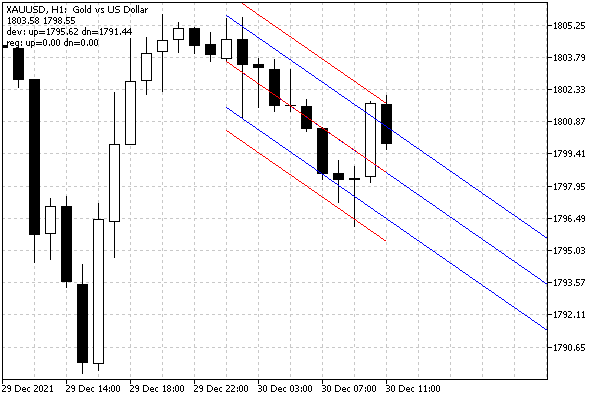

# Getting time or price at the specified line points

Many graphical objects include one or more straight lines. MQL5 allows you to interpolate and extrapolate points on these lines and get another coordinate from one coordinate, for example, price by time or time by price.

Interpolation is always available: it works "inside" the object, i.e., between anchor points. Extrapolation outside an object is possible only if the ray property in the corresponding direction is enabled for it (see [Ray properties for objects with straight lines](/en/book/applications/objects/objects_rays)).

The ObjectGetValueByTime function returns the price value for the specified time. The ObjectGetTimeByValue function returns the time value for the specified price

double ObjectGetValueByTime(long chartId, const string name, datetime time, int line)

datetime ObjectGetTimeByValue(long chartId, const string name, double value, int line)

Calculations are made for an object named name on the chart with chartId. The time and value parameters specify a known coordinate for which the unknown should be calculated. Since an object can have several lines, several values will correspond to one coordinate, and therefore it is necessary to specify the line number in the line parameter.

The function returns the price or time value for the projection of the point with the specified initial coordinate relative to the line.

In case of an error, 0 will be returned, and the error code will be written to _LastError. For example, attempting to extrapolate a line value with the beam property disabled generates an OBJECT_GETVALUE_FAILED (4205) error.

The functions are applicable to the following objects:

- Trendline (OBJ_TREND)
- Trendline by angle (OBJ_TRENDBYANGLE)
- Gann line (OBJ_GANNLINE)
- Equidistant channel (OBJ_CHANNEL), 2 lines
- Linear regression channel (OBJ_REGRESSION); 3 lines
- Standard deviation channel (OBJ_STDDEVCHANNEL); 3 lines
- Arrow line (OBJ_ARROWED_LINE)

Let's check the operation of the function using a bufferless indicator ObjectChannels.mq5. It creates two objects with standard deviation and linear regression channels, after which it requests and displays in the comment the price of the upper and lower lines on future bars. For the standard deviation channel, the OBJPROP_RAY_RIGHT property is enabled, but for the regression channel, it is not (intentionally). In this regard, no values will be received from the second channel, and zeros are always displayed on the screen for it.

As new bars form, the channels will automatically move to the right. The length of the channels is set in the input parameter WorkPeriod (10 bars by default).

```
input int WorkPeriod = 10;
   
const string Prefix = "ObjChnl-";
const string ObjStdDev = Prefix + "StdDev";
const string ObjRegr = Prefix + "Regr";
   
void OnInit()
{
   CreateObjects();
   UpdateObjects();
}

```

The CreateObjects function creates 2 channels and makes initial settings for them.

```
void CreateObjects()
{
   ObjectCreate(0, ObjStdDev, OBJ_STDDEVCHANNEL, 0, 0, 0);
   ObjectCreate(0, ObjRegr, OBJ_REGRESSION, 0, 0, 0);
   ObjectSetInteger(0, ObjStdDev, OBJPROP_COLOR, clrBlue);
   ObjectSetInteger(0, ObjStdDev, OBJPROP_RAY_RIGHT, true);
   ObjectSetInteger(0, ObjRegr, OBJPROP_COLOR, clrRed);
   // NB: ray is not enabled for the regression channel (intentionally)
}

```

The UpdateObjects function moves channels to the last WorkPeriod bars.

```
void UpdateObjects()
{
   const datetime t0 = iTime(NULL, 0, WorkPeriod);
   const datetime t1 = iTime(NULL, 0, 0);
   
   // we don't use ObjectMove because channels work
   // only with time coordinate (price is calculated automatically)
   ObjectSetInteger(0, ObjStdDev, OBJPROP_TIME, 0, t0);
   ObjectSetInteger(0, ObjStdDev, OBJPROP_TIME, 1, t1);
   ObjectSetInteger(0, ObjRegr, OBJPROP_TIME, 0, t0);
   ObjectSetInteger(0, ObjRegr, OBJPROP_TIME, 1, t1);
}

```

In the OnCalculate handler, we update the position of the channels on new bars, and on each tick, we call DisplayObjectData to get price extrapolation and display it as a comment.

```
int OnCalculate(const int rates_total,
                const int prev_calculated,
                const int begin,
                const double &price[])
{
   static datetime now = 0;
   if(now != iTime(NULL, 0, 0))
   {
      UpdateObjects();
      now = iTime(NULL, 0, 0);
   }
   
   DisplayObjectData();
   
   return rates_total;
}

```

In the DisplayObjectData function, we will find prices at anchor points on the middle line (OBJPROP_PRICE). Also, using ObjectGetValueByTime, we will request price values for the upper and lower channel lines through WorkPeriod bars in the future.

```
void DisplayObjectData()
{
   const double p0 = ObjectGetDouble(0, ObjStdDev, OBJPROP_PRICE, 0);
   const double p1 = ObjectGetDouble(0, ObjStdDev, OBJPROP_PRICE, 1);
   
   // the following equalities are always true due to the channel calculation algorithm:
   // - the middle lines of both channels are the same,
   // - anchor points always lie on the middle line,
   // ObjectGetValueByTime(0, ObjStdDev, iTime(NULL, 0, 0), 0) == p1
   // ObjectGetValueByTime(0, ObjRegr, iTime(NULL, 0, 0), 0) == p1
   
   // trying to extrapolate future prices from the upper and lower lines
   const double d1 = ObjectGetValueByTime(0, ObjStdDev, iTime(NULL, 0, 0)
      + WorkPeriod * PeriodSeconds(), 1);
   const double d2 = ObjectGetValueByTime(0, ObjStdDev, iTime(NULL, 0, 0)
      + WorkPeriod * PeriodSeconds(), 2);
   
   const double r1 = ObjectGetValueByTime(0, ObjRegr, iTime(NULL, 0, 0)
      + WorkPeriod * PeriodSeconds(), 1);
   const double r2 = ObjectGetValueByTime(0, ObjRegr, iTime(NULL, 0, 0)
      + WorkPeriod * PeriodSeconds(), 2);
   
   // display all received prices in a comment
   Comment(StringFormat("%.*f %.*f\ndev: up=%.*f dn=%.*f\nreg: up=%.*f dn=%.*f",
      _Digits, p0, _Digits, p1,
      _Digits, d1, _Digits, d2,
      _Digits, r1, _Digits, r2));
}

```

It is important to note that due to the fact that the ray property is not enabled for the regression channel, it always gives zeros in the future (although if we asked for prices within the channel's time period, we would get the correct values).



Channels and price values at the points of their lines

Here, for channels that are 10 bars long, the extrapolation is also done on 10 bars ahead, which gives the future values shown in the line with "dev:", approximately corresponding to the right border of the window.
