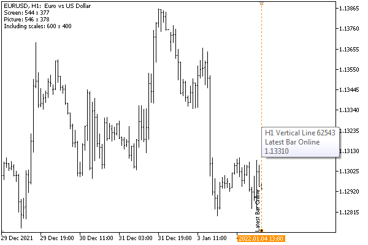

# Chart change event

When changing the chart size, price display modes, scale, or other parameters, the terminal sends the CHARTEVENT_CHART_CHANGE event, which has no parameters. The MQL program must find out the changes on its own using ChartGet function calls.

We have already used this event in the ChartModeMonitor.mq5 example in the section on [Chart display modes](/en/book/applications/charts/charts_mode). Now let's take another example.

As you know, MetaTrader 5 allows the saving of the screenshot of the current chart to a file of a specified size (the Save as Picture command of the context menu). However, this method of obtaining a screenshot is not suitable for all cases. In particular, if you need an image with a tooltip or when an object of the input field type is active (when text is selected inside the field and the text cursor is visible), the standard command will not help, since it re-forms the chart image without taking into account these and some other nuances of the current state of the window.

The only alternative to get an exact copy of the window is to use means that are external to the terminal (for example, the PrtSc key via the Windows clipboard), but this method does not guarantee the required window size. In order not to select the size by trial and error, or some additional programs, we will create an indicator EventWindowSizer.mq5, which will track the user's size setting on the go and output the current value in a comment.

All work is done in the OnChartEvent handler, starting with checking the event ID for CHARTEVENT_CHART_CHANGE. The dimensions of the window in pixels can be obtained using the [CHART_WIDTH_IN_PIXELS](/en/book/applications/charts/charts_scale_time) and [CHART_HEIGHT_IN_PIXELS](/en/book/applications/charts/charts_scale_price) properties. However, they return dimensions without taking into account borders, and the borders are usually wanted for a screenshot. Therefore, we will display in the comment not only the property values (marked with the word "Screen"), but also the corrected values (marked with the word "Picture"): 2 pixels should be added in width, and 1 pixel in vertical (these are the features of window rendering in the terminal).

```
void OnChartEvent(const int id, const long &lparam, const double &dparam, const string &sparam)
{
   if(id == CHARTEVENT_CHART_CHANGE)
   {
      const int w = (int)ChartGetInteger(0, CHART_WIDTH_IN_PIXELS);
      const int h = (int)ChartGetInteger(0, CHART_HEIGHT_IN_PIXELS);
      // "Raw" sizes "as is" are displayed with the "Screen" mark,
      // correction for (-2,-1) is needed to include frames - it is displayed with the "Picture" mark,
      // correction for (-54,-22) is needed to include scales - it is displayed with "Including scales" flag.
      Comment(StringFormat("Screen: %d x %d\nPicture: %d x %d\nIncluding scales: %d x %d",
         w, h, w + 2, h + 1, w + 2 + 54, h + 1 + 22));
   }
}

```

Moreover, the obtained values do not take into account time and price scales. If they should also be taken into account in the size of the screenshot, then an adjustment should be made for their size as well. Unfortunately, the MQL5 API does not provide a way to find out these sizes, so we can only determine them empirically: for standard Windows font settings, the price scale width is 54 pixels, and the time scale height is 22 pixels. These constants may differ for your version of Windows, so you should edit them, or set them using input parameters.

After running the indicator on a chart, try resizing the window and see how the numbers in the comment will change.



Window screenshot with a tooltip and current sizes in the comment
