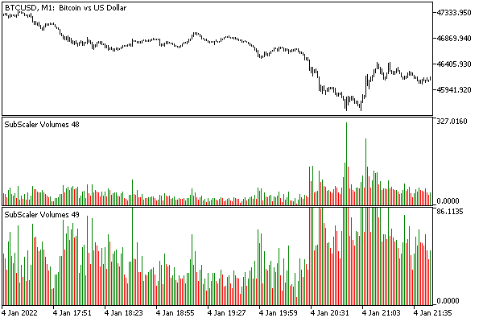

# Keyboard events

MQL programs can receive messages about keystrokes from the terminal by processing in the OnChartEvent function the CHARTEVENT_KEYDOWN events.

It is important to note that events are generated only in the active chart, and only when it has the input focus.

In Windows, focus is the logical and visual selection of one particular window that the user is currently interacting with. As a rule, the focus is moved by a mouse click or special keyboard shortcuts (Tab, Ctrl+Tab), causing the selected window to be highlighted. For example, a text cursor will appear in the input field, the current line will be colored in the list with an alternative color, and so on.

Similar visual effects are noticeable in the terminal, in particular, when one of the Market Watch, Data Window windows, or the Expert log receives focus. However, the situation is somewhat different with chart windows. It is not always possible to distinguish by external signs whether the chart visible in the foreground has the input focus or not. It is guaranteed that you can switch the focus, as already mentioned, by clicking on the required chart (on the chart, and not on the window title or its frame) or using hot keys:

- Alt+W brings up a window with a list of charts, where you can select one.
- Ctrl+F6 switches to the next chart (in the list of windows, where the order corresponds, as a rule, to the order of tabs).
- Crtl+Shift+F6 switches to the previous chart.

The full list of MetaTrader 5 hotkeys can be found in the [documentation](https://www.metatrader5.com/en/terminal/help/start_advanced/hotkeys). Please pay attention that some combinations do not comply with the general recommendations of Microsoft (for example, F10 opens the quotes window, but does not activate the main menu).

The CHARTEVENT_KEYDOWN event parameters contain the following information:

- lparam — code of the pressed key
- dparam — the number of keystrokes generated during the time it was held down
- sparam — a bitmask describing the status of the keyboard keys, converted to a string

| Bits | Description |
| --- | --- |
| 0—7 | Key scan code (depends on hardware, OEM) |
| 8 | Extended keyboard key attribute |
| 9—12 | For Windows service purposes (do not use) |
| 13 | Key state  Alt  (1 - pressed, 0 - released), not available (see below) |
| 14 | Previous key state (1 - pressed, 0 - released) |
| 15 | Changed key state (1 if released, 0 if pressed) |

The state of the Alt key is actually not available, because it is intercepted by the terminal and this bit is always 0. Bit 15 is also always equal to 0 due to the triggering context of this event: only key presses are passed to the MQL program, not key releases.

The attribute of the extended keyboard (bit 8) is set, for example, for the keys of the numeric block (on laptops it is usually activated by Fn), keys such as NumLock, ScrollLock, right Ctrl (as opposed to the left, main Ctrl), and so on. Read more about this in the Windows documentation.

The first time any non-system key is pressed, bit 14 will be 0. If you keep the key pressed, subsequent automatically generated repetitions of the event will have 1 in this bit.

The following structure will help ensure that the description of the bits is correct.

```
struct KeyState
{
   uchar scancode;
   bool extended;
   bool altPressed;
   bool previousState;
   bool transitionState;
   
   KeyState() { }
   KeyState(const ushort keymask)
   {
      this = keymask; // use operator overload=
   }
   void operator=(const ushort keymask)
   {
      scancode = (uchar)(0xFF & keymask);
      extended = 0x100 & keymask;
      altPressed = 0x2000 & keymask;
      previousState = 0x4000 & keymask;
      transitionState = 0x8000 & keymask;
   }
};

```

In an MQL program, it can be used like this.

```
void OnChartEvent(const int id,
                  const long &lparam,
                  const double &dparam,
                  const string &sparam)
{
   if(id == CHARTEVENT_KEYDOWN)
   {
      PrintFormat("%lld %lld %4llX", lparam, (ulong)dparam, (ushort)sparam);
      KeyState state[1];
      state[0] =(ushort)sparam;
      ArrayPrint(state);
   }
}

```

For practical purposes, it is more convenient to extract bit attributes from the key mask using macros.

```
#define KEY_SCANCODE(SPARAM) ((uchar)(((ushort)SPARAM) & 0xFF))
#define KEY_EXTENDED(SPARAM) ((bool)(((ushort)SPARAM) & 0x100))
#define KEY_PREVIOUS(SPARAM) ((bool)(((ushort)SPARAM) & 0x4000))

```

You can run the EventAll.mq5 indicator from the [Event-related chart properties](/en/book/applications/events/events_properties) section on the chart and see what parameter values will be displayed in the log when certain keys are pressed.

It is important to note that the code in lparam is one of the virtual keyboard key codes. Their list can be seen in the file MQL5/Include/VirtualKeys.mqh, which comes with MetaTrader 5. For example, here are some of them:

```
#define VK_SPACE          0x20
#define VK_PRIOR          0x21
#define VK_NEXT           0x22
#define VK_END            0x23
#define VK_HOME           0x24
#define VK_LEFT           0x25
#define VK_UP             0x26
#define VK_RIGHT          0x27
#define VK_DOWN           0x28
...
#define VK_INSERT         0x2D
#define VK_DELETE         0x2E
...
// VK_0 - VK_9 ASCII codes of characters '0' - '9' (0x30 - 0x39)
// VK_A - VK_Z ASCII codes of characters 'A' - 'Z' (0x41 - 0x5A)

```

The codes are called virtual because the corresponding keys may be located differently on different keyboards, or even implemented through the joint pressing of auxiliary keys (such as Fn on laptops). In addition, virtuality has another side: the same key can generate different symbols or control actions. For example, the same key can denote different letters in different language layouts. Also, each of the letter keys can generate an uppercase or lowercase letter, depending on the mode of CapsLock and the state of the Shift keys.

In this regard, to get a character from a virtual key code, the MQL5 API has the special function TranslateKey.

short TranslateKey(int key)

The function returns a Unicode character based on the passed virtual key code, given the current input language and the state of the control keys.

In case of an error, the value -1 will be returned. An error can occur if the code does not match the correct character, for example, when trying to get a character for the Shift key.

Recall that in addition to the received code of the pressed key, an MQL program can additionally [Check keyboard status](/en/book/common/environment/env_keyboard) in terms of control keys and modes. By the way, constants of the form TERMINAL_KEYSTATE_XXX, passed as a parameter to the TerminalInfoInteger function, are based on the principle of 1000 + virtual key code. For example, TERMINAL_KEYSTATE_UP is 1038 because VK_UP is 38 (0x26).

When planning algorithms that react to keystrokes, keep in mind that the terminal can intercept many key combinations, since they are reserved for performing certain actions (the link to the documentation was given above). In particular, pressing the spacebar opens a field for quick navigation along the time axis. The MQL5 API allows you to partly control such built-in keyboard processing and disable it if necessary. See the section on [Mouse and keyboard control](/en/book/applications/charts/charts_keyboard_mouse).

The simple bufferless indicator EventTranslateKey.mq5 serves as a demonstration of this function. In its OnChartEvent handler for the CHARTEVENT_KEYDOWN events, TranslateKeyis is called to get a valid Unicode character. If it succeeds, the symbol is added to the message string that is displayed in the plot comment. On pressing Enter, a newline is inserted into the text, and on pressing Backspace, the last character is erased from the end.

```
#include <VirtualKeys.mqh>
   
string message = "";
   
void OnChartEvent(const int id,
   const long &lparam, const double &dparam, const string &sparam)
{
   if(id == CHARTEVENT_KEYDOWN)
   {
      if(lparam == VK_RETURN)
      {
         message += "\n";
      }
      else if(lparam == VK_BACK)
      {
         StringSetLength(message, StringLen(message) - 1);
      }
      else
      {
         ResetLastError();
         const ushort c = TranslateKey((int)lparam);
         if(_LastError == 0)
         {
            message += ShortToString(c);
         }
      }
      Comment(message);
   }
}

```

You can try entering characters in different cases and different languages.

Be careful. The function returns the signed short value, mainly to be able to return an error code of -1. However, the type of a "wide" two-byte character is considered to be an unsigned integer, ushort. If the receiving variable is declared as ushort, a check using -1 (for example,c!=-1) will issue a "sign mismatch" compiler warning (explicit type casting required), while the other (c >= 0) is generally erroneous, since it is always equal to true.

In order to be able to insert spaces between words in the message, quick navigation activated by the spacebar is pre-disabled in the OnInit handler.

```
void OnInit()
{
   ChartSetInteger(0, CHART_QUICK_NAVIGATION, false);
}

```

As a full-fledged example of using keyboard events, consider the following application task. Terminal users know that the scale of the main chart window can be changed interactively without opening the settings dialog using the mouse: just press the mouse button in the price scale and, without releasing it, move up/down. Unfortunately, this method does not work in subwindows.

Subwindows always scale automatically to fit all the content, and to change the scale you have to open a dialog and enter values manually. Sometimes the need for this arises if the indicators in the subwindow show "outliers" — too large single readings that interfere with the analysis of the rest of the normal (medium) size data. In addition, sometimes it is desirable to simply enlarge the picture in order to deal with finer details.

To solve this problem and allow the user to adjust the scale of the subwindow using keystrokes, we have implemented the SubScalermq5 indicator. It has no buffers and does not display anything.

SubScaler must be the first indicator in the subwindow, or, to put it more strictly, it must be added to the subwindow before the working indicator of interest to you is added there, the scale of which you want to control. To make SubScaler the first indicator, it should be placed on the chart (in the main window) and thereby create a new subwindow, where you can then add a subordinate indicator.

In the working indicator settings dialog, it is important to enable the option Inherit scale (on the tab Scale).

When both indicators are running in a subwindow, you can use the arrow keys Up/Down to zoom in/out. If the Shift key is pressed, the current visible range of values on the vertical axis is shifted up or down.

Zooming in means zooming in on details ("camera zoom"), so that some of the data may go outside the window. Zooming out means that the overall picture becomes smaller ("camera zoom out").

The input parameters set are:

- Initial maximum — the upper limit of the data during the initial placement on the chart, +1000 by default.
- Initial minimum — the lower data limit during the initial placement on the chart, by default -1000.
- Scaling factor — step with which the scale will change by pressing the keys, value in the range [0.01 ... 0.5], by default 0.1.

We are forced to ask the user for the minimum and maximum because SubScaler cannot know in advance the working range of values of an arbitrary third-party indicator, which will be added to the subwindow next.

When the chart is restored after starting a new terminal session or when a tpl template is loaded, SubScaler picks up the scale of the previous (saved) state.

Now let's look at the implementation of SubScaler.

The above settings are set in the corresponding input variables:

```
input double FixedMaximum = 1000;  // Initial Maximum
input double FixedMinimum = -1000; // Initial Minimum
input double _ScaleFactor = 0.1;   // Scale Factor [0.01 ... 0.5]
input bool Disabled = false;

```

In addition, the Disabled variable allows you to temporarily disable the keyboard response for a specific instance of the indicator in order to set up several different scales in different subwindows (one by one).

Since the input variables are read-only in MQL5, we are forced to declare one more variable ScaleFactor to correct the entered value within the allowed range [0.01 ... 0.5].

```
double ScaleFactor;

```

The number of the current subwindow (w) and the number of indicators in it (n) are stored in global variables: they are all filled in the OnInit handler.

```
int w = -1, n = -1;
   
void OnInit()
{
  ScaleFactor = _ScaleFactor;
  if(ScaleFactor < 0.01 || ScaleFactor > 0.5)
  {
    PrintFormat("ScaleFactor %f is adjusted to default value 0.1,"
       " valid range is [0.01, 0.5]", ScaleFactor);
    ScaleFactor = 0.1;
  }
  w = ChartWindowFind();
  n = ChartIndicatorsTotal(0, w);
}

```

In the OnChartEvent function, we process two types of events: chart changes and keyboard events. The CHARTEVENT_CHART_CHANGE event is necessary to keep track of the addition of the next indicator to the subwindow (working indicator to be scaled). At the same time, we request the current range of subwindow values (CHART_PRICE_MIN, CHART_PRICE_MAX) and determine whether it is degenerate, that is, when both the maximum and minimum are equal to zero. In this case, it is necessary to apply the initial limits specified in the input parameters (FixedMinimum,FixedMaximum).

```
void OnChartEvent(const int id, const long &lparam, const double &dparam, const string &sparam)
{
   switch(id)
   {
   case CHARTEVENT_CHART_CHANGE:
      if(ChartIndicatorsTotal(0, w) > n)
      {
         n = ChartIndicatorsTotal(0, w);
         const double min = ChartGetDouble(0, CHART_PRICE_MIN, w);
         const double max = ChartGetDouble(0, CHART_PRICE_MAX, w);
         PrintFormat("Change: %f %f %d", min, max, n);
         if(min == 0 && max == 0)
         {
            IndicatorSetDouble(INDICATOR_MINIMUM, FixedMinimum);
            IndicatorSetDouble(INDICATOR_MAXIMUM, FixedMaximum);
         }
      }
      break;
   ...
   }
}

```

When a keyboard press event is received, the main Scale function is called, which receives not only lparam but also the state of the Shift key obtained by referring to TerminalInfoInteger(TERMINAL_KEYSTATE_SHIFT).

```
void OnChartEvent(const int id, const long &lparam, const double &dparam, const string &sparam)
{
  switch(id)
  {
    case CHARTEVENT_KEYDOWN:
      if(!Disabled)
         Scale(lparam, TerminalInfoInteger(TERMINAL_KEYSTATE_SHIFT));
      break;
    ...
  }
}

```

Inside the Scale function, the first thing we do is get the current range of values into the min and max variables.

```
void Scale(const long cmd, const int shift)
{
   const double min = ChartGetDouble(0, CHART_PRICE_MIN, w);
   const double max = ChartGetDouble(0, CHART_PRICE_MAX, w);
   ...

```

Then, depending on whether the Shift key is currently pressed, either zooming or panning is performed, i.e. shifting the visible range of values up or down. In both cases, the modification is performed with a given step (multiplier) ScaleFactor, relative to the limits min and max, and they are assigned to the indicator properties INDICATOR_MINIMUM and INDICATOR_MAXIMUM, respectively. Due to the fact that the subordinate indicator has the Inherit scale setting, it becomes a working setting for it as well.

```
 if((shift &0x10000000) ==0)// Shift is not pressed - scalechange
   {
      if(cmd == VK_UP) // enlarge (zoom in)
      {
         IndicatorSetDouble(INDICATOR_MINIMUM, min / (1.0 + ScaleFactor));
         IndicatorSetDouble(INDICATOR_MAXIMUM, max / (1.0 + ScaleFactor));
         ChartRedraw();
      }
      else if(cmd == VK_DOWN) // shrink (zoom out)
      {
         IndicatorSetDouble(INDICATOR_MINIMUM, min * (1.0 + ScaleFactor));
         IndicatorSetDouble(INDICATOR_MAXIMUM, max * (1.0 + ScaleFactor));
         ChartRedraw();
      }
   }
   else // Shift pressed - pan/shift range
   {
      if(cmd == VK_UP) // shifting charts up
      {
         const double d = (max - min) * ScaleFactor;
         IndicatorSetDouble(INDICATOR_MINIMUM, min - d);
         IndicatorSetDouble(INDICATOR_MAXIMUM, max - d);
         ChartRedraw();
      }
      else if(cmd == VK_DOWN) // shifting charts down
      {
         const double d = (max - min) * ScaleFactor;
         IndicatorSetDouble(INDICATOR_MINIMUM, min + d);
         IndicatorSetDouble(INDICATOR_MAXIMUM, max + d);
         ChartRedraw();
      }
   }
}

```

For any change, ChartRedraw is called to update the chart.

Let's see how SubScaler works with the standard indicator of volumes (any other indicators, including custom ones, are controlled in the same way).



Here in two subwindows, two instances of SubScaler apply different vertical scales to volumes.
