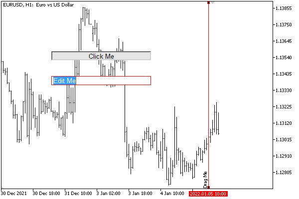

# Graphical object events

For the [graphical objects](/en/book/applications/objects) located on the chart, the terminal generates several specialized events. Most of them apply to objects of any type. The text editing end event in the input field — CHARTEVENT_OBJECT_ENDEDIT — is generated only for objects of the OBJ_EDIT type.

Object click (CHARTEVENT_OBJECT_CLICK), mouse drag (CHARTEVENT_OBJECT_DRAG) and object property change (CHARTEVENT_OBJECT_CHANGE) events are always active, while CHARTEVENT_OBJECT_CREATE object creation and CHARTEVENT_OBJECT_DELETE object creation events require explicit enabling by setting chart the relevant properties: CHART_EVENT_OBJECT_CREATE and CH ART_EVENT_OBJECT_DELETE.

When renaming an object manually (from the properties dialog), the terminal generates a sequence of events CHARTEVENT_OBJECT_DELETE, CHARTEVENT_OBJECT_CREATE, CHARTEVENT_OBJECT_CHANGE. When you programmatically rename an object, these events are not generated.

All events in objects carry the name of the associated object in the sparam parameter of the OnChartEvent function.

In addition, click coordinates are passed for CHARTEVENT_OBJECT_CLICK: X in the lparam parameter and Y in the dparam parameter. Coordinates are common to the entire chart, including subwindows.

Clicking on objects works differently depending on the object type. For some, such as the ellipse, the cursor must be over any anchor point. For others (triangle, rectangle, lines), the cursor may be over the object's perimeter, not just over a point. In all such cases, hovering the mouse cursor over the interactive area of the object displays a tooltip with the name of the object.

Objects linked to screen coordinates, which allow to form the graphical interface of the program, in particular, a button, an input field, and a rectangular panel, generate events when the mouse is clicked anywhere inside the object.

If there are multiple objects under the cursor, an event is generated for the object with the largest [Z-priority](/en/book/applications/objects/objects_z_order). If the priorities of the objects are equal, the event is assigned to the one that was created later (this corresponds to their visual display, that is, the later one overlaps the earlier one).

The new version of the indicator will help you check events in objects EventAllObjects.mq5. We will create and configure it using the already known class Object Selector of several objects, and then intercept in the handler OnChartEvent their characteristic events.

```
#include <MQL5Book/ObjectMonitor.mqh>
   
class ObjectBuilder: public ObjectSelector
{
protected:
   const ENUM_OBJECT type;
   const int window;
public:
   ObjectBuilder(const string _id, const ENUM_OBJECT _type,
      const long _chart = 0, const int _win = 0):
      ObjectSelector(_id, _chart), type(_type), window(_win)
   {
      ObjectCreate(host, id, type, window, 0, 0);
   }
};

```

Initially, in OnInit we create a button object and a vertical line. For the line, we will track the event of movement (towing), and on pressing the button, we will create an input field for which we will check the entered text.

```
const string ObjNamePrefix = "EventShow-";
const string ButtonName = ObjNamePrefix + "Button";
const string EditBoxName = ObjNamePrefix + "EditBox";
const string VLineName = ObjNamePrefix + "VLine";
   
bool objectCreate, objectDelete;
   
void OnInit()
{
   // remember the original settings to restore in OnDeinit
   objectCreate = ChartGetInteger(0, CHART_EVENT_OBJECT_CREATE);
   objectDelete = ChartGetInteger(0, CHART_EVENT_OBJECT_DELETE);
   
   // set new properties
   ChartSetInteger(0, CHART_EVENT_OBJECT_CREATE, true);
   ChartSetInteger(0, CHART_EVENT_OBJECT_DELETE, true);
   
   ObjectBuilder button(ButtonName, OBJ_BUTTON);
   button.set(OBJPROP_XDISTANCE, 100).set(OBJPROP_YDISTANCE, 100)
   .set(OBJPROP_XSIZE, 200).set(OBJPROP_TEXT, "Click Me");
   
   ObjectBuilder line(VLineName, OBJ_VLINE);
   line.set(OBJPROP_TIME, iTime(NULL, 0, 0))
   .set(OBJPROP_SELECTABLE, true).set(OBJPROP_SELECTED, true)
   .set(OBJPROP_TEXT, "Drag Me").set(OBJPROP_TOOLTIP, "Drag Me");
   
   ChartRedraw();
}

```

Along the way, do not forget to set the chart properties CHART_EVENT_OBJECT_CREATE and CHART_EVENT_OBJECT_DELETE to true to be notified when a set of objects changes.

In the OnChartEvent function, we will provide an additional response to the required events: after the dragging is completed, we will display the new position of the line in the log and, after editing the text in the input field, its contents.

```
void OnChartEvent(const int id,
   const long &lparam, const double &dparam, const string &sparam)
{
   ENUM_CHART_EVENT evt = (ENUM_CHART_EVENT)id;
   PrintFormat("%s %lld %f '%s'", EnumToString(evt), lparam, dparam, sparam);
   if(id == CHARTEVENT_OBJECT_CLICK && sparam == ButtonName)
   {
      if(ObjectGetInteger(0, ButtonName, OBJPROP_STATE))
      {
         ObjectBuilder edit(EditBoxName, OBJ_EDIT);
         edit.set(OBJPROP_XDISTANCE, 100).set(OBJPROP_YDISTANCE, 150)
         .set(OBJPROP_BGCOLOR, clrWhite)
         .set(OBJPROP_XSIZE, 200).set(OBJPROP_TEXT, "Edit Me");
      }
      else
      {
         ObjectDelete(0, EditBoxName);
      }
      
      ChartRedraw();
   }
   else if(id == CHARTEVENT_OBJECT_ENDEDIT && sparam == EditBoxName)
   {
      Print(ObjectGetString(0, EditBoxName, OBJPROP_TEXT));
   }
   else if(id == CHARTEVENT_OBJECT_DRAG && sparam == VLineName)
   {
      Print(TimeToString((datetime)ObjectGetInteger(0, VLineName, OBJPROP_TIME)));
   }
}

```

Note that when the button is pressed for the first time, its state changes from released to pressed, and in response to this, we create an input field. If you click the button again, it will change its state back, as a result of which the input field will be removed from the chart.

Below is an image of the chart during the operation of the indicator.



Immediately after the indicator is launched, the following lines appear in the log:

```
CHARTEVENT_OBJECT_CREATE 0 0.000000 'EventShow-Button'
CHARTEVENT_OBJECT_CREATE 0 0.000000 'EventShow-VLine'
CHARTEVENT_CHART_CHANGE 0 0.000000 ''

```

If we then drag the line with the mouse, we will see something like this:

```
CHARTEVENT_OBJECT_DRAG 0 0.000000 'EventShow-VLine'
2022.01.05 10:00

```

Next, you can click the button and edit the text in the newly created input field (when editing is complete, click Enter or click outside the input field). This will result in the following entries in the log (the coordinates and the text of the message may differ; the text "new message" was entered here):

```
CHARTEVENT_OBJECT_CLICK 181 113.000000 'EventShow-Button'
CHARTEVENT_CLICK 181 113.000000 ''
CHARTEVENT_OBJECT_CREATE 0 0.000000 'EventShow-EditBox'
CHARTEVENT_OBJECT_CLICK 152 160.000000 'EventShow-EditBox'
CHARTEVENT_CLICK 152 160.000000 ''
CHARTEVENT_OBJECT_ENDEDIT 0 0.000000 'EventShow-EditBox'
new message

```

If you then release the button, the input field will be deleted.

```
CHARTEVENT_OBJECT_CLICK 162 109.000000 'EventShow-Button'
CHARTEVENT_CLICK 162 109.000000 ''
CHARTEVENT_OBJECT_DELETE 0 0.000000 'EventShow-EditBox'

```

It is worth noting that the button works by default as a two-position switch, that is, it sticks alternately in the pressed or released state as a result of a mouse click. For a regular button, this behavior is redundant: in order to simply track button presses, you should return it to the released state when processing the event by calling ObjectSetInteger(0, ButtonName, OBJPROP_STATE, false).
