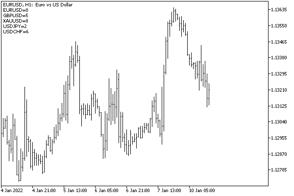

# Getting the last tick of a symbol

In the chapter about timeseries, in the [Working with arrays of real ticks](/en/book/applications/timeseries/timeseries_ticks_mqltick) section, we introduced the built-in structure MqlTick containing fields with price and volume values for a particular symbol, known at the time of each change in quotes. In online mode, an MQL program can query the last received prices and volumes using the SymbolInfoTick function that adopts the same structure.

bool SymbolInfoTick(const string symbol, MqlTick &tick)

For a symbol with a given name symbol, the function fills the tick structure passed by reference. If successful, it returns true.

As you know, indicators and Expert Advisors are automatically called by the terminal upon the arrival of a new tick, if they contain the description of the corresponding handlers [OnCalculate](/en/book/applications/indicators_make/indicators_oncalculate) and [OnTick](/en/book/automation/experts/experts_ontick). However, information about the meaning of price changes, the volume of the last trade, and the tick generation time are not transferred directly to the handlers. More detailed information can be obtained with the SymbolInfoTick function.

Tick events are generated only for a chart symbol, and therefore we have already considered the option of obtaining our own multi-symbol event for ticks based on [custom events](/en/book/applications/events/events_custom). In this case, SymbolInfoTick makes it possible to read information about ticks on third-party symbols about receiving notifications.

Let's take the EventTickSpy.mq5 indicator and convert it to SymbolTickSpy.mq5, which will request the MqlTick structure for the corresponding symbol on each "multicurrency" tick and then calculate and display all spreads on the chart.

Let's add a new input parameter Index. It will be required for a new way of sending notifications: we will send only the index of the changed symbol in the user event (see further along).

```
#define TICKSPY 0xFEED // 65261
 
input string SymbolList = 
   "EURUSD,GBPUSD,XAUUSD,USDJPY,USDCHF"; // List of symbols, comma separated (example)
input ushort Message = TICKSPY;          // Custom message id
input long Chart = 0;                    // Receiving chart id (do not edit)
input int Index = 0;                     // Index in symbol list (do not edit)

```

Also, we add the Spreads array to store spreads by symbols and the SelfIndex variable to remember the position of the current chart's symbol in the list (if it is included in the list, which is usually so). The latter is needed to call our new tick handling function from OnCalculate in the original copy of the indicator. It is easier and more correct to take a ready-made index for _Symbol explicitly and not send it in an event back to ourselves.

```
int Spreads[];
int SelfIndex = -1;

```

The introduced data structures are initialized in OnInit. Otherwise, OnInit remained unchanged, including the launch of subordinate instances of the indicator on third-party symbols (these lines are omitted here).

```
void OnInit()
{
   ...
         const int n = StringSplit(SymbolList, ',', Symbols);
         ArrayResize(Spreads, n);
         for(int i = 0; i < n; ++i)
         {
            if(Symbols[i] != _Symbol)
            {
               ...
            }
            else
            {
               SelfIndex = i;
            }
            Spreads[i] = 0;
         }
   ...
}

```

In the OnCalculate handler, we generate a custom event on each tick if the copy of the indicator works on the other symbol (at the same time, the ID of the Chart chart to which notifications should be sent is not equal to 0). Please note that the only parameter filled in the event is lparam which is equal to Index (dparam is 0, and sparam is NULL). If Chart equals 0, this means we are in the main copy of the indicator working on the chart symbol _Symbol, and if it is found in the input symbol list, we call directly OnSymbolTick with the corresponding SelfIndex index.

```
int OnCalculate(const int rates_total, const int prev_calculated, const int, const double &price[])
{
   if(prev_calculated)
   {
      if(Chart > 0)
      {
         EventChartCustom(Chart, Message, Index, 0, NULL);
      }
      else if(SelfIndex > -1)
      {
         OnSymbolTick(SelfIndex);
      }
   }
  
   return rates_total;
}

```

In the receiving part of the event algorithm in OnChartEvent, we also call OnSymbolTick, but this time we get the symbol number from the list in lparam (what was sent as the Index parameter from another copy of the indicator).

```
void OnChartEvent(const int id, const long &lparam, const double &dparam, const string &sparam)
{
   if(id == CHARTEVENT_CUSTOM + Message)
   {
      OnSymbolTick((int)lparam);
   }
}

```

The OnSymbolTick function requests full tick information using SymbolInfoTick and calculates the spread as the difference between the Ask and Bid prices divided by the point size (the SYMBOL_POINT property will be discussed later).

```
void OnSymbolTick(const int index)
{
   const string symbol = Symbols[index];
   
   MqlTick tick;
   if(SymbolInfoTick(symbol, tick))
   {
      Spreads[index] = (int)MathRound((tick.ask - tick.bid)
         / SymbolInfoDouble(symbol, SYMBOL_POINT));
      string message = "";
      for(int i = 0; i < ArraySize(Spreads); ++i)
      {
         message += Symbols[i] + "=" + (string)Spreads[i] + "\n";
      }
      
      Comment(message);
   }
}

```

The new spread updates the corresponding cell in the Spreads array, after which the entire array is displayed on the chart in the comment. Here's what it looks like.



You can compare in real time the correspondence of the information in the comment and in the Market Watch window.
