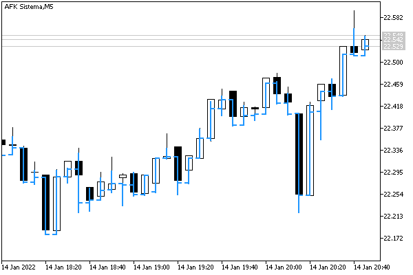
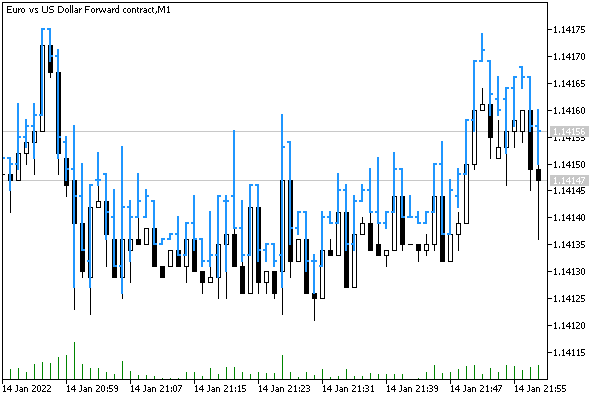

# Price type for building symbol charts

Bars on MetaTrader 5 price charts can be plotted based on Bid or Last prices, and the plotting type is indicated in the specification of each instrument. An MQL program can find this characteristic by calling the SymbolInfoInteger function for the SYMBOL_CHART_MODE property. The return value is a member of the ENUM_SYMBOL_CHART_MODE enumeration.

| Identifier | Description |
| --- | --- |
| SYMBOL_CHART_MODE_BID | Bars are built at Bid prices |
| SYMBOL_CHART_MODE_LAST | Bars are built at Last prices |

The mode with Last prices is used for symbols traded on exchanges (as opposed to the decentralized Forex market), and the [Depth of Market](/en/book/automation/marketbook) is available for such symbols. The depth of the market can be found based on the [SYMBOL_TICKS_BOOKDEPTH](/en/book/automation/symbols/symbols_market_depth) property.

The SYMBOL_CHART_MODE property is useful for adjusting the signals of indicators or strategies that are built, for example, at the chart's Last prices, while orders will be executed "at the market price", that is, at Ask or Bid prices depending on direction.

Also, the price type is required when calculating bars of the [custom instrument](/en/book/advanced/custom_symbols): if it depends on standard symbols, it may make sense to consider their settings by price type. When the user enters the formula of the [synthetic instrument](https://www.metatrader5.com/en/terminal/help/trading_advanced/custom_instruments#synthetic) in the Custom Symbol window (opened by selecting Create Symbol in the Symbols dialogue), it is possible to select price types according to the specifications of the respective standard symbols used. However, when the calculation algorithm is formed in an MQL program, precisely it is responsible for the correct choice of the price type.

First, let's collect statistics on the use of Bid and Last prices to build charts on a specific account. This is what the script SymbolStatsByPriceType.mq5 will do.

```
const bool MarketWatchOnly = false;
   
void OnStart()
{
   const int n = SymbolsTotal(MarketWatchOnly);
   int k = 0;
   // loop through all available characters
   for(int i = 0; i < n; ++i)
   {
      if(SymbolInfoInteger(SymbolName(i, MarketWatchOnly), SYMBOL_CHART_MODE)
          == SYMBOL_CHART_MODE_LAST)
      {
         k++;
      }
   }
   PrintFormat("Symbols in total: %d", n);
   PrintFormat("Symbols using price types: Bid=%d, Last=%d", n - k, k);
}

```

Try it on different accounts (some may not have stock symbols). Here's what the result might look like:

```
   Symbols in total: 52304
   Symbols using price types: Bid=229, Last=52075

```

A more practical example is the indicator SymbolBidAskChart.mq5, designed to draw a diagram in the form of bars formed based on prices of the specified type. This will allow you to compare candlesticks of a chart that uses prices from the SYMBOL_CHART_MODE property for its construction with bars on an alternative price type. For example, you can see bars at the Bid price on the instrument chart at the price Last or get bars for the Ask price, which the standard terminal charts do not support.

As a basis for a new indicator, we will take a ready-made indicator IndDeltaVolume.mq5 presented in the section [Waiting for data and managing visibility](/en/book/applications/indicators_make/indicators_wait_none). In that indicator, we downloaded a tick history for a certain number of bars BarCount and calculated the delta of volumes, that is, separately buy and sell volumes. In the new indicator, we only need to replace the calculation algorithm with the search for Open, High, Low, and Close prices based on ticks inside each bar.

Indicator settings include four buffers and one bar chart (DRAW_BARS) displayed in the main window.

```
#property indicator_chart_window
#property indicator_buffers 4
#property indicator_plots   1
   
#property indicator_type1   DRAW_BARS
#property indicator_color1  clrDodgerBlue
#property indicator_width1  2
#property indicator_label1  "Open;High;Low;Close;"

```

The display as bars is chosen to make them easier to read when run over the main chart candlesticks so that both versions of each bar are visible.

The new ChartMode input parameter allows the user to select one of three price types (note that Ask is our addition compared to the standard set of elements in ENUM_SYMBOL_CHART_MODE).

```
enum ENUM_SYMBOL_CHART_MODE_EXTENDED
{
   _SYMBOL_CHART_MODE_BID,  // SYMBOL_CHART_MODE_BID
   _SYMBOL_CHART_MODE_LAST, // SYMBOL_CHART_MODE_LAST
   _SYMBOL_CHART_MODE_ASK,  // SYMBOL_CHART_MODE_ASK*
};
   
input int BarCount = 100;
input COPY_TICKS TickType = INFO_TICKS;
input ENUM_SYMBOL_CHART_MODE_EXTENDED ChartMode = _SYMBOL_CHART_MODE_BID;

```

The former CalcDeltaVolume class changed its name to CalcCustomBars but remained almost unchanged. The differences include a new set of four buffers and the chartMode field which is initialized in the constructor from the input variable ChartMode.

```
class CalcCustomBars
{
   const int limit;
   const COPY_TICKS tickType;
   const ENUM_SYMBOL_CHART_MODE_EXTENDED chartMode;
   
   double open[];
   double high[];
   double low[];
   double close[];
   ...
public:
   CalcCustomBars(
      const int bars,
      const COPY_TICKS type,
      const ENUM_SYMBOL_CHART_MODE_EXTENDED mode)
      : limit(bars), tickType(type), chartMode(mode) ...
   {
      // register arrays as indicator buffers
      SetIndexBuffer(0, open);
      SetIndexBuffer(1, high);
      SetIndexBuffer(2, low);
      SetIndexBuffer(3, close);
      const static string defTitle[] = {"Open;High;Low;Close;"};
      const static string types[] = {"Bid", "Last", "Ask"};
      string name = defTitle[0];
      StringReplace(name, ";", types[chartMode] + ";");
      PlotIndexSetString(0, PLOT_LABEL, name);
      IndicatorSetInteger(INDICATOR_DIGITS, _Digits);
   }
   ...

```

Depending on the mode of chartMode, the auxiliary method price returns a specific price type from each tick.

```
protected:
   double price(const MqlTick &t) const
   {
      switch(chartMode)
      {
      case _SYMBOL_CHART_MODE_BID:
         return t.bid;
      case _SYMBOL_CHART_MODE_LAST:
         return t.last;
      case _SYMBOL_CHART_MODE_ASK:
         return t.ask;
      }
      return 0; // error
   }
   ...

```

Using the price method, we can easily implement the modification of the main calculation method calc which fills the buffers for the bar numbered i based on an array of ticks for this bar.

```
   void calc(const int i, const MqlTick &ticks[], const int skip = 0)
   {
      const int n = ArraySize(ticks);
      for(int j = skip; j < n; ++j)
      {
         const double p = price(ticks[j]);
         if(open[i] == EMPTY_VALUE)
         {
            open[i] = p;
         }
         
         if(p > high[i] || high[i] == EMPTY_VALUE)
         {
            high[i] = p;
         }
         
         if(p < low[i])
         {
            low[i] = p;
         }
         
         close[i] = p;
      }
   }

```

The remaining fragments of the source code and the principles of their work correspond to the description of IndDeltaVolume.mq5.

In the OnInit handler, we additionally display the current price type of the chart and return a warning if the user decides to build an indicator based on the Last price type for the instrument where the Last is absent.

```
int OnInit()
{
   ...
   ENUM_SYMBOL_CHART_MODE mode =
      (ENUM_SYMBOL_CHART_MODE)SymbolInfoInteger(_Symbol, SYMBOL_CHART_MODE);
   Print("Chart mode: ", EnumToString(mode));
   
   if(mode == SYMBOL_CHART_MODE_BID
      && ChartMode == _SYMBOL_CHART_MODE_LAST)
   {
      Alert("Last price is not available for ", _Symbol);
   }
   
   return INIT_SUCCEEDED;
}

```

Below is a screenshot of an instrument with the chart plotting mode based on the Last price; an indicator with the price type Bid is laid over the chart.



It is also interesting to look at the bars for the Ask price running over a regular Bid price chart.



During hours of low liquidity, when the spread widens, you can see a significant difference between Bid and Ask charts.
