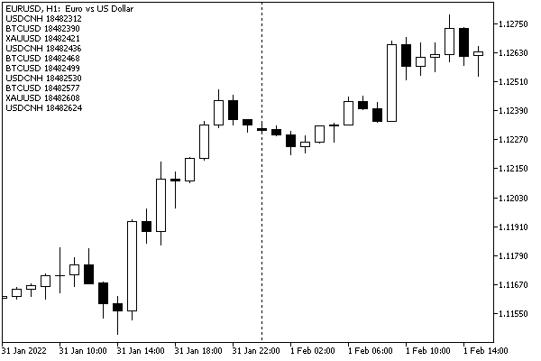

# Receiving events about changes in the Depth of Market

The OnBookEvent event is generated by the terminal when the order book status changes. The event is processed by the OnBookEvent function defined in the source code. In order for the terminal to start sending OnBookEvent notifications to the MQL program for a specific symbol, you must first subscribe to receive them using the [MarketBookAdd](/en/book/automation/marketbook/marketbook_add_release) function.

To unsubscribe from receiving the OnBookEvent event for a symbol, call the [MarketBookRelease](/en/book/automation/marketbook/marketbook_add_release) function.

The OnBookEvent event is broadcast, which means that it is enough for one MQL program on the chart to subscribe to OnBookEvent events, and all other programs on the same chart will also start receiving the events provided they have the OnBookEvent handler in the code. Therefore, it is necessary to analyze the name of the symbol, which is passed to the handler as a parameter.

The OnBookEvent handler prototype is as follows.

void OnBookEvent(const string &symbol)

OnBookEvent events are queued even if the processing of the previous OnBookEvent event has not yet been completed.

It is important that the events OnBookEvent are only notifications and do not provide the state of the order book. To get the Depth of Market data, call the [MarketBookGet](/en/book/automation/marketbook/marketbook_get) function.

It should be noted, however, that the MarketBookGet call, even if it is made directly from the OnBookEvent handler, will receive the current state of the order book at the time when MarketBookGet is called, which does not necessarily match the order book state that triggered sending of the event OnBookEvent. This can happen when a sequence of very fast order book changes arrives at the terminal.

In this regard, in order to obtain the most complete chronology of Depth of Market changes, we need to write an implementation of OnBookEvent and prioritize the optimization by the execution speed.

At the same time, there is no guaranteed way to get all unique Depth of Market states in MQL5.

If your program started receiving notifications successfully, and then they disappeared when the market was open (and ticks continue to come), this may indicate problems in the subscription. In particular, another MQL program which is poorly designed could unsubscribe more times than required. In such cases, it is recommended to resubscribe with a new MarketBookAdd call after a predefined timeout (for example, several tens of seconds or a minute).

An example of bufferless indicator MarketBookEvent.mq5 allows you to track the arrival of OnBookEvent events and prints the symbol name and the current time (millisecond system counter) in a comment. For clarity, we use the multi-line comment function from the Comments.mqh file, section [Displaying messages in the chart window](/en/book/common/output/output_comment).

Interestingly, if you leave the input parameter WorkSymbol empty (default value), the indicator itself will not initiate a subscription to the order book but will be able to intercept messages requested by other MQL programs on the same chart. Let's check it.

```
#include <MQL5Book/Comments.mqh>
   
input string WorkSymbol = ""; // WorkSymbol (if empty, intercept events initiated by others)
   
void OnInit()
{
   if(StringLen(WorkSymbol))
   {
      PRTF(MarketBookAdd(WorkSymbol));
   }
   else
   {
      Print("Start listening to OnBookEvent initiated by other programs");
   }
}
   
void OnBookEvent(const string &symbol)
{
   ChronoComment(symbol + " " + (string)GetTickCount());
}
 
void OnDeinit(const int)
{
   Comment("");
   if(StringLen(WorkSymbol))
   {
      PRTF(MarketBookRelease(WorkSymbol));
   }
}

```

Let's run MarketBookEvent with default settings (no own subscription) and then add the MarketBookAddRelease indicator from the previous section, and specify for it a list of several symbols with available order books (in the example below, this is "XAUUSD,BTCUSD,USDCNH"). It doesn't matter which chart to run the indicators on: it can be a completely different symbol, like EURUSD.

Immediately after launching MarketBookEvent, the chart will be empty (no comments) because there are no subscriptions yet. Once MarketBookAddRelease starts (three lines should appear in the log with the status of a successful subscription equal to true), the names of symbols will begin to appear in the comments alternately as their order books are updated (we have not yet learned how to read the order book; this will be discussed in the next section).

Here's how it looks on the screen.



If we now remove the MarketBookAddRelease indicator, it will cancel its subscriptions, and the comment will stop updating. Subsequent removal of MarketBookEvent will clear the comment.

Please note that some time (a second or two) passes between the request to unsubscribe and the moment when Depth of Market events actually stop updating the comment.

You can run the MarketBookEvent indicator alone on the chart, specifying some symbol in its WorkSymbol parameter to make sure notifications work within the same app. MarketBookAddRelease was previously used only to demonstrate the broadcast nature of notifications. In other words, enabling a subscription to order book changes in one program does affect the receipt of notifications in another.
