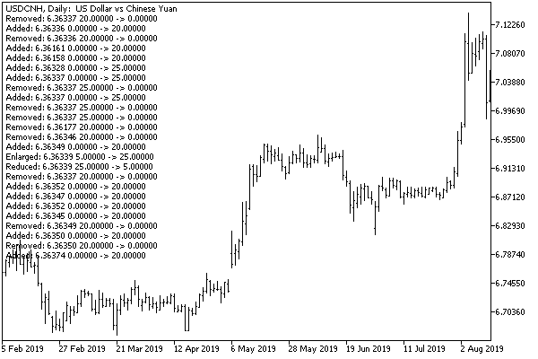

# Using Depth of Market data in applied algorithms

The Depth of Market is considered to be a very useful technology for developing advanced trading systems. In particular, analysis of the distribution of Depth of Market volumes at levels close to the market allows you to find out in advance the average order execution price of a specific volume: simply sum up the volumes of the levels (in the opposite direction) that will ensure its filling. In a thin market, with insufficient volumes, the algorithm may refrain from opening a trade in order to avoid significant price slippage.

Based on the Depth of Market data, other strategies can also be constructed. For example, it can be important to know the price levels at which large volumes are located.

MarketBookVolumeAlert.mq5

In the next test indicator MarketBookVolumeAlert.mq5, we implement a simple algorithm for tracking volumes or their changes that exceed a given value.

```
#property indicator_chart_window
#property indicator_plots 0
   
input string WorkSymbol = ""; // WorkSymbol (if empty, use current chart symbol)
input bool CountVolumeInLots = false;
input double VolumeLimit = 0;
   
const string _WorkSymbol = StringLen(WorkSymbol) == 0 ? _Symbol : WorkSymbol;

```

There are no graphics in the indicator. The controlled symbol is entered in the WorkSymbol parameter (if left blank, the chart's working symbol is implied). The minimum threshold of tracked objects, that is, the sensitivity of the algorithm, is specified in the VolumeLimit parameter. Depending on the CountVolumeInLots parameter, the volumes are analyzed and displayed to the user in lots (true) or units (false). This also affects how the VolumeLimit value should be entered. The conversion from units to fractions of lots is provided by the VOL macro: the contract size used in it contract is initialized in OnInit (see below).

```
#define VOL(V) (CountVolumeInLots ? V / contract : V)

```

If large volumes are found above the threshold, the program will display a message about the corresponding level in the comment. To save the nearest history of warnings, we use the class of multi-line comments already known to us (Comments.mqh).

```
#define N_LINES 25                // number of lines in the comment buffer
#include <MQL5Book/Comments.mqh>

```

In the handler OnInit let's prepare the necessary settings and subscribe to the DOM events.

```
double contract;
int digits;
   
void OnInit()
{
   MarketBookAdd(_WorkSymbol);
   contract = SymbolInfoDouble(_WorkSymbol, SYMBOL_TRADE_CONTRACT_SIZE);
   digits = (int)MathRound(MathLog10(contract));
   Print(SymbolInfoDouble(_WorkSymbol, SYMBOL_SESSION_BUY_ORDERS_VOLUME));
   Print(SymbolInfoDouble(_WorkSymbol, SYMBOL_SESSION_SELL_ORDERS_VOLUME));
}

```

The SYMBOL_SESSION_BUY_ORDERS_VOLUME and SYMBOL_SESSION_SELL_ORDERS_VOLUME properties, if they are filled by your broker for the selected symbol, will help you figure out which threshold it makes sense to choose. By default, VolumeLimit is 0, which is why absolutely all changes in the order book will generate warnings. To filter out insignificant fluctuations, it is recommended to set VolumeLimit to a value that exceeds the average size of volumes at all levels (look in advance in the built-in order book or in the [MarketBookDisplay.mq5](/en/book/automation/marketbook/marketbook_get) indicator).

In the usual way, we implement the finalization.

```
void OnDeinit(const int)
{
   MarketBookRelease(_WorkSymbol);
   Comment("");
}

```

The main work is done by the OnBookEvent processor. It describes a static array MqlBookInfo mbp to store the previous version of the order book (since the last function call).

```
void OnBookEvent(const string &symbol)
{
   if(symbol != _WorkSymbol) return; // process only the requested symbol 
   
   static MqlBookInfo mbp[];      // previous table/book
   MqlBookInfo mbi[];
   if(MarketBookGet(symbol, mbi)) // read the current book
   {
      if(ArraySize(mbp) == 0) // first time we just save, because nothing to compare
      {
         ArrayCopy(mbp, mbi);
         return;
      }
      ...

```

If there is an old and a new order book, we compare the volumes at their levels with each other in nested loops by i and j. Recall that an increase in the index means a decrease in price.

```
      int j = 0;
      for(int i = 0; i < ArraySize(mbi); ++i)
      {
         bool found = false;
         for( ; j < ArraySize(mbp); ++j)
         {
            if(MathAbs(mbp[j].price - mbi[i].price) < DBL_EPSILON * mbi[i].price)
            {       // mbp[j].price == mbi[i].price
               if(VOL(mbi[i].volume_real - mbp[j].volume_real) >= VolumeLimit)
               {
                  NotifyVolumeChange("Enlarged", mbp[j].price,
                     VOL(mbp[j].volume_real), VOL(mbi[i].volume_real));
               }
               else
               if(VOL(mbp[j].volume_real - mbi[i].volume_real) >= VolumeLimit)
               {
                  NotifyVolumeChange("Reduced", mbp[j].price,
                     VOL(mbp[j].volume_real), VOL(mbi[i].volume_real));
               }
               found = true;
               ++j;
               break;
            }
            else if(mbp[j].price > mbi[i].price)
            {
               if(VOL(mbp[j].volume_real) >= VolumeLimit)
               {
                  NotifyVolumeChange("Removed", mbp[j].price,
                     VOL(mbp[j].volume_real), 0.0);
               }
               // continue the loop increasing ++j to lower prices
            }
            else // mbp[j].price < mbi[i].price
            {
               break;
            }
         }
         if(!found) // unique (new) price
         {
            if(VOL(mbi[i].volume_real) >= VolumeLimit)
            {
               NotifyVolumeChange("Added", mbi[i].price, 0.0, VOL(mbi[i].volume_real));
            }
         }
      }
      ...

```

Here, the emphasis is not on the type of level, but on the volume value only. However, if you wish, you can easily add the designation of buys or sells to notifications, depending on the type field of that level where the important change took place.

Finally, we save a new copy of mbi in a static array mbp to compare against it on the next function call.

```
      if(ArrayCopy(mbp, mbi) <= 0)
      {
         Print("ArrayCopy failed:", _LastError);
      }
      if(ArrayResize(mbp, ArraySize(mbi)) <= 0) // shrink if needed
      {
         Print("ArrayResize failed:", _LastError);
      }
   }
}

```

ArrayCopy does not automatically shrink a dynamic destination array if it happens to be larger than the source array, so we explicitly set its exact size with ArrayResize.

An auxiliary function NotifyVolumeChange simply adds information about the found change to the comment.

```
void NotifyVolumeChange(const string action, const double price,
   const double previous, const double volume)
{
   const string message = StringFormat("%s: %s %s -> %s",
      action,
      DoubleToString(price, (int)SymbolInfoInteger(_WorkSymbol, SYMBOL_DIGITS)),
      DoubleToString(previous, digits),
      DoubleToString(volume, digits));
   ChronoComment(message);
}

```

The following image shows the result of the indicator for settings CountVolumeInLots=false, VolumeLimit=20.



MarketBookQuasiTicks.mq5

As a second example of the possible use of the order book, let's turn to the problem of obtaining multicurrency ticks. We have already touched on it in the section [Generation of custom events](/en/book/applications/events/events_custom), where we have seen one of the possible solutions and the indicator EventTickSpy.mq5. Now, after getting acquainted with the Depth of Market API, we can implement an alternative.

Let's create an indicator MarketBookQuasiTicks.mq5, which will subscribe to order books of a given list of instruments and find the prices of the best offer and demand in them, that is, pairs of prices around the spread, which are just prices Ask and Bid.

Of course, this information is not a complete equivalent of standard ticks (recall that trade/tick and order book flows can come from completely different providers), but it provides an adequate and timely view of the market.

New values of prices by symbols will be displayed in a multi-line comment.

The list of working symbols is specified in the SymbolList input parameter as a comma-separated list. Enabling and disabling subscriptions to Depth of Market events is done in the OnInit and OnDeinit handlers.

```
#define N_LINES 25                // number of lines in the comment buffer
#include <MQL5Book/Comments.mqh>
   
input string SymbolList = "EURUSD,GBPUSD,XAUUSD,USDJPY"; // SymbolList (comma,separated,list)
   
const string WorkSymbols = StringLen(SymbolList) == 0 ? _Symbol : SymbolList;
string symbols[];
   
void OnInit()
{
   const int n = StringSplit(WorkSymbols, ',', symbols);
   for(int i = 0; i < n; ++i)
   {
      if(!MarketBookAdd(symbols[i]))
      {
         PrintFormat("MarketBookAdd(%s) failed with code %d", symbols[i], _LastError);
      }
   }
}
   
void OnDeinit(const int)
{
   for(int i = 0; i < ArraySize(symbols); ++i)
   {
      if(!MarketBookRelease(symbols[i]))
      {
         PrintFormat("MarketBookRelease(%s) failed with code %d", symbols[i], _LastError);
      }
   }
   Comment("");
}

```

The analysis of each new order book is carried out in OnBookEvent.

```
void OnBookEvent(const string &symbol)
{
   MqlBookInfo mbi[];
   if(MarketBookGet(symbol, mbi)) // getting the current order book
   {
      int half = ArraySize(mbi) / 2; // estimate the middle of the order book
      bool correct = true;
      for(int i = 0; i < ArraySize(mbi); ++i)
      {
         if(i > 0)
         {
            if(mbi[i - 1].type == BOOK_TYPE_SELL
               && mbi[i].type == BOOK_TYPE_BUY)
            {
               half = i; // specify the middle of the order book
            }
            
            if(mbi[i - 1].price <= mbi[i].price)
            {
               correct = false;
            }
         }
      }
      
      if(correct) // retrieve the best Bid/Ask prices from the correct order book 
      {
         // mbi[half - 1].price // Ask
         // mbi[half].price     // Bid
         OnSymbolTick(symbol, mbi[half].price);
      }
   }
}

```

Found market Ask/Bid prices are passed to helper function OnSymbolTick to be displayed in a comment.

```
void OnSymbolTick(const string &symbol, const double price)
{
   const string message = StringFormat("%s %s",
      symbol, DoubleToString(price, (int)SymbolInfoInteger(symbol, SYMBOL_DIGITS)));
   ChronoComment(message);
}

```

If you wish, you can make sure that our synthesized ticks do not differ much from the standard ticks.

This is how information about incoming quasi-ticks looks on the chart.


At the same time, it should be noted once again that order book events are available on the platform online only, but not in the [tester](/en/book/automation/tester). If the trading system is built exclusively on quasi-ticks from the order book, its testing will require the use of third-party solutions that ensure the collection and playback of order books in the tester.
