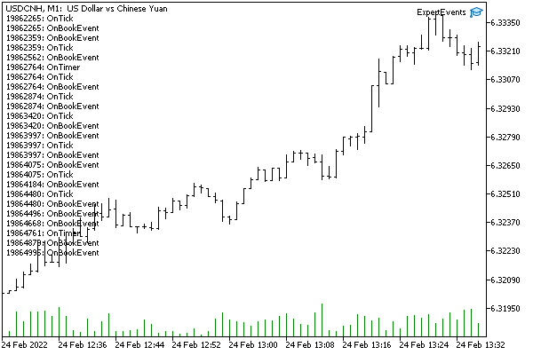

# Expert Advisors main event: OnTick

The OnTick event is generated by the terminal for Expert Advisors when a new tick appears containing the price of the current chart's working symbol on which the Expert Advisor is running. To handle this event, the OnTick function must be defined in the Expert Advisor code. It has the following prototype.

void OnTick(void)

As you can see, the function has no parameters. If necessary, the very value of the new price and other tick characteristics should be requested by calling [SymbolInfoTick](/en/book/automation/symbols/symbols_tick).

From the point of view of the reaction to the new tick event, this handler is similar to OnCalculate in indicators. However, OnCalculate can only be defined in indicators, and OnTick only in Expert Advisors (to be more precise, the OnTick function in the code of an indicator, script, or service will be simply ignored).

At the same time, the Expert Advisor does not have to contain the OnTick handler. In addition to this event, Expert Advisors can process the [OnTimer](/en/book/applications/timer/timer_ontimer), [OnBookEvent](/en/book/automation/marketbook/marketbook_events), and [OnChartEvent](/en/book/applications/events/events_onchartevent) events and perform all necessary trading operations from them.

All events in Expert Advisors are processed one after the other in the order they arrive, since Expert Advisors, like all other MQL programs, are single-threaded. If there is already an OnTick event in the queue or such an event is being processed, then new OnTick events are not queued.

An OnTick event is generated regardless of whether automatic trading is disabled or enabled (Algo trading button in the terminal interface). Disabled automatic trading means only restriction on sending trade requests from the Expert Advisors but does not prevent the Expert Advisor from running.

It should be remembered that tick events are generated only for one symbol, which is the symbol of the current chart. If the Expert Advisor is multicurrency, then getting ticks from other symbols should be organized in some alternative way, for example, using a spy indicator [EventTickSpy.mq5](/en/book/applications/events/events_custom) or subscription to market book events, as in [MarketBookQuasiTicks.mq5](/en/book/automation/marketbook/marketbook_application).

As a simple example, consider the Expert Advisor ExpertEvents.mq5. It defines handlers for all events that are usually used to launch trading algorithms. We will study some other events ([OnTrade](/en/book/automation/experts/experts_ontrade), [OnTradeTransaction](/en/book/automation/experts/experts_ontradetransaction), as well as tester events) later.

All handlers call the display helper function which outputs the current time (millisecond system counter label) and handler name in a multi-line comment.

```
#define N_LINES 25
#include <MQL5Book/Comments.mqh>
   
void Display(const string message)
{
   ChronoComment((string)GetTickCount() + ": " + message);
}

```

The OnTick event will be called automatically upon the arrival of new ticks. For timer and order book events, you need to activate the corresponding handlers using EventSetTimer and MarketBookAdd calls from OnInit.

```
void OnInit()
{
   Print(__FUNCTION__);
   EventSetTimer(2);
   if(!MarketBookAdd(_Symbol))
   {
      Print("MarketBookAdd failed:", _LastError);
   }
}
   
void OnTick()
{
   Display(__FUNCTION__);
}
   
void OnTimer()
{
   Display(__FUNCTION__);
}
   
void OnBookEvent(const string &symbol)
{
   if(symbol == _Symbol) // react only to order book of "our" symbol
   {
      Display(__FUNCTION__);
   }
}

```

The chart change event is also available: it can be used to trade on markup based on graphical objects, by pressing buttons or hotkeys, as well as upon the arrival of custom events from other programs, for example, indicators like EventTickSpy.mq5.

```
void OnChartEvent(const int id, const long &lparam, const double &dparam, const string &sparam)
{
   Display(__FUNCTION__);
}
   
void OnDeinit(const int)
{
   Print(__FUNCTION__);
   MarketBookRelease(_Symbol);
   Comment("");
}

```

The following screenshot shows the result of the Expert Advisor operation on the chart.



Please note that the OnBookEvent event (if it is broadcast for a symbol) arrives more often than OnTick.
