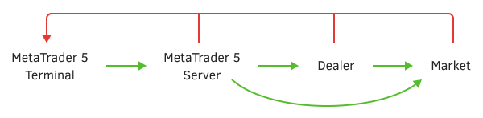

# Basic principles and concepts: order, deal, and position

Before starting to study the development of Expert Advisors in MQL5, let's recall the general architecture of the platform and the basic concepts that formalize trading activity.

MetaTrader 5 is a client terminal connected to a multi-level server part distributed between the computers of a broker, dealer or exchange. Once a user fills out an order to execute a trade, it goes through several stages of forwarding and verification, after which it is registered or rejected by the dealer or exchange. Then an order registered in the market may or may not be executed depending on circumstances such as liquidity, rate of price change, pause in symbol trading, or technical issues.

Here, green arrows indicate the successful execution of a trade operation as it moves from the terminal to the market, and red arrows indicate a potential rejection.

Orders generated by MQL programs also go through similar instances. In case of an unfavorable outcome, the MQL5 API will allow us to learn the reason for the failure through the error code.

This whole process is expressed (and documented in reports) in three fundamental terms: order, deal, and position.

An order is a trader's instruction to a brokerage company to buy or sell a financial instrument. MetaTrader 5 supports several types of orders, but in a simplified form they can be conditionally divided into market, pending, and special protective levels Take Profit and Stop Loss.

As a result of the successful execution of an order, a deal occurs in the trading system. Specifically, a deal can be concluded at the current price in the case of a market order, or when a pending order is triggered when the price reaches the value specified in the order. In other words, a deal is a fact of buying or selling a particular financial instrument.

It should be taken into account that in some conditions, an order execution may result in several deals. For example, if the order book does not contain a sufficient amount of symbol liquidity, then a buy order can be executed through various counter orders, including those at a slightly different price.

A financial instrument bought or sold according to a deal forms a long or short position, respectively, which is reflected in the assets/liabilities of the trading account. As a result of the subsequent change in the price of the position instrument, a floating profit or loss is formed on the account, which can be fixed by closing the position through reverse trading operations (orders and deals). Depending on the type of trading account (netting or hedging), deals for the same instrument modify a single net position or create/delete independent positions.

More information can be found in the [terminal user manual](https://www.metatrader5.com/en/terminal/help/trading/general_concept).

All orders, deals, and positions are included in the trading history of the account.

Next, we will look at the software API, which includes functions for sending trade orders, getting the current state of the portfolio in the account, checking the margin load and potential profit/loss, as well as analyzing the trading history.
