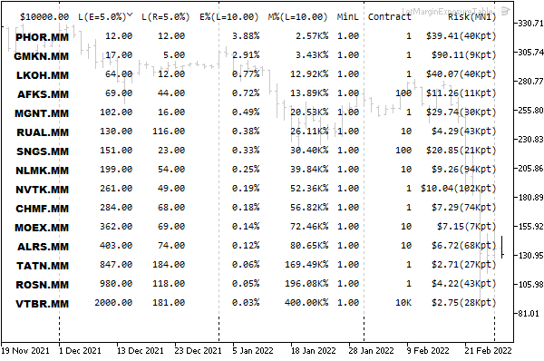

# Margin calculation for a future order: OrderCalcMargin

Before sending a trade request to the server, an MQL program can calculate the margin required for a planned trade using the OrderCalcMargin function. It is recommended to always do this in order to avoid excessive deposit load.

bool OrderCalcMargin(ENUM_ORDER_TYPE action, const string symbol,  

   double volume, double price, double &margin)

The function calculates the margin required for the specified action order type and the symbol financial instrument with volume lots. This aligns with the settings of the current account but does not consider existing pending orders and open positions. The ENUM_ORDER_TYPE enumeration was introduced in the [Order types](/en/book/automation/experts/experts_order_type) section.

The margin value (in the account currency) is written to the margin parameter passed by reference.

It should be emphasized that this is an estimate of the margin for a single new position or order, and not the total value of the collateral, which it will become after execution. Moreover, the evaluation is done as if there were no other pending orders and open positions on the current account. In reality, the value of the margin depends on many factors, including other orders and positions, and may change as the market environment (such as leverage) changes.

The function returns an indicator of success (true) or error (false). The error code can be obtained in the usual way from the variable _LastError.

The OrderCalcMargin function can only be used in Expert Advisors and scripts. To calculate the margin in indicators, you need to implement an alternative method, for example, launch an auxiliary Expert Advisor in a chart object, pass parameters to it. and get the result through the event mechanism, or independently describe calculations in MQL5 using [formulas](/en/book/automation/symbols/symbols_margin) according to the types of instruments. In the [next section](/en/book/automation/experts/experts_ordercalcprofit), we will give an example of such an implementation, along with an estimate of the potential profit/loss.

We could write a simple script that calls OrderCalcMargin for symbols from Market Watch, and compare margin values for them. Instead, let's slightly complicate the task and consider the header file LotMarginExposure.mqh, which allows the evaluation of the deposit load and the margin level after opening a position with a predetermined risk level. A little later we will discuss the [OrderCheck](/en/book/automation/experts/experts_ordercheck) function which is capable of providing similar information. However, our algorithm will additionally be able to solve the inverse problem of choosing the lot size according to the given load or risk levels.

The use of new features is demonstrated in a non-trading Expert Advisor LotMarginExposureTable.mq5.

In theory, the fact that an MQL program is implemented as an Expert Advisor does not mean that trading operations must be performed in it. Very often, as in our case, various utilities are created in the form of an Expert Advisor. Their advantage over scripts is that they remain on the chart and can perform their functions indefinitely in response to certain events.

In the new Expert Advisor, we use the skills of creating an interactive graphical interface using [objects](/en/book/applications/objects). To say it in a simpler way, for a given list of symbols, the Expert Advisor will display a table with several columns of margin indicators on the chart, and the table can be sorted by each of the columns. We will provide the list of columns a little later.

Since the analysis of lots, margin, and deposit load is a common task, we will separate the implementation into a separate header file LotMarginExposure.mqh.

All file functions are grouped in a namespace to avoid conflicts and for the sake of clarity (indicating the context before calling an internal function informs about the origin and location of this function).

```
namespace LEMLR
{
   ...
};

```

The abbreviation LEMLR means "Lot, Exposure, Margin Level, Risk".

The main calculations are performed in the Estimate function. Considering a prototype of the built-in OrderCalcMargin function, in the Estimate function parameters we need to pass the symbol name, order type, volume, and price. But that's not all we need.

```
   bool Estimate(const ENUM_ORDER_TYPE type, const string symbol, const double lot,
      const double price,...)

```

We intend to evaluate several indicators of a trading operation, which are interconnected and can be calculated in different directions, depending on what the user entered as initial data and what they want to calculate. For example, using the above parameters, it is easy to find the new margin level and account load. Their formulas are exactly the opposite:

```
Ml = money / margin * 100
Ex = margin / money * 100

```

Here the margin variable indicates the amount of margin, for which it is enough to call OrderCalcMargin.

However, traders often prefer to start from a predetermined load or margin level and calculate the volume for that. Moreover, there is an equally popular risk-based lot calculation approach. Risk is understood as the amount of potential loss from trading in case of an unfavorable price movement, as a result of which the content of another variable from the above formulas will decrease, that is, money.

To calculate the loss, it is important to know the volatility of the financial instrument during the trading period (the duration of the strategy) or the distance of the stop loss assumed by the user.

Therefore, the list of parameters of the Estimate function expands.

```
   bool Estimate(const ENUM_ORDER_TYPE type, const string symbol, const double lot,
      const double price,
      const double exposure, const double riskLevel, const int riskPoints,
      const ENUM_TIMEFRAMES riskPeriod, double money,...)

```

In the exposure parameter, we specify the desired deposit load as a percentage, and in the riskLevel parameter, we indicate the part of the deposit (also in percentage) that we are willing to risk. For risk-based calculations, you can pass the stop loss size in points in the riskPoints parameter. When it is equal to 0, the riskPeriod parameter comes into play: it specifies the period for which the algorithm will automatically calculate the range of symbol quotes in points. Finally, in the money parameter, we can specify an arbitrary amount of free margin for lot evaluation. Some traders conditionally divide the deposit between several robots. When money is 0, the function will fill this variable with the AccountInfoDouble(ACCOUNT_MARGIN_FREE) property.

Now we need to decide how to return the results of the function. Since it is able to evaluate many trading indicators and several volume options, it makes sense to define the SymbolLotExposureRisk structure.

```
   struct SymbolLotExposureRisk
   {
      double lot;                      // requested volume (or minimum)
      int atrPointsNormalized;         // price range normalized by tick size
      double atrValue;                 // range as the amount of profit/loss for 1 lot
      double lotFromExposureRaw;       // not normalized ( can be less than the minimum lot)
      double lotFromExposure;          // normalized lot from deposit loading
      double lotFromRiskOfStopLossRaw; // not normalized (can be less than the minimum lot)
      double lotFromRiskOfStopLoss;    // normalized lot from risk
      double exposureFromLot;          // loading based on the volume of 'lot
      double marginLevelFromLot;       // margin level from 'lot' volume
      int lotDigits;                   // number of digits in normalized lots
   };

```

The lot field in the structure contains the lot passed to the Exposure function if the lot is not equal to 0. If the passed lot is zero, the symbol property SYMBOL_VOLUME_MIN is substituted instead.

Two fields are allocated for the calculated values of volumes based on the load of the deposit and the risk: with the suffix Raw (lotFromExposureRaw, lotFromRiskOfStopLossRaw), and without it (lotFromExposure, lotFromRiskOfStopLoss). Raw fields contain a "pure arithmetic" result, which may not match the symbol specification. In the fields without a suffix, lots are normalized considering the minimum, maximum, and step. Such duplication is useful, in particular, for those cases when the calculation gives values less than the minimum lot (for example, lotFromExposureRaw equals 0.023721 with a minimum of 0.1, due to which lotFromExposure is reduced to zero): then from the content of Raw fields, you can evaluate how much money to add or how much to increase the risk to get to the minimum lot.

Let's describe the last output parameter of the Estimate function as a reference to this structure. We will gradually fill in all the fields in the function body. First of all, we get the margin for one lot by calling OrderCalcMargin and save it to a local variable lot1margin.

```
   bool Estimate(const ENUM_ORDER_TYPE type, const string symbol, const double lot,
      const double price, const double exposure,
      const double riskLevel, const int riskPoints, const ENUM_TIMEFRAMES riskPeriod,
      double money, SymbolLotExposureRisk &r)
   {
      double lot1margin;
      if(!OrderCalcMargin(type, symbol, 1.0,
         price == 0 ? GetCurrentPrice(symbol, type) : price,
         lot1margin))
      {
         Print("OrderCalcMargin ", symbol, " failed: ", _LastError);
         return false;
      }
      if(lot1margin == 0)
      {
         Print("Margin ", symbol, " is zero, ", _LastError);
         return false;
      }
      ...

```

If the entry price is not specified, i.e. price equals 0, the helper function GetCurrentPrice returns a suitable price based on order type: for buys, the symbol property SYMBOL_ASK will be taken, and for sells it will be SYMBOL_BID. This and other helper functions are omitted here, their content can be found in the attached source code.

If the margin calculation fails, or a zero value is received, the Estimate function will return false.

Keep in mind that zero margin may be the norm, but it also may be an error, depending on the instrument and order type. So for exchange tickers, pending orders are subject to deposit, but not for OTC tickers (i.e., deposit 0 is correct). This point should be taken into account in the calling code: it should request margin only for such combinations of symbols and types of operations for which it makes sense and is assumed to be non-zero.

Having a deposit for one lot, we can calculate the number of lots to ensure a given load of the deposit.

```
      double usedMargin = 0;
      if(money == 0)
      {
         money = AccountInfoDouble(ACCOUNT_MARGIN_FREE);
         usedMargin = AccountInfoDouble(ACCOUNT_MARGIN);
      }
   
      r.lotFromExposureRaw = money * exposure / 100.0 / lot1margin;
      r.lotFromExposure = NormalizeLot(symbol, r.lotFromExposureRaw);
      ...

```

The helper function NormalizeLot is shown below.

In order to get a lot depending on the risk and volatility, a little more calculation is required.

```
      const double tickValue = SymbolInfoDouble(symbol, SYMBOL_TRADE_TICK_VALUE);
      const int pointsInTick = (int)(SymbolInfoDouble(symbol, SYMBOL_TRADE_TICK_SIZE)
         / SymbolInfoDouble(symbol, SYMBOL_POINT));
      const double pointValue = tickValue / pointsInTick;
      const int atrPoints = (riskPoints > 0) ? (int)riskPoints :
         (int)(((MathMax(iHigh(symbol, riskPeriod, 1), iHigh(symbol, riskPeriod, 0))
         -  MathMin(iLow(symbol, riskPeriod, 1), iLow(symbol, riskPeriod, 0)))
         / SymbolInfoDouble(symbol, SYMBOL_POINT)));
      // rounding by tick size 
      r.atrPointsNormalized = atrPoints / pointsInTick * pointsInTick;
      r.atrValue = r.atrPointsNormalized * pointValue;
      
      r.lotFromRiskOfStopLossRaw = money * riskLevel / 100.0
         / (pointValue * r.atrPointsNormalized);
      r.lotFromRiskOfStopLoss = NormalizeLot(symbol, r.lotFromRiskOfStopLossRaw);
      ...

```

Here we find the cost of one pip of the instrument and the range of its changes for the specified period, after which we already calculate the lot.

Finally, we get the account load and margin level for the given lot.

```
      r.lot = lot <= 0 ? SymbolInfoDouble(symbol, SYMBOL_VOLUME_MIN) : lot;
      double margin = r.lot * lot1margin;
     
      r.exposureFromLot = (margin + usedMargin) / money * 100.0;
      r.marginLevelFromLot = margin > 0 ? money / (margin + usedMargin) * 100.0 : 0;
      r.lotDigits = (int)MathLog10(1.0 / SymbolInfoDouble(symbol, SYMBOL_VOLUME_MIN));
      
      return true;
   }

```

In case of successful calculation, the function will return true.

Here is the shortened view of the NormalizeLot function (all checks for 0 are omitted for simplicity). Details about the corresponding properties can be found in the section [Permitted volumes of trading operations](/en/book/automation/symbols/symbols_volume).

```
   double NormalizeLot(const string symbol, const double lot)
   {
      const double stepLot = SymbolInfoDouble(symbol, SYMBOL_VOLUME_STEP);
      const double newLotsRounded = MathFloor(lot / stepLot) * stepLot;
      const double minLot = SymbolInfoDouble(symbol, SYMBOL_VOLUME_MIN);
      if(newLotsRounded < minLot) return 0;
      const double maxLot = SymbolInfoDouble(symbol, SYMBOL_VOLUME_MAX);
      if(newLotsRounded > maxLot) return maxLot;
      return newLotsRounded;
   }

```

The above implementation of Estimate does not take into account adjustments for overlapping positions. As a rule, they lead to a decrease in the deposit, so the current estimate of account load and margin level may be more pessimistic than it turns out in reality, but this provides additional protection. Those interested can add a code to analyze the composition of already frozen account funds (their total amount is contained in the ACCOUNT_MARGIN account property) broken down by positions and orders: then it will be possible to take into account the potential effect of a new order on the margin (for example, only the largest position from the opposite ones will be taken into account or a reduced hedged margin rate will be applied, see details in the section [Margin requirements](/en/book/automation/symbols/symbols_margin)).

Now it's time to put margin and lot estimation into practice in LotMarginExposureTable.mq5. Considering the fact that Raw fields will be shown only in those cases when the normalization of lots led to their zeroing, the total number of columns in the resulting table of indicators is 8.

```
#include <MQL5Book/LotMarginExposure.mqh>
#define TBL_COLUMNS 8

```

In the input parameters, we will provide the possibility to specify the order type, the list of symbols to be analyzed (a list separated by commas), available funds, as well as the lot, the target deposit load, the level of margin, and risk.

```
input ENUM_ORDER_TYPE Action = ORDER_TYPE_BUY;
input string WorkList = "";                   // Symbols (comma,separated,list)
input double Money = 0;                       // Money (0 = free margin)
input double Lot = 0;                         // Lot (0 = min lot)
input double Exposure = 5.0;                  // Exposure (%)
input double RiskLevel = 5.0;                 // RiskLevel (%)
input int RiskPoints = 0;                     // RiskPoints/SL (0 = auto-range of RiskPeriod)
input ENUM_TIMEFRAMES RiskPeriod = PERIOD_W1;

```

For pending order types, it is necessary to select stock symbols, since for other symbols a zero margin will be obtained, which will cause an error in the Estimate function. If the list of symbols is left empty, the Expert Advisor will process only the symbol of the current chart. Zero default values in parameters Money and Lot mean, respectively, the current amount of free funds on the account and the minimum lot for each symbol.

The 0 value in the RiskPoints parameter means getting a range of prices during RiskPeriod (default is a week).

The input parameter UpdateFrequency sets the recalculation frequency in seconds. If you leave it equal to zero, the recalculation is performed on each new bar.

```
input int UpdateFrequency = 0; // UpdateFrequency (sec, 0 - once per bar)

```

Described in the global context are: an array of symbols (later populated by parsing the input parameter WorkList) and the timestamp of the last successful calculation.

```
string symbols[];
datetime lastTime;

```

At startup, we turn on the second timer.

```
void OnInit()
{
   Comment("Starting...");
   lastTime = 0;
   EventSetTimer(1);
}

```

In the timer handler, we provide the first call to the main calculation in OnTick, if OnTick has not yet been called upon the arrival of a tick. This situation can happen, for example, on weekends or during a calm market. Also, OnTimer is the entry point for recalculations at a given frequency.

```
void OnTimer()
{
   if(lastTime == 0) // calculation for the first time (if OnTick did have time to trigger)
   {
      OnTick();
      Comment("Started");
   }
   else if(lastTime != -1)
   {
      if(UpdateFrequency <= 0) // if there is no frequency, we work on new bars in OnTick
      {
         EventKillTimer();     // and the timer is no longer needed
      }
      else if(TimeCurrent() - lastTime >= UpdateFrequency)
      {
         lastTime = LONG_MAX; // prevent re-entering this 'if' branch 
         OnTick();
         if(lastTime != -1)   // completed without error
         {
 lastTime = TimeCurrent();// update timestamp
         }
      }
      Comment("");
   }
}

```

In the OnTick handler, we first check the input parameters and convert the list of symbols into an array of strings. If problems are found, the sign of the error is written in lastTime: the value -1, and the processing of subsequent ticks is interrupted at the very beginning.

```
void OnTick()
{
   if(lastTime == -1) return; // already had an error, exit 
  
   if(UpdateFrequency <= 0)   // if the update rate is not set
   {
      if(lastTime == iTime(NULL, 0, 0)) return; // waiting for a new bar
   }
   else if(TimeCurrent() - lastTime < UpdateFrequency)
   {
      return;
   }
      
   const int ns = StringSplit((WorkList == "" ? _Symbol : WorkList), ',', symbols);
   if(ns <= 0)
   {
      Print("Empty symbols");
      lastTime = -1;
      return;
   }
   
   if(Exposure > 100 || Exposure <= 0)
   {
      Print("Percent of Exposure is incorrect: ", Exposure);
      lastTime = -1;
      return;
   }
   
   if(RiskLevel > 100 || RiskLevel <= 0)
   {
      Print("Percent of RiskLevel is incorrect: ", RiskLevel);
      lastTime = -1;
      return;
   }
   ...

```

In particular, it is considered an error if the input values Exposure and Risk Level are beyond the range of 0 to 100, as it should be for percentages. In case of normal input data, we update the timestamp, describe the structure LEMLR::SymbolLotExposureRisk to receive calculated indicators from the function LEMLR::Estimate (one symbol each), as well as a two-dimensional array LME (from "Lot Margin Exposure") to collect indicators for all symbols.

```
   lastTime = UpdateFrequency > 0 ? TimeCurrent() : iTime(NULL, 0, 0);
   
   LEMLR::SymbolLotExposureRisk r = {};
   
   double LME[][13];
   ArrayResize(LME, ns);
   ArrayInitialize(LME, 0);
   ...

```

In a loop through symbols, we call the LEMLR::Estimate function and fill the LME array.

```
   for(int i = 0; i < ns; i++)
   {
      if(!LEMLR::Estimate(Action, symbols[i], Lot, 0,
         Exposure, RiskLevel, RiskPoints, RiskPeriod, Money, r))
      {
        Print("Calc failed (will try on the next bar, or refresh manually)");
        return;
      }
      
      LME[i][eLot] = r.lot;
      LME[i][eAtrPointsNormalized] = r.atrPointsNormalized;
      LME[i][eAtrValue] = r.atrValue;
      LME[i][eLotFromExposureRaw] = r.lotFromExposureRaw;
      LME[i][eLotFromExposure] = r.lotFromExposure;
      LME[i][eLotFromRiskOfStopLossRaw] = r.lotFromRiskOfStopLossRaw;
      LME[i][eLotFromRiskOfStopLoss] = r.lotFromRiskOfStopLoss;
      LME[i][eExposureFromLot] = r.exposureFromLot;
      LME[i][eMarginLevelFromLot] = r.marginLevelFromLot;
      LME[i][eLotDig] = r.lotDigits;
      LME[i][eMinLot] = SymbolInfoDouble(symbols[i], SYMBOL_VOLUME_MIN);
      LME[i][eContract] = SymbolInfoDouble(symbols[i], SYMBOL_TRADE_CONTRACT_SIZE);
      LME[i][eSymbol] = pack2double(symbols[i]);
   }
   ...

```

Elements of the special enumeration LME_FIELDS are used as array indexes, which simultaneously provide names and numbers for indicators from the structure.

```
enum LME_FIELDS // 10 fields + 3 additional symbol properties
{
   eLot,
   eAtrPointsNormalized,
   eAtrValue,
   eLotFromExposureRaw,
   eLotFromExposure,
   eLotFromRiskOfStopLossRaw,
   eLotFromRiskOfStopLoss,
   eExposureFromLot,
   eMarginLevelFromLot,
   eLotDig,
   eMinLot,
   eContract,
   eSymbol
};

```

The properties of SYMBOL_VOLUME_MIN and SYMBOL_TRADE_CONTRACT_SIZE are added for reference. The symbol name is "packed" into an approximate value of type double using the pack2double function, in order to subsequently implement a unified sorting by any of the fields, including the names.

```
double pack2double(const string s)
{
   double r = 0;
   for(int i = 0; i < StringLen(s); i++)
   {
      r = (r * 255) + (StringGetCharacter(s, i) % 255);
   }
   return r;
}

```

At this stage, we could already run the Expert Advisor and print the results in a log, something like this.

```
ArrayPrint(LME);

```

But looking into a log all the time is not convenient. Besides, unified formatting of values from different columns, and even more so the presentation of "packed" rows in double, can't be called user-friendly. Therefore, the scoreboard class was developed (Tableau.mqh) to display an arbitrary table on the chart. In addition to the fact that when preparing a table, we can control the format of each field ourselves (in the future, highlight it in a different color), this class allows you to interactively sort the table by any column: the first mouse click sorts in one direction, the second click sorts in the opposite direction, and the third one cancels sorting.

Here we will not describe the class in detail but you can study its source code. It is only important to note that the interface is based on [graphical objects](/en/book/applications/objects). In fact, the table cells are formed by objects of the OBJ_LABEL type, and all their properties are already familiar to the reader. However, some of the techniques used in the source code of the scoreboard, in particular, working with [graphic resources](/en/book/advanced/resources) and measuring the [display text](/en/book/advanced/resources/resources_textout), will be presented later, in the seventh part.

The constructor of the class tableau takes several parameters:

- prefix — prefix for the names of the created graphical objects
- rows — number of rows
- cols — number of columns
- height — line height in pixels (-1 means double the font size)
- width — cell width in pixels
- c — an angle of the chart for anchoring objects
- g — the gap in pixels between cells
- f — font size
- font — font name for regular cells
- bold — the name of the bold font for headings
- bgc — background color
- bgt — background transparency

```
class Tableau
{
public:
   Tableau(const string prefix, const int rows, const int cols,
      const int height = 16, const int width = 100,
      const ENUM_BASE_CORNER c = CORNER_RIGHT_LOWER, const int g = 8,
      const int f = 8, const string font = "Consolas", const string bold = "Arial Black",
      const int mask = TBL_FLAG_COL_0_HEADER,
      const color bgc = 0x808080, const uchar bgt = 0xC0)
      ...
};

```

Most of these parameters can be set by the user in the input variables of the LotMarginExposureTable.mq5 Expert Advisor.

```
input ENUM_BASE_CORNER Corner = CORNER_RIGHT_LOWER;
input int Gap = 16;
input int FontSize = 8;
input string DefaultFontName = "Consolas";
input string TitleFontName = "Arial Black";
input string MotoTypeFontsHint = "Consolas/Courier/Courier New/Lucida Console/Lucida Sans Typewriter";
input color BackgroundColor = 0x808080;
input uchar BackgroundTransparency = 0xC0; // BackgroundTransparency (255 - opaque, 0 - glassy)

```

The number of columns in the table is predetermined, the number of lines is equal to the number of symbols, plus the top line with headings.

It is important to note that fonts for the table should be selected without proportional lettering, so in the variable MotoTypeFontsHint a tooltip is provided with a set of standard Windows monospace fonts.

The created graphical objects are populated using the fill method of the Tableau class.

```
   bool fill(const string &data[], const string &hint[]) const;

```

Our Expert Advisor passes the data array of strings which are obtained from the LME array through a series of transformations through StringFormat, as well as the hint array with tooltips for titles.

The following image shows a part of the chart with the running Expert Advisor with default settings but with a specified list of symbols "EURUSD,USDRUB,USDCNH,XAUUSD,XPDUSD".


Symbol names are displayed in the left column. As the heading of the first column, the funds amount is displayed (in this case, free on the account at the current moment, because in the input parameter Money is left at 0). When you hover your mouse over the column name, you can see a tooltip with an explanation.

In the following columns:

- L(E) — lot calculated for loading level E of the 5% deposit after the deal
- L(R) — lot calculated at risk R for 5% of the deposit after unsuccessful trading (range in points and risk amount — in the last column)
- E% — deposit loading after entry with a minimum lot
- M% — margin level after entry with the minimum lot
- MinL — minimum lot for each symbol
- Contract — contract size (1 lot) for each symbol
- Risk — profit/loss in money when trading 1 lot and the same range in points

In columns E% and M%, in this case, the minimum lots are used, since the input parameter Lot is 0 (default).

When loading a 5% of the deposit, trading is possible for all selected symbols except for "XPDUSD". For the latter, the volume turned out to be 0.03272, which is less than the minimum lot of 0.1, and therefore the result is enclosed in brackets. If we allow loading of 20% (enter 20 in the parameter Exposure), we get the minimum lot for "XPDUSD" 0.1.

If we enter the value of 1 in the Lot parameter, we will see updated values in the E% and M% columns in the table (the load will increase, and the margin level will fall).


The last screenshot illustrating the work of the Expert Advisor shows a large set of blue chips of the Russian exchange MOEX sorted by volume calculated for a 5% deposit load (2nd column). Among the non-standard settings, it can be noted that Lot=10, and the period for calculating the price range and risk is equal to MN1. The background is made translucent white, the anchoring is to the upper left corner of the chart.


