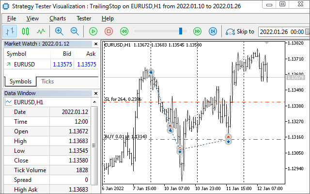
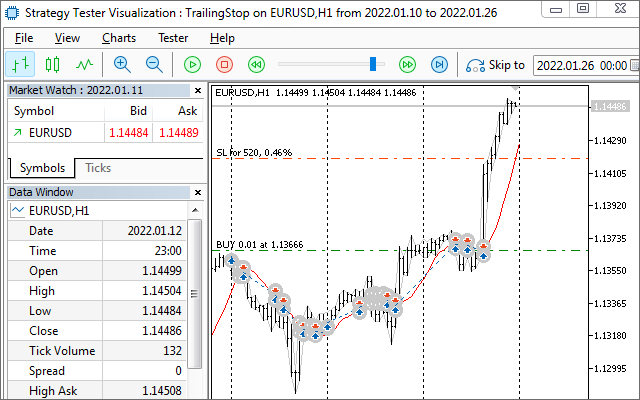

# Trailing stop

One of the most common tasks where the ability to change protective price levels is used is to sequentially shift Stop Loss at a better price as the favorable trend continues. This is the trailing stop. We implement it using new structures MqlTradeRequestSync and MqlTradeResultSync from previous sections.

To be able to connect the mechanism to any Expert Advisor, let's declare it as the Trailing Stop class (see the file TrailingStop.mqh). We will store the number of the controlled position, its symbol, and the size of the price point, as well as the required distance of the stop loss level from the current price, and the step of level changes in the personal variables of the class.

```
#include <MQL5Book/MqlTradeSync.mqh>
   
class TrailingStop
{
   const ulong ticket;  // ticket of controlled position
   const string symbol; // position symbol
   const double point;  // symbol price pip size
   const uint distance; // distance to the stop in points
   const uint step;     // movement step (sensitivity) in points
   ...

```

The distance is only needed for the standard position tracking algorithm provided by the base class. Derived classes will be able to move the protective level according to other principles, such as moving averages, channels, the SAR indicator, and others. After getting acquainted with the base class, we will give an example of a derived class with a moving average.

Let's create the level variable for the current stop price level. In the ok variable, we will maintain the current status of the position: true if the position still exists and false if an error occurred and the position was closed.

```
protected:
   double level;
   bool ok;
   virtual double detectLevel() 
   {
      return DBL_MAX;  
   }

```

A virtual method detectLevel is intended for overriding in descendant classes, where the stop price should be calculated according to an arbitrary algorithm. In this implementation, a special value DBL_MAX is returned, indicating the work according to the standard algorithm (see below).

In the constructor, fill in all the fields with the values of the corresponding parameters. The [PositionSelectByTicket](/en/book/automation/experts/experts_position_list) function checks for the existence of a position with a given ticket and allocates it in the program environment so that the subsequent call of [PositionGetString](/en/book/automation/experts/experts_positionget_funcs) returns its string property with the symbol name.

```
public:
   TrailingStop(const ulong t, const uint d, const uint s = 1) :
      ticket(t), distance(d), step(s),
      symbol(PositionSelectByTicket(t) ? PositionGetString(POSITION_SYMBOL) : NULL),
      point(SymbolInfoDouble(symbol, SYMBOL_POINT))
   {
      if(symbol == NULL)
      {
         Print("Position not found: " + (string)t);
         ok = false;
      }
      else
      {
         ok = true;
      }
   }
   
   bool isOK() const
   {
      return ok;
   }

```

Now let's consider the main public method of the trail class. The MQL program will need to call it on every tick or by timer to keep track of the position. The method returns true while the position exists.

```
   virtual bool trail()
   {
      if(!PositionSelectByTicket(ticket))
      {
         ok = false;
         return false; // position closed
      }
   
      // find out prices for calculations: current quote and stop level
      const double current = PositionGetDouble(POSITION_PRICE_CURRENT);
      const double sl = PositionGetDouble(POSITION_SL);
      ...

```

Here and below we use the position properties reading functions. They will be discussed in detail in a [separate section](/en/book/automation/experts/experts_positionget_funcs). In particular, we need to find out the direction of trade — buying and selling — in order to know in which direction the stop level should be set.

```
      // POSITION_TYPE_BUY  = 0 (false)
      // POSITION_TYPE_SELL = 1 (true)
      const bool sell = (bool)PositionGetInteger(POSITION_TYPE);
      TU::TradeDirection dir(sell);
      ...

```

For calculations and checks, we will use the helper class TU::TradeDirection and its object dir. For example, its negative method allows you to calculate the price located at a specified distance from the current price in a losing direction, regardless of the type of operation. This simplifies the code because otherwise you would have to do "mirror" calculations for buys and sells.

```
      level = detectLevel();
      // we can't trail without a level: removing the stop level must be done by the calling code
      if(level == 0) return true;
      // if there is a default value, make a standard offset from the current price
      if(level == DBL_MAX) level = dir.negative(current, point * distance);
      level = TU::NormalizePrice(level, symbol);
      
      if(!dir.better(current, level))
      {
         return true; // you can't set a stop level on the profitable side<
      }
      ...

```

The better method of the TU::TradeDirection class checks that the received stop level is located on the right side of the price. Without this method, we would need to write the check twice again (for buys and sells).

We may get an incorrect stop level value since the detectLevel method can be overridden in derived classes. With the standard calculation, this problem is eliminated because the level is calculated by the dir object.

Finally, when the level is calculated, it is necessary to apply it to the position. If the position does not already have a stop loss, any valid level will do. If the stop loss has already been set, then the new value should be better than the previous one and differ by more than the specified step.

```
      if(sl == 0)
      {
         PrintFormat("Initial SL: %f", level);
         move(level);
      }
      else
      {
         if(dir.better(level, sl) && fabs(level - sl) >= point * step)
         {
            PrintFormat("SL: %f -> %f", sl, level);
            move(level);
         }
      }
      
      return true; // success
   }

```

Sending of a position modification request is implemented in the move method which uses the familiar adjust method of the MqlTradeRequestSync structure (see the section [Modifying Stop Loss and/or Take Profit levels](/en/book/automation/experts/experts_modify_position)).

```
   bool move(const double sl)
   {
      MqlTradeRequestSync request;
      request.position = ticket;
      if(request.adjust(sl, 0) && request.completed())
      {
         Print("OK Trailing: ", TU::StringOf(sl));
         return true;
      }
      return false;
   }
};

```

Now everything is ready to add trailing to the test Expert Advisor TrailingStop.mq5. In the input parameters, you can specify the trading direction, the distance to the stop level in points, and the step in points. The TrailingDistance parameter equals 0 by default, which means automatic calculation of the daily range of quotes and using half of it as a distance.

```
#include <MQL5Book/MqlTradeSync.mqh>
#include <MQL5Book/TrailingStop.mqh>
   
enum ENUM_ORDER_TYPE_MARKET
{
   MARKET_BUY = ORDER_TYPE_BUY,   // ORDER_TYPE_BUY
   MARKET_SELL = ORDER_TYPE_SELL  // ORDER_TYPE_SELL
};
   
input int TrailingDistance = 0;   // Distance to Stop Loss in points (0 = autodetect)
input int TrailingStep = 10;      // Trailing Step in points
input ENUM_ORDER_TYPE_MARKET Type;
input string Comment;
input ulong Deviation;
input ulong Magic = 1234567890;

```

When launched, the Expert Advisor will find if there is a position on the current symbol with the specified Magic number and will create it if it doesn't exist.

Trailing will be carried out by an object of the TrailingStop class wrapped in a smart pointer [AutoPtr](/en/book/oop/templates/templates_objects). Thanks to the latter, we don't need to manually delete the old object when it needs a new tracking object to replace it for the new position being created. When a new object is assigned to a smart pointer, the old object is automatically deleted. Recall that dereferencing a smart pointer, i.e., accessing the work object stored inside, is done using the overloaded [] operator.

```
#include <MQL5Book/AutoPtr.mqh>
   
AutoPtr<TrailingStop> tr;

```

In the OnTick handler, we check if there is an object. If there is one, check whether a position exists (the attribute is returned from the trail method). Immediately after the program starts, the object is not there, and the pointer is NULL. In this case, you should either create a new position or find an already open one and create a Trailing Stop object for it. This is done by the Setup function. On subsequent calls of OnTick, the object starts and continues tracking, preventing the program from going inside the if block while the position is "alive".

```
void OnTick()
{
   if(tr[] == NULL || !tr[].trail())
   {
      // if there is no trailing yet, create or find a suitable position
      Setup();
   }
}

```

And here is the Setup function.

```
void Setup()
{
   int distance = 0;
   const double point = SymbolInfoDouble(_Symbol, SYMBOL_POINT);
   
   if(trailing distance == 0) // auto-detect the daily range of prices
   {
      distance = (int)((iHigh(_Symbol, PERIOD_D1, 1) - iLow(_Symbol, PERIOD_D1, 1))
         / point / 2);
      Print("Autodetected daily distance (points): ", distance);
   }
   else
   {
      distance = TrailingDistance;
   }
   
   // process only the position of the current symbol and our Magic
   if(GetMyPosition(_Symbol, Magic))
   {
      const ulong ticket = PositionGetInteger(POSITION_TICKET);
      Print("The next position found: ", ticket);
      tr = new TrailingStop(ticket, distance, TrailingStep);
   }
   else // there is no our position
   {
      Print("No positions found, lets open it...");
      const ulong ticket = OpenPosition();
      if(ticket)
      {
         tr = new TrailingStop(ticket, distance, TrailingStep);
      }
   }
   
   if(tr[] != NULL)
   {
      // Execute trailing for the first time immediately after creating or finding a position
      tr[].trail();
   }
}

```

The search for a suitable open position is implemented in the GetMyPosition function, and opening a new position is done by the OpenPosition function. Both are presented below. In any case, we get a position ticket and create a trailing object for it.

```
bool GetMyPosition(const string s, const ulong m)
{
   for(int i = 0; i < PositionsTotal(); ++i)
   {
      if(PositionGetSymbol(i) == s && PositionGetInteger(POSITION_MAGIC) == m)
      {
         return true;
      }
   }
   return false;
}

```

The purpose and the general meaning of the algorithm should be clear from the names of the built-in functions. In the loop through all open positions (PositionsTotal), we sequentially select each of them using PositionGetSymbol and get its symbol. If the symbol matches the requested one, we read and compare the position property POSITION_MAGIC with the passed "magic". All functions for working with positions will be discussed in a [separate section](/en/book/automation/experts/experts_position_list).

The function will return true as soon as the first matching position is found. At the same time, the position will remain selected in the trading environment of the terminal which makes it possible for the rest of the code to read its other properties if necessary.

We already know the algorithm for opening a position.

```
ulong OpenPosition()
{
   MqlTradeRequestSync request;
   
   // default values
   const bool wantToBuy = Type == MARKET_BUY;
   const double volume = SymbolInfoDouble(_Symbol, SYMBOL_VOLUME_MIN);
   // optional fields are filled directly in the structure
   request.magic = Magic;
   request.deviation = Deviation;
   request.comment = Comment;
   ResetLastError();
   // execute the selected trade operation and wait for its confirmation
   if((bool)(wantToBuy ? request.buy(volume) : request.sell(volume))
      && request.completed())
   {
      Print("OK Order/Deal/Position");
   }
   
   return request.position; // non-zero value - sign of success
}

```

For clarity, let's see how this program works in the tester, in visual mode.

After compilation, let's open the strategy tester panel in the terminal, on the Review tab, and choose the first option: Single test.

In the Settings tab, select the following:

- in the drop-down list Expert Advisor: MQL5Book\p6\TralingStop
- Symbol: EURUSD
- Timeframe: H1
- Interval: last year, month, or custom
- Forward: No
- Delays: disabled
- Modeling: based on real or generated ticks
- Optimization: disabled
- Visual mode: enabled

Once you press Start, you will see something like this in a separate tester window:



Standard trailing stop in the tester

The log will show entries that look like this:

```
2022.01.10 00:02:00   Autodetected daily distance (points): 373
2022.01.10 00:02:00   No positions found, let's open it...
2022.01.10 00:02:00   instant buy 0.01 EURUSD at 1.13612 (1.13550 / 1.13612 / 1.13550)
2022.01.10 00:02:00   deal #2 buy 0.01 EURUSD at 1.13612 done (based on order #2)
2022.01.10 00:02:00   deal performed [#2 buy 0.01 EURUSD at 1.13612]
2022.01.10 00:02:00   order performed buy 0.01 at 1.13612 [#2 buy 0.01 EURUSD at 1.13612]
2022.01.10 00:02:00   Waiting for position for deal D=2
2022.01.10 00:02:00   OK Order/Deal/Position
2022.01.10 00:02:00   Initial SL: 1.131770
2022.01.10 00:02:00   position modified [#2 buy 0.01 EURUSD 1.13612 sl: 1.13177]
2022.01.10 00:02:00   OK Trailing: 1.13177
2022.01.10 00:06:13   SL: 1.131770 -> 1.131880
2022.01.10 00:06:13   position modified [#2 buy 0.01 EURUSD 1.13612 sl: 1.13188]
2022.01.10 00:06:13   OK Trailing: 1.13188
2022.01.10 00:09:17   SL: 1.131880 -> 1.131990
2022.01.10 00:09:17   position modified [#2 buy 0.01 EURUSD 1.13612 sl: 1.13199]
2022.01.10 00:09:17   OK Trailing: 1.13199
2022.01.10 00:09:26   SL: 1.131990 -> 1.132110
2022.01.10 00:09:26   position modified [#2 buy 0.01 EURUSD 1.13612 sl: 1.13211]
2022.01.10 00:09:26   OK Trailing: 1.13211
2022.01.10 00:09:35   SL: 1.132110 -> 1.132240
2022.01.10 00:09:35   position modified [#2 buy 0.01 EURUSD 1.13612 sl: 1.13224]
2022.01.10 00:09:35   OK Trailing: 1.13224
2022.01.10 10:06:38   stop loss triggered #2 buy 0.01 EURUSD 1.13612 sl: 1.13224 [#3 sell 0.01 EURUSD at 1.13224]
2022.01.10 10:06:38   deal #3 sell 0.01 EURUSD at 1.13221 done (based on order #3)
2022.01.10 10:06:38   deal performed [#3 sell 0.01 EURUSD at 1.13221]
2022.01.10 10:06:38   order performed sell 0.01 at 1.13221 [#3 sell 0.01 EURUSD at 1.13224]
2022.01.10 10:06:38   Autodetected daily distance (points): 373
2022.01.10 10:06:38   No positions found, let's open it...

```

Look how the algorithm shifts the SL level up with a favorable price movement, up to the moment when the position is closed by stop loss. Immediately after liquidating a position, the program opens a new one.

To check the possibility of using non-standard tracking mechanisms, we implement an example of an algorithm on a moving average. To do this, let's go back to the file TrailingStop.mqh and describe the derived class TrailingStopByMA.

```
class TrailingStopByMA: public TrailingStop
{
   int handle;
   
public:
   TrailingStopByMA(const ulong t, const int period,
      const int offset = 1,
      const ENUM_MA_METHOD method = MODE_SMA,
      const ENUM_APPLIED_PRICE type = PRICE_CLOSE): TrailingStop(t, 0, 1)
   {
      handle = iMA(_Symbol, PERIOD_CURRENT, period, offset, method, type);
   }
   
   virtual double detectLevel() override
   {
      double array[1];
      ResetLastError();
      if(CopyBuffer(handle, 0, 0, 1, array) != 1)
      {
         Print("CopyBuffer error: ", _LastError);
         return 0;
      }
      return array[0];
   }
};

```

It creates the [iMA](/en/book/applications/indicators_use/indicators_standard) indicator instance in the constructor: the period, the averaging method, and the price type are passed via parameters.

In the overridden detectLevel method, we read the value from the indicator buffer, and by default, this is done with an offset of 1 bar, i.e., the bar is closed, and its readings do not change when ticks arrive. Those who wish can take the value from the zero bar, but such signals are unstable for all price types, except for PRICE_OPEN.

To use a new class in the same test Expert Advisor TrailingStop.mq5, let's add another input parameter MATrailingPeriod with a moving period (we will leave other parameters of the indicator unchanged).

```
input int MATrailingPeriod = 0;   // Period for Trailing by MA (0 = disabled)

```

The value of 0 in this parameter disables the trailing moving average. If it is enabled, the distance settings in the TrailingDistance parameter are ignored.

Depending on this parameter, we will create either a standard trailing object TrailingStop or the one derivative from iMA —TrailingStopByMA.

```
      ...
      tr = MATrailingPeriod > 0 ?
         new TrailingStopByMA(ticket, MATrailingPeriod) :
         new TrailingStop(ticket, distance, TrailingStep);
      ...

```

Let's see how the updated program behaves in the tester. In the Expert Advisor settings, set a non-zero period for MA, for example, 10.



Trailing stop on the moving average in the tester

Please note that in those moments when the average comes close to the price, there is an effect of frequent stop-loss triggering and closing the position. When the average is above the quotes, a protective level is not set at all, because this is not correct for buying. This is a consequence of the fact that our Expert Advisor does not have any strategy and always opens positions of the same type, regardless of the situation on the market. For sales, the same paradoxical situation will occasionally arise when the average goes below the price, which means the market is growing, and the robot "stubbornly" gets into a short position.

In working strategies, as a rule, the direction of the position is chosen taking into account the movement of the market, and the moving average is located on the right side of the current price, where placing a stop loss is allowed.
