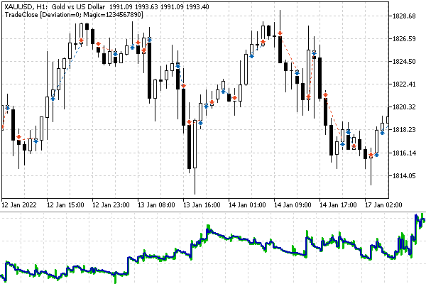

# Closing a position: full and partial

Technically, closing a position can be thought of as a trading operation that is opposite to the one used to open it. For example, to exit a buy, you need to make a sell operation (ORDER_TYPE_SELL in the type field) and to exit the sell one you need to buy (ORDER_TYPE_BUY in the type field).

The trading operation type in the action field of the MqlTradeTransaction structure remains the same: TRADE_ACTION_DEAL.

On a hedging account, the position to be closed must be specified using a ticket in the position field. For netting accounts, you can specify only the name of the symbol in the symbol field since only one symbol position is possible on them. However, you can also close positions by ticket here.

In order to unify the code, it makes sense to fill in both position and symbol fields regardless of account type.

Also, be sure to set the volume in the volume field. If it is equal to the position volume, it will be closed completely. However, by specifying a lower value, it is possible to close only part of the position.

In the following table, all mandatory structure fields are marked with an asterisk and optional fields are marked with a plus.

| Field | Netting | Hedging |
| --- | --- | --- |
| action | * | * |
| symbol | * | + |
| position | + | * |
| type | * | * |
| type_filling | * | * |
| volume | * | * |
| price | *' | *' |
| deviation | ± | ± |
| magic | + | + |
| comment | + | + |

The price field marked is with an asterisk with a tick because it is required only for symbols with the Request and Instant execution modes), while for the Exchange and Market execution, the price in the structure is not taken into account.

For a similar reason, the deviation field is marked with '±'. It has effect only for Instant and Request modes.

To simplify the programmatic implementation of closing a position, let's return to our extended structure MqlTradeRequestSync in the file MqlTradeSync.mqh. The method for closing a position by ticket has the following code.

```
struct MqlTradeRequestSync: public MqlTradeRequest
{
   double partial; // volume after partial closing
   ...
   bool close(const ulong ticket, const double lot = 0)
   {
      if(!PositionSelectByTicket(ticket)) return false;
      
      position = ticket;
      symbol = PositionGetString(POSITION_SYMBOL);
      type = (ENUM_ORDER_TYPE)(PositionGetInteger(POSITION_TYPE) ^ 1);
      price = 0; 
      ...

```

Here we first check for the existence of a position by calling the [PositionSelectByTicket](/en/book/automation/experts/experts_position_list) function. Additionally, this call makes the position selected in the trading environment of the terminal, which allows you to read its properties using the [subsequent functions](/en/book/automation/experts/experts_positionget_funcs). In particular, we find out the symbol of a position from the POSITION_SYMBOL property and "reverse" its type from POSITION_TYPE to the opposite one in order to get the required order type.

The position types in the ENUM_POSITION_TYPE enum are POSITION_TYPE_BUY (value 0) and POSITION_TYPE_SELL (value 1). In the enumeration of order types ENUM_ORDER_TYPE, exactly the same values are occupied by market operations: ORDER_TYPE_BUY and ORDER_TYPE_SELL. That is why we can bring the first enumeration to the second one, and to get the opposite direction of trading, it is enough to switch the zero bit using the exclusive OR operation ('^'): we get 1 from 0, and 0 from 1.

Zeroing the price field means automatic selection of the correct current price (Ask or Bid) before sending the request: this is done a little later, inside the helper method setVolumePrices, which is called further along the algorithm, from the market method.

The _market method call occurs a couple of lines below. The _market method generates a market order for the full volume or a part, taking into account all the completed fields of the structure.

```
      const double total = lot == 0 ? PositionGetDouble(POSITION_VOLUME) : lot;
      partial = PositionGetDouble(POSITION_VOLUME) - total;
      return _market(symbol, total);
   }

```

This fragment is slightly simplified compared to the current source code. The full code contains the handling of a rare but possible situation when the position volume exceeds the maximum allowed volume in one order per symbol (SYMBOL_VOLUME_MAX property). In this case, the position has to be closed in parts, via several orders.

Also note that since the position can be closed partially, we had to add a field to the partial structure, where the planned balance of the volume after the operation is placed. Of course, for a complete closure, this will be 0. This information will be required to further verify the completion of the operation.

For netting accounts, there is a version of the close method that identifies the position by symbol name. It selects a position by symbol, gets its ticket, and then refers to the previous version of close.

```
   bool close(const string name, const double lot = 0)
   {
      if(!PositionSelect(name)) return false;
      return close(PositionGetInteger(POSITION_TICKET), lot);
   }

```

In the MqlTradeRequestSync structure, we have the completed method that provides a synchronous wait for the completion of the operation, if necessary. Now we need to supplement it to close positions, in the branch where action equals TRADE_ACTION_DEAL. We will distinguish between opening a position and closing by a zero value in the position field: it has no ticket when opening a position and has one when closing.

```
   bool completed()
   {
      if(action == TRADE_ACTION_DEAL)
      {
         if(position == 0)
         {
            const bool success = result.opened(timeout);
            if(success) position = result.position;
            return success;
         }
         else
         {
            result.position = position;
            result.partial = partial;
            return result.closed(timeout);
         }
      }

```

To check the actual closing of a position, we have added the closed method into the MqlTradeResultSync structure. Before calling it, we write the position ticket in the result.position field so that the result structure can track the moment when the corresponding ticket disappears from the trading environment of the terminal, or when the volume equals result.partial in case of partial closure.

Here is the closed method. It is built on a well-known principle: first checking the success of the server return code, and then waiting with the wait method for some condition to fulfill.

```
struct MqlTradeResultSync: public MqlTradeResult
{
   ...
   bool closed(const ulong msc = 1000)
   {
      if(retcode != TRADE_RETCODE_DONE)
      {
         return false;
      }
      if(!wait(positionRemoved, msc))
      {
         Print("Position removal timeout: P=" + (string)position);
      }
      
      return true;
   }

```

In this case, to check the condition for the position to disappear, we had to implement a new function positionRemoved.

```
   static bool positionRemoved(MqlTradeResultSync &ref)
   {
      if(ref.partial)
      {
         return PositionSelectByTicket(ref.position)
            && TU::Equal(PositionGetDouble(POSITION_VOLUME), ref.partial);
      }
      return !PositionSelectByTicket(ref.position);
   }

```

We will test the operation of closing positions using the Expert Advisor TradeClose.mq5, which implements a simple trading strategy: enter the market if there are two consecutive bars in the same direction, and as soon as the next bar closes in the opposite direction to the previous trend, we exit the market. Repetitive signals during continuous trends will be ignored, that is, there will be a maximum of one position (minimum lot) or none in the market.

The Expert Advisor will not have any adjustable parameters: only the (Deviation) and a unique number (Magic). The implicit parameters are the timeframe and the working symbol of the chart.

To track the presence of an already open position, we use the GetMyPosition function from the previous example TradeTrailing.mq5: it searches among positions by symbol and Expert Advisor number and returns a logical true if a suitable position is found.

We also take the almost unchanged function OpenPosition: it opens a position according to the market order type passed in the single parameter. Here, this parameter will come from the trend detection algorithm, and earlier (in TrailingStop.mq5) the order type was set by the user through an input variable.

A new function that implements closing a position is ClosePosition. Because the header file MqlTradeSync.mqh took over the whole routine, we only need to call the request.close(ticket) method for the submitted position ticket and wait for the deletion to complete by request.completed().

In theory, the latter can be avoided if the Expert Advisor analyzes the situation at each tick. In this case, a potential problem with deleting the position will promptly reveal itself on the next tick, and the Expert Advisor can try to delete it again. However, this Expert Advisor has trading logic based on bars, and therefore it makes no sense to analyze every tick. Next, we implement a special mechanism for bar-by-bar work, and in this regard, we synchronously control the removal, otherwise, the position would remain "hanging" for a whole bar.

```
ulong LastErrorCode = 0;
   
ulong ClosePosition(const ulong ticket)
{
   MqlTradeRequestSync request; // empty structure
   
   // optional fields are filled directly in the structure
   request.magic = Magic;
   request.deviation = Deviation;
   
   ResetLastError();
   // perform close and wait for confirmation
   if(request.close(ticket) && request.completed())
   {
      Print("OK Close Order/Deal/Position");
   }
   else // print diagnostics in case of problems
   {
      Print(TU::StringOf(request));
      Print(TU::StringOf(request.result));
      LastErrorCode = request.result.retcode;
      return 0; // error, code to parse in LastErrorCode
   }
   
   return request.position; // non-zero value - success
}

```

We could force the ClosePosition functions to return 0 in case of successful deletion of the position and an error code otherwise. This seemingly efficient approach would make the behavior of the two functions OpenPosition and ClosePosition different: in the calling code, it would be necessary to nest the calls of these functions in logical expressions that are opposite in meaning, and this would introduce confusion. In addition, we would require the global variable LastErrorCode in any case, in order to add information about the error inside the OpenPosition function. Also, the if(condition) check is more organically interpreted as success than if(!condition).

The function that generates trading signals according to the above strategy is called GetTradeDirection.

```
ENUM_ORDER_TYPE GetTradeDirection()
{
   if(iClose(_Symbol, _Period, 1) > iClose(_Symbol, _Period, 2)
      && iClose(_Symbol, _Period, 2) > iClose(_Symbol, _Period, 3))
   {
      return ORDER_TYPE_BUY; // open a long position
   }
   
   if(iClose(_Symbol, _Period, 1) < iClose(_Symbol, _Period, 2)
      && iClose(_Symbol, _Period, 2) < iClose(_Symbol, _Period, 3))
   {
      return ORDER_TYPE_SELL; // open a short position
   }
   
   return (ENUM_ORDER_TYPE)-1; // close
}

```

The function returns a value of the ENUM_ORDER_TYPE type with two standard elements (ORDER_TYPE_BUY and ORDER_TYPE_SELL) triggering buys and sells, respectively. The special value -1 (not in the enumeration) will be used as a close signal.

To activate the Expert Advisor based on the trading algorithm, we use the OnTick handler. As we remember, other options are suitable for other strategies, for example, a timer for trading on the news or Depth of Market events for volume trading.

First, let's analyze the function in a simplified form, without handling potential errors. At the very beginning, there is a block that ensures that the further algorithm is triggered only when a new bar is opened.

```
void OnTick()
{
   static datetime lastBar = 0;
   if(iTime(_Symbol, _Period, 0) == lastBar) return;
   lastBar = iTime(_Symbol, _Period, 0);
   ...

```

Next, we get the current signal from the GetTradeDirection function.

```
   const ENUM_ORDER_TYPE type = GetTradeDirection();

```

If there is a position, we check whether a signal to close it has been received and call ClosePosition if necessary. If there is no position yet and there is a signal to enter the market, we call OpenPosition.

```
   if(GetMyPosition(_Symbol, Magic))
   {
      if(type != ORDER_TYPE_BUY && type != ORDER_TYPE_SELL)
      {
         ClosePosition(PositionGetInteger(POSITION_TICKET));
      }
   }
   else if(type == ORDER_TYPE_BUY || type == ORDER_TYPE_SELL)
   {
      OpenPosition(type);
   }
}

```

To analyze errors, you will need to enclose OpenPosition and ClosePosition calls into conditional statements and take some action to restore the working state of the program. In the simplest case, it is enough to repeat the request at the next tick, but it is desirable to do this a limited number of times. Therefore, we will create static variables with a counter and an error limit.

```
void OnTick()
{
   static int errors = 0;
   static const int maxtrials = 10; // no more than 10 attempts per bar
   
   // expect a new bar to appear if there were no errors
   static datetime lastBar = 0;
   if(iTime(_Symbol, _Period, 0) == lastBar && errors == 0) return;
   lastBar = iTime(_Symbol, _Period, 0);
   ...

```

The bar-by-bar mechanism is temporarily disabled if errors appear since it is desirable to overcome them as soon as possible.

Errors are counted in conditional statements around ClosePosition and OpenPosition.

```
   const ENUM_ORDER_TYPE type = GetTradeDirection();
   
   if(GetMyPosition(_Symbol, Magic))
   {
      if(type != ORDER_TYPE_BUY && type != ORDER_TYPE_SELL)
      {
         if(!ClosePosition(PositionGetInteger(POSITION_TICKET)))
         {
            ++errors;
         }
         else
         {
            errors = 0;
         }
      }
   }
   else if(type == ORDER_TYPE_BUY || type == ORDER_TYPE_SELL)
   {
      if(!OpenPosition(type))
      {
         ++errors;
      }
      else
      {
         errors = 0;
      }
   }
 // too many errors per bar
   if(errors >= maxtrials) errors = 0;
 // error serious enough to pause
   if(IS_TANGIBLE(LastErrorCode)) errors = 0;
}

```

Setting the errors variable to 0 turns on the bar-by-bar mechanism again and stops attempts to repeat the request until the next bar.

The macro IS_TANGIBLE is defined in TradeRetcode.mqh as:

```
#define IS_TANGIBLE(T) ((T) >= TRADE_RETCODE_ERROR)

```

Errors with smaller codes are operational, that is, normal in a sense. Large codes require analysis and different actions, depending on the cause of the problem: incorrect request parameters, permanent or temporary bans in the trading environment, lack of funds, and so on. We will present an improved error classifier in the section [Pending order modification](/en/book/automation/experts/experts_modify_order).

Let's run the Expert Advisor in the tester on XAUUSD, H1 from the beginning of 2022, simulating real ticks. The next collage shows a fragment of a chart with deals, as well as the balance curve.



TradeClose testing results on XAUUSD, H1

Based on the report and the log, we can see that the combination of our simple trading logic and the two operations of opening and closing positions is working properly.

In addition to simply closing a position, the platform supports the possibility of mutual [closing of two opposite positions](/en/book/automation/experts/experts_closeby) on hedging accounts.
