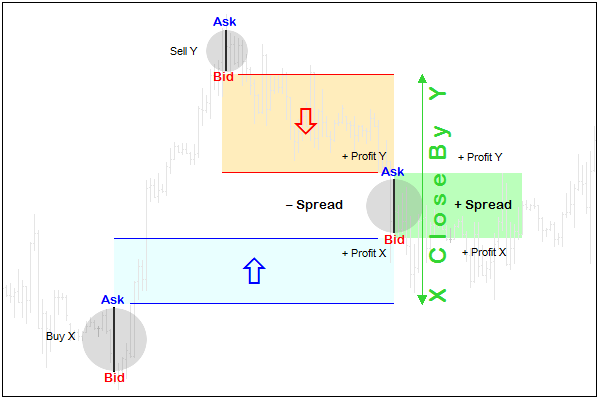
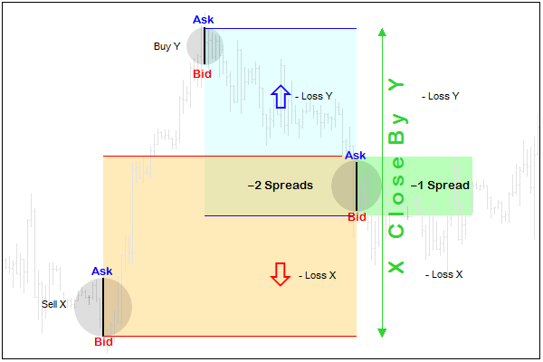
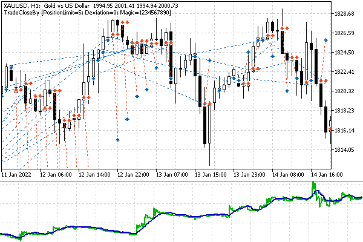
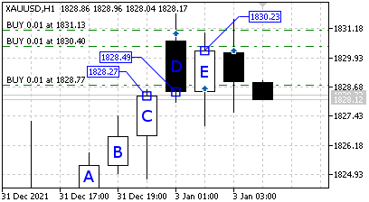

# Closing opposite positions: full and partial (hedging)

On hedging accounts, it is allowed to open several positions at the same time, and in most cases, these positions can be in the opposite direction. In some jurisdictions, hedging accounts are restricted: you can only have positions in one direction at a time. In this case, you will receive the TRADE_RETCODE_HEDGE_PROHIBITED error code when trying to execute an opposite trading operation. Also, this restriction often correlates with the setting of the ACCOUNT_FIFO_CLOSE account property to true.

When two opposite positions are opened at the same time, the platform supports the mechanism of their simultaneous mutual closing using the TRADE_ACTION_CLOSE_BY operation. To perform this action, you should fill two more fields in the MqlTradeTransaction structure in addition to the action field: position and position_by must contain the tickets of positions to be closed.

The availability of this feature depends on the [SYMBOL_ORDER_MODE](/en/book/automation/symbols/symbols_trade_mode) property of the financial instrument: SYMBOL_ORDER_CLOSEBY (64) must be present in the allowed flags bitmask.

This operation not only simplifies closing (one operation instead of two) but also saves one spread.

As you know, any new position starts trading with a loss equal to the spread. For example, when buying a financial instrument, a transaction is concluded at the Ask price, but for an exit deal, that is, a sale, the actual price is Bid. For a short position, the situation is reversed: immediately after entering at the Bid price, we start tracking the price Ask for a potential exit.

If you close positions at the same time in a regular way, their exit prices will be at a distance of the current spread from each other. However, if you use the TRADE_ACTION_CLOSE_BY operation, then both positions will be closed without taking into account the current prices. The price at which positions are offset is equal to the opening price of the position_by position (in the request structure). It is specified in the [ORDER_TYPE_CLOSE_BY](/en/book/automation/experts/experts_order_type) order generated by the TRADE_ACTION_CLOSE_BY request.

Unfortunately, in the reports in the context of deals and positions, the closing and opening prices of opposite positions/deals are displayed in pairs of identical values, in a mirror direction, which gives the impression of a double profit or loss. In fact, the financial result of the operation (the difference between prices adjusted for the lot) is recorded only for the first position exit trade (the position field in the request structure). The result of the second exit trade is always 0, regardless of the price difference.

Another consequence of this asymmetry is that from changing the places of tickets in the position and position_by fields, the profit and loss statistics in the context of long and short trades changes in the trading report, for example, profitable long trades can increase exactly as much as the number of profitable short trades decreases. But this, in theory, should not affect the overall result, if we assume that the delay in the execution of the order does not depend on the order of transfer of tickets.

The following diagram shows a graphical explanation of the process (spreads are intentionally exaggerated).



Spread accounting when closing profitable positions

Here is a case of a profitable pair of positions. If the positions had opposite directions and were at a loss, then when they were closed separately, the spread would be taken into account twice (in each). Counter closing allows you to reduce the loss by one spread.



Accounting for the spread when closing unprofitable positions

Reversed positions do not have to be of equal size. The opposite closing operation will work on the minimum of the two volumes.

In the MqlTradeSync.mqh file, the close-by operation is implemented using the closeby method with two parameters for position tickets.

```
struct MqlTradeRequestSync: public MqlTradeRequest
{
   ...
   bool closeby(const ulong ticket1, const ulong ticket2)
   {
      if(!PositionSelectByTicket(ticket1)) return false;
      double volume1 = PositionGetDouble(POSITION_VOLUME);
      if(!PositionSelectByTicket(ticket2)) return false;
      double volume2 = PositionGetDouble(POSITION_VOLUME);
   
      action = TRADE_ACTION_CLOSE_BY;
      position = ticket1;
      position_by = ticket2;
      
      ZeroMemory(result);
      if(volume1 != volume2)
      {
         // remember which position should disappear
         if(volume1 < volume2)
            result.position = ticket1;
         else
            result.position = ticket2;
      }
      return OrderSend(this, result);
   }

```

To control the result of the closure, we store the ticket of a smaller position in the result.position variable. Everything in the completed method and in the MqlTradeResultSync structure is ready for synchronous position closing tracking: the same algorithm worked for a normal closing of a position.

```
struct MqlTradeRequestSync: public MqlTradeRequest
{
   ...
   bool completed()
   {
      ...
      else if(action == TRADE_ACTION_CLOSE_BY)
      {
         return result.closed(timeout);
      }
      return false;
   }

```

Opposite positions are usually used as a replacement for a stop order or an attempt to take profit on a short-term correction while remaining in the market and following the main trend. The option of using a pseudo-stop order allows you to postpone the decision to actually close positions for some time, continuing the analysis of market movements expecting the price to reverse in the right direction. However, it should be kept in mind that "locked" positions require increased deposits and are subject to swaps. That is why it is difficult to imagine a trading strategy built on opposite positions in its pure form, which could serve as an example for this section.

Let's develop the idea of the price-action bar-based strategy outlined in the previous example. The new Expert Advisor is TradeCloseBy.mq5.

We will use the previous signal to enter the market upon detection of two consecutive candles that closed in the same direction. A function responsible for its formation is again GetTradeDirection. However, let's allow re-entries if the trend continues. The total maximum allowed number of positions will be set in the input variable PositionLimit, the default is 5.

The GetMyPositions function will undergo some changes: it will have two parameters, which will be references to arrays that accept position tickets: buy and sell separately.

```
#define PUSH(A,V) (A[ArrayResize(A, ArraySize(A) + 1, ArraySize(A) * 2) - 1] = V)
   
int GetMyPositions(const string s, const ulong m,
   ulong &ticketsLong[], ulong &ticketsShort[])
{
   for(int i = 0; i < PositionsTotal(); ++i)
   {
      if(PositionGetSymbol(i) == s && PositionGetInteger(POSITION_MAGIC) == m)
      {
         if((ENUM_POSITION_TYPE)PositionGetInteger(POSITION_TYPE) == POSITION_TYPE_BUY)
            PUSH(ticketsLong, PositionGetInteger(POSITION_TICKET));
         else
            PUSH(ticketsShort, PositionGetInteger(POSITION_TICKET));
      }
   }
   
   const int min = fmin(ArraySize(ticketsLong), ArraySize(ticketsShort));
   if(min == 0) return -fmax(ArraySize(ticketsLong), ArraySize(ticketsShort));
   return min;
}

```

The function returns the size of the smallest array of the two. When it is greater than zero, we have the opportunity to close opposite positions.

If the minimum array is zero size, the function will return the size of another array, but with a minus sign, just to let the calling code know that all positions are in the same direction.

If there are no positions in either direction, the function will return 0.

Opening positions will remain under the control of the function OpenPosition - no changes here.

Closing will be carried out only in the mode of two opposite positions in the new function CloseByPosition. In other words, this Expert Advisor is not capable of closing positions one at a time, in the usual way. Of course, in a real robot, such a principle is unlikely to occur, but as an example of an oncoming closure, it fits very well. If we need to close a single position, it is enough to open an opposite position for it (at this moment the floating profit or loss is fixed) and call CloseByPosition for two.

```
bool CloseByPosition(const ulong ticket1, const ulong ticket2)
{
   MqlTradeRequestSync request;
   request.magic = Magic;
   
   ResetLastError();
   // send a request and wait for it to complete
   if(request.closeby(ticket1, ticket2))
   {
      Print("Positions collapse initiated");
      if(request.completed())
      {
         Print("OK CloseBy Order/Deal/Position");
         return true; // success
      }
   }
   
   Print(TU::StringOf(request));
   Print(TU::StringOf(request.result));
   
   return false; // error
}

```

The code uses the request.closeby method described above. The position, and position_by fields are filled and OrderSend is called.

The trading logic is described in the OnTick handler which analyzes the price configuration only at the moment of the formation of a new bar and receives a signal from the GetTradeDirection function.

```
void OnTick()
{
   static bool error = false;
   // waiting for the formation of a new bar, if there is no error
   static datetime lastBar = 0;
   if(iTime(_Symbol, _Period, 0) == lastBar && !error) return;
   lastBar = iTime(_Symbol, _Period, 0);
   
   const ENUM_ORDER_TYPE type = GetTradeDirection();
   ...

```

Next, we fill the ticketsLong and ticketsShort arrays with position tickets of the working symbol and with the given Magic number. If the GetMyPositions function returns a value greater than zero, it gives the number of formed pairs of opposite positions. They can be closed in a loop using the CloseByPosition function. The combination of pairs in this case is chosen randomly (in the order of positions in the terminal environment), however, in practice, it may be important to select pairs by volume or in such a way that the most profitable ones are closed first.

```
   ulong ticketsLong[], ticketsShort[];
   const int n = GetMyPositions(_Symbol, Magic, ticketsLong, ticketsShort);
   if(n > 0)
   {
      for(int i = 0; i < n; ++i)
      {
         error = !CloseByPosition(ticketsShort[i], ticketsLong[i]) && error;
      }
   }
   ...

```

For any other value of n, you should check if there is a signal (possibly repeated) to enter the market and execute it by calling OpenPosition.

```
   else if(type == ORDER_TYPE_BUY || type == ORDER_TYPE_SELL)
   {
      error = !OpenPosition(type);
   }
   ...

```

Finally, if there are still open positions, but they are in the same direction, we check if their number has reached the limit, in which case we form an opposite position in order to "collapse" two of them on the next bar (thus closing one of any position from the old ones).

```
   else if(n < 0)
   {
      if(-n >= (int)PositionLimit)
      {
         if(ArraySize(ticketsLong) > 0)
         {
            error = !OpenPosition(ORDER_TYPE_SELL);
         }
         else // (ArraySize(ticketsShort) > 0)
         {
            error = !OpenPosition(ORDER_TYPE_BUY);
         }
      }
   }
}

```

Let's run the Expert Advisor in the tester on XAUUSD, H1 from the beginning of 2022, with default settings. Below is the chart with positions in the process of the program, as well as the balance curve.



TradeCloseBy test results on XAUUSD, H1

It is easy to find in the log the moments of time when one trend ends (buying with tickets from #2 to #4), and transactions start being generated in the opposite direction (selling #5), after which a counter close is triggered.

```
2022.01.03 01:05:00   instant buy 0.01 XAUUSD at 1831.13 (1830.63 / 1831.13 / 1830.63)
2022.01.03 01:05:00   deal #2 buy 0.01 XAUUSD at 1831.13 done (based on order #2)
2022.01.03 01:05:00   deal performed [#2 buy 0.01 XAUUSD at 1831.13]
2022.01.03 01:05:00   order performed buy 0.01 at 1831.13 [#2 buy 0.01 XAUUSD at 1831.13]
2022.01.03 01:05:00   Waiting for position for deal D=2
2022.01.03 01:05:00   OK New Order/Deal/Position
2022.01.03 02:00:00   instant buy 0.01 XAUUSD at 1828.77 (1828.47 / 1828.77 / 1828.47)
2022.01.03 02:00:00   deal #3 buy 0.01 XAUUSD at 1828.77 done (based on order #3)
2022.01.03 02:00:00   deal performed [#3 buy 0.01 XAUUSD at 1828.77]
2022.01.03 02:00:00   order performed buy 0.01 at 1828.77 [#3 buy 0.01 XAUUSD at 1828.77]
2022.01.03 02:00:00   Waiting for position for deal D=3
2022.01.03 02:00:00   OK New Order/Deal/Position
2022.01.03 03:00:00   instant buy 0.01 XAUUSD at 1830.40 (1830.16 / 1830.40 / 1830.16)
2022.01.03 03:00:00   deal #4 buy 0.01 XAUUSD at 1830.40 done (based on order #4)
2022.01.03 03:00:00   deal performed [#4 buy 0.01 XAUUSD at 1830.40]
2022.01.03 03:00:00   order performed buy 0.01 at 1830.40 [#4 buy 0.01 XAUUSD at 1830.40]
2022.01.03 03:00:00   Waiting for position for deal D=4
2022.01.03 03:00:00   OK New Order/Deal/Position
2022.01.03 05:00:00   instant sell 0.01 XAUUSD at 1826.22 (1826.22 / 1826.45 / 1826.22)
2022.01.03 05:00:00   deal #5 sell 0.01 XAUUSD at 1826.22 done (based on order #5)
2022.01.03 05:00:00   deal performed [#5 sell 0.01 XAUUSD at 1826.22]
2022.01.03 05:00:00   order performed sell 0.01 at 1826.22 [#5 sell 0.01 XAUUSD at 1826.22]
2022.01.03 05:00:00   Waiting for position for deal D=5
2022.01.03 05:00:00   OK New Order/Deal/Position
2022.01.03 06:00:00   close position #5 sell 0.01 XAUUSD by position #2 buy 0.01 XAUUSD (1825.64 / 1825.86 / 1825.64)
2022.01.03 06:00:00   deal #6 buy 0.01 XAUUSD at 1831.13 done (based on order #6)
2022.01.03 06:00:00   deal #7 sell 0.01 XAUUSD at 1826.22 done (based on order #6)
2022.01.03 06:00:00   Positions collapse initiated
2022.01.03 06:00:00   OK CloseBy Order/Deal/Position

```

Transaction #3 is an interesting artifact. An attentive reader will notice that it opened lower than the previous one, seemingly violating our strategy. In fact, there is no error here, and this is a consequence of the fact that the conditions of the signals are written as simply as possible: only based on the closing prices of the bars. Therefore, a bearish reversal candle (D), which opened with a gap up and closed above the end of the previous bullish candle (C), generated a buy signal. This situation is illustrated in the following screenshot.



Transactions on an uptrend at closing prices

All candles in sequence A, B, C, D, and E close higher than the previous one and encourage continued buying. To exclude such artifacts, one should additionally analyze the direction of the bars themselves.

The last thing to pay attention to in this example is the OnInit function. Since the Expert Advisor uses the TRADE_ACTION_CLOSE_BY operation, checks are made here for the relevant account and working symbol settings.

```
int OnInit()
{
   ...
   if(AccountInfoInteger(ACCOUNT_MARGIN_MODE) != ACCOUNT_MARGIN_MODE_RETAIL_HEDGING)
   {
      Alert("An account with hedging is required for this EA!");
      return INIT_FAILED;
   }
   
   if((SymbolInfoInteger(_Symbol, SYMBOL_ORDER_MODE) & SYMBOL_ORDER_CLOSEBY) == 0)
   {
      Alert("'Close By' mode is not supported for ", _Symbol);
      return INIT_FAILED;
   }
   
   return INIT_SUCCEEDED;
}

```

If one of the properties does not support cross-closing, the Expert Advisor will not be able to continue working. When creating working robots, these checks, as a rule, are carried out inside the trading algorithm and switch the program to alternative modes, in particular, to a single closing of positions and maintaining an aggregate position in case of netting.
