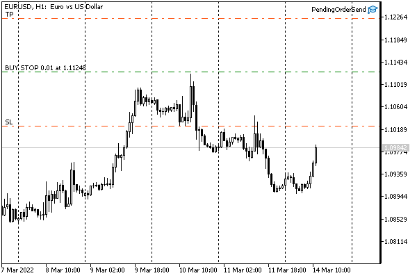
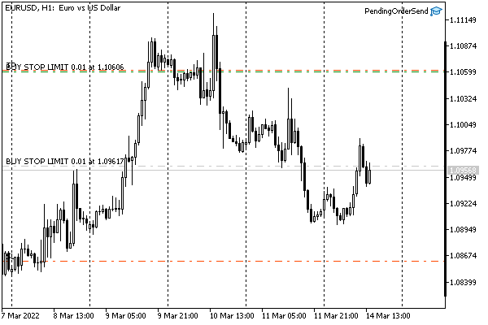
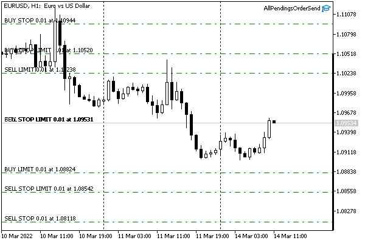

# Placing a pending order

In [Types of orders](/en/book/automation/experts/experts_order_type), we theoretically considered all options for placing pending orders supported by the platform. From a practical point of view, orders are created using OrderSend/OrderSendAsync functions, for which the request structure MqlTradeRequest is prefilled according to special rules. Specifically, the action field must contain the TRADE_ACTION_PENDING value from the [ENUM_TRADE_REQUEST_ACTIONS](/en/book/automation/experts/experts_request_types) enumeration. With this in mind, the following fields are mandatory:

- action
- symbol
- volume
- price
- type (default value 0 corresponds to ORDER_TYPE_BUY)
- type_filling (default 0 corresponds to ORDER_FILLING_FOK)
- type_time (default value 0 corresponds to ORDER_TIME_GTC)
- expiration (default 0, not used for ORDER_TIME_GTC)

If zero defaults are suitable for the task, some of the last four fields can be skipped.

The stoplimit field is mandatory only for orders of types ORDER_TYPE_BUY_STOP_LIMIT and ORDER_TYPE_SELL_STOP_LIMIT.

The following fields are optional:

- sl
- tp
- magic
- comment

Zero values in sl and tp indicate the absence of protective levels.

Let's add the methods for checking values and filling fields into our structures in the MqlTradeSync.mqh file. The principle of formation of all types of orders is the same, so let's consider a couple of special cases of placing limit buy and sell orders. The remaining types will differ only in the value of the field type. Public methods with a full set of required fields, as well as protective levels, are named according to types: buyLimit and sellLimit.

```
   ulong buyLimit(const string name, const double lot, const double p,
      const double stop = 0, const double take = 0,
      ENUM_ORDER_TYPE_TIME duration = ORDER_TIME_GTC, datetime until = 0)
   {
      type = ORDER_TYPE_BUY_LIMIT;
      return _pending(name, lot, p, stop, take, duration, until);
   }
   
   ulong sellLimit(const string name, const double lot, const double p,
      const double stop = 0, const double take = 0,
      ENUM_ORDER_TYPE_TIME duration = ORDER_TIME_GTC, datetime until = 0)
   {
      type = ORDER_TYPE_SELL_LIMIT;
      return _pending(name, lot, p, stop, take, duration, until);
   }

```

Since the structure contains the symbol field which is optionally initialized in the constructor, there are similar methods without the name parameter: they call the above methods by passing symbol as the first parameter. Thus, to create an order with minimal effort, write the following:

```
MqlTradeRequestSync request; // by default uses the current chart symbol
request.buyLimit(volume, price);

```

The general part of the code for checking the passed values, normalizing them, saving them in structure fields, and creating a pending order has been moved to the helper method _pending. It returns the order ticket on success or 0 on failure.

```
   ulong _pending(const string name, const double lot, const double p,
      const double stop = 0, const double take = 0,
      ENUM_ORDER_TYPE_TIME duration = ORDER_TIME_GTC, datetime until = 0,
      const double origin = 0)
   {
      action = TRADE_ACTION_PENDING;
      if(!setSymbol(name)) return 0;
      if(!setVolumePrices(lot, p, stop, take, origin)) return 0;
      if(!setExpiration(duration, until)) return 0;
      if((SymbolInfoInteger(name, SYMBOL_ORDER_MODE) & (1 << (type / 2))) == 0)
      {
         Print(StringFormat("pending orders %s not allowed for %s",
            EnumToString(type), name));
         return 0;
      }
      ZeroMemory(result);
      if(OrderSend(this, result)) return result.order;
      return 0;
   }

```

We already know how to fill the action field and how to call the setSymbol and setVolumePrices methods from previous trading operations.

The multi-string if operator ensures that the operation being prepared is present among the allowed symbol operations specified in the [SYMBOL_ORDER_MODE](/en/book/automation/symbols/symbols_trade_mode) property. Integer type division type which divides in half and shifts the resulting value by 1, sets the correct bit in the mask of allowed order types. This is due to the combination of constants in the ENUM_ORDER_TYPE enumeration and the SYMBOL_ORDER_MODE property. For example, ORDER_TYPE_BUY_STOP and ORDER_TYPE_SELL_STOP have the values 4 and 5, which when divided by 2 both give 2 (with decimals removed). Operation 1 << 2 has a result 4 equal to SYMBOL_ORDER_STOP.

A special feature of pending orders is the processing of the expiration date. The setExpiration method deals with it. In this method, it should be ensured that the specified expiration mode [ENUM_ORDER_TYPE_TIME](/en/book/automation/experts/experts_pending_expiration) of duration is allowed for the symbol and the date and time in until are filled in correctly.

```
   bool setExpiration(ENUM_ORDER_TYPE_TIME duration = ORDER_TIME_GTC, datetime until = 0)
   {
      const int modes = (int)SymbolInfoInteger(symbol, SYMBOL_EXPIRATION_MODE);
      if(((1 << duration) & modes) != 0)
      {
         type_time = duration;
         if((duration == ORDER_TIME_SPECIFIED || duration == ORDER_TIME_SPECIFIED_DAY)
            && until == 0)
         {
            Print(StringFormat("datetime is 0, "
               "but it's required for order expiration mode %s",
               EnumToString(duration)));
            return false;
         }
         if(until > 0 && until <= TimeTradeServer())
         {
            Print(StringFormat("expiration datetime %s is in past, server time is %s",
               TimeToString(until), TimeToString(TimeTradeServer())));
            return false;
         }
         expiration = until;
      }
      else
      {
         Print(StringFormat("order expiration mode %s is not allowed for %s",
            EnumToString(duration), symbol));
         return false;
      }
      return true;
   }

```

The bitmask of allowed modes is available in the [SYMBOL_EXPIRATION_MODE](/en/book/automation/symbols/symbols_expiration) property. The combination of bits in the mask and the constants ENUM_ORDER_TYPE_TIME is such that we just need to evaluate the expression 1 << duration and superimpose it on the mask: a non-zero value indicates the presence of the mode.

For the ORDER_TIME_SPECIFIED and ORDER_TIME_SPECIFIED_DAY modes, the expiration field with the specific datetime value cannot be empty. Also, the specified date and time cannot be in the past.

Since the _pending method presented earlier sends a request to the server using OrderSend in the end, our program must make sure that the order with the received ticket was actually created (this is especially important for limit orders that can be output to an external trading system). Therefore, in the completed method, which is used for "blocking" control of the result, we will add a branch for the TRADE_ACTION_PENDING operation.

```
   bool completed()
   {
      // old processing code
      // TRADE_ACTION_DEAL
      // TRADE_ACTION_SLTP
      // TRADE_ACTION_CLOSE_BY
      ...
      else if(action == TRADE_ACTION_PENDING)
      {
         return result.placed(timeout);
      }
      ...
      return false;
   }

```

In the MqlTradeResultSync structure, we add the placed method.

```
   bool placed(const ulong msc = 1000)
   {
      if(retcode != TRADE_RETCODE_DONE
         && retcode != TRADE_RETCODE_DONE_PARTIAL)
      {
         return false;
      }
      
      if(!wait(orderExist, msc))
      {
         Print("Waiting for order: #" + (string)order);
         return false;
      }
      return true;
   }

```

Its main task is to wait for the order to appear using the wait in the orderExist function: it has already been used in the first stage of verification of [position opening](/en/book/automation/experts/experts_market_buy_sell).

To test the new functionality, let's implement the Expert Advisor PendingOrderSend.mq5. It enables the selection of the pending order type and all its attributes using input variables, after which a confirmation request is executed.

```
enum ENUM_ORDER_TYPE_PENDING
{                                                        // UI interface strings
   PENDING_BUY_STOP = ORDER_TYPE_BUY_STOP,               // ORDER_TYPE_BUY_STOP
   PENDING_SELL_STOP = ORDER_TYPE_SELL_STOP,             // ORDER_TYPE_SELL_STOP
   PENDING_BUY_LIMIT = ORDER_TYPE_BUY_LIMIT,             // ORDER_TYPE_BUY_LIMIT
   PENDING_SELL_LIMIT = ORDER_TYPE_SELL_LIMIT,           // ORDER_TYPE_SELL_LIMIT
   PENDING_BUY_STOP_LIMIT = ORDER_TYPE_BUY_STOP_LIMIT,   // ORDER_TYPE_BUY_STOP_LIMIT
   PENDING_SELL_STOP_LIMIT = ORDER_TYPE_SELL_STOP_LIMIT, // ORDER_TYPE_SELL_STOP_LIMIT
};
 
input string Symbol;             // Symbol (empty = current _Symbol)
input double Volume;             // Volume (0 = minimal lot)
input ENUM_ORDER_TYPE_PENDING Type = PENDING_BUY_STOP;
input int Distance2SLTP = 0;     // Distance to SL/TP in points (0 = no)
input ENUM_ORDER_TYPE_TIME Expiration = ORDER_TIME_GTC;
input datetime Until = 0;
input ulong Magic = 1234567890;
input string Comment;

```

The Expert Advisor will create a new order every time it is launched or parameters are changed. Automatic [order removal](/en/book/automation/experts/experts_remove_order) is not yet provided. We will discuss this operation type later. In this regard, do not forget to delete orders manually.

A one-time order placement is performed, as in some previous examples, based on a timer (therefore, you should first make sure that the market is open).

```
void OnTimer()
{
   // execute once and wait for the user to change the settings
   EventKillTimer();
   
   const string symbol = StringLen(Symbol) == 0 ? _Symbol : Symbol;
   if(PlaceOrder((ENUM_ORDER_TYPE)Type, symbol, Volume,
      Distance2SLTP, Expiration, Until, Magic, Comment))
   {
      Alert("Pending order placed - remove it manually, please");
   }
}

```

The PlaceOrder function accepts all settings as parameters, sends a request, and returns a success indicator (non-zero ticket). Orders of all supported types are provided with pre-filled distances from the current price which are calculated as part of the daily range of quotes.

```
ulong PlaceOrder(const ENUM_ORDER_TYPE type,
   const string symbol, const double lot,
   const int sltp, ENUM_ORDER_TYPE_TIME expiration, datetime until,
   const ulong magic = 0, const string comment = NULL)
{
   static double coefficients[] = // indexed by order type
   {
      0  ,   // ORDER_TYPE_BUY - not used
      0  ,   // ORDER_TYPE_SELL - not used
     -0.5,   // ORDER_TYPE_BUY_LIMIT - slightly below the price
     +0.5,   // ORDER_TYPE_SELL_LIMIT - slightly above the price
     +1.0,   // ORDER_TYPE_BUY_STOP - far above the price
     -1.0,   // ORDER_TYPE_SELL_STOP - far below the price
     +0.7,   // ORDER_TYPE_BUY_STOP_LIMIT - average above the price 
     -0.7,   // ORDER_TYPE_SELL_STOP_LIMIT - average below the price
      0  ,   // ORDER_TYPE_CLOSE_BY - not used
   };
   ...

```

For example, the coefficient of -0.5 for ORDER_TYPE_BUY_LIMIT means that the order will be placed below the current price by half of the daily range (rebound inside the range), and the coefficient of +1.0 for ORDER_TYPE_BUY_STOP means that the order will be at the upper border of the range (breakout).

The daily range itself is calculated as follows.

```
   const double range = iHigh(symbol, PERIOD_D1, 1) - iLow(symbol, PERIOD_D1, 1);
   Print("Autodetected daily range: ", (float)range);
   ...

```

We find the volume and point values that will be required below.

```
   const double volume = lot == 0 ? SymbolInfoDouble(symbol, SYMBOL_VOLUME_MIN) : lot;
   const double point = SymbolInfoDouble(symbol, SYMBOL_POINT);

```

The price level for placing an order is calculated in the price variable based on the given coefficients from the total range.

```
   const double price = TU::GetCurrentPrice(type, symbol) + range * coefficients[type];

```

The stoplimit field must be filled only for *_STOP_LIMIT orders. The values for it are stored in the origin variable.

```
   const bool stopLimit =
      type == ORDER_TYPE_BUY_STOP_LIMIT ||
      type == ORDER_TYPE_SELL_STOP_LIMIT;
   const double origin = stopLimit ? TU::GetCurrentPrice(type, symbol) : 0;

```

When these two types of orders are triggered, a new pending order will be placed at the current price. Indeed, in this scenario, the price moves from the current value to the price level, where the order is activated, and therefore the "former current" price becomes the correct rebound level indicated by a limit order. We will illustrate this situation below.

Protective levels are determined using the TU::TradeDirection object. For stop-limit orders, we calculated starting from origin.

```
   TU::TradeDirection dir(type);
   const double stop = sltp == 0 ? 0 :
      dir.negative(stopLimit ? origin : price, sltp * point);
   const double take = sltp == 0 ? 0 :
      dir.positive(stopLimit ? origin : price, sltp * point);

```

Next, the structure is described and the optional fields are filled in.

```
   MqlTradeRequestSync request(symbol);
   
   request.magic = magic;
   request.comment = comment;
   // request.type_filling = SYMBOL_FILLING_FOK;

```

Here you can select the fill mode. By default, MqlTradeRequestSync automatically selects the first of the allowed modes, [ENUM_ORDER_TYPE_FILLING](/en/book/automation/experts/experts_execution_filling).

Depending on the order type chosen by the user, we call one or another trading method.

```
   ResetLastError();
   // fill in and check the required fields, send the request
   ulong order = 0;
   switch(type)
   {
   case ORDER_TYPE_BUY_STOP:
      order = request.buyStop(volume, price, stop, take, expiration, until);
      break;
   case ORDER_TYPE_SELL_STOP:
      order = request.sellStop(volume, price, stop, take, expiration, until);
      break;
   case ORDER_TYPE_BUY_LIMIT:
      order = request.buyLimit(volume, price, stop, take, expiration, until);
      break;
   case ORDER_TYPE_SELL_LIMIT:
      order = request.sellLimit(volume, price, stop, take, expiration, until);
      break;
   case ORDER_TYPE_BUY_STOP_LIMIT:
      order = request.buyStopLimit(volume, price, origin, stop, take, expiration, until);
      break;
   case ORDER_TYPE_SELL_STOP_LIMIT:
      order = request.sellStopLimit(volume, price, origin, stop, take, expiration, until);
      break;
   }
   ...

```

If the ticket is received, we wait for it to appear in the trading environment of the terminal.

```
   if(order != 0)
   {
      Print("OK order sent: #=", order);
      if(request.completed()) // expect result (order confirmation)
      {
         Print("OK order placed");
      }
   }
   Print(TU::StringOf(request));
   Print(TU::StringOf(request.result));
   return order;
}

```

Let's run the Expert Advisor on the EURUSD chart with default settings and additionally select the distance to the protective levels of 1000 points. We will see the following entries in the log (assuming that the default settings match the permissions for EURUSD in your account).

```
Autodetected daily range: 0.01413
OK order sent: #=1282106395
OK order placed
TRADE_ACTION_PENDING, EURUSD, ORDER_TYPE_BUY_STOP, V=0.01, ORDER_FILLING_FOK, »
  » @ 1.11248, SL=1.10248, TP=1.12248, ORDER_TIME_GTC, M=1234567890
DONE, #=1282106395, V=0.01, Request executed, Req=91
Alert: Pending order placed - remove it manually, please

```

Here is what it looks like on the chart:



Pending order ORDER_TYPE_BUY_STOP

Let's delete the order manually and change the order type to ORDER_TYPE_BUY_STOP_LIMIT. The result is a more complex picture.



Pending order ORDER_TYPE_BUY_STOP_LIMIT

The price where the upper pair of dash-dotted lines is located is the order trigger price, as a result of which an ORDER_TYPE_BUY_LIMIT order will be placed at the current price level, with Stop Loss and Take Profit values marked with red lines. The Take Profit level of the future ORDER_TYPE_BUY_LIMIT order practically coincides with the activation level of the newly created preliminary order ORDER_TYPE_BUY_STOP_LIMIT.

As an additional example for self-study, an Expert Advisor AllPendingsOrderSend.mq5 is included with the book; the Expert Advisor sets 6 pending orders at once: one of each type.



Pending orders of all types

As a result of running it with default settings, you may get log entries as follows:

```
Autodetected daily range: 0.01413
OK order placed: #=1282032135
TRADE_ACTION_PENDING, EURUSD, ORDER_TYPE_BUY_LIMIT, V=0.01, ORDER_FILLING_FOK, »
  » @ 1.08824, ORDER_TIME_GTC, M=1234567890
DONE, #=1282032135, V=0.01, Request executed, Req=73
OK order placed: #=1282032136
TRADE_ACTION_PENDING, EURUSD, ORDER_TYPE_SELL_LIMIT, V=0.01, ORDER_FILLING_FOK, »
  » @ 1.10238, ORDER_TIME_GTC, M=1234567890
DONE, #=1282032136, V=0.01, Request executed, Req=74
OK order placed: #=1282032138
TRADE_ACTION_PENDING, EURUSD, ORDER_TYPE_BUY_STOP, V=0.01, ORDER_FILLING_FOK, »
  » @ 1.10944, ORDER_TIME_GTC, M=1234567890
DONE, #=1282032138, V=0.01, Request executed, Req=75
OK order placed: #=1282032141
TRADE_ACTION_PENDING, EURUSD, ORDER_TYPE_SELL_STOP, V=0.01, ORDER_FILLING_FOK, »
  » @ 1.08118, ORDER_TIME_GTC, M=1234567890
DONE, #=1282032141, V=0.01, Request executed, Req=76
OK order placed: #=1282032142
TRADE_ACTION_PENDING, EURUSD, ORDER_TYPE_BUY_STOP_LIMIT, V=0.01, ORDER_FILLING_FOK, »
  » @ 1.10520, X=1.09531, ORDER_TIME_GTC, M=1234567890
DONE, #=1282032142, V=0.01, Request executed, Req=77
OK order placed: #=1282032144
TRADE_ACTION_PENDING, EURUSD, ORDER_TYPE_SELL_STOP_LIMIT, V=0.01, ORDER_FILLING_FOK, »
  » @ 1.08542, X=1.09531, ORDER_TIME_GTC, M=1234567890
DONE, #=1282032144, V=0.01, Request executed, Req=78
Alert: 6 pending orders placed - remove them manually, please

```
