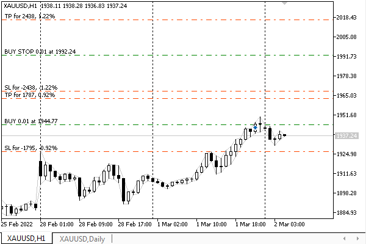
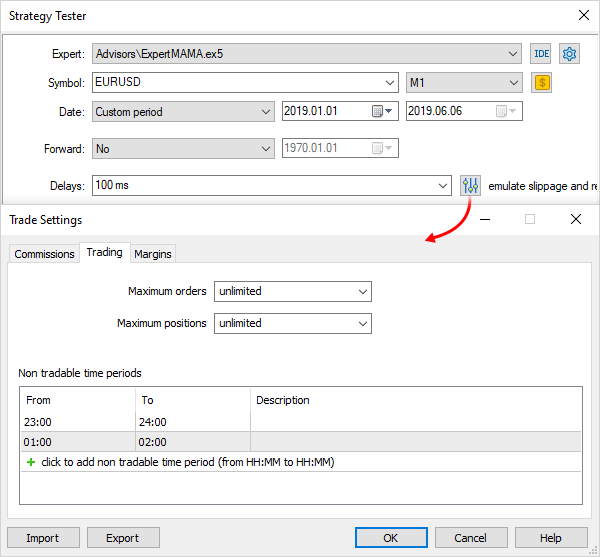

# Modifying a pending order

MetaTrader 5 allows you to modify certain properties of a pending order, including the activation price, protection levels, and expiration date. The main properties such as order type or volume cannot be changed. In such cases, you should [delete](/en/book/automation/experts/experts_remove_order) the order and replace it with another one. The only case where the order type can be changed by the server itself is the activation of a stop limit order, which turns into the corresponding limit order.

Programmatic modification of orders is performed by the TRADE_ACTION_MODIFY operation: it is this constant that needs to be written in the field action of the structure [MqlTradeRequest](/en/book/automation/experts/experts_mqltraderequest) before sending to the server by the function OrderSend or OrderSendAsync. The ticket of the modified order is indicated in the field order. Taking into account action and order, the full list of required fields for this operation includes:

- action
- order
- price
- type_time (default value 0 corresponds to ORDER_TIME_GTC)
- expiration (default 0, not important for ORDER_TIME_GTC)
- type_filling (default 0 corresponds to ORDER_FILLING_FOK)
- stoplimit (only for orders of types ORDER_TYPE_BUY_STOP_LIMIT and ORDER_TYPE_SELL_STOP_LIMIT)

Optional fields:

- sl
- tp

If protective levels have already been set for the order, they should be specified so they can be saved. Zero values indicate deletion of Stop Loss and/or Take Profit.

In the MqlTradeRequestSync structure (MqlTradeSync.mqh), the implementation of order modification is placed in the modify method.

```
struct MqlTradeRequestSync: public MqlTradeRequest
{
   ...
   bool modify(const ulong ticket,
      const double p, const double stop = 0, const double take = 0,
      ENUM_ORDER_TYPE_TIME duration = ORDER_TIME_GTC, datetime until = 0,
      const double origin = 0)
   {
      if(!OrderSelect(ticket)) return false;
      
      action = TRADE_ACTION_MODIFY;
      order = ticket;
      
      // the following fields are needed for checks inside subfunctions
      type = (ENUM_ORDER_TYPE)OrderGetInteger(ORDER_TYPE);
      symbol = OrderGetString(ORDER_SYMBOL);
      volume = OrderGetDouble(ORDER_VOLUME_CURRENT);
      
      if(!setVolumePrices(volume, p, stop, take, origin)) return false;
      if(!setExpiration(duration, until)) return false;
      ZeroMemory(result);
      return OrderSend(this, result);
   }

```

The actual execution of the request is again done in the completed method, in the dedicated branch of the if operator.

```
   bool completed()
   {
      ...
      else if(action == TRADE_ACTION_MODIFY)
      {
         result.order = order;
         result.bid = sl;
         result.ask = tp;
         result.price = price;
         result.volume = stoplimit;
         return result.modified(timeout);
      }
      ...
   }

```

For the MqlTradeResultSync structure to know the new values of the properties of the edited order and to be able to compare them with the result, we write them in free fields (they are not filled by the server in this type of request). Further in the modified method, the result structure is waiting for the modification to be applied.

```
struct MqlTradeResultSync: public MqlTradeResult
{
   ...
   bool modified(const ulong msc = 1000)
   {
      if(retcode != TRADE_RETCODE_DONE && retcode != TRADE_RETCODE_PLACED)
      {
         return false;
      }
   
      if(!wait(orderModified, msc))
      {
         Print("Order not found in environment: #" + (string)order);
         return false;
      }
      return true;
   }
   
   static bool orderModified(MqlTradeResultSync &ref)
   {
      if(!(OrderSelect(ref.order) || HistoryOrderSelect(ref.order)))
      {
         Print("OrderSelect failed: #=" + (string)ref.order);
         return false;
      }
      return TU::Equal(ref.bid, OrderGetDouble(ORDER_SL))
         && TU::Equal(ref.ask, OrderGetDouble(ORDER_TP))
         && TU::Equal(ref.price, OrderGetDouble(ORDER_PRICE_OPEN))
         && TU::Equal(ref.volume, OrderGetDouble(ORDER_PRICE_STOPLIMIT));
   }

```

Here we see how the order properties are read using the [OrderGetDouble](/en/book/automation/experts/experts_orderget_funcs) function and compared with the specified values. All this happens according to the already familiar procedure, in a loop inside the wait function, within a certain timeout of msc (1000 milliseconds by default).

As an example, let's use the Expert Advisor PendingOrderModify.mq5, while inheriting some code fragments from PendingOrderSend.mq5. In particular, a set of input parameters and the PlaceOrder function to create a new order. It is used at the first launch if there is no order for the given combination of the symbol and Magic number, thus ensuring that the Expert Advisor has something to modify.

A new function was required to find a suitable order: GetMyOrder. It is very similar to the GetMyPosition function, which was used in the example with [position tracking](/en/book/automation/experts/experts_trailing_stop) (TrailingStop.mq5) to find a suitable position. The purpose of the built-in MQL5 API functions used inside GetMyOrder should be generally clear from their names, and the technical description will be presented in [separate sections](/en/book/automation/experts/experts_order_list).

```
ulong GetMyOrder(const string name, const ulong magic)
{
   for(int i = 0; i < OrdersTotal(); ++i)
   {
      ulong t = OrderGetTicket(i);
      if(OrderGetInteger(ORDER_MAGIC) == magic
         && OrderGetString(ORDER_SYMBOL) == name)
      {
         return t;
      }
   }
   
   return 0;
}

```

The input parameter Distance2SLTP is now missing. Instead, the new Expert Advisor will automatically calculate the daily range of prices and place protective levels at a distance of half of this range. At the beginning of each day, the range and the new levels in the sl and tp fields will be recalculated. Order modification requests will be generated based on the new values.

Those pending orders that trigger and turn into positions will be closed upon reaching Stop Loss or Take Profit. The terminal can inform the MQL program about the activation of pending orders and the closing of positions if you describe [trading event](/en/book/automation/experts/experts_ontradetransaction) handlers in it. This would allow, for example, to avoid the creation of a new order if there is an open position. However, the current strategy can also be used. So, we will deal with events later.

The main logic of the Expert Advisor is implemented in the OnTick handler.

```
void OnTick()
{
   static datetime lastDay = 0;
   static const uint DAYLONG = 60 * 60 * 24; // number of seconds in a day
   //discard the "fractional" part, i.e. time
   if(TimeTradeServer() / DAYLONG * DAYLONG == lastDay) return;
   ...

```

Two lines at the beginning of the function ensure that the algorithm runs once at the beginning of each day. To do this, we calculate the current date without time and compare it with the value of the lastDay variable which contains the last successful date. The success or error status of course becomes clear at the end of the function, so we'll come back to it later.

Next, the price range for the previous day is calculated.

```
   const string symbol = StringLen(Symbol) == 0 ? _Symbol : Symbol;
   const double range = iHigh(symbol, PERIOD_D1, 1) - iLow(symbol, PERIOD_D1, 1);
   Print("Autodetected daily range: ", (float)range);
   ...

```

Depending on whether there is an order or not in the GetMyOrder function, we will either create a new order via PlaceOrder or edit the existing one using ModifyOrder.

```
   uint retcode = 0;
   ulong ticket = GetMyOrder(symbol, Magic);
   if(!ticket)
   {
      retcode = PlaceOrder((ENUM_ORDER_TYPE)Type, symbol, Volume,
         range, Expiration, Until, Magic);
   }
   else
   {
      retcode = ModifyOrder(ticket, range, Expiration, Until);
   }
   ...

```

Both functions, PlaceOrder and ModifyOrder, work on the basis of the Expert Advisor's input parameters and the found price range. They return the status of the request, which will need to be analyzed in some way to decide which action to take:

- Update the lastDay variable if the request is successful (the order has been updated and the Expert Advisor sleeps until the beginning of the next day)
- Leave the old day in lastDay for some time to try again on the next ticks if there are temporary problems (for example, the trading session has not started yet)
- Stop the Expert Advisor if serious problems are detected (for example, the selected order type or trade direction is not allowed on the symbol)

```
   ...
   if(/* some kind of retcode analysis */)
   {
      lastDay = TimeTradeServer() / DAYLONG * DAYLONG;
   }
}

```

In the section [Closing a position: full and partial](/en/book/automation/experts/experts_close), we used a simplified analysis with the IS_TANGIBLE macro which gave an answer in the categories of "yes" and "no" to indicate whether there was an error or not. Obviously, this approach needs to be improved, and we will return to this issue soon. For now, we will focus on the main functionality of the Expert Advisor.

The source code of the PlaceOrder function remained virtually unchanged from the previous example. ModifyOrder is shown below.

Recall that we determined the location of orders based on the daily range, to which the table of coefficients was applied. The principle has not changed, however, since we now have two functions that work with orders, PlaceOrder and ModifyOrder, the Coefficients table is placed in a global context. We will not repeat it here and will go straight to the ModifyOrder function.

```
uint ModifyOrder(const ulong ticket, const double range,
   ENUM_ORDER_TYPE_TIME expiration, datetime until)
{
   // default values
   const string symbol = OrderGetString(ORDER_SYMBOL);
   const double point = SymbolInfoDouble(symbol, SYMBOL_POINT);
   ...

```

Price levels are calculated depending on the order type and the passed range.

```
   const ENUM_ORDER_TYPE type = (ENUM_ORDER_TYPE)OrderGetInteger(ORDER_TYPE);
   const double price = TU::GetCurrentPrice(type, symbol) + range * Coefficients[type];
   
   // origin is filled only for orders *_STOP_LIMIT
   const bool stopLimit =
      type == ORDER_TYPE_BUY_STOP_LIMIT ||
      type == ORDER_TYPE_SELL_STOP_LIMIT;
   const double origin = stopLimit ? TU::GetCurrentPrice(type, symbol) : 0; 
   
   TU::TradeDirection dir(type);
   const int sltp = (int)(range / 2 / point);
   const double stop = sltp == 0 ? 0 :
      dir.negative(stopLimit ? origin : price, sltp * point);
   const double take = sltp == 0 ? 0 :
      dir.positive(stopLimit ? origin : price, sltp * point);
   ...

```

After calculating all the values, we create an object of the MqlTradeRequestSync structure and execute the request.

```
   MqlTradeRequestSync request(symbol);
   
   ResetLastError();
   // pass the data for the fields, send the order and wait for the result
   if(request.modify(ticket, price, stop, take, expiration, until, origin)
      && request.completed())
   {
      Print("OK order modified: #=", ticket);
   }
   
   Print(TU::StringOf(request));
   Print(TU::StringOf(request.result));
   return request.result.retcode;
}

```

To analyze retcode which we have to execute in the calling block inside OnTick, a new mechanism was developed that supplemented the file TradeRetcode.mqh. All server return codes are divided into several "severity" groups, described by the elements of the TRADE_RETCODE_SEVERITY enumeration.

```
enum TRADE_RETCODE_SEVERITY
{
   SEVERITY_UNDEFINED,   // something non-standard - just output to the log
   SEVERITY_NORMAL,      // normal operation
   SEVERITY_RETRY,       // try updating environment/prices again (probably several times) 
   SEVERITY_TRY_LATER,   // we should wait and try again
   SEVERITY_REJECT,      // request denied, probably(!) you can try again
                         // 
   SEVERITY_INVALID,     // need to fix the request
   SEVERITY_LIMITS,      // need to check the limits and fix the request
   SEVERITY_PERMISSIONS, // it is required to notify the user and change the program/terminal settings
   SEVERITY_ERROR,       // stop, output information to the log and to the user
};

```

In a simplistic way, the first half corresponds to recoverable errors: it is usually enough to wait a while and retry the request. The second half requires you to change the content of the request, check the account or symbol settings, the permissions for the program, and in the worst case, stop trading. Those who wish can draw a conditional separator line not after SEVERITY_REJECT, as it is visually highlighted now, but before it.

The division of all codes into groups is performed by the TradeCodeSeverity function (given with abbreviations).

```
TRADE_RETCODE_SEVERITY TradeCodeSeverity(const uint retcode)
{
   static const TRADE_RETCODE_SEVERITY severities[] =
   {
      ...
      SEVERITY_RETRY,       // REQUOTE (10004)
      SEVERITY_UNDEFINED,     
      SEVERITY_REJECT,      // REJECT (10006)
      SEVERITY_NORMAL,      // CANCEL (10007)
      SEVERITY_NORMAL,      // PLACED (10008)
      SEVERITY_NORMAL,      // DONE (10009)
      SEVERITY_NORMAL,      // DONE_PARTIAL (10010)
      SEVERITY_ERROR,       // ERROR (10011)
      SEVERITY_RETRY,       // TIMEOUT (10012)
      SEVERITY_INVALID,     // INVALID (10013)
      SEVERITY_INVALID,     // INVALID_VOLUME (10014)
      SEVERITY_INVALID,     // INVALID_PRICE (10015)
      SEVERITY_INVALID,     // INVALID_STOPS (10016)
      SEVERITY_PERMISSIONS, // TRADE_DISABLED (10017)
      SEVERITY_TRY_LATER,   // MARKET_CLOSED (10018)
      SEVERITY_LIMITS,      // NO_MONEY (10019)
      ...
   };
   
   if(retcode == 0) return SEVERITY_NORMAL;
   if(retcode < 10000 || retcode > HEDGE_PROHIBITED) return SEVERITY_UNDEFINED;
   return severities[retcode - 10000];
}

```

Thanks to this functionality, the OnTick handler can be supplemented with "smart" error handling. A static variable RetryFrequency stores the frequency with which the program will try to repeat the request in case of non-critical errors. The last time such an attempt was made is stored in the RetryRecordTime variable.

```
void OnTick()
{
   ...
   const static int DEFAULT_RETRY_TIMEOUT = 1; // seconds
   static int RetryFrequency = DEFAULT_RETRY_TIMEOUT;
   static datetime RetryRecordTime = 0;
   if(TimeTradeServer() - RetryRecordTime < RetryFrequency) return;
   ...

```

Once the PlaceOrder or ModifyOrder function returns the value of retcode, we learn how severe it is and, based on the severity, we choose one of three alternatives: stopping the Expert Advisor, waiting for a timeout, or regular operation (marking the successful modification of the order by the current day in lastDay).

```
   const TRADE_RETCODE_SEVERITY severity = TradeCodeSeverity(retcode);
   if(severity >= SEVERITY_INVALID)
   {
      Alert("Can't place/modify pending order, EA is stopped");
      RetryFrequency = INT_MAX;
   }
   else if(severity >= SEVERITY_RETRY)
   {
      RetryFrequency += (int)sqrt(RetryFrequency + 1);
      RetryRecordTime = TimeTradeServer();
      PrintFormat("Problems detected, waiting for better conditions "
         "(timeout enlarged to %d seconds)",
         RetryFrequency);
   }
   else
   {
      if(RetryFrequency > DEFAULT_RETRY_TIMEOUT)
      {
         RetryFrequency = DEFAULT_RETRY_TIMEOUT;
         PrintFormat("Timeout restored to %d second", RetryFrequency);
      }
      lastDay = TimeTradeServer() / DAYLONG * DAYLONG;
   }

```

In case of repeated problems that are classified as solvable, the RetryFrequency timeout gradually increases with each subsequent error but resets to 1 second when the request is successfully processed.

It should be noted that the methods of the applied structure MqlTradeRequestSync check a large number of combinations of parameters for correctness and, if problems are found, interrupt the process prior to the SendRequest call. This behavior is enabled by default, but it can be disabled by defining an empty RETURN(X) macro before the directive #include with MqlTradeSync.mqh.

```
#define RETURN(X)
#include <MQL5Book/MqlTradeSync.mqh>

```

With this macro definition, checks will only print warnings to the log but will continue to execute methods until the SendRequest call.

In any case, after calling one or another method of the MqlTradeResultSync structure, the error code will be added to retcode. This will be done either by the server or by the MqlTradeRequestSync structure's checking algorithms (here we utilize the fact that the MqlTradeResultSync instance is included inside MqlTradeRequestSync). I do not provide here the description of the return of error codes and the use of the RETURN macro in the MqlTradeRequestSync methods for the sake of brevity. Those interested can see the full source code in the MqlTradeSync.mqh file.

Let's run the Expert Advisor PendingOrderModify.mq5 in the tester, with the visual mode enabled, using the data of XAUUSD, H1 (all ticks or real ticks mode). With the default settings, the Expert Advisor will place orders of the ORDER_TYPE_BUY_STOP type with a minimum lot. Let's make sure from the log and trading history that the program places pending orders and modifies them at the beginning of each day.

```
2022.01.03 01:05:00   Autodetected daily range: 14.37
2022.01.03 01:05:00   buy stop 0.01 XAUUSD at 1845.73 sl: 1838.55 tp: 1852.91 (1830.63 / 1831.36)
2022.01.03 01:05:00   OK order placed: #=2
2022.01.03 01:05:00   TRADE_ACTION_PENDING, XAUUSD, ORDER_TYPE_BUY_STOP, V=0.01, ORDER_FILLING_FOK, »
  » @ 1845.73, SL=1838.55, TP=1852.91, ORDER_TIME_GTC, M=1234567890
2022.01.03 01:05:00   DONE, #=2, V=0.01, Bid=1830.63, Ask=1831.36, Request executed
2022.01.04 01:05:00   Autodetected daily range: 33.5
2022.01.04 01:05:00   order modified [#2 buy stop 0.01 XAUUSD at 1836.56]
2022.01.04 01:05:00   OK order modified: #=2
2022.01.04 01:05:00   TRADE_ACTION_MODIFY, XAUUSD, ORDER_TYPE_BUY_STOP, V=0.01, ORDER_FILLING_FOK, » 
  » @ 1836.56, SL=1819.81, TP=1853.31, ORDER_TIME_GTC, #=2
2022.01.04 01:05:00   DONE, #=2, @ 1836.56, Bid=1819.81, Ask=1853.31, Request executed, Req=1
2022.01.05 01:05:00   Autodetected daily range: 18.23
2022.01.05 01:05:00   order modified [#2 buy stop 0.01 XAUUSD at 1832.56]
2022.01.05 01:05:00   OK order modified: #=2
2022.01.05 01:05:00   TRADE_ACTION_MODIFY, XAUUSD, ORDER_TYPE_BUY_STOP, V=0.01, ORDER_FILLING_FOK, »
  » @ 1832.56, SL=1823.45, TP=1841.67, ORDER_TIME_GTC, #=2
2022.01.05 01:05:00   DONE, #=2, @ 1832.56, Bid=1823.45, Ask=1841.67, Request executed, Req=2
...
2022.01.11 01:05:00   Autodetected daily range: 11.96
2022.01.11 01:05:00   order modified [#2 buy stop 0.01 XAUUSD at 1812.91]
2022.01.11 01:05:00   OK order modified: #=2
2022.01.11 01:05:00   TRADE_ACTION_MODIFY, XAUUSD, ORDER_TYPE_BUY_STOP, V=0.01, ORDER_FILLING_FOK, »
  » @ 1812.91, SL=1806.93, TP=1818.89, ORDER_TIME_GTC, #=2
2022.01.11 01:05:00   DONE, #=2, @ 1812.91, Bid=1806.93, Ask=1818.89, Request executed, Req=6
2022.01.11 18:10:58   order [#2 buy stop 0.01 XAUUSD at 1812.91] triggered
2022.01.11 18:10:58   deal #2 buy 0.01 XAUUSD at 1812.91 done (based on order #2)
2022.01.11 18:10:58   deal performed [#2 buy 0.01 XAUUSD at 1812.91]
2022.01.11 18:10:58   order performed buy 0.01 at 1812.91 [#2 buy stop 0.01 XAUUSD at 1812.91]
2022.01.11 20:28:59   take profit triggered #2 buy 0.01 XAUUSD 1812.91 sl: 1806.93 tp: 1818.89 »
  » [#3 sell 0.01 XAUUSD at 1818.89]
2022.01.11 20:28:59   deal #3 sell 0.01 XAUUSD at 1818.91 done (based on order #3)
2022.01.11 20:28:59   deal performed [#3 sell 0.01 XAUUSD at 1818.91]
2022.01.11 20:28:59   order performed sell 0.01 at 1818.91 [#3 sell 0.01 XAUUSD at 1818.89]
2022.01.12 01:05:00   Autodetected daily range: 23.28
2022.01.12 01:05:00   buy stop 0.01 XAUUSD at 1843.77 sl: 1832.14 tp: 1855.40 (1820.14 / 1820.49)
2022.01.12 01:05:00   OK order placed: #=4
2022.01.12 01:05:00   TRADE_ACTION_PENDING, XAUUSD, ORDER_TYPE_BUY_STOP, V=0.01, ORDER_FILLING_FOK, »
  » @ 1843.77, SL=1832.14, TP=1855.40, ORDER_TIME_GTC, M=1234567890
2022.01.12 01:05:00   DONE, #=4, V=0.01, Bid=1820.14, Ask=1820.49, Request executed, Req=7

```

The order can be triggered at any moment, after which the position is closed after some time by the stop loss or take profit (as in the code above).

In some cases, a situation may arise when the position still exists at the beginning of the next day, and then a new order will be created in addition to it, as in the screenshot below.



The Expert Advisor with a trading strategy based on pending orders in the tester

Please note that due to the fact that we request quotes of the PERIOD_D1 timeframe to calculate the daily range, the visual tester opens the corresponding chart, in addition to the current working one. Such a service works not only for timeframes other than the working one but also for other symbols. This will be useful, in particular, when developing [multicurrency Expert Advisors](/en/book/automation/experts/experts_multisymbol).

To check how error handling works, try disabling trading for the Expert Advisor. The log will contain the following:

```
Autodetected daily range: 34.48
TRADE_ACTION_PENDING, XAUUSD, ORDER_TYPE_BUY_STOP, V=0.01, ORDER_FILLING_FOK, »
  » @ 1975.73, SL=1958.49, TP=1992.97, ORDER_TIME_GTC, M=1234567890
CLIENT_DISABLES_AT, AutoTrading disabled by client
Alert: Can't place/modify pending order, EA is stopped

```

This error is critical, and the Expert Advisor stops working.

To demonstrate one of the easier errors, we could use the OnTimer handler instead of OnTick. Then launching the same Expert Advisor on symbols where trading sessions take only a part of a day would periodically generate a sequence of non-critical errors about a closed market ("Market closed"). In this case, the Expert Advisor would keep trying to start trading, constantly increasing the waiting time.

This, in particular, is easy to check in the tester, which allows you to set up arbitrary trading sessions for any symbol. On the Settings tab, to the right of the Delays dropdown list, there is a button that opens the Trade setup dialog. There, you should include the option Use your settings and on the Trade tab add at least one record to the table Non-trading periods.



Setting up non-trading periods in the tester

Please note that it is non-trading periods that are set here, not trading sessions, i.e., this setting acts exactly the opposite in comparison with the symbol specification.

Many potential errors related to trade restrictions can be eliminated by preliminary analysis of the environment using a class like Permissions presented in the section [Restrictions and permissions for account transactions](/en/book/automation/account/account_limits_and_restrictions).
