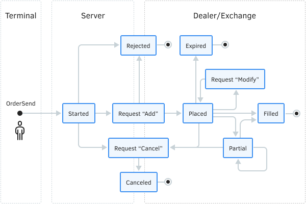

# Order properties (active and history)

In the sections related to trading operations, in particular to [making buying/selling](/en/book/automation/experts/experts_market_buy_sell), [closing a position](/en/book/automation/experts/experts_close), and [placing a pending order](/en/book/automation/experts/experts_pending), we have seen that requests are sent to the server based on the filling of specific fields of the MqlTradeRequest structure, most of which directly define the properties of the resulting orders. The MQL5 API allows you to learn these and some other properties set by the trading system itself, such as ticket, registration time, and status.

It is important to note that the list of order properties is common for both active and historical orders, although, of course, the values of many properties will differ for them.

Order properties are grouped in MQL5 according to the principle already familiar to us based on the type of values: integer (compatible with long/ulong), real (double), and strings. Each property group has its own enumeration.

Integer properties are summarized in ENUM_ORDER_PROPERTY_INTEGER and are presented in the following table.

| Identifier | Description | Type |
| --- | --- | --- |
| ORDER_TYPE | Order type | ENUM_ORDER_TYPE |
| ORDER_TYPE_FILLING | Execution type by volume | ENUM_ORDER_TYPE_FILLING |
| ORDER_TYPE_TIME | Order lifetime (pending) | ENUM_ORDER_TYPE_TIME |
| ORDER_TIME_EXPIRATION | Order expiration time (pending) | datetime |
| ORDER_MAGIC | Arbitrary identifier set by the Expert Advisor that placed the order | ulong |
| ORDER_TICKET | Order ticket; a unique number assigned by the server to each order | ulong |
| ORDER_STATE | Order status | ENUM_ORDER_STATE (see below) |
| ORDER_REASON | Reason or source for the order | ENUM_ORDER_REASON (see below) |
| ORDER_TIME_SETUP | Order placement time | datetime |
| ORDER_TIME_DONE | Order execution or withdrawal time | datetime |
| ORDER_TIME_SETUP_MSC | Time of order placement for execution in milliseconds | ulong |
| ORDER_TIME_DONE_MSC | Order execution/withdrawal time in milliseconds | ulong |
| ORDER_POSITION_ID | ID of the position that the order generated or modified upon execution | ulong |
| ORDER_POSITION_BY_ID | Opposite position identifier for orders of type ORDER_TYPE_CLOSE_BY | ulong |

Each executed order generates a deal that opens a new or changes an existing position. The ID of this position is assigned to the executed order in the ORDER_POSITION_ID property.

The ENUM_ORDER_STATE enumeration contains elements that describe order statuses. See a simplified scheme (state diagram) of orders below.

| Identifier | Description |
| --- | --- |
| ORDER_STATE_STARTED | The order has been checked for correctness but has not yet been accepted by the server |
| ORDER_STATE_PLACED | The order has been accepted by the server |
| ORDER_STATE_CANCELED | The order has been canceled by the client (user or MQL program) |
| ORDER_STATE_PARTIAL | The order has been partially executed |
| ORDER_STATE_FILLED | The order has been filled in full |
| ORDER_STATE_REJECTED | The order has been rejected by the server |
| ORDER_STATE_EXPIRED | The order has been canceled upon expiration |
| ORDER_STATE_REQUEST_ADD | The order is being registered (being placed in the trading system) |
| ORDER_STATE_REQUEST_MODIFY | The order is being modified (its parameters are being changed) |
| ORDER_STATE_REQUEST_CANCEL | The order is being deleted (removing from the trading system) |

Order status diagram

Changing the state is possible only for active orders. For historical orders (filled or canceled), the status is fixed.

You can cancel an order that has already been partially fulfilled, and then its status in the history will be ORDER_STATE_CANCELED.

ORDER_STATE_PARTIAL occurs only for active orders. Executed (historical) orders always have the status ORDER_STATE_FILLED.

The ENUM_ORDER_REASON enumeration specifies possible order source options.

| Identifier | Description |
| --- | --- |
| ORDER_REASON_CLIENT | Order placed manually from the desktop terminal |
| ORDER_REASON_EXPERT | Order placed from the desktop terminal by an Expert Adviser or a script |
| ORDER_REASON_MOBILE | Order placed from the mobile application |
| ORDER_REASON_WEB | Order placed from the web terminal (browser) |
| ORDER_REASON_SL | Order placed by the server as a result of Stop Loss triggering |
| ORDER_REASON_TP | Order placed by the server as a result of Take Profit triggering |
| ORDER_REASON_SO | Order placed by the server as a result of the Stop Out event |

Real properties are collected in the ENUM_ORDER_PROPERTY_DOUBLE enumeration.

| Identifier | Description |
| --- | --- |
| ORDER_VOLUME_INITIAL | Initial volume when placing an order |
| ORDER_VOLUME_CURRENT | Current volume (initial or remaining after partial execution) |
| ORDER_PRICE_OPEN | The price indicated in the order |
| ORDER_PRICE_CURRENT | The current symbol price of an order that has not yet been executed or the execution price |
| ORDER_SL | Stop Loss Level |
| ORDER_TP | Take Profit level |
| ORDER_PRICE_STOPLIMIT | The price for placing a Limit order when a StopLimit order is triggered |

The ORDER_PRICE_CURRENT property contains the current Ask price for active buy pending orders or the Bid price for active sell pending orders. "Current" refers to the price known in the trading environment at the time the order is selected using OrderSelect or OrderGetTicket. For executed orders in the history, this property contains the execution price, which may differ from the one specified in the order due to slippage.

The ORDER_VOLUME_INITIAL and ORDER_VOLUME_CURRENT properties are not equal to each other only if the order status is ORDER_STATE_PARTIAL.

If the order was filled in parts, then its ORDER_VOLUME_INITIAL property in history will be equal to the size of the last filled part, and all other "fills" related to the original full volume will be executed as separate orders (and deals).

String properties are described in the ENUM_ORDER_PROPERTY_STRING enumeration.

| Identifier | Description |
| --- | --- |
| ORDER_SYMBOL | The symbol on which the order is placed |
| ORDER_COMMENT | Comment |
| ORDER_EXTERNAL_ID | Order ID in the external trading system (on the exchange) |

To read all the above properties, there are two different sets of functions: for active orders and for historical orders. First, we will consider the functions for active orders, and we will return to the historical ones after we get acquainted with the principles of selecting the required period in [history](/en/book/automation/experts/experts_history_select).
