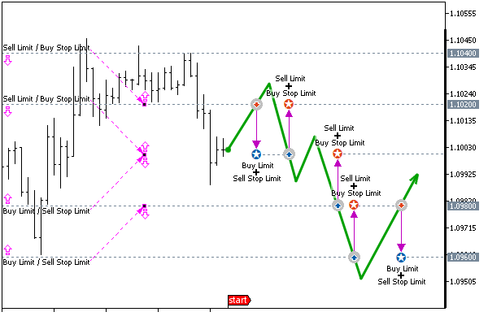
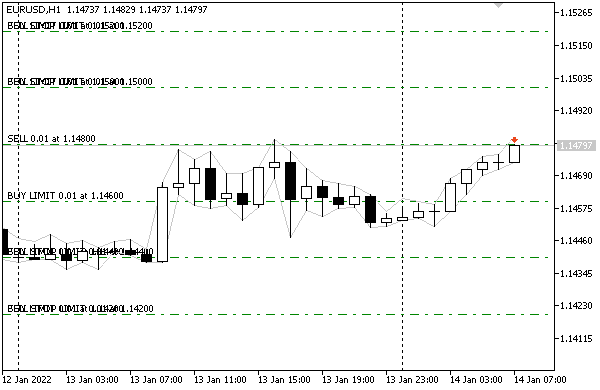

# Selecting orders by properties

In one of the sections on [symbol properties](/en/book/automation/symbols/symbols_currencies), we introduced the SymbolFilter class to select financial instruments with specified characteristics. Now we will apply the same approach for orders.

Since we have to analyze not only orders but also deals and positions in a similar way, we will separate the general part of the filtering algorithm into the base class TradeFilter (TradeFilter.mqh). It almost exactly repeats the source code of SymbolFilter. Therefore, we will not explain it here again.

Those who wish can perform a contextual file comparison of SymbolFilter.mqh and TradeFilter.mqh to see how similar they are and to localize minor edits.

The main difference is that the TradeFilter class is a template since it has to deal with the properties of different objects: orders, deals, and positions.

```
enum IS // supported comparison conditions in filters
{
   EQUAL,
   GREATER,
   NOT_EQUAL,
   LESS
};
   
enum ENUM_ANY // dummy enum to cast all enums to it
{
};
   
template<typename T,typename I,typename D,typename S>
class TradeFilter
{
protected:
   MapArray<ENUM_ANY,long> longs;
   MapArray<ENUM_ANY,double> doubles;
   MapArray<ENUM_ANY,string> strings;
   MapArray<ENUM_ANY,IS> conditions;
   ...
   
   template<typename V>
   static bool equal(const V v1, const V v2);
   
   template<typename V>
   static bool greater(const V v1, const V v2);
   
   template<typename V>
   bool match(const T &m, const MapArray<ENUM_ANY,V> &data) const;
   
public:
   // methods for adding conditions to the filter
   TradeFilter *let(const I property, const long value, const IS cmp = EQUAL);
   TradeFilter *let(const D property, const double value, const IS cmp = EQUAL);
   TradeFilter *let(const S property, const string value, const IS cmp = EQUAL);
   // methods for getting into arrays of records matching the filter
   template<typename E,typename V>
   bool select(const E property, ulong &tickets[], V &data[],
      const bool sort = false) const;
   template<typename E,typename V>
   bool select(const E &property[], ulong &tickets[], V &data[][],
      const bool sort = false) const
   bool select(ulong &tickets[]) const;
   ...
}

```

The template parameters I, D and S are enumerations for property groups of three main types (integer, real, and string): for orders, they were described in previous sections, so for clarity, you can imagine that I=ENUM_ORDER_PROPERTY_INTEGER, D=ENUM_ORDER_PROPERTY_DOUBLE, S=ENUM_ORDER_PROPERTY_STRING.

The T type is designed for specifying a monitor class. At the moment we have only one monitor ready, OrderMonitor. Later we will implement DealMonitor and PositionMonitor.

Earlier, in the SymbolFilter class, we did not use template parameters because for symbols, all types of property enumerations are invariably known, and there is a single class SymbolMonitor.

Recall the structure of the filter class. A group of let methods allows you to register a combination of "property=value" pairs in the filter, which will then be used to select objects in select methods. The ID property is specified in the property parameter, and the value is in the value parameter.

There are also several select methods. They allow the calling code to fill in an array with selected tickets, as well as, if necessary, additional arrays with the values of the requested object properties. The specific identifiers of the requested properties are set in the first parameter of the select method; it can be one property or several. Depending on this, the receiving array must be one-dimensional or two-dimensional.

The combination of property and value can be checked not only for equality (EQUAL) but also for greater/less operations (GREATER/LESS). For string properties, it is acceptable to specify a search pattern with the character "*" denoting any sequence of characters (for example, "*[tp]*" for the ORDER_COMMENT property will match all comments in which "[tp]" occurs anywhere, although this is only demonstration of the possibility — while to search for orders resulting from triggered Take Profit you should analyze [ORDER_REASON](/en/book/automation/experts/experts_order_properties)).

Since the algorithm requires the implementation of a loop though all objects and objects can be of different types (so far these are orders, but then support for deals and positions will appear), we need to describe two abstract methods in the TradeFilter class: total and get:

```
   virtual int total() const = 0;
   virtual ulong get(const int i) const = 0;

```

The first one returns the number of objects and the second one returns the order ticket by its number. This should remind you of the pair of functions OrdersTotal and OrderGetTicket. Indeed, they are used in specific implementations of methods for filtering orders.

Below is the OrderFilter class (OrderFilter.mqh) in full.

```
#include <MQL5Book/OrderMonitor.mqh>
#include <MQL5Book/TradeFilter.mqh>
   
class OrderFilter: public TradeFilter<OrderMonitor,
   ENUM_ORDER_PROPERTY_INTEGER,
   ENUM_ORDER_PROPERTY_DOUBLE,
   ENUM_ORDER_PROPERTY_STRING>
{
protected:
   virtual int total() const override
   {
      return OrdersTotal();
   }
   virtual ulong get(const int i) const override
   {
      return OrderGetTicket(i);
   }
};

```

This simplicity is especially important given that similar filters will be created effortlessly for trades and positions.

With the help of the new class, we can much more easily check the presence of orders belonging to our Expert Advisor, i.e., replace any self-written versions of the GetMyOrder function used in the example [PendingOrderModify.mq5](/en/book/automation/experts/experts_modify_order).

```
   OrderFilter filter;
   ulong tickets[];
   
   // set a condition for orders for the current symbol and our "magic" number
   filter.let(ORDER_SYMBOL, _Symbol).let(ORDER_MAGIC, Magic);
   // select suitable tickets in an array
   if(filter.select(tickets))
   {
      ArrayPrint(tickets);
   }

```

By "any versions" here we mean that thanks to the filter class, we can create arbitrary conditions for selecting orders and changing them "on the go" (for example, at the direction of the user, not the programmer).

As an example of how to utilize the filter, let's use an Expert Advisor that creates a grid of pending orders for trading on a rebound from levels within a certain price range, that is, designed for a fluctuating market. Starting from this section and over the next few, we will modify the Expert Advisor in the context of the material being studied.

The first version of the Expert Advisor PendingOrderGrid1.mq5 builds a grid of a given size from limit and stop-limit orders. The parameters will be the number of price levels and the step in points between them. The operation scheme is illustrated in the following chart.



Grid of pending orders on 4 levels with a step of 200 points

At a certain initial time, which can be determined by the intraday schedule and can correspond, for example, to the "night flat", the current price is rounded up to the size of the grid step, and a specified number of levels is laid up from this level up and down.

At each upper level, we place a limit sell order and a stoplimit buy order with the price of the future limit order one level lower. At each lower level, we place a limit buy order and a stoplimit sell order with the price of the future limit order one level higher.

When the price touches one of the levels, the limit order standing there turns into a buy or sell (position). At the same time, a stop-limit order of the same level is automatically converted by the system into a limit order of the opposite direction at the next level.

For example, if the price breaks through the level while moving up, we will get a short position, and a limit order to buy will be created at the step distance below it.

The Expert Advisor will monitor, that at each level there is a stop limit order paired with a limit order. Therefore, after a new limit buy order is detected, the program will add a stop-limit sell order to it at the same level, and the target price of the future limit order is the level next to the top, i.e., the one where the position is opened.

Let's say the price turns down and activates a limit order to the level below — we will get a long position. At the same time, the stop-limit order is converted into a limit order to sell at the next level above. Now the Expert Advisor will again detect a "bare" limit order and create a stop-limit order to buy as a pair to it, at the same level as the price of the future limit order one level lower.

If there are opposite positions, we will close them. We will also provide for the setting of an intraday period when the trading system is enabled, and for the rest of the time all orders and positions will be deleted. This, in particular, is useful for the "night flat", when the return fluctuations of the market are especially pronounced.

Of course, this is just one of many potential implementations of the grid strategy which lacks many of the customizations of grids, but we won't overcomplicate the example.

The Expert Advisor will analyze the situation on each bar (presumably H1 timeframe or less). In theory, this Expert Advisor's operation logic needs to be improved by promptly responding to [trading events](/en/book/automation/experts/experts_ontradetransaction) but we haven't explored them yet. Therefore, instead of constant tracking and instant "manual" restoration of limit orders at vacant grid levels, we entrusted this work to the server through the use of stop-limit orders. However, there is a nuance here.

The fact is that limit and stop-limit orders at each level are of opposite types (buy/sell) and therefore are activated by different types of prices.

It turns out that if the market moved up to the next level in the upper half of the grid, the Ask price may touch the level and activate a stop-limit buy order, but the Bid price will not reach the level, and the sell limit order will remain as it is (it will not turn into a position). In the lower half of the grid, when the market moves down, the situation is mirrored. Any level is first touched by the Bid price, and activates a stop-limit order to sell, and only with a further decrease the level is also reached by the Ask price. If there is no move, the buy limit order will remain as is.

This problem becomes critical as the spread increases. Therefore, the Expert Advisor will require additional control over "extra" limit orders. In other words, the Expert Advisor will not generate a stop-limit order that is missing at the level if there is already a limit order at its supposed target price (adjacent level).

The source code is included in the file PendingOrderGrid1.mq5. In the input parameters, you can set the Volume of each trade (by default, if left equal to 0, the minimum lot of the chart symbol is taken), the number of grid levels GridSize (must be even), and the step GridStep between levels in points. The start and end times of the intraday segment on which the strategy is allowed to work are specified in the parameters StartTime and StopTime: in both, only time is important.

```
#include <MQL5Book/MqlTradeSync.mqh>
#include <MQL5Book/OrderFilter.mqh>
#include <MQL5Book/MapArray.mqh>
   
input double Volume;                                       // Volume (0 = minimal lot)
input uint GridSize = 6;                                   // GridSize (even number of price levels)
input uint GridStep = 200;                                 // GridStep (points)
input ENUM_ORDER_TYPE_TIME Expiration = ORDER_TIME_GTC;
input ENUM_ORDER_TYPE_FILLING Filling = ORDER_FILLING_FOK;
input datetime StartTime = D'1970.01.01 00:00:00';         // StartTime (hh:mm:ss)
input datetime StopTime = D'1970.01.01 09:00:00';          // StopTime (hh:mm:ss)
input ulong Magic = 1234567890;

```

The segment of working time can be either within a day (StartTime < StopTime) or cross the boundary of the day (StartTime > StopTime), for example, from 22:00 to 09:00. If the two times are equal, round-the-clock trading is assumed.

Before proceeding with the implementation of the trading idea, let's simplify the task of setting up queries and outputting diagnostic information to the log. To do this, we describe our own structure MqlTradeRequestSyncLog, the derivative of MqlTradeRequestSync.

```
const ulong DAYLONG = 60 * 60 * 24; // length of the day in seconds
   
struct MqlTradeRequestSyncLog: public MqlTradeRequestSync
{
   MqlTradeRequestSyncLog()
   {
      magic = Magic;
      type_filling = Filling;
      type_time = Expiration;
      if(Expiration == ORDER_TIME_SPECIFIED)
      {
         expiration = (datetime)(TimeCurrent() / DAYLONG * DAYLONG
            + StopTime % DAYLONG);
         if(StartTime > StopTime)
         {
            expiration = (datetime)(expiration + DAYLONG);
         }
      }
   }
   ~MqlTradeRequestSyncLog()
   {
      Print(TU::StringOf(this));
      Print(TU::StringOf(this.result));
   }
};

```

In the constructor, we fill in all fields with unchanged values. In the destructor, we log meaningful query and result fields. Obviously, the destructor of automatic objects will always be called at the moment of exit from the code block where the order was formed and sent, that is, the sent and received data will be printed.

In OnInit let's perform some checks for the correctness of the input variables, in particular, for an even grid size.

```
int OnInit()
{
   if(GridSize < 2 || !!(GridSize % 2))
   {
      Alert("GridSize should be 2, 4, 6+ (even number)");
      return INIT_FAILED;
   }
   return INIT_SUCCEEDED;
}

```

The main entry point of the algorithm is the OnTick handler. In it, for brevity, we will omit the same error handling mechanism based on TRADE_RETCODE_SEVERITY as in the example PendingOrderModify.mq5.

For bar-by-bar work, the function has a static variable lastBar, in which we store the time of the last successfully processed bar. All subsequent ticks on the same bar are skipped.

```
void OnTick()
{
   static datetime lastBar = 0;
   if(iTime(_Symbol, _Period, 0) == lastBar) return;
   uint retcode = 0;
   
   ... // main algorithm (see further)
   
   const TRADE_RETCODE_SEVERITY severity = TradeCodeSeverity(retcode);
   if(severity < SEVERITY_RETRY)
   {
      lastBar = iTime(_Symbol, _Period, 0);
   }
}

```

Instead of an ellipsis, the main algorithm will follow, divided into several auxiliary functions for systematization purposes. First of all, let's determine whether the working period of the day is set and, if so, whether the strategy is currently enabled. This attribute is stored in the tradeScheduled variable.

```
   ...
   bool tradeScheduled = true;
   
   if(StartTime != StopTime)
   {
      const ulong now = TimeCurrent() % DAYLONG;
      
      if(StartTime < StopTime)
      {
         tradeScheduled = now >= StartTime && now < StopTime;
      }
      else
      {
         tradeScheduled = now >= StartTime || now < StopTime;
      }
   }
   ...

```

With trading enabled, first, check if there is already a network of orders using the CheckGrid function. If there is no network, the function will return the GRID_EMPTY constant and we should create the network by calling Setup Grid. If the network has already been built, it makes sense to check if there are opposite positions to close: this is done by the CompactPositions function.

```
   if(tradeScheduled)
   {
      retcode = CheckGrid();
      
      if(retcode == GRID_EMPTY)
      {
         retcode = SetupGrid();
      }
      else
      {
         retcode = CompactPositions();
      }
   }
   ...

```

As soon as the trading period ends, it is necessary to delete orders and close all positions (if any). This is done, respectively, by the RemoveOrders and CompactPositions function, functions but with a boolean flag (true): this single, optional argument instructs to apply a simple close for the remaining positions after the opposite close.

```
   else
   {
      retcode = CompactPositions(true);
      if(!retcode) retcode = RemoveOrders();
   }

```

All functions return a server code, which is analyzed for success or failure with TradeCodeSeverity. The special application codes GRID_EMPTY and GRID_OK are also considered standard according to TRADE_RETCODE_SEVERITY.

```
#define GRID_OK    +1
#define GRID_EMPTY  0

```

Now let's take a look at the functions one by one.

The CheckGrid function uses the OrderFilter class presented at the beginning of this section. The filter requests all pending orders for the current symbol and with "our" identification number, and the tickets of found orders are stored in the array.

```
uint CheckGrid()
{
   OrderFilter filter;
   ulong tickets[];
   
   filter.let(ORDER_SYMBOL, _Symbol).let(ORDER_MAGIC, Magic)
      .let(ORDER_TYPE, ORDER_TYPE_SELL, IS::GREATER)
      .select(tickets);
   const int n = ArraySize(tickets);
   if(!n) return GRID_EMPTY;
   ...

```

The completeness of the grid is analyzed using the already familiar MapArray class that stores "key=value" pairs. In this case, the key is the level (price converted into points), and the value is the bitmask (superposition) of order types at the given level. Also, limit and stop-limit orders are counted in the limits and stops variables, respectively.

```
   // price levels => masks of types of orders existing there
   MapArray<ulong,uint> levels;
 
   const double point = SymbolInfoDouble(_Symbol, SYMBOL_POINT);
   int limits = 0;
   int stops = 0;
   
   for(int i = 0; i < n; ++i)
   {
      if(OrderSelect(tickets[i]))
      {
         const ulong level = (ulong)MathRound(OrderGetDouble(ORDER_PRICE_OPEN) / point);
         const ulong type = OrderGetInteger(ORDER_TYPE);
         if(type == ORDER_TYPE_BUY_LIMIT || type == ORDER_TYPE_SELL_LIMIT)
         {
            ++limits;
            levels.put(level, levels[level] | (1 << type));
         }
         else if(type == ORDER_TYPE_BUY_STOP_LIMIT 
            || type == ORDER_TYPE_SELL_STOP_LIMIT)
         {
            ++stops;
            levels.put(level, levels[level] | (1 << type));
         }
      }
   }
   ...

```

If the number of orders of each type matches and is equal to the specified grid size, then everything is in order.

```
   if(limits == stops)
   {
      if(limits == GridSize) return GRID_OK; // complete grid
      
      Alert("Error: Order number does not match requested");
      return TRADE_RETCODE_ERROR;
   }
   ...

```

The situation when the number of limit orders is greater than the stop limit ones is normal: it means that due to the price movement, one or more stop limit orders have turned into limit ones. The program should then add stop-limit orders to the levels where there are not enough of them. A separate order of a specific type for a specific level can be placed by the RepairGridLevel function.

```
   if(limits > stops)
   {
      const uint stopmask = 
         (1 << ORDER_TYPE_BUY_STOP_LIMIT) | (1 << ORDER_TYPE_SELL_STOP_LIMIT);
      for(int i = 0; i < levels.getSize(); ++i)
      {
         if((levels[i] & stopmask) == 0) // there is no stop-limit order at this level
         {
            // the direction of the limit is required to set the reverse stop limit
            const bool buyLimit = (levels[i] & (1 << ORDER_TYPE_BUY_LIMIT));
            // checks for "extra" orders due to the spread are omitted here (see the source code)
            ...
            // create a stop-limit order in the desired direction
            const uint retcode = RepairGridLevel(levels.getKey(i), point, buyLimit);
            if(TradeCodeSeverity(retcode) > SEVERITY_NORMAL)
            {
               return retcode;
            }
         }
      }
      return GRID_OK;
   }
   ...

```

The situation when the number of stop-limit orders is greater than the limit ones is treated as an error (probably the server skipped the price for some reason).

```
   Alert("Error: Orphaned Stop-Limit orders found");
   return TRADE_RETCODE_ERROR;
}

```

The function RepairGridLevel performs the following actions.

```
uint RepairGridLevel(const ulong level, const double point, const bool buyLimit)
{
   const double price = level * point;
   const double volume = Volume == 0 ?
      SymbolInfoDouble(_Symbol, SYMBOL_VOLUME_MIN) : Volume;
   
   MqlTradeRequestSyncLog request;
   
   request.comment = "repair";
   
   // if there is an unpaired buy-limit, set the sell-stop-limit to it
   // if there is an unpaired sell-limit, set buy-stop-limit to it
   const ulong order = (buyLimit ?
      request.sellStopLimit(volume, price, price + GridStep * point) :
      request.buyStopLimit(volume, price, price - GridStep * point));
   const bool result = (order != 0) && request.completed();
   if(!result) Alert("RepairGridLevel failed");
   return request.result.retcode;
}

```

Please note that we do not need to actually fill in the structure (except for a comment that can be made more informative if necessary) since some of the fields are filled in automatically by the constructor, and we pass the volume and price directly to the sellStopLimit or buyStopLimit method.

A similar approach is used in the SetupGrid function, which creates a new full network of orders. At the beginning of the function, we prepare variables for calculations and describe the MqlTradeRequestSyncLog array of structures.

```
uint SetupGrid()
{
   const double current = SymbolInfoDouble(_Symbol, SYMBOL_BID);
   const double point = SymbolInfoDouble(_Symbol, SYMBOL_POINT);
   const double volume = Volume == 0 ?
      SymbolInfoDouble(_Symbol, SYMBOL_VOLUME_MIN) : Volume;
   // central price of the range rounded to the nearest step,
   // from it up and down we identify the levels  
   const double base = ((ulong)MathRound(current / point / GridStep) * GridStep)
      * point;
   const string comment = "G[" + DoubleToString(base,
      (int)SymbolInfoInteger(_Symbol, SYMBOL_DIGITS)) + "]";
   const static string message = "SetupGrid failed: ";
   MqlTradeRequestSyncLog request[][2]; // limit and stop-limit - one pair
   ArrayResize(request, GridSize);      // 2 pending orders per level

```

Next, we generate orders for the lower and upper half of the grid, diverging from the center to the sides.

```
   for(int i = 0; i < (int)GridSize / 2; ++i)
   {
      const int k = i + 1;
      
      // bottom half of the grid
      request[i][0].comment = comment;
      request[i][1].comment = comment;
      
      if(!(request[i][0].buyLimit(volume, base - k * GridStep * point)))
      {
         Alert(message + (string)i + "/BL");
         return request[i][0].result.retcode;
      }
      if(!(request[i][1].sellStopLimit(volume, base - k * GridStep * point,
         base - (k - 1) * GridStep * point)))
      {
         Alert(message + (string)i + "/SSL");
         return request[i][1].result.retcode;
      }
      
      // top half of the grid
      const int m = i + (int)GridSize / 2;
      
      request[m][0].comment = comment;
      request[m][1].comment = comment;
      
      if(!(request[m][0].sellLimit(volume, base + k * GridStep * point)))
      {
         Alert(message + (string)m + "/SL");
         return request[m][0].result.retcode;
      }
      if(!(request[m][1].buyStopLimit(volume, base + k * GridStep * point,
         base + (k - 1) * GridStep * point)))
      {
         Alert(message + (string)m + "/BSL");
         return request[m][1].result.retcode;
      }
   }

```

Then we check for readiness.

```
   for(int i = 0; i < (int)GridSize; ++i)
   {
      for(int j = 0; j < 2; ++j)
      {
         if(!request[i][j].completed())
         {
            Alert(message + (string)i + "/" + (string)j + " post-check");
            return request[i][j].result.retcode;
         }
      }
   }
   return GRID_OK;
}

```

Although the check (call of completed) is spaced out with sending orders, our structure still uses the synchronous form OrderSend internally. In fact, to speed up sending a batch of orders (as in our grid Expert Advisor), it is better to use the asynchronous version OrderSendAsync. But then the order execution status should be initiated from the event handler [OnTradeTransaction](/en/book/automation/experts/experts_ontradetransaction). We will study this one later.

An error when sending any order leads to an early exit from the loop and the return of the code from the server. This testing Expert Advisor will simply stop its further work in case of an error. For a real robot, it is desirable to provide an intellectual analysis of the meaning of the error and, if necessary, delete all orders and close positions.

Positions that will be generated by pending orders are closed by the function CompactPositions.

```
uint CompactPositions(const bool cleanup = false)

```

The cleanup parameter equal to false by default means regular "cleaning" of positions within the trading period, i.e., the closing of opposite positions (if any). Value cleanup=true is used to force close all positions at the end of the trading period.

The function fills the ticketsLong and ticketsShort arrays with tickets of long and short positions using a helper function GetMyPositions. We have already used the latter in the example TradeCloseBy.mq5 in the section [Closing opposite positions: full and partial](/en/book/automation/experts/experts_closeby). The CloseByPosition function from that example has undergone minimal changes in the new Expert Advisor: it returns a code from the server instead of a logical indicator of success or error.

```
uint CompactPositions(const bool cleanup = false)
{
   uint retcode = 0;
   ulong ticketsLong[], ticketsShort[];
   const int n = GetMyPositions(_Symbol, Magic, ticketsLong, ticketsShort);
   if(n > 0)
   {
      Print("CompactPositions, pairs: ", n);
      for(int i = 0; i < n; ++i)
      {
         retcode = CloseByPosition(ticketsShort[i], ticketsLong[i]);
         if(retcode) return retcode;
      }
   }
   ...

```

The second part of CompactPositions only works when cleanup=true. It is far from perfect and will be rewritten soon.

```
   if(cleanup)
   {
      if(ArraySize(ticketsLong) > ArraySize(ticketsShort))
      {
         retcode = CloseAllPositions(ticketsLong, ArraySize(ticketsShort));
      }
      else if(ArraySize(ticketsLong) < ArraySize(ticketsShort))
      {
         retcode = CloseAllPositions(ticketsShort, ArraySize(ticketsLong));
      }
   }
   
   return retcode;
}

```

For all found remaining positions, the usual closure is performed by calling CloseAllPositions.

```
uint CloseAllPositions(const ulong &tickets[], const int start = 0)
{
   const int n = ArraySize(tickets);
   Print("CloseAllPositions ", n);
   for(int i = start; i < n; ++i)
   {
      MqlTradeRequestSyncLog request;
      request.comment = "close down " + (string)(i + 1 - start)
         + " of " + (string)(n - start);
      if(!(request.close(tickets[i]) && request.completed()))
      {
         Print("Error: position is not closed ", tickets[i]);
         return request.result.retcode;
      }
   }
   return 0; // success
}

```

Now we only need to consider the RemoveOrders function. It also uses the order filter to get a list of them, and then calls the remove method in a loop.

```
uint RemoveOrders()
{
   OrderFilter filter;
   ulong tickets[];
   filter.let(ORDER_SYMBOL, _Symbol).let(ORDER_MAGIC, Magic)
      .select(tickets);
   const int n = ArraySize(tickets);
   for(int i = 0; i < n; ++i)
   {
      MqlTradeRequestSyncLog request;
      request.comment = "removal " + (string)(i + 1) + " of " + (string)n;
      if(!(request.remove(tickets[i]) && request.completed()))
      {
         Print("Error: order is not removed ", tickets[i]);
         return request.result.retcode;
      }
   }
   return 0;
}

```

Let's check how the Expert Advisor works in the tester with default settings (trading period from 00:00 to 09:00). Below is a screenshot for launching on EURUSD, H1.



Grid strategy PendingOrderGrid1.mq5 in the tester

In the log, in addition to periodic entries about the batch creation of several orders (at the beginning of the day) and their removal in the morning, we will regularly see the restoration of the network (adding orders instead of triggered ones) and closing positions.

```
buy stop limit 0.01 EURUSD at 1.14200 (1.14000) (1.13923 / 1.13923)
TRADE_ACTION_PENDING, EURUSD, ORDER_TYPE_BUY_STOP_LIMIT, V=0.01, ORDER_FILLING_FOK, »
   » @ 1.14200, X=1.14000, ORDER_TIME_GTC, M=1234567890, repair
DONE, #=159, V=0.01, Bid=1.13923, Ask=1.13923, Request executed, Req=287
CompactPositions, pairs: 1
close position #152 sell 0.01 EURUSD by position #153 buy 0.01 EURUSD (1.13923 / 1.13923)
deal #18 buy 0.01 EURUSD at 1.13996 done (based on order #160)
deal #19 sell 0.01 EURUSD at 1.14202 done (based on order #160)
Positions collapse initiated
OK CloseBy Order/Deal/Position
TRADE_ACTION_CLOSE_BY, EURUSD, ORDER_TYPE_BUY, ORDER_FILLING_FOK, P=152, b=153, »
   » M=1234567890, compacting
DONE, D=18, #=160, Request executed, Req=288

```

Now it's time to study the MQL5 functions for working with positions and improve their selection and analysis in our Expert Advisor. The following sections deal with this.
