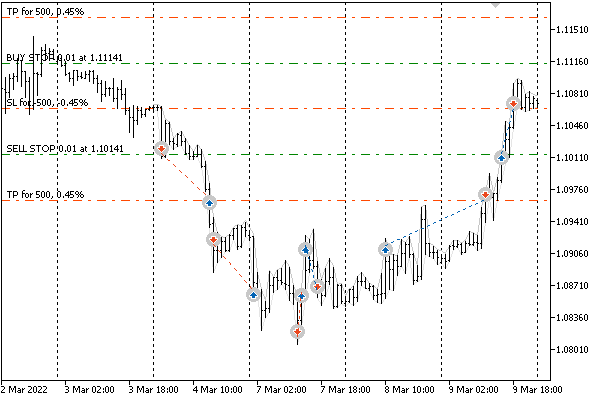
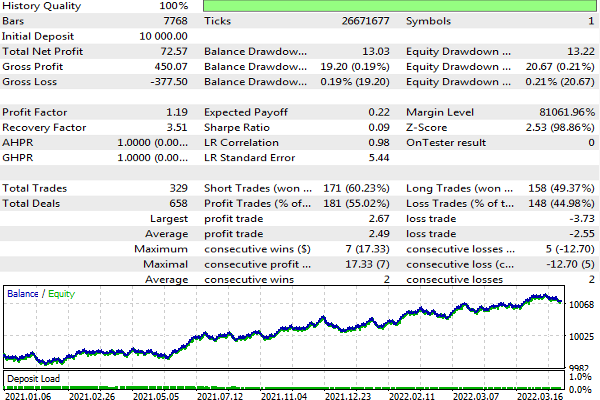

# OnTrade event

The OnTrade event occurs when changing the list of placed orders and open positions, the history of orders, and the history of deals. Any trading action (placing/activating/deleting a pending order, opening/closing a position, setting protective levels, etc.) changes the history of orders and deals and/or the list of positions and current orders accordingly. The initiator of an action can be a user, a program, or a server.

To receive the event in a program, you should describe the corresponding handler.

void OnTrade(void)

In the case of sending trade requests using OrderSend/OrderSendAsync, one request will trigger multiple OnTrade events since processing usually takes place in several stages and each operation can change the state of orders, positions, and trading history.

In general, there is no exact ratio in the number of OnTrade and OnTradeTransaction calls. OnTrade is called after the corresponding calls OnTradeTransaction.

Since the OnTrade event is of a generalized nature and does not specify the essence of the operation, it is less popular with developers of MQL programs. It is usually necessary to check all aspects of the trading account state in the code and compare it with some saved state, that is, with the applied cache of trading entities used in the trading strategy. In the simplest case, you can, for example, remember the ticket of the created order in the OnTrade handler to interrogate all its properties. However, this may imply the "unnecessary" analysis of a large number of incidental events that are not related to a specific order.

We will talk about the possibility of applied caching of the trading environment and history in the section on [multicurrency Expert Advisors](/en/book/automation/experts/experts_multisymbol).

To further explore OnTrade, let's deal with an Expert Advisor implementing a strategy on two OCO ("One Cancels Other") pending orders. It will place a pair of breakout stop orders and wait for one of them to trigger, after which the second one will be removed. For clarity, we will provide support for both types of trading events, OnTrade and OnTradeTransaction, so that the working logic will run either from one handler or another, as chosen by the user.

The source code is available in the OCO2.mq5 file. Its input parameters include the lot size Volume (default is 0 which means minimum), the Distance2SLTP distance in points to place each of the orders and it also determines the protective levels, the expiration date Expiration in seconds from the setup time, and the event switcher ActivationBy (default, OnTradeTransaction). Since Distance2SLTP sets both the offset from the current price and the distance to the stop loss, the stop losses of the two orders are the same and equal to the price at the time of setting.

```
enum EVENT_TYPE
{
   ON_TRANSACTION, // OnTradeTransaction
   ON_TRADE        // OnTrade
};
   
input double Volume;            // Volume (0 - minimal lot)
input uint Distance2SLTP = 500; // Distance Indent/SL/TP (points)
input ulong Magic = 1234567890;
input ulong Deviation = 10;
input ulong Expiration = 0;     // Expiration (seconds in future, 3600 - 1 hour, etc)
input EVENT_TYPE ActivationBy = ON_TRANSACTION;

```

To simplify the initialization of request structures, we will describe our own MqlTradeRequestSyncOCO structure derived from MqlTradeRequestSync.

```
struct MqlTradeRequestSyncOCO: public MqlTradeRequestSync
{
   MqlTradeRequestSyncOCO()
   {
      symbol = _Symbol;
      magic = Magic;
      deviation = Deviation;
      if(Expiration > 0)
      {
         type_time = ORDER_TIME_SPECIFIED;
         expiration = (datetime)(TimeCurrent() + Expiration);
      }
   }
};

```

At the global level, let's introduce several objects and variables.

```
OrderFilter orders;        // object for selecting orders
PositionFilter trades;     // object for selecting positions
bool FirstTick = false;    // or single processing of OnTick at start
ulong ExecutionCount = 0;  // counter of trading strategy calls RunStrategy()

```

All trading logic, except for the start moment, will be triggered by trading events. In the OnInit handler, we set up filter objects and wait for the first tick (set FirstTick to true).

```
int OnInit()
{
   FirstTick = true;
   
   orders.let(ORDER_MAGIC, Magic).let(ORDER_SYMBOL, _Symbol)
      .let(ORDER_TYPE, (1 << ORDER_TYPE_BUY_STOP) | (1 << ORDER_TYPE_SELL_STOP),
      IS::OR_BITWISE);
   trades.let(POSITION_MAGIC, Magic).let(POSITION_SYMBOL, _Symbol);
      
   return INIT_SUCCEEDED;
}

```

We are only interested in stop orders (buy/sell) and positions with a specific magic number and the current symbol.

In the OnTick function, we once call the main part of the algorithm designed as RunStrategy (we will describe it below). Further, this function will be called only from OnTrade or OnTradeTransaction.

```
void OnTick()
{
   if(FirstTick)
   {
      RunStrategy();
      FirstTick = false;
   }
}

```

For example, when the OnTrade mode is enabled, this fragment works.

```
void OnTrade()
{
   static ulong count = 0;
   PrintFormat("OnTrade(%d)", ++count);
   if(ActivationBy == ON_TRADE)
   {
      RunStrategy();
   }
}

```

Note that the OnTrade handler calls are counted regardless of whether the strategy is activated here or not. Similarly, the relevant events are counted in the OnTradeTransaction handler (even if they occur in vain). This is done in order to be able to see both events and their counters in the log at the same time.

When the OnTradeTransaction mode is on, obviously, RunStrategy starts from there.

```
void OnTradeTransaction(const MqlTradeTransaction &transaction,
   const MqlTradeRequest &request,
   const MqlTradeResult &result)
{
   static ulong count = 0;
   PrintFormat("OnTradeTransaction(%d)", ++count);
   Print(TU::StringOf(transaction));
   
   if(ActivationBy != ON_TRANSACTION) return;
   
   if(transaction.type == TRADE_TRANSACTION_ORDER_DELETE)
   {
      // why not here? for answer, see the text
      /* // this won't work online: m.isReady() == false because order temporarily lost
      OrderMonitor m(transaction.order);
      if(m.isReady() && m.get(ORDER_MAGIC) == Magic && m.get(ORDER_SYMBOL) == _Symbol)
      {
         RunStrategy();
      }
      */
   }
   else if(transaction.type == TRADE_TRANSACTION_HISTORY_ADD)
   {
      OrderMonitor m(transaction.order);
      if(m.isReady() && m.get(ORDER_MAGIC) == Magic && m.get(ORDER_SYMBOL) == _Symbol)
      {
         // the ORDER_STATE property does not matter - in any case, you need to remove the remaining
         // if(transaction.order_state == ORDER_STATE_FILLED
         // || transaction.order_state == ORDER_STATE_CANCELED ...)
         RunStrategy();
      }
   }
}

```

It should be noted that when trading online, a triggered pending order may disappear from the trading environment for some time due to being transferred from the existing ones to history. When we receive the TRADE_TRANSACTION_ORDER_DELETE event, the order has already been removed from the active list but has not yet appeared in history. It only gets there when we receive the TRADE_TRANSACTION_HISTORY_ADD event. This behavior is not observed in the [tester](/en/book/automation/tester), that is, a deleted order is immediately added to history and is available there for selecting and reading properties already in the TRADE_TRANSACTION_ORDER_DELETE phase.

In both trade event handlers, we count and log the number of calls. For the case with OnTrade, it must match ExecutionCount which we will soon see inside RunStrategy. But for OnTradeTransaction, the counter and ExecutionCount will differ significantly because the strategy here is called very selectively, for one type of event. Based on this, we can conclude that OnTradeTransaction allows for a more efficient use of resources by calling the algorithm only when appropriate.

The ExecutionCount counter is output to the log when the Expert Advisor is unloaded.

```
void OnDeinit(const int r)
{
   Print("ExecutionCount = ", ExecutionCount);
}

```

Now, finally, let's introduce the RunStrategy function. The promised counter is incremented at the very beginning.

```
void RunStrategy()
{
   ExecutionCount++;
   ...

```

Next, two arrays are described for receiving order tickets and their statuses from the orders filter object.

```
   ulong tickets[];
   ulong states[];

```

To begin with, we will request orders that fall under our conditions. If there are two of them, everything is fine, and nothing needs to be done.

```
   orders.select(ORDER_STATE, tickets, states);
   const int n = ArraySize(tickets);
   if(n == 2) return; // OK - standard state
   ...

```

If one order remains, then the other one was triggered and the remaining one must be deleted.

```
   if(n > 0)          // 1 or 2+ orders is an error, you need to delete everything
   {
      // delete all matching orders, except for partially filled ones
      MqlTradeRequestSyncOCO r;
      for(int i = 0; i < n; ++i)
      {
         if(states[i] != ORDER_STATE_PARTIAL)
         {
            r.remove(tickets[i]) && r.completed();
         }
      }
   }
   ...

```

Otherwise, there are no orders. Therefore, you need to check if there is an open position: for this, we use another trades filter object but the results are added to the same receiving array tickets. If there is no position, we place a new pair of orders.

```
   else // n == 0
   {
      // if there are no open positions, place 2 orders
      if(!trades.select(tickets))
      {
         MqlTradeRequestSyncOCO r;
         SymbolMonitor sm(_Symbol);
         
         const double point = sm.get(SYMBOL_POINT);
         const double lot = Volume == 0 ? sm.get(SYMBOL_VOLUME_MIN) : Volume;
         const double buy = sm.get(SYMBOL_BID) + point * Distance2SLTP;
         const double sell = sm.get(SYMBOL_BID) - point * Distance2SLTP;
         
         r.buyStop(lot, buy, buy - Distance2SLTP * point,
            buy + Distance2SLTP * point) && r.completed();
         r.sellStop(lot, sell, sell + Distance2SLTP * point,
            sell - Distance2SLTP * point) && r.completed();
      }
   }
}

```

Let's run the Expert Advisor in the tester with default settings, on the EURUSD pair. The following image shows the testing process.



Expert Advisor with a pair of pending stop orders based on the OCO strategy in the tester

At the stage of placing a pair of orders, we will see the following entries in the log.

```
buy stop 0.01 EURUSD at 1.11151 sl: 1.10651 tp: 1.11651 (1.10646 / 1.10683)
sell stop 0.01 EURUSD at 1.10151 sl: 1.10651 tp: 1.09651 (1.10646 / 1.10683)
OnTradeTransaction(1)
TRADE_TRANSACTION_ORDER_ADD, #=2(ORDER_TYPE_BUY_STOP/ORDER_STATE_PLACED), ORDER_TIME_GTC, EURUSD, »
   » @ 1.11151, SL=1.10651, TP=1.11651, V=0.01
OnTrade(1)
OnTradeTransaction(2)
TRADE_TRANSACTION_REQUEST
OnTradeTransaction(3)
TRADE_TRANSACTION_ORDER_ADD, #=3(ORDER_TYPE_SELL_STOP/ORDER_STATE_PLACED), ORDER_TIME_GTC, EURUSD, »
   » @ 1.10151, SL=1.10651, TP=1.09651, V=0.01
OnTrade(2)
OnTradeTransaction(4)
TRADE_TRANSACTION_REQUEST

```

As soon as one of the orders is triggered, this is what happens:

```
order [#3 sell stop 0.01 EURUSD at 1.10151] triggered
deal #2 sell 0.01 EURUSD at 1.10150 done (based on order #3)
deal performed [#2 sell 0.01 EURUSD at 1.10150]
order performed sell 0.01 at 1.10150 [#3 sell stop 0.01 EURUSD at 1.10151]
OnTradeTransaction(5)
TRADE_TRANSACTION_DEAL_ADD, D=2(DEAL_TYPE_SELL), #=3(ORDER_TYPE_BUY/ORDER_STATE_STARTED), »
   » EURUSD, @ 1.10150, SL=1.10651, TP=1.09651, V=0.01, P=3
OnTrade(3)
OnTradeTransaction(6)
TRADE_TRANSACTION_ORDER_DELETE, #=3(ORDER_TYPE_SELL_STOP/ORDER_STATE_FILLED), ORDER_TIME_GTC, »
   » EURUSD, @ 1.10151, SL=1.10651, TP=1.09651, V=0.01, P=3
OnTrade(4)
OnTradeTransaction(7)
TRADE_TRANSACTION_HISTORY_ADD, #=3(ORDER_TYPE_SELL_STOP/ORDER_STATE_FILLED), ORDER_TIME_GTC, »
   » EURUSD, @ 1.10151, SL=1.10651, TP=1.09651, P=3
order canceled [#2 buy stop 0.01 EURUSD at 1.11151]
OnTrade(5)
OnTradeTransaction(8)
TRADE_TRANSACTION_ORDER_DELETE, #=2(ORDER_TYPE_BUY_STOP/ORDER_STATE_CANCELED), ORDER_TIME_GTC, »
   » EURUSD, @ 1.11151, SL=1.10651, TP=1.11651, V=0.01
OnTrade(6)
OnTradeTransaction(9)
TRADE_TRANSACTION_HISTORY_ADD, #=2(ORDER_TYPE_BUY_STOP/ORDER_STATE_CANCELED), ORDER_TIME_GTC, »
   » EURUSD, @ 1.11151, SL=1.10651, TP=1.11651, V=0.01
OnTrade(7)
OnTradeTransaction(10)
TRADE_TRANSACTION_REQUEST

```

Order #3 was deleted by itself, and order #2 was deleted (canceled) by our Expert Advisor.

If we run the Expert Advisor with only the mode of operation through the OnTrade event changed in settings, we should get completely similar financial results (ceteris paribus, that is, for example, if random delays in tick generation are not included). The only thing that will be different is the number of RunStrategy function calls. For example, for 4 months of 2022 on EURUSD, H1 with 88 trades, we will get the following approximate metrics of ExecutionCount (what matters is the ratio, not the absolute values associated with your broker's ticks):

- OnTradeTransaction — 132
- OnTrade — 438

This is a practical proof of the possibility of building more selective algorithms based on OnTradeTransaction compared with OnTrade.

This OCO2.mq5 Expert Advisor version reacts to actions with orders and positions quite straightforwardly. In particular, as soon as the previous position is closed by stop loss or take profit, it will place two new orders. If you delete one of the orders manually, the Expert Advisor will immediately delete the second one and then recreate a new pair with an offset from the current price. You can improve the behavior by embedding a schedule similar to what is done in the grid Expert Advisor and not reacting to canceled orders in the history (although, please note that MQL5 does not provide means for finding out whether an order was canceled manually or programmatically). We will present a different direction for improving this Expert Advisor when exploring the [economic calendar](/en/book/advanced/calendar) API.

In addition, an interesting mode is already available in the current version, related to setting the expiration date for pending orders in the input variable Expiration. If a pair of orders does not trigger, then, immediately after their expiration, a new pair is placed relative to the changed new current price. As an independent exercise, you can try to optimize the Expert Advisor in the tester by changing Expiration and Distance2SLTP. Programmatic work with the tester, including in the optimization mode, will be covered in the [next chapter](/en/book/automation/tester).

Below is one of the setting options (Distance2SLTP=250, Expiration=5000) found over a period of 16 months from the beginning of 2021 for the EURUSD pair.



Test run results of the OCO2 Expert Advisor
