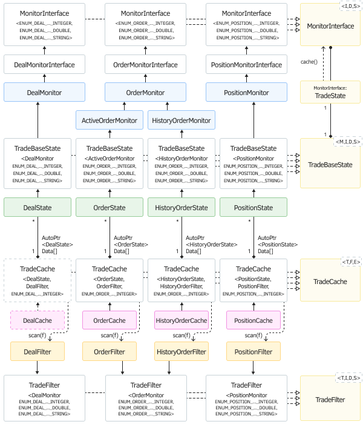

# Monitoring trading environment changes

In the previous section related to the [OnTrade](/en/book/automation/experts/experts_ontrade) event, we mentioned that some trading strategy programming approaches may require you to take snapshots of the environment and compare them with each other over time. This is a common practice when using OnTrade but it can also be activated on a schedule, on every bar, or even tick. Our monitor classes that can read the properties of orders, deals, and positions lacked the ability to save the state. In this section, we will present one of the trading environment caching options.

The properties of all trading objects are divided by types into three groups: integer, real, and string. Each object class has its own groups (for example, for orders, integer properties are described in the ENUM_ORDER_PROPERTY_INTEGER enumeration, and for positions they are described in ENUM_POSITION_PROPERTY_INTEGER), but the essence of division is the same. Therefore, we will introduce the PROP_TYPE enumeration, with the help of which it will be possible to describe to which type an object property belongs. This generalization comes up naturally since the mechanisms for storing and processing properties of the same type should be the same, regardless of whether the property belongs to an order, position, or deal.

```
enum PROP_TYPE
{
   PROP_TYPE_INTEGER,
   PROP_TYPE_DOUBLE,
   PROP_TYPE_STRING,
};

```

Arrays are the simplest way to store property values. Obviously, due to the presence of three base types, we will need three different arrays. Let's describe them inside a new class TradeState nested in MonitorInterface (TradeBaseMonitor.mqh).

The basic template MonitorInterface<I,D,S> forms the basis of all applied monitor classes (OrderMonitor, DealMonitor, PositionMonitor). Types I, D, and S here correspond to concrete enumerations of integer, real, and string properties.

It is quite logical to include the storage mechanism in the base monitor, especially since the created property cache will be filled with data by reading properties from the monitor object.

```
template<typename I,typename D,typename S>
class MonitorInterface
{
   ...
   class TradeState
   {
   public:
      ...
      long ulongs[];
      double doubles[];
      string strings[];
      const MonitorInterface *owner;
      
      TradeState(const MonitorInterface *ptr) : owner(ptr)
      {
         ...
      }
   };

```

The entire TradeState class has been made public because its fields would need to be accessed from the parent monitor object (which is passed as a pointer to the constructor), and besides TradeState will be used only in the protected part of the monitor (they cannot be reached from the outside).

In order to fill three arrays with property values of three different types, you must first find out the distribution of properties by type and indexes in each particular array.

For each trading object type (orders, deals, and positions), the identifiers of the 3 corresponding enumerations with properties of different types do not intersect and form a continuous numbering. Let's demonstrate this.

In the [Enumerations](/en/book/common/conversions/conversions_enums) chapter, we considered the script ConversionEnum.mq5 which implements the process function to log all elements of a particular enumeration. That script examined the ENUM_APPLIED_PRICE enum. Now we can create a copy of the script and analyze the other three enumerations. For example, like this:

```
void OnStart()
{
   process((ENUM_POSITION_PROPERTY_INTEGER)0);
   process((ENUM_POSITION_PROPERTY_DOUBLE)0);
   process((ENUM_POSITION_PROPERTY_STRING)0);
}

```

As a result of its execution, we get the following log. The left column contains the numbering inside the enumerations, and the values on the right (after the '=' sign) are the built-in constants (identifiers) of the elements.

```
ENUM_POSITION_PROPERTY_INTEGER Count=9
0 POSITION_TIME=1
1 POSITION_TYPE=2
2 POSITION_MAGIC=12
3 POSITION_IDENTIFIER=13
4 POSITION_TIME_MSC=14
5 POSITION_TIME_UPDATE=15
6 POSITION_TIME_UPDATE_MSC=16
7 POSITION_TICKET=17
8 POSITION_REASON=18
ENUM_POSITION_PROPERTY_DOUBLE Count=8
0 POSITION_VOLUME=3
1 POSITION_PRICE_OPEN=4
2 POSITION_PRICE_CURRENT=5
3 POSITION_SL=6
4 POSITION_TP=7
5 POSITION_COMMISSION=8
6 POSITION_SWAP=9
7 POSITION_PROFIT=10
ENUM_POSITION_PROPERTY_STRING Count=3
0 POSITION_SYMBOL=0
1 POSITION_COMMENT=11
2 POSITION_EXTERNAL_ID=19

```

For example, the property with a constant of 0 is a string POSITION_SYMBOL, the properties with constants 1 and 2 are integers POSITION_TIME and POSITION_TYPE, the property with a constant of 3 is a real POSITION_VOLUME, and so on.

Thus, constants are a system of end-to-end indexes on properties of all types, and we can use the same algorithm (based on EnumToArray.mqh) to get them.

For each property, you need to remember its type (which determines which of the three arrays will store the value) and the serial number among the properties of the same type (this will be the index of the element in the corresponding array). For example, we see that positions have only 3 string properties, so the strings array in the snapshot of one position will have to have the same size, and POSITION_SYMBOL (0), POSITION_COMMENT (11), and POSITION_EXTERNAL_ID (19) will be written to its indexes 0, 1, and 2.

The conversion of end-to-end indexes of properties into their type (one of PROP_TYPE) and into an ordinal number in an array of the corresponding type can be done once at the start of the program since enumerations with properties are constant (built into the system). We write the resulting indirect addressing table into a static two-dimensional indices array. Its size in the first dimension will be dynamically determined as the total number of properties (of all 3 types). We will write the size into the limit static variable. A couple of cells are allocated for the second dimension: indices[i][0] — type PROP_TYPE, indices[i][1] — index in one of the arrays ulongs, doubles, or strings (depending on indices[i][0]).

```
   class TradeState
   {
      ...
      static int indices[][2];
      static int j, d, s;
   public:
      const static int limit;
      
      static PROP_TYPE type(const int i)
      {
         return (PROP_TYPE)indices[i][0];
      }
      
      static int offset(const int i)
      {
         return indices[i][1];
      }
      ...

```

Variables j, d, and s will be used to sequentially index properties within each of the 3 different types. Here's how it's done in the static method calcIndices.

```
      static int calcIndices()
      {
         const int size = fmax(boundary<I>(),
            fmax(boundary<D>(), boundary<S>())) + 1;
         ArrayResize(indices, size);
         j = d = s = 0;
         for(int i = 0; i < size; ++i)
         {
            if(detect<I>(i))
            {
               indices[i][0] = PROP_TYPE_INTEGER;
               indices[i][1] = j++;
            }
            else if(detect<D>(i))
            {
               indices[i][0] = PROP_TYPE_DOUBLE;
               indices[i][1] = d++;
            }
            else if(detect<S>(i))
            {
               indices[i][0] = PROP_TYPE_STRING;
               indices[i][1] = s++;
            }
            else
            {
               Print("Unresolved int value as enum: ", i, " ", typename(TradeState));
            }
         }
         return size;
      }

```

The boundary method returns the maximum constant among all elements of the given enumeration E.

```
   template<typename E>
   static int boundary(const E dummy = (E)NULL)
   {
      int values[];
      const int n = EnumToArray(dummy, values, 0, 1000);
      ArraySort(values);
      return values[n - 1];
   }

```

The largest value of all three types of enumerations determines the range of integers that should be sorted in accordance with the property type to which they belong.

Here we use the detect method which returns true if the integer is an element of an enumeration.

```
   template<typename E>
   static bool detect(const int v)
   {
      ResetLastError();
      const string s = EnumToString((E)v); // result is not used 
      if(_LastError == 0) // only the absence of an error is important
      {
         return true;
      }
      return false;
   }

```

The last question is how to run this calculation when the program starts. This is achieved by utilizing the static nature of the variables and the method.

```
template<typename I,typename D,typename S>
static int MonitorInterface::TradeState::indices[][2];
template<typename I,typename D,typename S>
static int MonitorInterface::TradeState::j,
   MonitorInterface::TradeState::d,
   MonitorInterface::TradeState::s;
template<typename I,typename D,typename S>
const static int MonitorInterface::TradeState::limit =
   MonitorInterface::TradeState::calcIndices();

```

Note that limit is initialized by the result of calling our calcIndices function.

Having a table with indexes, we implement the filling of arrays with property values in the cache method.

```
   class TradeState
   {
      ...
      TradeState(const MonitorInterface *ptr) : owner(ptr)
      {
         cache(); // when creating an object, immediately cache the properties
      }
      
      template<typename T>
      void _get(const int e, T &value) const // overload with record by reference
      {
         value = owner.get(e, value);
      }
      
      void cache()
      {
         ArrayResize(ulongs, j);
         ArrayResize(doubles, d);
         ArrayResize(strings, s);
         for(int i = 0; i < limit; ++i)
         {
            switch(indices[i][0])
            {
            case PROP_TYPE_INTEGER: _get(i, ulongs[indices[i][1]]); break;
            case PROP_TYPE_DOUBLE: _get(i, doubles[indices[i][1]]); break;
            case PROP_TYPE_STRING: _get(i, strings[indices[i][1]]); break;
            }
         }
      }
   };

```

We loop through the entire range of properties from 0 to limit and, depending on the property type in indices[i][0], write its value to the element of the ulongs, doubles, or strings array under the number indices[i][1] (the corresponding element of the array is passed by reference to the _get method).

A call of owner.get(e, value) refers to one of the standard methods of the monitor class (here it is visible as an abstract pointer MonitorInterface). In particular, for positions in the PositionMonitor class, this will lead to PositionGetInteger, PositionGetDouble, or PositionGetString calls. The compiler will choose the correct type. Order and deal monitors have their own similar implementations, which are automatically included by this base code.

It is logical to inherit the description of a snapshot of one trading object from the monitor class. Since we have to cache orders, deals, and positions, it makes sense to make the new class a template and collect all common algorithms suitable for all objects in it. Let's call it TradeBaseState (fileTradeState.mqh).

```
template<typename M,typename I,typename D,typename S>
class TradeBaseState: public M
{
   M::TradeState state;
   bool cached;
   
public:
   TradeBaseState(const ulong t) : M(t), state(&this), cached(ready)
   {
   }
   
   void passthrough(const bool b)   // enable/disable cache as desired
   {
      cached = b;
   }
   ...

```

One of the specific monitor classes described earlier is hidden under the letter M ([OrderMonitor.mqh](/en/book/automation/experts/experts_orderget_funcs), [PositionMonitor.mqh](/en/book/automation/experts/experts_positionget_funcs), [DealMonitor.mqh](/en/book/automation/experts/experts_historydealget_funcs)). The basis is the state caching object of the newly introduced M::TradeState class. Depending on M, a specific index table will be formed inside (one for class M) and arrays of properties will be distributed (own for each instance of M, that is, for each order, deal, position).

The cached variable contains a sign of whether the arrays in the state are filled with property values, and whether to query properties on an object to return values from the cache. This will be required later to compare the saved and current states.

In other words, when cached is set to false, the object will behave like a regular monitor, reading properties from the trading environment. When cached equals true, the object will return previously stored values from internal arrays.

```
   virtual long get(const I property) const override
   {
      return cached ? state.ulongs[M::TradeState::offset(property)] : M::get(property);
   }
   
   virtual double get(const D property) const override
   {
      return cached ? state.doubles[M::TradeState::offset(property)] : M::get(property);
   }
   
   virtual string get(const S property) const override
   {
      return cached ? state.strings[M::TradeState::offset(property)] : M::get(property);
   }
   ...

```

By default, caching is, of course, enabled.

We must also provide a method that directly performs caching (filling arrays). To do this, just call the cache method for the state object.

```
   bool update()
   {
      if(refresh())
      {
         cached = false; // disable reading from the cache
         state.cache();  // read real properties and write to cache
         cached = true;  // enable external cache access back 
         return true;
      }
      return false;
   }

```

What is the refresh method?

So far, we have been using monitor objects in simple mode: creating, reading properties, and deleting them. At the same time, property reading assumes that the corresponding order, deal, or position was selected in the trading context (inside the constructor). Since we are now improving monitors to support the internal state, it is necessary to ensure that the desired element is re-allocated in order to read the properties even after an indefinite time (of course, with a check that the element still exists). To implement this, we have added the refresh virtual method to the template MonitorInterface class.

```
// TradeBaseMonitor.mqh
template<typename I,typename D,typename S>
class MonitorInterface
{
   ...
   virtual bool refresh() = 0;

```

It must return true upon successful allocation of an order, deal, or position. If the result is false, one of the following errors should be contained in the built-in _LastError variable:

- 4753 ERR_TRADE_POSITION_NOT_FOUND;
- 4754 ERR_TRADE_ORDER_NOT_FOUND;
- 4755 ERR_TRADE_DEAL_NOT_FOUND;

In this case, the ready member variable, which signals the availability of the object, must be reset to false in implementations of this method in derived classes.

For example, in the PositionMonitor constructor, we had and still have such an initialization. The situation is similar to order and deal monitors.

```
// PositionMonitor.mqh
   const ulong ticket;
   PositionMonitor(const ulong t): ticket(t)
   {
      if(!PositionSelectByTicket(ticket))
      {
         PrintFormat("Error: PositionSelectByTicket(%lld) failed: %s", ticket,
            E2S(_LastError));
      }
      else
      {
         ready = true;
      }
   }
   ...

```

Now we will add the refresh method to all specific classes of this kind (see example PositionMonitor):

```
// PositionMonitor.mqh
   virtual bool refresh() override
   {
      ready = PositionSelectByTicket(ticket);
      return ready;
   }

```

But populating cache arrays with property values is only half the battle. The second half is to compare these values with the actual state of the order, deal, or position.

To identify differences and write indexes of changed properties to the changes array, the generated TradeBaseState class provides the getChanges method. The method returns true when changes are detected.

```
template<typename M,typename I,typename D,typename S>
class TradeBaseState: public M
{
   ...
   bool getChanges(int &changes[])
   {
      const bool previous = ready;
      if(refresh())
      {
         // element is selected in the trading environment = properties can be read and compared
         cached = false;    // read directly
         const bool result = M::diff(state, changes);
         cached = true;     // turn cache back on by default
         return result;
      }
      // no longer "ready" = most likely deleted
      return previous != ready; // if just deleted, this is also a change 
   }

```

As you can see, the main work is entrusted to a certain method diff in class M. This is a new method: we need to write it. Fortunately, thanks to OOP, you can do this once in the base template MonitorInterface, and the method will appear immediately for orders, deals, and positions.

```
// TradeBaseMonitor.mqh
template<typename I,typename D,typename S>
class MonitorInterface
{
   ...
   bool diff(const TradeState &that, int &changes[])
   {
      ArrayResize(changes, 0);
      for(int i = 0; i < TradeState::limit; ++i)
      {
         switch(TradeState::indices[i][0])
         {
         case PROP_TYPE_INTEGER:
            if(this.get((I)i) != that.ulongs[TradeState::offset(i)])
            {
               PUSH(changes, i);
            }
            break;
         case PROP_TYPE_DOUBLE:
            if(!TU::Equal(this.get((D)i), that.doubles[TradeState::offset(i)]))
            {
               PUSH(changes, i);
            }
            break;
         case PROP_TYPE_STRING:
            if(this.get((S)i) != that.strings[TradeState::offset(i)])
            {
               PUSH(changes, i);
            }
            break;
         }
      }
      return ArraySize(changes) > 0;
   }

```

So, everything is ready to form specific caching classes for orders, deals, and positions. For example, positions will be stored in the extended monitor PositionState on the base of PositionMonitor.

```
class PositionState: public TradeBaseState<PositionMonitor,
   ENUM_POSITION_PROPERTY_INTEGER,
   ENUM_POSITION_PROPERTY_DOUBLE,
   ENUM_POSITION_PROPERTY_STRING>
{
public:
   PositionState(const long t): TradeBaseState(t) { }
};

```

Similarly, a caching class for deals is defined in the file TradeState.mqh.

```
class DealState: public TradeBaseState<DealMonitor,
   ENUM_DEAL_PROPERTY_INTEGER,
   ENUM_DEAL_PROPERTY_DOUBLE,
   ENUM_DEAL_PROPERTY_STRING>
{
public:
   DealState(const long t): TradeBaseState(t) { }
};

```

With orders, things are a little more complicated, because they can be active and historical. So far we have had one generic monitor class for orders, OrderMonitor. It tries to find the submitted order ticket both among the active orders and in the history. This approach is not suitable for caching, because Expert Advisors need to track the transition of an order from one state to another.

For this reason, we add 2 more specific classes to the OrderMonitor.mqh file: ActiveOrderMonitor and HistoryOrderMonitor.

```
// OrderMonitor.mqh
class ActiveOrderMonitor: public OrderMonitor
{
public:
   ActiveOrderMonitor(const ulong t): OrderMonitor(t)
   {
      if(history) // if the order is in history, then it is already inactive
      {
         ready = false;   // reset ready flag
         history = false; // this object is only for active orders by definition
      }
   }
   
   virtual bool refresh() override
   {
      ready = OrderSelect(ticket);
      return ready;
   }
};
   
class HistoryOrderMonitor: public OrderMonitor
{
public:
   HistoryOrderMonitor(const ulong t): OrderMonitor(t) { }
   
   virtual bool refresh() override
   {
      history = true; // work only with history
      ready = historyOrderSelectWeak(ticket);
      return ready; // readiness is determined by the presence of a ticket in the history
   }
};

```

Each of them searches for a ticket only in their area. Based on these monitors, you can already create caching classes.

```
// TradeState.mqh
class OrderState: public TradeBaseState<ActiveOrderMonitor,
   ENUM_ORDER_PROPERTY_INTEGER,
   ENUM_ORDER_PROPERTY_DOUBLE,
   ENUM_ORDER_PROPERTY_STRING>
{
public:
   OrderState(const long t): TradeBaseState(t) { }
};
   
class HistoryOrderState: public TradeBaseState<HistoryOrderMonitor,
   ENUM_ORDER_PROPERTY_INTEGER,
   ENUM_ORDER_PROPERTY_DOUBLE,
   ENUM_ORDER_PROPERTY_STRING>
{
public:
   HistoryOrderState(const long t): TradeBaseState(t) { }
};

```

The final touch that we will add to the TradeBaseState class for convenience is a special method for converting a property value to a string. Although there are several versions of the stringify methods in the monitor, they will all "print" either values from the cache (if the member variable cached equals true) or values from the original object of the trading environment (if cached equals false). To visualize the differences between the cache and the changed object (when these differences are found), we need to simultaneously read the value from the cache and bypass the cache. In this regard, we add the stringifyRaw method which always works with the property directly (due to the fact that the cached variable is temporarily reset and reinstalled).

```
   // get the string representation of the property 'i' bypassing the cache
   string stringifyRaw(const int i)
   {
      const bool previous = cached;
      cached = false;
      const string s = stringify(i);
      cached = previous;
   }

```

Let's check the performance of the caching monitor using a simple example of an Expert Advisor that monitors the status of an active order (OrderSnapshot.mq5). Later we will develop this idea for caching any set of orders, deals, or positions, that is, we will create a full-fledged cache.

The Expert Advisor will try to find the last one in the list of active orders and create the OrderState object for it. If there are no orders, the user will be prompted to create an order or open a position (the latter is associated with placing and executing an order on the market). As soon as an order is found, we check if the order state has changed. This check is performed in the OnTrade handler. The Expert Advisor will continue to monitor this order until it is unloaded.

```
int OnInit()
{
   if(OrdersTotal() == 0)
   {
      Alert("Please, create a pending order or open/close a position");
   }
   else
   {
      OnTrade(); // self-invocation
   }
   return INIT_SUCCEEDED;
}
   
void OnTrade()
{
   static int count = 0;
   // object pointer is stored in static AutoPtr
   static AutoPtr<OrderState> auto;
   // get a "clean" pointer (so as not to dereference auto[] everywhere)
   OrderState *state = auto[];
   
   PrintFormat(">>> OnTrade(%d)", count++);
   
   if(OrdersTotal() > 0 && state == NULL)
   {
      const ulong ticket = OrderGetTicket(OrdersTotal() - 1);
      auto = new OrderState(ticket);
      PrintFormat("Order picked up: %lld %s", ticket,
         auto[].isReady() ? "true" : "false");
      auto[].print(); // initial state at the time of "capturing" the order
   }
   else if(state)
   {
      int changes[];
      if(state.getChanges(changes))
      {
         Print("Order properties changed:");
         ArrayPrint(changes);
         ...
      }
      if(_LastError != 0) Print(E2S(_LastError));
   }
}

```

In addition to displaying an array of changed properties, it would be nice to display the changes themselves. Therefore, instead of an ellipsis, we will add such a fragment (it will be useful to us in future classes of full-fledged caches).

```
         for(int k = 0; k < ArraySize(changes); ++k)
         {
            switch(OrderState::TradeState::type(changes[k]))
            {
            case PROP_TYPE_INTEGER:
               Print(EnumToString((ENUM_ORDER_PROPERTY_INTEGER)changes[k]), ": ",
                  state.stringify(changes[k]), " -> ",
                  state.stringifyRaw(changes[k]));
                  break;
            case PROP_TYPE_DOUBLE:
               Print(EnumToString((ENUM_ORDER_PROPERTY_DOUBLE)changes[k]), ": ",
                  state.stringify(changes[k]), " -> ",
                  state.stringifyRaw(changes[k]));
                  break;
            case PROP_TYPE_STRING:
               Print(EnumToString((ENUM_ORDER_PROPERTY_STRING)changes[k]), ": ",
                  state.stringify(changes[k]), " -> ",
                  state.stringifyRaw(changes[k]));
                  break;
            }
         }

```

Here we use the new stringifyRaw method. After displaying the changes, do not forget to update the cache state.

```
         state.update();

```

If you run the Expert Advisor on an account with no active orders and place a new one, you will see the following entries in the log (here buy limit for EURUSD is created below the current market price).

```
Alert: Please, create a pending order or open/close a position
>>> OnTrade(0)
Order picked up: 1311736135 true
MonitorInterface<ENUM_ORDER_PROPERTY_INTEGER,ENUM_ORDER_PROPERTY_DOUBLE,ENUM_ORDER_PROPERTY_STRING>
ENUM_ORDER_PROPERTY_INTEGER Count=14
  0 ORDER_TIME_SETUP=2022.04.11 11:42:39
  1 ORDER_TIME_EXPIRATION=1970.01.01 00:00:00
  2 ORDER_TIME_DONE=1970.01.01 00:00:00
  3 ORDER_TYPE=ORDER_TYPE_BUY_LIMIT
  4 ORDER_TYPE_FILLING=ORDER_FILLING_RETURN
  5 ORDER_TYPE_TIME=ORDER_TIME_GTC
  6 ORDER_STATE=ORDER_STATE_STARTED
  7 ORDER_MAGIC=0
  8 ORDER_POSITION_ID=0
  9 ORDER_TIME_SETUP_MSC=2022.04.11 11:42:39'729
 10 ORDER_TIME_DONE_MSC=1970.01.01 00:00:00'000
 11 ORDER_POSITION_BY_ID=0
 12 ORDER_TICKET=1311736135
 13 ORDER_REASON=ORDER_REASON_CLIENT
ENUM_ORDER_PROPERTY_DOUBLE Count=7
  0 ORDER_VOLUME_INITIAL=0.01
  1 ORDER_VOLUME_CURRENT=0.01
  2 ORDER_PRICE_OPEN=1.087
  3 ORDER_PRICE_CURRENT=1.087
  4 ORDER_PRICE_STOPLIMIT=0.0
  5 ORDER_SL=0.0
  6 ORDER_TP=0.0
ENUM_ORDER_PROPERTY_STRING Count=3
  0 ORDER_SYMBOL=EURUSD
  1 ORDER_COMMENT=
  2 ORDER_EXTERNAL_ID=
>>> OnTrade(1)
Order properties changed:
10 14
ORDER_PRICE_CURRENT: 1.087 -> 1.09073
ORDER_STATE: ORDER_STATE_STARTED -> ORDER_STATE_PLACED
>>> OnTrade(2)
>>> OnTrade(3)
>>> OnTrade(4)

```

Here you can see how the status of the order changed from STARTED to PLACED. If, instead of a pending order, we opened on the market with a small volume, we might not have time to receive these changes, because such orders, as a rule, are set very quickly, and their observed status changes from STARTED immediately to FILLED. And the latter already means that the order has been moved to history. Therefore, parallel history monitoring is required to track them. We will show this in the next example.

Please note that there may be many OnTrade events but not all of them are related to our order.

Let's try to set the Take Profit level and check the log.

```
>>> OnTrade(5)
Order properties changed:
10 13
ORDER_PRICE_CURRENT: 1.09073 -> 1.09079
ORDER_TP: 0.0 -> 1.097
>>> OnTrade(6)
>>> OnTrade(7)

```

Next, change the expiration date: from GTC to one day.

```
>>> OnTrade(8)
Order properties changed:
10
ORDER_PRICE_CURRENT: 1.09079 -> 1.09082
>>> OnTrade(9)
>>> OnTrade(10)
Order properties changed:
2 6
ORDER_TIME_EXPIRATION: 1970.01.01 00:00:00 -> 2022.04.11 00:00:00
ORDER_TYPE_TIME: ORDER_TIME_GTC -> ORDER_TIME_DAY
>>> OnTrade(11)

```

Here, in the process of changing our order, the price had enough time to change, and therefore we "hooked" an intermediate notification about the new value in ORDER_PRICE_CURRENT. And only after that, the expected changes in ORDER_TYPE_TIME and ORDER_TIME_EXPIRATION got into the log.

Next, we removed the order.

```
>>> OnTrade(12)
TRADE_ORDER_NOT_FOUND

```

Now for any actions with the account that lead to OnTrade events, our Expert Advisor will output TRADE_ORDER_NOT_FOUND, because it is designed to track a single order. If the Expert Advisor is restarted, it will "catch" another order if there is one. But we will stop the Expert Advisor and start preparing for a more urgent task.

As a rule, caching and controlling changes is required not for a single order or position, but for all or a set of them, selected according to certain conditions. For these purposes, we will develop a base template class TradeCache (TradeCache.mqh) and, based on it, we will create applied classes for lists of orders, deals, and positions.

```
template<typename T,typename F,typename E>
class TradeCache
{
   AutoPtr<T> data[];
   const E property;
   const int NOT_FOUND_ERROR;
   
public:
   TradeCache(const E id, const int error): property(id), NOT_FOUND_ERROR(error) { }
   
   virtual string rtti() const
   {
      return typename(this); // will be redefined in derived classes for visual output to the log
   }
   ...

```

In this template, the letter T denotes one of the classes of the TradeState family. As you can see, an array of such objects in the form of auto-pointers is reserved under the name data.

The letter F describes the type of one of the filter classes ([OrderFilter.mqh](/en/book/automation/experts/experts_order_filter), including [HistoryOrderFilter](/en/book/automation/experts/experts_historyorderget_funcs), [DealFilter.mqh](/en/book/automation/experts/experts_historydealget_funcs), [PositionFilter.mqh](/en/book/automation/experts/experts_positionget_funcs)) used to select cached items. In the simplest case, when the filter does not contain let conditions, all elements will be cached (with respect to [sampling history](/en/book/automation/experts/experts_history_select) for objects from history).

The letter E corresponds to the enumeration in which the property identifying the objects is located. Since this property is usually SOME_TICKET, the enumeration is assumed to be an integer ENUM_SOMETHING_PROPERTY_INTEGER.

The NOT_FOUND_ERROR variable is intended for the error code that occurs when trying to allocate a non-existent object for reading, for example, ERR_TRADE_POSITION_NOT_FOUND for positions.

In parameters, the main class method scan receives a reference to the configured filter (it should be configured by the calling code).

```
   void scan(F &f)
   {
      const int existedBefore = ArraySize(data);
      
      ulong tickets[];
      ArrayResize(tickets, existedBefore);
      for(int i = 0; i < existedBefore; ++i)
      {
         tickets[i] = data[i][].get(property);
      }
      ...

```

At the beginning of the method, we collect the identifiers of already cached objects into the tickets array. Obviously, on the first run, it will be empty.

Next, we fill the objects array with tickets of relevant objects using a filter. For each new ticket, we create a caching monitor object T and add it to the data array. For old objects, we analyze the presence of changes by calling data[j][].getChanges(changes) and then update the cache by calling data[j][].update().

```
      ulong objects[];
      f.select(objects);
      for(int i = 0, j; i < ArraySize(objects); ++i)
      {
         const ulong ticket = objects[i];
         for(j = 0; j < existedBefore; ++j)
         {
            if(tickets[j] == ticket)
            {
               tickets[j] = 0; // mark as found
               break;
            }
         }
         
         if(j == existedBefore) // this is not in the cache, you need to add
         {
            const T *ptr = new T(ticket);
            PUSH(data, ptr);
            onAdded(*ptr);
         }
         else
         {
            ResetLastError();
            int changes[];
            if(data[j][].getChanges(changes))
            {
               onUpdated(data[j][], changes);
               data[j][].update();
            }
            if(_LastError) PrintFormat("%s: %lld (%s)", rtti(), ticket, E2S(_LastError));
         }
      }
      ...

```

As you can see, in each phase of the change, that is, when an object is added or after it is changed, the onAdded and onUpdated methods are called. These are virtual stub methods that the scan can use to notify the program of the appropriate events. Application code is expected to implement a derived class with overridden versions of these methods. We will touch on this issue a little later, but for now, we will continue to consider the method scan.

In the above loop, all found tickets in the tickets array are set to zero, and therefore the remaining elements correspond to the missing objects of the trading environment. Next, they are checked by calling getChanges and comparing the error code with NOT_FOUND_ERROR. If this is true, the onRemoved virtual method is called. It returns a boolean flag (provided by your application code) saying whether the item should be removed from the cache.

```
      for(int j = 0; j < existedBefore; ++j)
      {
         if(tickets[j] == 0) continue; // skip processed elements
         
         // this ticket was not found, most likely deleted
         int changes[];
         ResetLastError();
         if(data[j][].getChanges(changes))
         {
            if(_LastError == NOT_FOUND_ERROR) // for example, ERR_TRADE_POSITION_NOT_FOUND
            {
               if(onRemoved(data[j][]))
               {
                  data[j] = NULL;             // release the object and array element
               }
               continue;
            }
            
            // NB! Usually we shouldn't fall here
            PrintFormat("Unexpected ticket: %lld (%s) %s", tickets[j],
               E2S(_LastError), rtti());
            onUpdated(data[j][], changes, true);
            data[j][].update();
         }
         else
         {
            PrintFormat("Orphaned element: %lld (%s) %s", tickets[j],
               E2S(_LastError), rtti());
         }
      }
   }

```

At the very end of the scan method, the data array is cleared of null elements but this fragment is omitted here for brevity.

The base class provides standard implementations of the onAdded, onRemoved, and onUpdated methods which display the essence of events in the log. By defining the PRINT_DETAILS macro in your code before including the header file TradeCache.mqh, you can order a printout of all the properties of each new object.

```
   virtual void onAdded(const T &state)
   {
      Print(rtti(), " added: ", state.get(property));
      #ifdef PRINT_DETAILS
      state.print();
      #endif
   }
   
   virtual bool onRemoved(const T &state)
   {
      Print(rtti(), " removed: ", state.get(property));
      return true; // allow the object to be removed from the cache (false to save)
   }
   
   virtual void onUpdated(T &state, const int &changes[],
      const bool unexpected = false)
   {
      ...
   }

```

We will not present the onUpdated method, because it practically repeats the code for outputting changes from the Expert Advisor OrderSnapshot.mq5 shown above.

Of course, the base class has facilities for getting the size of the cache and accessing a specific object by number.

```
   int size() const
   {
      return ArraySize(data);
   }
   
   T *operator[](int i) const
   {
      return data[i][]; // return pointer (T*) from AutoPtr object
   }

```

Based on the base TradeCache class, we can easily create certain classes for caching lists of positions, active orders, and orders from history. Deal caching is left as an independent task.

```
class PositionCache: public TradeCache<PositionState,PositionFilter,
   ENUM_POSITION_PROPERTY_INTEGER>
{
public:
   PositionCache(const ENUM_POSITION_PROPERTY_INTEGER selector = POSITION_TICKET,
      const int error = ERR_TRADE_POSITION_NOT_FOUND): TradeCache(selector, error) { }
};
   
class OrderCache: public TradeCache<OrderState,OrderFilter,
   ENUM_ORDER_PROPERTY_INTEGER>
{
public:
   OrderCache(const ENUM_ORDER_PROPERTY_INTEGER selector = ORDER_TICKET,
      const int error = ERR_TRADE_ORDER_NOT_FOUND): TradeCache(selector, error) { }
};
   
class HistoryOrderCache: public TradeCache<HistoryOrderState,HistoryOrderFilter,
   ENUM_ORDER_PROPERTY_INTEGER>
{
public:
   HistoryOrderCache(const ENUM_ORDER_PROPERTY_INTEGER selector = ORDER_TICKET,
      const int error = ERR_TRADE_ORDER_NOT_FOUND): TradeCache(selector, error) { }
};

```

To summarize the process of developing the presented functionality, we present a diagram of the main classes. This is a simplified version of UML diagrams which can be useful when designing complex programs in MQL5.



Class diagram of monitors, filters, and caches of trading objects

Templates are marked in yellow, abstract classes are left in white, and certain implementations are shown in color. Solid arrows with filled tips indicate inheritance, and dotted arrows with hollow tips indicate template typing. Dotted arrows with open tips indicate the use of the specified methods of each other by classes. Connections with diamonds are a composition (inclusion of some objects into others).

As an example of using the cache, let's create an Expert Advisor TradeSnapshot.mq5, which will respond to any changes in the trading environment from the OnTrade handler. For filtering and caching, the code describes 6 objects, 2 (filter and cache) for each type of element: positions, active orders, and historical orders.

```
PositionFilter filter0;
PositionCache positions;
   
OrderFilter filter1;
OrderCache orders;
   
HistoryOrderFilter filter2;
HistoryOrderCache history;

```

No conditions are set for filters through the let method calls so that all discovered online objects will get into the cache. There is an additional setting for orders from the history.

Optionally, at startup, you can load past orders to the cache at a given history depth. This can be done via the HistoryLookup input variable. In this variable, you can select the last day, last week (by duration, not calendar), month (30 days), or year (360 days). By default, the past history is not loaded (more precisely, it is loaded only in 1 second). Since the macro PRINT_DETAILS is defined in the Expert Advisor, be careful with accounts with a large history: they can generate a large log if the period is not limited.

```
enum ENUM_HISTORY_LOOKUP
{
   LOOKUP_NONE = 1,
   LOOKUP_DAY = 86400,
   LOOKUP_WEEK = 604800,
   LOOKUP_MONTH = 2419200,
   LOOKUP_YEAR = 29030400,
   LOOKUP_ALL = 0,
};
   
input ENUM_HISTORY_LOOKUP HistoryLookup = LOOKUP_NONE;
   
datetime origin;

```

In the OnInit handler, we reset the caches (in case the Expert Advisor is restarted with new parameters), calculate the start date of the history in the origin variable, and call OnTrade for the first time.

```
int OnInit()
{
   positions.reset();
   orders.reset();
   history.reset();
   origin = HistoryLookup ? TimeCurrent() - HistoryLookup : 0;
   
   OnTrade(); // self start
   return INIT_SUCCEEDED;
}

```

The OnTrade handler is minimalistic as all the complexities are now hidden inside the classes.

```
void OnTrade()
{
   static int count = 0;
   
   PrintFormat(">>> OnTrade(%d)", count++);
   positions.scan(filter0);
   orders.scan(filter1);
   // make a history selection just before using the filter
   // inside the 'scan' method
   HistorySelect(origin, LONG_MAX);
   history.scan(filter2);
   PrintFormat(">>> positions: %d, orders: %d, history: %d",
      positions.size(), orders.size(), history.size());
}

```

Immediately after launching the Expert Advisor on a clean account, we will see the following message:

```
>>> OnTrade(0)
>>> positions: 0, orders: 0, history: 0

```

Let's try to execute the simplest test case: let's buy or sell on an "empty" account which has no open positions and pending orders. The log will record the following events (occurring almost instantly).

First, an active order will be detected.

```
>>> OnTrade(1)
OrderCache added: 1311792104
MonitorInterface<ENUM_ORDER_PROPERTY_INTEGER,ENUM_ORDER_PROPERTY_DOUBLE,ENUM_ORDER_PROPERTY_STRING>
ENUM_ORDER_PROPERTY_INTEGER Count=14
  0 ORDER_TIME_SETUP=2022.04.11 12:34:51
  1 ORDER_TIME_EXPIRATION=1970.01.01 00:00:00
  2 ORDER_TIME_DONE=1970.01.01 00:00:00
  3 ORDER_TYPE=ORDER_TYPE_BUY
  4 ORDER_TYPE_FILLING=ORDER_FILLING_FOK
  5 ORDER_TYPE_TIME=ORDER_TIME_GTC
  6 ORDER_STATE=ORDER_STATE_STARTED
  7 ORDER_MAGIC=0
  8 ORDER_POSITION_ID=0
  9 ORDER_TIME_SETUP_MSC=2022.04.11 12:34:51'096
 10 ORDER_TIME_DONE_MSC=1970.01.01 00:00:00'000
 11 ORDER_POSITION_BY_ID=0
 12 ORDER_TICKET=1311792104
 13 ORDER_REASON=ORDER_REASON_CLIENT
ENUM_ORDER_PROPERTY_DOUBLE Count=7
  0 ORDER_VOLUME_INITIAL=0.01
  1 ORDER_VOLUME_CURRENT=0.01
  2 ORDER_PRICE_OPEN=1.09218
  3 ORDER_PRICE_CURRENT=1.09218
  4 ORDER_PRICE_STOPLIMIT=0.0
  5 ORDER_SL=0.0
  6 ORDER_TP=0.0
ENUM_ORDER_PROPERTY_STRING Count=3
  0 ORDER_SYMBOL=EURUSD
  1 ORDER_COMMENT=
  2 ORDER_EXTERNAL_ID=

```

Then this order will be moved to the history (at the same time, at least the status, execution time and position ID will change).

```
HistoryOrderCache added: 1311792104
MonitorInterface<ENUM_ORDER_PROPERTY_INTEGER,ENUM_ORDER_PROPERTY_DOUBLE,ENUM_ORDER_PROPERTY_STRING>
ENUM_ORDER_PROPERTY_INTEGER Count=14
  0 ORDER_TIME_SETUP=2022.04.11 12:34:51
  1 ORDER_TIME_EXPIRATION=1970.01.01 00:00:00
  2 ORDER_TIME_DONE=2022.04.11 12:34:51
  3 ORDER_TYPE=ORDER_TYPE_BUY
  4 ORDER_TYPE_FILLING=ORDER_FILLING_FOK
  5 ORDER_TYPE_TIME=ORDER_TIME_GTC
  6 ORDER_STATE=ORDER_STATE_FILLED
  7 ORDER_MAGIC=0
  8 ORDER_POSITION_ID=1311792104
  9 ORDER_TIME_SETUP_MSC=2022.04.11 12:34:51'096
 10 ORDER_TIME_DONE_MSC=2022.04.11 12:34:51'097
 11 ORDER_POSITION_BY_ID=0
 12 ORDER_TICKET=1311792104
 13 ORDER_REASON=ORDER_REASON_CLIENT
ENUM_ORDER_PROPERTY_DOUBLE Count=7
  0 ORDER_VOLUME_INITIAL=0.01
  1 ORDER_VOLUME_CURRENT=0.0
  2 ORDER_PRICE_OPEN=1.09218
  3 ORDER_PRICE_CURRENT=1.09218
  4 ORDER_PRICE_STOPLIMIT=0.0
  5 ORDER_SL=0.0
  6 ORDER_TP=0.0
ENUM_ORDER_PROPERTY_STRING Count=3
  0 ORDER_SYMBOL=EURUSD
  1 ORDER_COMMENT=
  2 ORDER_EXTERNAL_ID=
>>> positions: 0, orders: 1, history: 1

```

Note that these modifications happened within the same call of OnTrade. In other words, while our program was analyzing the properties of the new order (by calling orders.scan), the order was processed by the terminal in parallel, and by the time the history was checked (by calling history.scan), it has already gone down in history. That is why it is listed both here and there according to the last line of this log fragment. This behavior is normal for multithreaded programs and should be taken into account when designing them. But it doesn't always have to be. Here we are simply drawing attention to it. When executing an MQL program quickly, this situation usually does not occur.

If we were to check the history first, and then the online orders, then at the first stage we could find that the order is not yet in the history, and at the second stage that the order is no longer online. That is, it could theoretically get lost for a moment. A more realistic situation is to skip an order in its active phase due to history synchronization, i.e., right away fix it for the first time in history.

Recall that MQL5 does not allow you to synchronize the trading environment as a whole, but only in parts:

- Among active orders, information is relevant for the order for which the OrderSelect or OrderGetTicket function has just been called
- Among the positions, the information is relevant for the position for which the function PositionSelect, PositionSelectByTicket, or PositionGetTicket has just been called
- For orders and transactions in the history, information is available in the context of the last call of HistorySelect, HistorySelectByPosition, HistoryOrderSelect, HistoryDealSelect

In addition, let's remind you that trade events (like any MQL5 events) are messages about changes that have occurred, placed in the queue, and retrieved from the queue in a delayed way, and not immediately at the time of the changes. Moreover, the OnTrade event occurs after the relevant OnTradeTransaction events.

Try different program configurations, debug, and generate detailed logs to choose the most reliable algorithm for your trading system.

Let's return to our log. On the next triggering of OnTrade, the situation has already been fixed: the cache of active orders has detected the deletion of the order. Along the way, the position cache saw an open position.

```
>>> OnTrade(2)
PositionCache added: 1311792104
MonitorInterface<ENUM_POSITION_PROPERTY_INTEGER,ENUM_POSITION_PROPERTY_DOUBLE,ENUM_POSITION_PROPERTY_STRING>
ENUM_POSITION_PROPERTY_INTEGER Count=9
  0 POSITION_TIME=2022.04.11 12:34:51
  1 POSITION_TYPE=POSITION_TYPE_BUY
  2 POSITION_MAGIC=0
  3 POSITION_IDENTIFIER=1311792104
  4 POSITION_TIME_MSC=2022.04.11 12:34:51'097
  5 POSITION_TIME_UPDATE=2022.04.11 12:34:51
  6 POSITION_TIME_UPDATE_MSC=2022.04.11 12:34:51'097
  7 POSITION_TICKET=1311792104
  8 POSITION_REASON=POSITION_REASON_CLIENT
ENUM_POSITION_PROPERTY_DOUBLE Count=8
  0 POSITION_VOLUME=0.01
  1 POSITION_PRICE_OPEN=1.09218
  2 POSITION_PRICE_CURRENT=1.09214
  3 POSITION_SL=0.00000
  4 POSITION_TP=0.00000
  5 POSITION_COMMISSION=0.0
  6 POSITION_SWAP=0.00
  7 POSITION_PROFIT=-0.04
ENUM_POSITION_PROPERTY_STRING Count=3
  0 POSITION_SYMBOL=EURUSD
  1 POSITION_COMMENT=
  2 POSITION_EXTERNAL_ID=
OrderCache removed: 1311792104
>>> positions: 1, orders: 0, history: 1

```

After some time, we close the position. Since in our code the position cache is checked first (positions.scan), changes to the closed position are included in the log.

```
>>> OnTrade(8)
PositionCache changed: 1311792104
POSITION_PRICE_CURRENT: 1.09214 -> 1.09222
POSITION_PROFIT: -0.04 -> 0.04

```

Further in the same call of OnTrade, we detect the appearance of a closing order and its instantaneous transfer to history (again, due to its fast parallel processing by the terminal).

```
OrderCache added: 1311796883
MonitorInterface<ENUM_ORDER_PROPERTY_INTEGER,ENUM_ORDER_PROPERTY_DOUBLE,ENUM_ORDER_PROPERTY_STRING>
ENUM_ORDER_PROPERTY_INTEGER Count=14
  0 ORDER_TIME_SETUP=2022.04.11 12:39:55
  1 ORDER_TIME_EXPIRATION=1970.01.01 00:00:00
  2 ORDER_TIME_DONE=1970.01.01 00:00:00
  3 ORDER_TYPE=ORDER_TYPE_SELL
  4 ORDER_TYPE_FILLING=ORDER_FILLING_FOK
  5 ORDER_TYPE_TIME=ORDER_TIME_GTC
  6 ORDER_STATE=ORDER_STATE_STARTED
  7 ORDER_MAGIC=0
  8 ORDER_POSITION_ID=1311792104
  9 ORDER_TIME_SETUP_MSC=2022.04.11 12:39:55'710
 10 ORDER_TIME_DONE_MSC=1970.01.01 00:00:00'000
 11 ORDER_POSITION_BY_ID=0
 12 ORDER_TICKET=1311796883
 13 ORDER_REASON=ORDER_REASON_CLIENT
ENUM_ORDER_PROPERTY_DOUBLE Count=7
  0 ORDER_VOLUME_INITIAL=0.01
  1 ORDER_VOLUME_CURRENT=0.01
  2 ORDER_PRICE_OPEN=1.09222
  3 ORDER_PRICE_CURRENT=1.09222
  4 ORDER_PRICE_STOPLIMIT=0.0
  5 ORDER_SL=0.0
  6 ORDER_TP=0.0
ENUM_ORDER_PROPERTY_STRING Count=3
  0 ORDER_SYMBOL=EURUSD
  1 ORDER_COMMENT=
  2 ORDER_EXTERNAL_ID=
HistoryOrderCache added: 1311796883
MonitorInterface<ENUM_ORDER_PROPERTY_INTEGER,ENUM_ORDER_PROPERTY_DOUBLE,ENUM_ORDER_PROPERTY_STRING>
ENUM_ORDER_PROPERTY_INTEGER Count=14
  0 ORDER_TIME_SETUP=2022.04.11 12:39:55
  1 ORDER_TIME_EXPIRATION=1970.01.01 00:00:00
  2 ORDER_TIME_DONE=2022.04.11 12:39:55
  3 ORDER_TYPE=ORDER_TYPE_SELL
  4 ORDER_TYPE_FILLING=ORDER_FILLING_FOK
  5 ORDER_TYPE_TIME=ORDER_TIME_GTC
  6 ORDER_STATE=ORDER_STATE_FILLED
  7 ORDER_MAGIC=0
  8 ORDER_POSITION_ID=1311792104
  9 ORDER_TIME_SETUP_MSC=2022.04.11 12:39:55'710
 10 ORDER_TIME_DONE_MSC=2022.04.11 12:39:55'711
 11 ORDER_POSITION_BY_ID=0
 12 ORDER_TICKET=1311796883
 13 ORDER_REASON=ORDER_REASON_CLIENT
ENUM_ORDER_PROPERTY_DOUBLE Count=7
  0 ORDER_VOLUME_INITIAL=0.01
  1 ORDER_VOLUME_CURRENT=0.0
  2 ORDER_PRICE_OPEN=1.09222
  3 ORDER_PRICE_CURRENT=1.09222
  4 ORDER_PRICE_STOPLIMIT=0.0
  5 ORDER_SL=0.0
  6 ORDER_TP=0.0
ENUM_ORDER_PROPERTY_STRING Count=3
  0 ORDER_SYMBOL=EURUSD
  1 ORDER_COMMENT=
  2 ORDER_EXTERNAL_ID=
>>> positions: 1, orders: 1, history: 2

```

There are already 2 orders in the history cache, but the position and active order caches that were analyzed before the history cache have not yet applied these changes.

But in the next OnTrade event, we see that the position is closed, and the market order has disappeared.

```
>>> OnTrade(9)
PositionCache removed: 1311792104
OrderCache removed: 1311796883
>>> positions: 0, orders: 0, history: 2

```

If we monitor caches on every tick (or once per second, but not only for OnTrade events), we will see changes in the ORDER_PRICE_CURRENT and POSITION_PRICE_CURRENT properties on the go. POSITION_PROFIT will also change.

Our classes do not have persistence, that is, they live only in RAM and do not know how to save and restore their state in any long-term storage, such as files. This means that the program may miss a change that happened between terminal sessions. If you need such functionality, you should implement it yourself. In the future, in Part 7 of the book, we will look at the built-in SQLite database support in MQL5, which provides the most efficient and convenient way to store the trading environment cache and similar tabular data.
