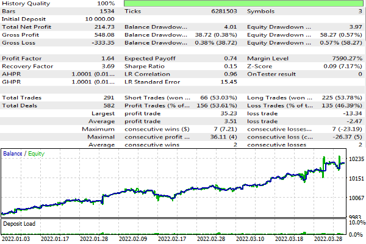
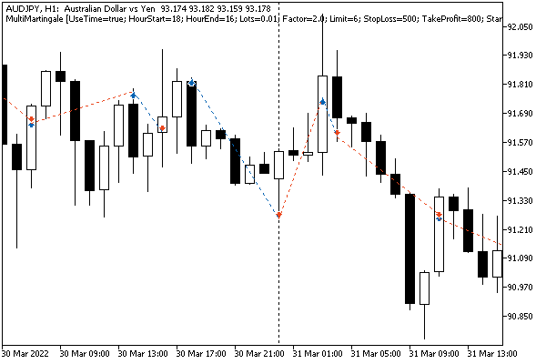

# Creating multi-symbol Expert Advisors

Until now, within the framework of the book, we have mainly analyzed examples of Expert Advisors trading on the current working symbol of the chart. However, MQL5 allows you to generate trade orders for any symbols of Market Watch, regardless of the working symbol of the chart.

In fact, many of the examples in the previous sections had an input parameter symbol, in which you can specify an arbitrary symbol. By default, there is an empty string, which is treated as the current symbol of the chart. So, we have already considered the following examples:

- CustomOrderSend.mq5 in [Sending a trade request](/en/book/automation/experts/experts_ordersend_ordersendasync)
- MarketOrderSend.mq5 in [Buying and selling operations](/en/book/automation/experts/experts_market_buy_sell)
- MarketOrderSendMonitor.mq5 in [Functions for reading the properties of active orders](/en/book/automation/experts/experts_orderget_funcs)
- PendingOrderSend.mq5 in [Setting a pending order](/en/book/automation/experts/experts_pending)
- PendingOrderModify.mq5 in [Modifying a pending order](/en/book/automation/experts/experts_modify_order)
- PendingOrderDelete.mq5 in [Deleting a pending order](/en/book/automation/experts/experts_remove_order)

You can try to run these examples with a different symbol and make sure that trading operations are performed exactly the same as with the native one.

Moreover, as we saw in the description of [OnBookEven](/en/book/automation/marketbook/marketbook_events) and [OnTradeTransaction](/en/book/automation/experts/experts_ontradetransaction) events, they are universal and inform about changes in the trading environment concerning arbitrary symbols. But this is not true for the [OnTick](/en/book/automation/experts/experts_ontick) event which is only generated when there is a change in the new prices of the current symbol. Usually, this is not a problem, but high-frequency multicurrency trading requires some additional technical steps to be taken, such as subscribing to OnBookEvent events for other symbols or setting a high-frequency timer. Another option to bypass this limitation in the form of a spy indicator EventTickSpy.mq5 was presented in the section [Generating custom events](/en/book/applications/events/events_custom).

In the context of talking about the support of multi-symbol trading, it should be noted that a similar concept of multi-timeframe Expert Advisors is not entirely correct. Trading at new bar opening times is only a special case of grouping ticks by arbitrary periods, not necessarily standard ones. Of course, the analysis of the emergence of a new bar on a specific timeframe is simplified by the system core due to functions like iTime(_Symbol, PERIOD_XX, 0), but this analysis is based on ticks anyway.

You can build virtual bars inside your Expert Advisor by the number of ticks (equivolume), by the range of prices (renko, range) and so on. In some cases, including for clarity, it makes sense to generate such "timeframes" explicitly outside the Expert Advisor, in the form of [custom symbols](/en/book/advanced/custom_symbols). But this approach has its limitations: we will talk about them in the next part of the book.

However, if the trading system still requires analysis of quotes based on the opening of bars or uses a multi-currency indicator, one should somehow wait for the synchronization of bars on all involved instruments. We provided an example of a class that performs this task in the section [Tracking bar formation](/en/book/applications/indicators_make/indicators_newbars).

When developing a multi-symbol Expert Advisor, the imperative task involves segregating a universal trading algorithm into distinct blocks. These blocks can subsequently be applied to various symbols with differing settings. The most logical approach to achieve this is to articulate one or more classes within the framework of the Object-Oriented Programming (OOP) concept.

Let's illustrate this methodology using an example of an Expert Advisor employing the well-known martingale strategy. As is commonly understood, the martingale strategy is inherently risky, given its practice of doubling lots after each losing trade in anticipation of recovering previous losses. Mitigating this risk is essential, and one effective approach is to simultaneously trade multiple symbols, preferably those with weak correlations. This way, temporary drawdowns on one instrument can potentially be offset by gains on others.

The incorporation of a variety of instruments (or diverse settings within a single trading system, or even distinct trading systems) within the Expert Advisor serves to diminish the overall impact of individual component failures. In essence, the greater the diversity in instruments or systems, the less the final result is contingent on the isolated setbacks of its constituent parts.

Let's call a new Expert Advisor MultiMartingale.mq5. Trading algorithm settings include:

- UseTime — logical flag for enabling/disabling scheduled trading
- HourStart and Hour End — the range of hours within which trading is allowed, if UseTime equals true
- Lots — the volume of the first deal in the series
- Factor — coefficient of increase in volume for subsequent transactions after a loss
- Limit — the maximum number of trades in a losing series with multiplication of volumes (after it, return to the initial lot)
- Stop Loss and Take Profit — distance to protective levels in points
- StartType — type of the first deal (purchase or sale)
- Trailing — indication of a stop loss trailing

In the source code, they are described in this way.

```
input bool UseTime = true;      // UseTime (hourStart and hourEnd)
input uint HourStart = 2;       // HourStart (0...23)
input uint HourEnd = 22;        // HourEnd (0...23)
input double Lots = 0.01;       // Lots (initial)
input double Factor = 2.0;      // Factor (lot multiplication)
input uint Limit = 5;           // Limit (max number of multiplications)
input uint StopLoss = 500;      // StopLoss (points)
input uint TakeProfit = 500;    // TakeProfit (points)
input ENUM_POSITION_TYPE StartType = 0; // StartType (first order type: BUY or SELL)
input bool Trailing = true;     // Trailing

```

In theory, it is logical to establish protective levels not in points but in terms of shares of the Average True Range indicator (ATR). However, at present, this is not a primary task.

Additionally, the Expert Advisor incorporates a mechanism to temporarily halt trading operations for a user-specified duration (controlled by the parameter SkipTimeOnError) in case of errors. We will omit a detailed discussion of this aspect here, as it can be referenced in the source codes.

To consolidate the entire set of configurations into a unified entity, a structure named Settings is defined. This structure has fields that mirror input variables. Furthermore, the structure includes the symbol field, addressing the strategy's multicurrency nature. In other words, the symbol can be arbitrary and differs from the working symbol on the chart.

```
struct Settings
{
   bool useTime;
   uint hourStart;
   uint hourEnd;
   double lots;
   double factor;
   uint limit;
   uint stopLoss;
   uint takeProfit;
   ENUM_POSITION_TYPE startType;
   ulong magic;
   bool trailing;
   string symbol;
   ...
};

```

In the initial development phase, we populate the structure with input variables. Nevertheless, this is only sufficient for trading on a single symbol. Subsequently, as we expand the algorithm to encompass multiple symbols, we'll be required to read various sets of settings (using a different approach) and append them to an array of structures.

The structure also encompasses several beneficial methods. Specifically, the validate method verifies the correctness of the settings, confirming the existence of the specified symbol, and returns a success indicator (true).

```
struct Settings
{
   ...
   bool validate()
   {
 ...// checking the lot size and protective levels (see the source code)
      
      double rates[1];
      const bool success = CopyClose(symbol, PERIOD_CURRENT, 0, 1, rates) > -1;
      if(!success)
      {
         Print("Unknown symbol: ", symbol);
      }
      return success;
   }
   ...
};

```

Calling CopyClose not only checks if the symbol is online in the Market Watch but also initiates the loading of its quotes (of the desired timeframe) and ticks in the tester. If this is not done, only quotes and ticks (in real ticks mode) of the currently selected instrument and timeframe are available in the tester by default. Since we are writing a multi-currency Expert Advisor, we will need third-party quotes and ticks.

```
struct Settings
{
   ...
   void print() const
   {
      Print(symbol, (startType == POSITION_TYPE_BUY ? "+" : "-"), (float)lots,
        "*", (float)factor,
        "^", limit,
        "(", stopLoss, ",", takeProfit, ")",
        useTime ? "[" + (string)hourStart + "," + (string)hourEnd + "]": "");
   }
};

```

The print method outputs all fields to the log in abbreviated form in one line. For example,

```
EURUSD+0.01*2.0^5(500,1000)[2,22]
|     | |   |   |  |    |   |  |
|     | |   |   |  |    |   |  `until this hour trading is allowed
|     | |   |   |  |    |   `from this hour trading is allowed
|     | |   |   |  |    `take profit in points
|     | |   |   |  `stop loss in points
|     | |   |   `maximum size of a series of losing trades (after '^')
|     | |   `lot multiplication factor (after '*')
|     | `initial lot in series
|     `+ start with Buy
|     `- start with Sell
`instrument

```

We will need other methods in the Settings structure when we move to multicurrency. For now, let's imagine a simplified version of what the handler OnInit of the Expert Advisor trading on one symbol might look like.

```
int OnInit()
{
   Settings settings =
   {
      UseTime, HourStart, HourEnd,
      Lots, Factor, Limit,
      StopLoss, TakeProfit,
      StartType, Magic, SkipTimeOnError, Trailing, _Symbol
   };
   
   if(settings.validate())
   {
      settings.print();
      ...
      // here you will need to initialize the trading algorithm with these settings
   }
   ...
}

```

Adhering to the OOP, the trading system in a generalized form should be described as a software interface. Again, in order to simplify the example, we will only use one method in this interface: trade.

```
interface TradingStrategy
{
   virtual bool trade(void);
};

```

Well, the main task of the algorithm is to trade, and it doesn’t even matter where we decide to call this method from: on each tick from OnTick, at the bar opening, or possibly on timer.

Your working Expert Advisors will most likely need additional interface methods to set up and support various modes. But they are not needed in this example.

Let's start creating a class of a specific trading system based on the interface. In our case, all instances will be of the class SimpleMartingale. However, it is also possible to implement many different classes that inherit the interface within one Expert Advisor and then use them in a uniform way in an arbitrary combination. A portfolio of strategies (preferably very different in nature) is usually characterized by increased stability of financial performance.

```
class SimpleMartingale: public TradingStrategy
{
protected:
   Settings settings;
   SymbolMonitor symbol;
   AutoPtr<PositionState> position;
   AutoPtr<TrailingStop> trailing;
   ...
};

```

Inside the class, we see a familiar Settings structure and the working symbol monitor SymbolMonitor. In addition, we will need to control the presence of positions and follow the stop-loss level for them, for which we have introduced variables with auto-pointers to objects [PositionState](/en/book/automation/experts/experts_trade_state) and [TrailingStop](/en/book/automation/experts/experts_trailing_stop). Auto-pointers allow us in our code not to worry about the explicit deletion of objects as this will be done automatically when the control exits the scope, or when a new pointer is assigned to the auto-pointer.

The class TrailingStop is a base class, with the simplest implementation of price tracking, from which you can inherit a lot of more complex algorithms, an example of which we considered as a derivative TrailingStopByMA. Therefore, in order to give the program flexibility in the future, it is desirable to ensure that the calling code can pass its own specific, customized trailing object, derived from TrailingStop. This can be done, for example, by passing a pointer to the constructor or by turning SimpleMartingale into a template class (then the trail class will be set by the template parameter).   

   

This principle of OOP is called dependency injection and is widely used along with many others that we briefly mentioned in the section [Theoretical foundations of OOP: composition](/en/book/oop/classes_and_interfaces/classes_composition).

The settings are passed to the strategy class as a constructor parameter. Based on them, we assign all internal variables.

```
class SimpleMartingale: public TradingStrategy
{
   ...
   double lotsStep;
   double lotsLimit;
   double takeProfit, stopLoss;
public:
   SimpleMartingale(const Settings &state) : symbol(state.symbol)
   {
      settings = state;
      const double point = symbol.get(SYMBOL_POINT);
      takeProfit = settings.takeProfit * point;
      stopLoss = settings.stopLoss * point;
      lotsLimit = settings.lots;
      lotsStep = symbol.get(SYMBOL_VOLUME_STEP);
      
      // calculate the maximum lot in the series (after a given number of multiplications)
      for(int pos = 0; pos < (int)settings.limit; pos++)
      {
         lotsLimit = MathFloor((lotsLimit * settings.factor) / lotsStep) * lotsStep;
      }
      
      double maxLot = symbol.get(SYMBOL_VOLUME_MAX);
      if(lotsLimit > maxLot)
      {
         lotsLimit = maxLot;
      }
      ...

```

Next, we use the object PositionFilter to search for existing "own" positions (by the magic number and symbol). If such a position is found, we create the PositionState object and, if necessary, the TrailingStop object for it.

```
      PositionFilter positions;
      ulong tickets[];
      positions.let(POSITION_MAGIC, settings.magic).let(POSITION_SYMBOL, settings.symbol)
         .select(tickets);
      const int n = ArraySize(tickets);
      if(n > 1)
      {
         Alert(StringFormat("Too many positions: %d", n));
      }
      else if(n > 0)
      {
         position = new PositionState(tickets[0]);
         if(settings.stopLoss && settings.trailing)
         {
           trailing = new TrailingStop(tickets[0], settings.stopLoss,
              ((int)symbol.get(SYMBOL_SPREAD) + 1) * 2);
         }
      }
   }

```

Schedule operations will be left "behind the scene" in the trade method for now (useTime, hourStart, and hourEnd parameter fields). Let's proceed directly to the trading algorithm.

If there are no and have not been any positions yet, the PositionState pointer will be zero, and we need to open a long or short position in accordance with the selected direction startType.

```
   virtual bool trade() override
   {
      ...
      ulong ticket = 0;
      
      if(position[] == NULL)
      {
         if(settings.startType == POSITION_TYPE_BUY)
         {
            ticket = openBuy(settings.lots);
         }
         else
         {
            ticket = openSell(settings.lots);
         }
      }
      ...

```

Helper methods openBuy and openSell are used here. We'll get to them in a couple of paragraphs. For now, we only need to know that they return the ticket number on success or 0 on failure.

If the position object already contains information about the tracked position, we check whether it is live by calling refresh. In case of success (true), update position information by calling update and also trail the stop loss, if it was requested by the settings.

```
      else // position[] != NULL
      {
         if(position[].refresh()) // does position still exists?
         {
            position[].update();
            if(trailing[]) trailing[].trail();
         }
         ...

```

If the position is closed, refresh will return false, and we will be in another if branch to open a new position: either in the same direction, if a profit was fixed, or in the opposite direction, if a loss occurred. Please note that we still have a snapshot of the previous position in the cache.

```
         else // the position is closed - you need to open a new one
         {
            if(position[].get(POSITION_PROFIT) >= 0.0) 
            {
              // keep the same direction:
              // BUY in case of profitable previous BUY
              // SELL in case of profitable previous SELL
               if(position[].get(POSITION_TYPE) == POSITION_TYPE_BUY)
                  ticket = openBuy(settings.lots);
               else
                  ticket = openSell(settings.lots);
            }
            else
            {
               // increase the lot within the specified limits
               double lots = MathFloor((position[].get(POSITION_VOLUME) * settings.factor) / lotsStep) * lotsStep;
   
               if(lotsLimit < lots)
               {
                  lots = settings.lots;
               }
             
               // change the trade direction:
               // SELL in case of previous unprofitable BUY
               // BUY in case of previous unprofitable SELL
               if(position[].get(POSITION_TYPE) == POSITION_TYPE_BUY)
                  ticket = openSell(lots);
               else
                  ticket = openBuy(lots);
            }
         }
      }
      ...

```

The presence of a non-zero ticket at this final stage means that we must start controlling it with new objects PositionState and TrailingStop.

```
      if(ticket > 0)
      {
         position = new PositionState(ticket);
         if(settings.stopLoss && settings.trailing)
         {
            trailing = new TrailingStop(ticket, settings.stopLoss,
               ((int)symbol.get(SYMBOL_SPREAD) + 1) * 2);
         }
      }
  
      return true;
    }

```

We now present, with some abbreviations, the openBuy method (openSell is all the same). It has three steps:

- Preparing the MqlTradeRequestSync structure using the prepare method (not shown here, it fills deviation and magic)
- Sending an order using a request.buy method call
- Checking the result with the postprocess method (not shown here, it calls request.completed and in case of an error, the period of suspension of trading begins in anticipation of better conditions);

```
   ulong openBuy(double lots)
   {
      const double price = symbol.get(SYMBOL_ASK);
      
      MqlTradeRequestSync request;
      prepare(request);
      if(request.buy(settings.symbol, lots, price,
         stopLoss ? price - stopLoss : 0,
         takeProfit ? price + takeProfit : 0))
      {
         return postprocess(request);
      }
      return 0;
   }

```

Usually, positions will be closed by stop loss or take profit. However, we support scheduled operations that may result in closures. Let's go back to the beginning of the trade method for scheduling work.

```
   virtual bool trade() override
   {
      if(settings.useTime && !scheduled(TimeCurrent())) // time out of schedule?
      {
         // if there is an open position, close it
         if(position[] && position[].isReady())
         {
            if(close(position[].get(POSITION_TICKET)))
            {
                                // at the request of the designer:
               position = NULL; // clear the cache or we could...
               // do not do this zeroing, that is, save the position in the cache,
               // to transfer the direction and lot of the next trade to a new series
            }
            else
            {
               position[].refresh(); // guaranteeing reset of the 'ready' flag
            }
         }
         return false;
      }
      ...// opening positions (given above)
   }

```

Working method close is largely similar to openBuy so we will not consider it here. Another method, scheduled, just returns true or false, depending on whether the current time falls within the specified working hours range (hourStart, hourEnd).

So, the trading class is ready. But for multi-currency work, you will need to create several copies of it. The TradingStrategyPool class will manage them, in which we describe an array of pointers to TradingStrategy and methods for replenishing it: parametric constructor and push.

```
class TradingStrategyPool: public TradingStrategy
{
private:
   AutoPtr<TradingStrategy> pool[];
public:
   TradingStrategyPool(const int reserve = 0)
   {
      ArrayResize(pool, 0, reserve);
   }
   
   TradingStrategyPool(TradingStrategy *instance)
   {
      push(instance);
   }
   
   void push(TradingStrategy *instance)
   {
      int n = ArraySize(pool);
      ArrayResize(pool, n + 1);
      pool[n] = instance;
   }
   
   virtual bool trade() override
   {
      for(int i = 0; i < ArraySize(pool); i++)
      {
         pool[i][].trade();
      }
      return true;
   }
};

```

It is not necessary to make the pool derived from the interface TradingStrategy interface, but if we do so, this allows future packing of strategy pools into other larger strategy pools, and so on. The trade method simply calls the same method on all array objects.

In the global context, let's add an autopointer to the trading pool, and in the OnInit handler we will ensure its filling. We can start with one single strategy (we will deal with multicurrency a bit later).

```
AutoPtr<TradingStrategyPool> pool;
   
int OnInit()
{
   ... // settings initialization was given earlier
   if(settings.validate())
   {
      settings.print();
      pool = new TradingStrategyPool(new SimpleMartingale(settings));
      return INIT_SUCCEEDED;
   }
   else
   {
      return INIT_FAILED;
   }
   ...
}

```

To start trading, we just need to write the following small handler OnTick.

```
void OnTick()
{
   if(pool[] != NULL)
   {
      pool[].trade();
   }
}

```

But what about multicurrency support?

The current set of input parameters is designed for only one instrument. We can use this to test and optimize the Expert Advisor on a single symbol, but after the optimal settings are found for all symbols, they need to be somehow combined and passed to the algorithm.

In this case, we apply the simplest solution. The code above contained a line with the settings formed by the print method generated by the Settings structures. We implement the method in the parse structure which does the reverse operation: restores the state of the fields by the line description. Also, since we need to concatenate several settings for different characters, we will agree that they can be concatenated into a single long string through a special delimiter character, for example ';'. Then it is easy to write the parseAll static method to read the merged set of settings, which will call parse to fill the array of Settings structures passed by reference. The full source code of the methods can be found in the attached file.

```
struct Settings
{
   ...
   bool parse(const string &line);
   void static parseAll(const string &line, Settings &settings[])
   ...
};  

```

For example, the following concatenated string contains settings for three symbols.

```
EURUSD+0.01*2.0^7(500,500)[2,22];AUDJPY+0.01*2.0^8(300,500)[2,22];GBPCHF+0.01*1.7^8(1000,2000)[2,22]

```

It is lines of this kind that the method parseAll can parse. To enter such a string into the Expert Advisor, we describe the input WorkSymbols variable.

```
input string WorkSymbols = ""; // WorkSymbols (name±lots*factor^limit(sl,tp)[start,stop];...)

```

If it is empty, the Expert Advisor will work with the settings from the individual input variables presented earlier. If the string is specified, the OnInit handler will fill the pool of trading systems based on the results of parsing this line.

```
int OnInit()
{
   if(WorkSymbols == "")
   {
      ...// work with the current single character, as before
   }
   else
   {
      Print("Parsed settings:");
      Settings settings[];
      Settings::parseAll(WorkSymbols, settings);
      const int n = ArraySize(settings);
      pool = new TradingStrategyPool(n);
      for(int i = 0; i < n; i++)
      {
         settings[i].trailing = Trailing;
         // support multiple systems on one symbol for hedging accounts
         settings[i].magic = Magic + i;  // different magic numbers for each subsystem
         pool[].push(new SimpleMartingale(settings[i]));
      }
   }
   return INIT_SUCCEEDED;
}

```

It's important to note that in MQL5, the length of the input string is restricted to 250 characters. Additionally, during optimization in the tester, strings are further truncated to a maximum of 63 characters. Consequently, to optimize concurrent trading across numerous symbols, it becomes imperative to devise an alternative method for loading settings, such as retrieving them from a text file. This can be easily accomplished by utilizing the same input variable, provided it is designated with a file name rather than a string containing settings.

This approach is implemented in the mentioned Settings::parseAll method. The name of the text file in which an input string will be passed to the Expert Advisor without length limitation is set according to the universal principle suitable for all similar cases: the file name begins with the name of the Expert Advisor, and then, after the hyphen, there must be the name of the variable whose data the file contains. For example, in our case, in the WorkSymbols input variable, you can optionally specify the file name "MultiMartingale-WorkSymbols.txt". Then the parseAll method will try to read the text from the file (it should be in the standard MQL5/Files sandbox).

Passing file names in input parameters requires additional steps to be taken for further testing and optimization of such an Expert Advisor: the #property tester_file "MultiMartingale-WorkSymbols.txt" directive should be added to the source code. This will be discussed in detail in the section [Tester preprocessor directives](/en/book/automation/tester/tester_directives). When this directive is added, the Expert Advisor will require the presence of the file and will not start without it in the tester!

The Expert Advisor is ready. We can test it on different symbols separately, choose the best settings for each and build a trading portfolio. In the next chapter, we will study the tester API, including optimization, and this Expert Advisor will come in handy. In the meantime, let's check its multi-currency operation.

```
WorkSymbols=EURUSD+0.01*1.2^4(300,600)[9,11];GBPCHF+0.01*2.0^7(300,400)[14,16];AUDJPY+0.01*2.0^6(500,800)[18,16]

```

In the first quarter of 2022, we will receive the following report (MetaTrader 5 reports do not provide statistics broken down by symbols, so it is possible to distinguish a single-currency report from a multi-currency one only by the table of deals/orders/positions).



Tester's report for a multi-currency Martingale strategy Expert Advisor

It should be noted that due to the fact that the strategy is launched from the OnTick handler, the runs on different main symbols (that is, those selected in the tester's settings drop-down list) will give slightly different results. In our test, we simply used EURUSD as the most liquid and most frequently ticked instrument, which is sufficient for most applications. However, if you want to react to ticks of all instruments, you can use an indicator like EventTickSpy.mq5. Optionally, you can run the trading logic on a timer without being tied to the ticks of a specific instrument.

And here is what the trading strategy looks like for a single symbol, in this case AUDJPY.



Chart with a test of a multi-currency Martingale strategy Expert Advisor

By the way, for all multicurrency Expert Advisors, there is another important issue that is left unattended here. We are talking about the method of selecting the lot size, for example, based on the loading of the deposit or risk. Earlier, we showed examples of such calculations in a non-trading Expert Advisor [LotMarginExposureTable.mq5](/en/book/automation/experts/experts_ordercalcmargin). In MultiMartingale.mq5, we have simplified the task by choosing a fixed lot and displaying it in the settings for each symbol. However, in operational multicurrency Expert Advisors, it makes sense to choose lots in proportion to the value of the instruments (by margin or volatility).

In conclusion, I would like to note that multi-currency strategies may require different optimization principles. The considered strategy makes it possible to separately find parameters for symbols and then combine them. However, some arbitrage and cluster strategies (for example, pair trading) are based on the simultaneous analysis of all tools for making trading decisions. In this case, the settings associated with all symbols should be separately included in the input parameters.
