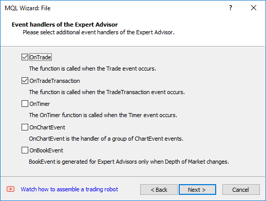
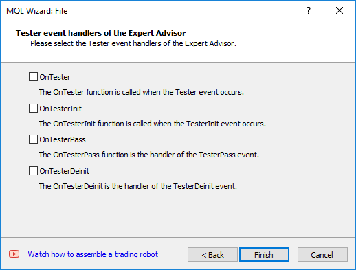
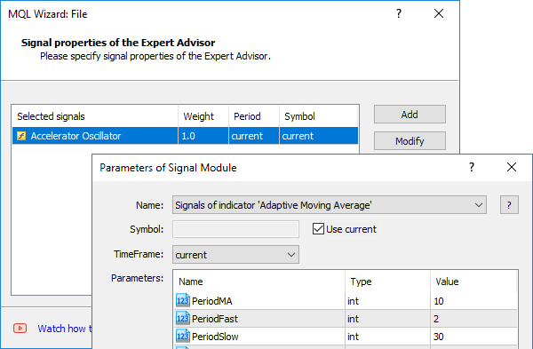
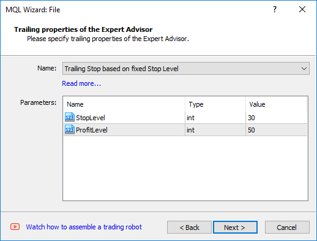
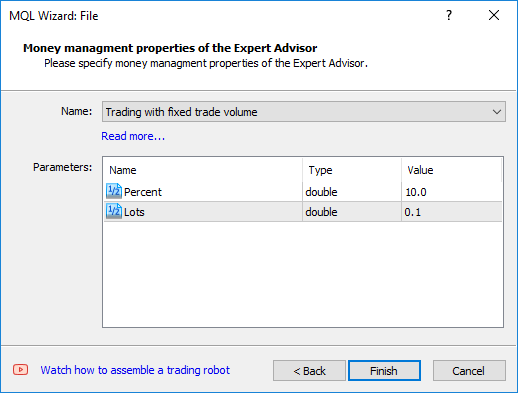

# Creating Expert Advisors in the MQL Wizard

So, we are completing the study of trading APIs for developing Expert Advisors. Throughout this chapter, we have considered various examples, which you can use as a starting point for your own project. However, if you want to start an Expert Advisor from scratch, you don't have to do it literally "from scratch". The MetaEditor provides the built-in MQL Wizard which, among other things, allows the creation of Expert Advisor templates. Moreover, in the case of Expert Advisor, this Wizard offers two different ways to generate source code.

We already got acquainted with the first step of the Wizard in the section [MQL Wizard and program draft](/en/book/intro/mql_wizard). Obviously, in the first step, we select the type of project to be created. In the previously mentioned chapter, we created a script template. Later, in the chapter on indicators, we took a tour of [creating an indicator template](/en/book/applications/indicators_make/indicators_wizard). Now we will consider the following two options:

- Expert Advisor (template)
- Expert Advisor (generate)

The first one is more simple. You can select a name, input parameters, and required event handlers, as shown in screenshots below, but there will be no trading logic and ready-made algorithms in the resulting source file.

The second option is more complicated. It will result in a ready-made Expert Advisor based on the standard library that provides a set of classes in header files available in the standard MetaTrader 5 package. Files are located in folders MQL5/Include/Expert/, MQL5/Include/Trade, MQL5/Include/Indicators, and several others. The library classes implement the most popular indicator signals, mechanisms for performing trading operations based on combinations of signals, as well as money management and trailing stop algorithms. The detailed study of the standard library is beyond the scope of this book.

Regardless of which options you select, at the second step of the Wizard, you need to enter the Expert Advisor name and input parameters. The appearance of this step is similar to what was also already shown in the section [MQL Wizard and program draft](/en/book/intro/mql_wizard). The only caveat is that Expert Advisors based on the standard library must have two mandatory (non-removable) parameters: Symbol and TimeFrame.

For a simple template, at the 3rd step, it is proposed to select additional event handlers that will be added to the source code, in addition to OnTick (OnTick always inserted).

Creation of an Expert Advisor template. Step 3. Additional event handlers

The final fourth step allows you to specify one or more optional event handlers for the tester. Those will be discussed in the next chapter.

Creation of an Expert Advisor template. Step 4. Tester event handlers

If the user chooses to generate a program based on the standard library at the first step of the Wizard, then the 3rd step is to set up trading signals.

Generation of a ready Expert Advisor. Step 3. Setting up trading signals

You can read more about it in the [documentation](https://www.metatrader5.com/en/metaeditor/help/mql5_wizard/wizard_ea_generate).

Steps 4 and 5 are designed to include trailing in the Expert Advisor and automatically select lots according to one of the predefined methods.

Generation of a ready Expert Advisor. Step 4. Choosing a trailing stop method

Generation of a ready Expert Advisor. Step 5. Selection of lots

The Wizard, of course, is not a universal tool, and the resulting program prototype, as a rule, needs to be improved. However, the knowledge gained in this chapter will give you more confidence in the generated source codes and extend them as needed.
