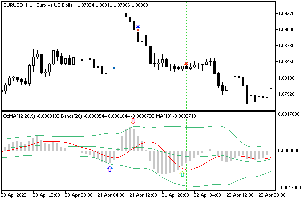

# Getting testing financial statistics: TesterStatistics

We usually evaluate the quality of an Expert Advisor based on a trading report, which is similar to a testing report when dealing with a tester. It contains a large number of variables that characterize the trading style, stability and, of course, profitability. All these metrics, with some exceptions, are available to the MQL program through a special function TesterStatistics. Thus, the Expert Advisor developer has the ability to analyze individual variables in the code and construct their own combined optimization quality criteria from them.

double TesterStatistics(ENUM_STATISTICS statistic)

The TesterStatistics function returns the value of the specified statistical variable, calculated based on the results of a separate run of the Expert Advisor in the tester. A function can be called in the OnDeinit or OnTester handler, which is yet to be discussed.

All available statistical variables are summarized in the ENUM_STATISTICS enumeration. Some of them serve as qualitative characteristics, that is, real numbers (usually total profits, drawdowns, ratios, and so on), and the other part is quantitative, that is, integers (for example, the number of transactions). However, both groups are controlled by the same function with the double result.

The following table shows real indicators (monetary amounts and coefficients). All monetary amounts are expressed in the deposit currency.

| Identifier | Description |
| --- | --- |
| STAT_INITIAL_DEPOSIT | Initial deposit |
| STAT_WITHDRAWAL | The amount of funds withdrawn from the account |
| STAT_PROFIT | Net profit or loss at the end of testing, the sum of STAT_GROSS_PROFIT and STAT_GROSS_LOSS |
| STAT_GROSS_PROFIT | Total profit, the sum of all profitable trades (greater than or equal to zero) |
| STAT_GROSS_LOSS | Total loss, the sum of all losing trades (less than or equal to zero) |
| STAT_MAX_PROFITTRADE | Maximum profit: the largest value among all profitable trades (greater than or equal to zero) |
| STAT_MAX_LOSSTRADE | Maximum loss: the smallest value among all losing trades (less than or equal to zero) |
| STAT_CONPROFITMAX | Total maximum profit in a series of profitable trades (greater than or equal to zero) |
| STAT_MAX_CONWINS | Total profit in the longest series of profitable trades |
| STAT_CONLOSSMAX | Total maximum loss in a series of losing trades (less than or equal to zero) |
| STAT_MAX_CONLOSSES | Total loss in the longest series of losing trades |
| STAT_BALANCEMIN | Minimum balance value |
| STAT_BALANCE_DD | Maximum balance drawdown in money |
| STAT_BALANCEDD_PERCENT | Balance drawdown in percent, which was recorded at the time of the maximum balance drawdown in money (STAT_BALANCE_DD) |
| STAT_BALANCE_DDREL_PERCENT | Maximum balance drawdown in percent |
| STAT_BALANCE_DD_RELATIVE | Balance drawdown in money equivalent, which was recorded at the moment of the maximum balance drawdown in percent (STAT_BALANCE_DDREL_PERCENT) |
| STAT_EQUITYMIN | Minimum equity value |
| STAT_EQUITY_DD | Maximum drawdown in money |
| STAT_EQUITYDD_PERCENT | Drawdown in percent, which was recorded at the time of the maximum drawdown of funds in the money (STAT_EQUITY_DD) |
| STAT_EQUITY_DDREL_PERCENT | Maximum drawdown in percent |
| STAT_EQUITY_DD_RELATIVE | Drawdown in money that was recorded at the time of the maximum drawdown in percent (STAT_EQUITY_DDREL_PERCENT) |
| STAT_EXPECTED_PAYOFF | Mathematical expectation of winnings (arithmetic mean of the total profit and the number of transactions) |
| STAT_PROFIT_FACTOR | Profitability, which is the ratio STAT_GROSS_PROFIT/STAT_GROSS_LOSS (if STAT_GROSS_LOSS = 0; profitability takes the value DBL_MAX) |
| STAT_RECOVERY_FACTOR | Recovery factor: the ratio of STAT_PROFIT/STAT_BALANCE_DD |
| STAT_SHARPE_RATIO | Sharpe ratio |
| STAT_MIN_MARGINLEVEL | Minimum margin level reached |
| STAT_CUSTOM_ONTESTER | The value of the custom optimization criterion returned by the OnTester function |

The following table shows integer indicators (amounts).

| Identifier | Description |
| --- | --- |
| STAT_DEALS | Total number of completed transactions |
| STAT_TRADES | Number of trades (deals to exit the market) |
| STAT_PROFIT_TRADES | Profitable trades |
| STAT_LOSS_TRADES | Losing trades |
| STAT_SHORT_TRADES | Short trades |
| STAT_LONG_TRADES | Long trades |
| STAT_PROFIT_SHORTTRADES | Short profitable trades |
| STAT_PROFIT_LONGTRADES | Long profitable trades |
| STAT_PROFITTRADES_AVGCON | Average length of a profitable series of trades |
| STAT_LOSSTRADES_AVGCON | Average length of a losing series of trades |
| STAT_CONPROFITMAX_TRADES | Number of trades that formed STAT_CONPROFITMAX (maximum profit in the sequence of profitable trades) |
| STAT_MAX_CONPROFIT_TRADES | Number of trades in the longest series of profitable trades STAT_MAX_CONWINS |
| STAT_CONLOSSMAX_TRADES | Number of trades that formed STAT_CONLOSSMAX (maximum loss in the sequence of losing trades) |
| STAT_MAX_CONLOSS_TRADES | Number of trades in the longest series of losing trades STAT_MAX_CONLOSSES |

Let's try to use the presented metrics to create our own complex Expert Advisor quality criterion. To do this, we need some kind of "experimental" example of an MQL program. Let's take the Expert Advisor [MultiMartingale.mq5](/en/book/automation/experts/experts_multisymbol) as a starting point, but we will simplify it: we will remove multicurrency, built-in error handling, and scheduling. Moreover, we will choose a signal trading strategy for it with a single calculation on the bar, i.e., at the opening prices. This will speed up optimization and expand the field for experiments.

The strategy will be based on the overbought and oversold conditions determined by the OsMA indicator. The Bollinger Bands indicator superimposed on OsMA will help you dynamically find the boundaries of excess volatility, which means trading signals.

When OsMA returns inside the corridor, crossing the lower border from the bottom up, we will open a buy trade. When OsMA crosses the upper boundary in the same way from top to bottom, we will sell. To exit positions, we use the moving average, also applied to OsMA. If OsMA shows a reverse movement (down for a long position or up for a short position) and touches the MA, the position will be closed. This strategy is illustrated in the following screenshot.



Trading strategy based on OsMA, BBands and MA indicators

The blue vertical line corresponds to the bar where the buy is opened, since on the two previous bars the lower Bollinger band was crossed by the OsMA histogram from the bottom up (this place is marked with a hollow blue arrow in the subwindow). The red vertical line is the location of the reverse signal, so the buy was closed and the sell was opened. In the subwindow, in this place (or rather, on the two previous bars, where the hollow red arrow is located), the OsMA histogram crosses the upper Bollinger band from top to bottom. Finally, the green line indicates the closing of the sale, due to the fact that the histogram began to rise above the red MA.

Let's name the Expert Advisor BandOsMA.mq5. The general settings will include a magic number, a fixed lot, and a stop loss distance in points. For the stop loss, we will use TrailingStop from the previous example. Take profit is not used here.

```
input group "C O M M O N   S E T T I N G S"
sinput ulong Magic = 1234567890;
input double Lots = 0.01;
input int StopLoss = 1000;

```

Three groups of settings are intended for indicators.

```
input group "O S M A   S E T T I N G S"
input int FastOsMA = 12;
input int SlowOsMA = 26;
input int SignalOsMA = 9;
input ENUM_APPLIED_PRICE PriceOsMA = PRICE_TYPICAL;
   
input group "B B A N D S   S E T T I N G S"
input int BandsMA = 26;
input int BandsShift = 0;
input double BandsDeviation = 2.0;
   
input group "M A   S E T T I N G S"
input int PeriodMA = 10;
input int ShiftMA = 0;
input ENUM_MA_METHOD MethodMA = MODE_SMA;

```

In the MultiMartingale.mq5 Expert Advisor, we had no trading signals, while the opening direction was set by the user. Here we have trading signals, and it makes sense to arrange them as a separate class. First, let's describe the abstract interface TradingSignal.

```
interface TradingSignal
{
   virtual int signal(void);
};

```

It is as simple as our other interface TradingStrategy. And this is good. The simpler the interfaces and objects, the more likely they are to do one single thing, which is a good programming style because it minimizes bugs and makes large software projects more understandable. Due to abstraction in any program that uses TradingSignal, it will be possible to replace one signal with another. We can also replace the strategy. Our strategies are now responsible for preparing and sending orders, and signals initiate them based on market analysis.

In our case, let's pack the specific implementation of TradingSignal into the BandOsMaSignal class. Of course, we need variables to store the descriptors of the 3 indicators. Indicator instances are created and deleted in the constructor and destructor, respectively. All parameters will be passed from input variables. Note that iBands and iMA are built based on the hOsMA handler.

```
class BandOsMaSignal: public TradingSignal
{
   int hOsMA, hBands, hMA;
   int direction;
public:
   BandOsMaSignal(const int fast, const int slow, const int signal,
      const ENUM_APPLIED_PRICE price,
      const int bands, const int shift, const double deviation,
      const int period, const int x, ENUM_MA_METHOD method)
   {
      hOsMA = iOsMA(_Symbol, _Period, fast, slow, signal, price);
      hBands = iBands(_Symbol, _Period, bands, shift, deviation, hOsMA);
      hMA = iMA(_Symbol, _Period, period, x, method, hOsMA);
      direction = 0;
   }
   
   ~BandOsMaSignal()
   {
      IndicatorRelease(hMA);
      IndicatorRelease(hBands);
      IndicatorRelease(hOsMA);
   }
   ...

```

The direction of the current trading signal is placed in the variable direction: 0 — no signals (undefined situation), +1 — buy, -1 — sell. We will fill in this variable in the signal method. Its code repeats the above verbal description of signals in MQL5.

```
   virtual int signal(void) override
   {
      double osma[2], upper[2], lower[2], ma[2];
      // get two values of each indicator on bars 1 and 2
      if(CopyBuffer(hOsMA, 0, 1, 2, osma) != 2) return 0;
      if(CopyBuffer(hBands, UPPER_BAND, 1, 2, upper) != 2) return 0;
      if(CopyBuffer(hBands, LOWER_BAND, 1, 2, lower) != 2) return 0;
      if(CopyBuffer(hMA, 0, 1, 2, ma) != 2) return 0;
      
      // if there was a signal already, check if it has ended
      if(direction != 0)
      {
         if(direction > 0)
         {
            if(osma[0] >= ma[0] && osma[1] < ma[1])
            {
               direction = 0;
            }
         }
         else
         {
            if(osma[0] <= ma[0] && osma[1] > ma[1])
            {
               direction = 0;
            }
         }
      }
      
      // in any case, check if there is a new signal
      if(osma[0] <= lower[0] && osma[1] > lower[1])
      {
         direction = +1;
      }
      else if(osma[0] >= upper[0] && osma[1] < upper[1])
      {
         direction = -1;
      }
      
      return direction;
   }
};

```

As you can see, the indicator values are read for bars 1 and 2, since we will work on opening a bar, and the 0th bar has just opened by the time we we call the signal method.

The new class that implements the TradingStrategy interface will be called SimpleStrategy.

The class provides some new features while also using some previously existing parts. In particular, it retained autopointers for PositionState and TrailingStop and has a new autopointer to the TradingSignal signal. Also, since we are going to trade only on the opening of bars, we needed the lastBar variable, which will store the time of the last processed bar.

```
class SimpleStrategy: public TradingStrategy
{
protected:
   AutoPtr<PositionState> position;
   AutoPtr<TrailingStop> trailing;
   AutoPtr<TradingSignal> command;
   
   const int stopLoss;
   const ulong magic;
   const double lots;
   
   datetime lastBar;
   ...

```

The global parameters are passed to the SimpleStrategy constructor. We also pass a pointer to the TradingSignal object: in this case, it will be BandOsMaSignal which will have to be created by the calling code. Next, the constructor tries to find among the existing positions those that have the required magic number and symbol, and if successful, adds a trailing stop. This will be useful if the Expert Advisor has a break for one reason or another, and the position has already been opened.

```
public:
   SimpleStrategy(TradingSignal *signal, const ulong m, const int sl, const double v):
      command(signal), magic(m), stopLoss(sl), lots(v), lastBar(0)
   {
 // select "our" position among the existing ones (if there is a suitable one)
      PositionFilter positions;
      ulong tickets[];
      positions.let(POSITION_MAGIC, magic).let(POSITION_SYMBOL, _Symbol).select(tickets);
      const int n = ArraySize(tickets);
      if(n > 1)
      {
         Alert(StringFormat("Too many positions: %d", n));
 // TODO: close extra positions - this is not allowed by the strategy
      }
      else if(n > 0)
      {
         position = new PositionState(tickets[0]);
         if(stopLoss)
         {
           trailing = new TrailingStop(tickets[0], stopLoss, stopLoss / 50);
         }
      }
   }

```

The implementation of the trade method is similar to the martingale example. However, we have removed lot multiplications and added the signal method call.

```
   virtual bool trade() override
   {
      // we work only once when a new bar appears
      if(lastBar == iTime(_Symbol, _Period, 0)) return false;
      
      int s = command[].signal(); // getting a signal
      
      ulong ticket = 0;
      
      if(position[] != NULL)
      {
         if(position[].refresh()) // position exists
         {
            // the signal has changed to the opposite or disappeared
            if((position[].get(POSITION_TYPE) == POSITION_TYPE_BUY && s != +1)
            || (position[].get(POSITION_TYPE) == POSITION_TYPE_SELL && s != -1))
            {
               PrintFormat("Signal lost: %d for position %d %lld",
                  s, position[].get(POSITION_TYPE), position[].get(POSITION_TICKET));
               if(close(position[].get(POSITION_TICKET)))
               {
                  position = NULL;
               }
               else
               {
                 // update internal flag 'ready'
                 // according to whether or not there was a closure
                  position[].refresh();
               }
            }
            else
            {
               position[].update();
               if(trailing[]) trailing[].trail();
            }
         }
         else // position is closed
         {
            position = NULL;
         }
      }
      
      if(position[] == NULL && s != 0)
      {
         ticket = (s == +1) ? openBuy() : openSell();
      }
      
      if(ticket > 0) // new position just opened
      {
         position = new PositionState(ticket);
         if(stopLoss)
         {
            trailing = new TrailingStop(ticket, stopLoss, stopLoss / 50);
         }
      }
      // store the current bar
      lastBar = iTime(_Symbol, _Period, 0);
      
      return true;
   }

```

Auxiliary methods openBuy, openSell, and others have undergone minimal changes, so we will not list them (the full source code is attached).

Since we always have only one strategy in this Expert Advisor, in contrast to the multi-currency martingale in which each symbol required its own settings, let's exclude the strategy pool and manage the strategy object directly.

```
AutoPtr<TradingStrategy> strategy;
   
int OnInit()
{
   if(FastOsMA >= SlowOsMA) return INIT_PARAMETERS_INCORRECT;
   strategy = new SimpleStrategy(
      new BandOsMaSignal(FastOsMA, SlowOsMA, SignalOsMA, PriceOsMA,
         BandsMA, BandsShift, BandsDeviation,
         PeriodMA, ShiftMA, MethodMA),
         Magic, StopLoss, Lots);
   return INIT_SUCCEEDED;
}
   
void OnTick()
{
   if(strategy[] != NULL)
   {
      strategy[].trade();
   }
}

```

We now have a ready Expert Advisor which we can use as a tool for studying the tester. First, let's create an auxiliary structure TesterRecord for querying and storing all statistical data.

```
struct TesterRecord
{
   string feature;
   double value;
   
   static void fill(TesterRecord &stats[])
   {
      ResetLastError();
      for(int i = 0; ; ++i)
      {
         const double v = TesterStatistics((ENUM_STATISTICS)i);
         if(_LastError) return;
         TesterRecord t = {EnumToString((ENUM_STATISTICS)i), v};
         PUSH(stats, t);
      }
   }
};

```

In this case, the feature string field is needed only for informative log output. To save all indicators (for example, to be able to generate your own report form later), a simple array of type double of appropriate length is enough.

Using the structure in the OnDeinit handler, we make sure that the MQL5 API returns the same values as the tester's report.

```
void OnDeinit(const int)
{
   TesterRecord stats[];
   TesterRecord::fill(stats);
   ArrayPrint(stats, 2);
}

```

For example, when running the Expert Advisor on EURUSD, H1 with a deposit of 10000 and without any optimizations (with default settings), we will get approximately the following values for 2021 (fragment):

```
                        [feature]  [value]
[ 0] "STAT_INITIAL_DEPOSIT"       10000.00
[ 1] "STAT_WITHDRAWAL"                0.00
[ 2] "STAT_PROFIT"                    6.01
[ 3] "STAT_GROSS_PROFIT"            303.63
[ 4] "STAT_GROSS_LOSS"             -297.62
[ 5] "STAT_MAX_PROFITTRADE"          15.15
[ 6] "STAT_MAX_LOSSTRADE"           -10.00
...
[27] "STAT_DEALS"                   476.00
[28] "STAT_TRADES"                  238.00
...
[37] "STAT_CONLOSSMAX_TRADES"         8.00
[38] "STAT_MAX_CONLOSS_TRADES"        8.00
[39] "STAT_PROFITTRADES_AVGCON"       2.00
[40] "STAT_LOSSTRADES_AVGCON"         2.00

```

Knowing all these values, we can invent our own formula for the combined metric of the Expert Advisor quality and, at the same time, the objective optimization function. But the value of this indicator in any case will need to be reported to the tester. And that's what the OnTester function does.
