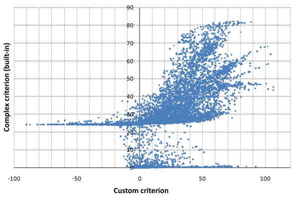
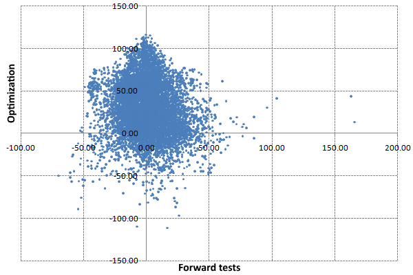
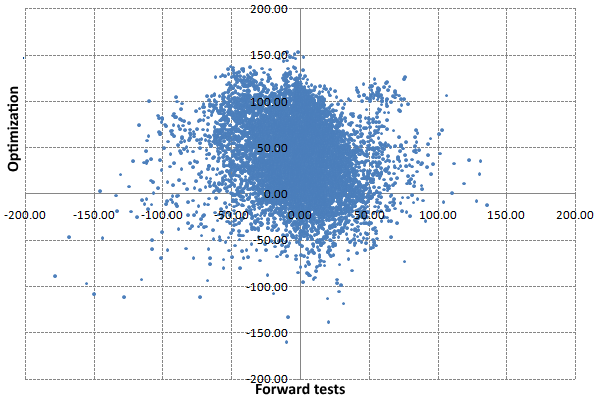
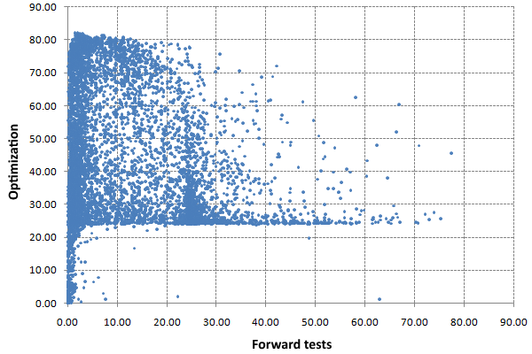
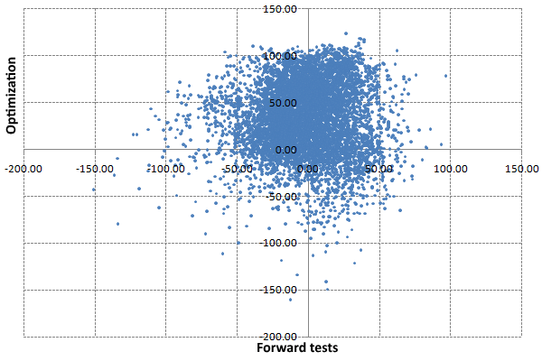
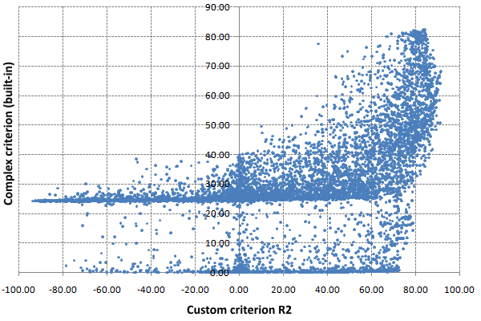
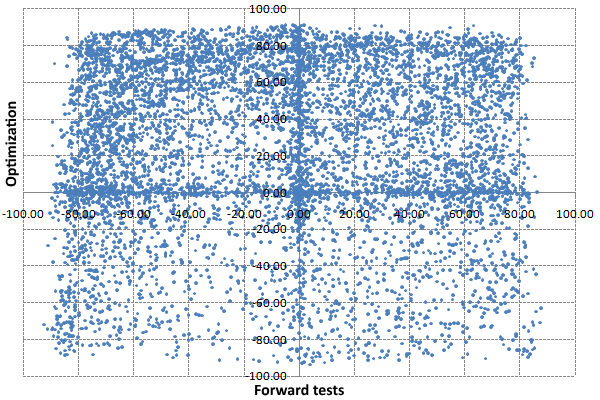
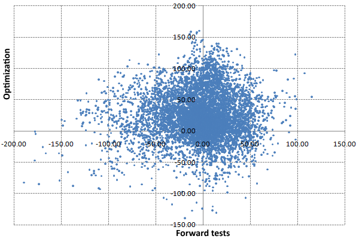

# OnTester event

The OnTester event is generated upon the completion of Expert Advisor testing on historical data (both a separate tester run initiated by the user and one of the multiple runs automatically launched by the tester during optimization). To handle the OnTester event, an MQL program must have a corresponding function in its source code, but this is not necessary. Even without the OnTester function, Expert Advisors can be successfully optimized based on standard criteria.

The function can only be used in Expert Advisors.

double OnTester()

The function is designed to calculate some value of type double, used as a custom optimization criterion (Custom max). Criterion selection is important primarily for successful genetic optimization, while it also allows the user to evaluate and compare the effects of different settings.

In genetic optimization, the results are sorted within one generation in the criterion descending order. That is, the results with the highest value are considered the best in terms of the optimization criterion. The worst values in this sorting are subsequently discarded and do not take part in the formation of the next generation.

Please note that the values returned by the OnTester function are taken into account only when a custom criterion is selected in the tester settings. The availability of the OnTester function does not automatically mean its use by the genetic algorithm.   

   

The MQL5 API does not provide the means to programmatically find out which optimization criterion the user has selected in the tester settings. Sometimes it is very important to know this in order to implement your own analytical algorithms to post-process optimization results.

The function is called by the kernel only in the tester, just before the call of the OnDeinit function.

To calculate the return value, we can use both the standard statistics available through the [TesterStatistics](/en/book/automation/tester/tester_testerstatistics) function and their arbitrary calculations.

In the BandOsMA.mq5 Expert Advisor, we create the OnTester handler which takes into account several metrics: profit, profitability, the number of trades, and the Sharpe ratio. Next, we multiply all the metrics after taking the square root of each. Of course, each developer may have their own preferences and ideas for constructing such generalized quality criteria.

```
double sign(const double x)
{
   return x > 0 ? +1 : (x < 0 ? -1 : 0);
}
   
double OnTester()
{
   const double profit = TesterStatistics(STAT_PROFIT);
   return sign(profit) * sqrt(fabs(profit))
      * sqrt(TesterStatistics(STAT_PROFIT_FACTOR))
      * sqrt(TesterStatistics(STAT_TRADES))
      * sqrt(fabs(TesterStatistics(STAT_SHARPE_RATIO)));
}

```

The unit test log displays a line with the value of the OnTester function.

Let's launch the genetic optimization of the Expert Advisor for 2021 on EURUSD, H1 with the selection of indicator parameters and stop loss size (the file MQL5/Presets/MQL5Book/BandOsMA.set is provided with the book). To check the quality of optimization, we will also include forward tests from the beginning of 2022 (5 months).

First, let's optimize according to our criterion.

As you know, MetaTrader 5 saves all standard criteria in the optimization results in addition to the current one used during optimization. This allows, upon completion of the optimization, to analyze the results from different points by selecting certain criteria from the drop-down list in the upper right corner of the panel with the table. Thus, although we did optimization according to our own criterion, the most interesting built-in complex criterion is also available to us.

We can export the optimization table to an XML file, first with our criteria selected, and then with a complex criterion giving the file a new name (unfortunately, only one criterion is written to the export file; it is important not to change the sorting between two exports). This makes it possible to combine two tables in an external program and build a diagram on which two criteria are plotted along the axes; each point there indicates a combination of criteria in one run.



Comparison of custom and complex optimization criteria

In a complex criterion, we observe a multi-level structure, since it is calculated according to a formula with conditions: somewhere one branch works, and somewhere else another one operates. Our custom criteria are always calculated using the same formula. We also note the presence of negative values in our criterion (this is expected) and the declared range of 0-100 for the complex criterion.

Let's check how good our criterion is by analyzing its values for the forward period.



Values of the custom criterion on periods of optimization and forward tests

As expected, only a part of the good optimization indicators remained on the forward. But we are more interested not in the criterion, but in profit. Let's look at its distribution in the optimization-forward link.



Profit on periods of optimization and forward tests

The picture here is similar. Of the 6850 passes with a profit in the optimization period, 3123 turned out to be profitable in the forward as well (45%). And out of the first 1000 best, only 323 were profitable, which is not good enough. Therefore, this Expert Advisor will need a lot of work to identify stable profitable settings. But maybe it's the optimization criteria problem?

Let's repeat the optimization, this time using the built-in complex criterion.

Attention! MetaTrader 5 generates optimization caches during optimizations: opt files at Tester/cache. When starting the next optimization, it looks for suitable caches to continue the optimization. If there is a cache file with the previous settings, the process does not start from the very beginning, but it takes into account previous results. This allows you to build genetic optimizations in chains, assuming that you find the best results (after all, each genetic optimization is a random process).   

   

MetaTrader 5 does not take into account the optimization criterion as a distinguishing factor in the settings. This may be useful in some cases, based on the foregoing, but it will interfere with our current task. To conduct a pure experiment, we need optimization from scratch. Therefore, immediately after the first optimization using our criterion, we cannot launch the second one using the complex criterion.   

   

There is no way to disable the current behavior from the terminal interface. Therefore, you should either delete or rename (change the extension) the previous opt-file manually in any file manager. A little later we will get acquainted with the preprocessor directive for the tester [tester_no_cache](/en/book/automation/tester/tester_directives), which can be specified in the source code of a particular Expert Advisor, allowing you to disable the cache reading.

Comparison of the values of the complex criterion on the periods of optimization and the forward period takes the following form.



Complex criterion for periods of optimization and forward tests

Here's the stability of profits on forwards.



Profit on periods of optimization and forward tests

Of the 5952 positive results in history, only 2655 (also about 45%) remained in the black. But out of the first 1000, 581 turned out to be successful on the forward.

So, we have seen that it is quite simple to use OnTester from the technical point of view, but our criterion works worse than the built-in one (ceteris paribus), although it is far from ideal. Thus, from the point of view of the search for the formula of the criterion itself, and the subsequent reasonable choice of parameters without looking into the future, there are more questions about the content of OnTester, than there are answers.

Here, programming smoothly flows into research and scientific activity, and is beyond the scope of this book. But we will give one example of a criterion calculated on our own metric, and not on ready-made metrics: TesterStatistics. We will talk about the criterion R2, also known as the coefficient of determination (RSquared.mqh).

Let's create a function to calculate R2 from the balance curve. It is known that when trading with a permanent lot, an ideal trading system should show the balance in the form of a straight line. We are now using a permanent lot, and therefore it will suit us. As for R2 in the case of variable lots, we will deal with it a little later.

In the end, R2 is an inverse measure of the variance of the data relative to the linear regression built on them. The range of R2 values lies from minus infinity to +1 (although large negative values are very unlikely in our case). It is obvious that the found line is simultaneously characterized by a slope, therefore, in order to universalize the code, we will save both R2 and the tangent of the angle in the R2A structure as an intermediate result.

```
struct R2A
{
   double r2;    // square of correlation coefficient
   double angle; // tangent of the slope
   R2A(): r2(0), angle(0) { }
};

```

Calculation of indicators is performed in the RSquared function which takes an array of data as input and returns an R2A structure.

```
R2A RSquared(const double &data[])
{
   int size = ArraySize(data);
   if(size <= 2) return R2A();
   double x, y, div;
   int k = 0;
   double Sx = 0, Sy = 0, Sxy = 0, Sx2 = 0, Sy2 = 0;
   for(int i = 0; i < size; ++i)
   {
      if(data[i] == EMPTY_VALUE
      || !MathIsValidNumber(data[i])) continue;
      x = i + 1;
      y = data[i];
      Sx  += x;
      Sy  += y;
      Sxy += x * y;
      Sx2 += x * x;
      Sy2 += y * y;
      ++k;
   }
   size = k;
   const double Sx22 = Sx * Sx / size;
   const double Sy22 = Sy * Sy / size;
   const double SxSy = Sx * Sy / size;
   div = (Sx2 - Sx22) * (Sy2 - Sy22);
   if(fabs(div) < DBL_EPSILON) return R2A();
   R2A result;
   result.r2 = (Sxy - SxSy) * (Sxy - SxSy) / div;
   result.angle = (Sxy - SxSy) / (Sx2 - Sx22);
   return result;
}

```

For optimization, we need one criterion value, and here the angle is important because a smooth falling balance curve with a negative slope can also get a good R2 estimate. Therefore, we will write one more function that will "add minus" to any estimates of R2 with a negative angle. We take the value of R2 modulo because it can itself be negative in the case of very bad (scattered) data that do not fit into our linear model. Thus, we must prevent a situation where a minus times minus gives a plus.

```
double RSquaredTest(const double &data[])
{
   const R2A result = RSquared(data);
   const double weight = 1.0 - 1.0 / sqrt(ArraySize(data) + 1);
   if(result.angle < 0) return -fabs(result.r2) * weight;
   return result.r2 * weight;
}

```

Additionally, our criterion takes into account the size of the series, which corresponds to the number of trades. Due to this, an increase in the number of transactions will increase the indicator.

Having this tool at our disposal, we will implement the function of calculating the balance line in the Expert Advisor and find R2 for it. At the end, we multiply the value by 100, thereby converting the scale to the range of the built-in complex criterion.

```
#define STAT_PROPS 4
   
double GetR2onBalanceCurve()
{
   HistorySelect(0, LONG_MAX);
   
   const ENUM_DEAL_PROPERTY_DOUBLE props[STAT_PROPS] =
   {
      DEAL_PROFIT, DEAL_SWAP, DEAL_COMMISSION, DEAL_FEE
   };
   double expenses[][STAT_PROPS];
   ulong tickets[]; // only needed because of the 'select' prototype, but useful for debugging
   
   DealFilter filter;
   filter.let(DEAL_TYPE, (1 << DEAL_TYPE_BUY) | (1 << DEAL_TYPE_SELL), IS::OR_BITWISE)
      .let(DEAL_ENTRY,
      (1 << DEAL_ENTRY_OUT) | (1 << DEAL_ENTRY_INOUT) | (1 << DEAL_ENTRY_OUT_BY),
      IS::OR_BITWISE)
      .select(props, tickets, expenses);
   
   const int n = ArraySize(tickets);
   
   double balance[];
   
   ArrayResize(balance, n + 1);
   balance[0] = TesterStatistics(STAT_INITIAL_DEPOSIT);
   
   for(int i = 0; i < n; ++i)
   {
      double result = 0;
      for(int j = 0; j < STAT_PROPS; ++j)
      {
         result += expenses[i][j];
      }
      balance[i + 1] = result + balance[i];
   }
   const double r2 = RSquaredTest(balance);
   return r2 * 100;
}

```

In the OnTester handler, we will use the new criterion under the conditional compilation directive, so we need to uncomment the directive #define USE_R2_CRITERION at the beginning of the source code.

```
double OnTester()
{
#ifdef USE_R2_CRITERION
   return GetR2onBalanceCurve();
#else
   const double profit = TesterStatistics(STAT_PROFIT);
   return sign(profit) * sqrt(fabs(profit))
      * sqrt(TesterStatistics(STAT_PROFIT_FACTOR))
      * sqrt(TesterStatistics(STAT_TRADES))
      * sqrt(fabs(TesterStatistics(STAT_SHARPE_RATIO)));
#endif      
}

```

Let's delete the previous results of optimizations (opt-files with cache) and launch a new optimization of the Expert Advisor: by the R2 criterion.

When comparing the values of the R2 criterion with the complex criterion, we can say that the "convergence" between them has increased.



Comparison of custom criterion R2 and complex built-in criterion

The values of the R2 criterion in the optimization window and on the forward period for the corresponding sets of parameters look as follows.



Criterion R2 on periods of optimization and forward tests

And here is how the profits in the past and in the future are combined.



Profit on periods of optimization and forward tests for R2

The statistics are as follows: out of the last 5582 profitable passes, 2638 (47%) remained profitable, and out of the first 1000 most profitable passes there are 566 that remained profitable, which is comparable to the built-in complex criterion.

As mentioned above, the statistics provide raw source material for the next, more intelligent optimization stages, which is more than just a programming task. We will concentrate on other, purely programmatic aspects of optimization.
