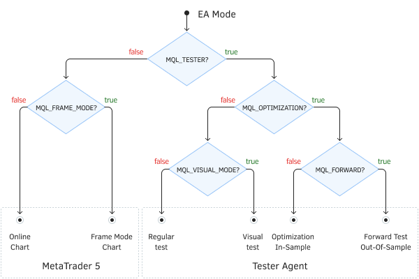

# Auto-tuning: ParameterGetRange and ParameterSetRange

In the previous section, we learned how to pass an optimization criterion to the tester. However, we missed one important point. If you look into our optimization logs, you can see a lot of error messages there, like the ones below.

```
...
Best result 90.61004580175876 produced at generation 25. Next generation 26
genetic pass (26, 388) tested with error "incorrect input parameters" in 0:00:00.021
genetic pass (26, 436) tested with error "incorrect input parameters" in 0:00:00.007
genetic pass (26, 439) tested with error "incorrect input parameters" in 0:00:00.007
genetic pass (26, 363) tested with error "incorrect input parameters" in 0:00:00.008
genetic pass (26, 365) tested with error "incorrect input parameters" in 0:00:00.008
...

```

In other words, every few test passes, something is wrong with the input parameters, and such a pass is not performed. The OnInit handler contains the following check:

```
   if(FastOsMA >= SlowOsMA) return INIT_PARAMETERS_INCORRECT;

```

On our part, it is quite logical to impose such a restriction that the period of the slow MA should be greater than the period of the fast one. However, the tester does not know such things about our algorithm therefore tries to sort through a variety of combinations of periods, including incorrect ones. This might be a common situation for optimization which, however, has a negative consequence.

Since we apply genetic optimization, there are several rejected samples in each generation that do not participate in further mutations. The MetaTrader 5 optimizer does not make up for these losses, i.e., it does not generate a replacement for them. Then, a smaller population size can negatively affect quality. Thus, it is necessary to come up with a way to ensure that the input settings are enumerated only in the correct combinations. And here two MQL5 API functions come to our aid: ParameterGetRange and ParameterSetRange.

Both functions have two overloaded prototypes that differ in parameter types: long and double. This is how the two variants of the ParameterGetRange function are described.

bool ParameterGetRange(const string name, bool &enable, long &value, long &start, long &step, long &stop)

bool ParameterGetRange(const string name, bool &enable, double &value, double &start, double &step, double &stop)

For the input variable specified by name, the function receives information about its current value (value), range of values (start, stop), and change step (step) during optimization. In addition, an attribute is written to the enable variable of whether the optimization is enabled for the input variable named 'name'.

The function returns an indication of success (true) or error (false).

The function can only be called from three special optimization-related handlers: OnTesterInit, OnTesterPass, and OnTesterDeinit. We will talk about them in the [next section](/en/book/automation/tester/tester_ontester_init_pass_deinit). As you can guess from the names, OnTesterInit is called before optimization starts, OnTesterDeinit — after completion of optimization, and OnTesterPass — after each pass in the optimization process. For now, we are only interested in OnTesterInit. Just like the other two functions, it has no parameters and can be declared with the type void, i.e., it returns nothing.

Two versions of the ParameterSetRange function have similar prototypes and perform the opposite action: they set the optimization properties of the Expert Advisor's input parameter.

bool ParameterSetRange(const string name, bool enable, long value, long start, long step, long stop)

bool ParameterSetRange(const string name, bool enable, double value, double start, double step, double stop)

The function sets the modification rules of the input variable with the name name when optimizing: value, change step, start and end values.

This function can only be called from the OnTesterInit handler when starting optimization in the strategy tester.

Thus, using the ParameterGetRange and ParameterSetRange functions, you can analyze and set new range and step values, as well as completely exclude, or, vice versa, include certain parameters from optimization, despite the settings in the strategy tester. This allows you to create your own scripts to manage the space of input parameters during optimization.

The function allows you to use in optimization even those variables that are declared with the sinput modifier (they are not available for inclusion in the optimization by the user).

Attention! After the call of ParameterSetRange with a change in the settings of a specific input variable, subsequent calls of ParameterGetRange will not "see" these changes and will still return to the original settings. This makes it impossible to use functions together in complex software products, where settings can be handled by different classes and [libraries](/en/book/advanced/libraries) from independent developers.

Let's improve the BandOsMA Expert Advisor using the new functions. The updated version is named BandOsMApro.mq5 ("pro" can be conditionally decoded as "parameter range optimization").

So, we have the OnTesterInit handler, in which we read the settings for the FastOsMA and SlowOsMA parameters, and check if they are included in the optimization. If so, you need to turn them off and offer something in return.

```
void OnTesterInit()
{
   bool enabled1, enabled2;
   long value1, start1, step1, stop1;
   long value2, start2, step2, stop2;
   if(ParameterGetRange("FastOsMA", enabled1, value1, start1, step1, stop1)
   && ParameterGetRange("SlowOsMA", enabled2, value2, start2, step2, stop2))
   {
      if(enabled1 && enabled2)
      {
         if(!ParameterSetRange("FastOsMA", false, value1, start1, step1, stop1)
         || !ParameterSetRange("SlowOsMA", false, value2, start2, step2, stop2))
         {
            Print("Can't disable optimization by FastOsMA and SlowOsMA: ",
               E2S(_LastError));
            return;
         }
         ...
      }
   }
   else
   {
      Print("Can't adjust optimization by FastOsMA and SlowOsMA: ", E2S(_LastError));
   }
}

```

Unfortunately, due to the addition of OnTesterInit, the compiler also requires you to add OnTesterDeinit, although we do not need this function. But we are forced to agree and add an empty handler.

```
void OnTesterDeinit()
{
}

```

The presence of the OnTesterInit/OnTesterDeinit functions in the code will lead to the fact that when the optimization is started, an additional chart will open in the terminal with a copy of our Expert Advisor running on it. It works in a special mode that allows you to receive additional data (the so-called frames) from tested copies on agents, but we will explore this possibility later. For now, it is important for us to note that all operations with files, logs, charts, and objects work in this auxiliary copy of the Expert Advisor directly in the terminal, as usual (and not on the agent). In particular, all error messages and Print calls will be displayed in the log on the Experts tab of the terminal.

We have information about the change ranges and steps of these parameters, we can literally recalculate all the correct combinations. This task is assigned to a separate Iterate function because a similar operation will have to be reproduced by copies of the Expert Advisor on agents, in the OnInit handler.

In the Iterate function, we have two nested loops over the periods of fast and slow MA in which we count the number of valid combinations, i.e. when the i period is less than j. We need the optional find parameter when calling Iterate from OnInit to return the pair by the sequence number of the combination i and j. Since it is required to return 2 numbers, we declared the PairOfPeriods structure for them.

```
struct PairOfPeriods
{
   int fast;
   int slow;
};
   
PairOfPeriods Iterate(const long start1, const long stop1, const long step1,
   const long start2, const long stop2, const long step2,
   const long find = -1)
{
   int count = 0;
   for(int i = (int)start1; i <= (int)stop1; i += (int)step1)
   {
      for(int j = (int)start2; j <= (int)stop2; j += (int)step2)
      {
         if(i < j)
         {
            if(count == find)
            {
               PairOfPeriods p = {i, j};
               return p;
            }
            ++count;
         }
      }
   }
   PairOfPeriods p = {count, 0};
   return p;
}

```

When calling Iterate from OnTesterInit, we don't use the find parameter and keep counting until the very end, and return the resulting amount in the first field of the structure. This will be the range of values of some new shadow parameter, for which we must enable optimization. Let's call it FastSlowCombo4Optimization and add to the new group of auxiliary input parameters. More will be added here soon.

```
input group "A U X I L I A R Y"
sinput int FastSlowCombo4Optimization = 0;   // (reserved for optimization)
...

```

Let's go back to OnTesterInit and organize an MQL5 optimization by the FastSlowCombo4Optimization parameter in the desired range using ParameterSetRange.

```
void OnTesterInit()
{
   ...
         PairOfPeriods p = Iterate(start1, stop1, step1, start2, stop2, step2);
         const int count = p.fast;
         ParameterSetRange("FastSlowCombo4Optimization", true, 0, 0, 1, count);
         PrintFormat("Parameter FastSlowCombo4Optimization is enabled with maximum: %d",
            count);
   ...
}

```

Please note that the resulting number of iterations for the new parameter should be displayed in the terminal log.

When testing on the agent, use the number in FastSlowCombo4Optimization to get a couple of periods by calling Iterate again, this time with the filled find parameter. But the problem is that for this operation, it is required to know the initial ranges and the FastOsMA and SlowOsMA parameter change step. This information is present only in the terminal. So, we need to somehow transfer it to the agent.

Now we will apply the only solution we know so far: we will add 3 more shadow optimization parameters and set some values for them. In the future, we will get acquainted with the technology of transferring files to agents (see [Preprocessor directives for the tester](/en/book/automation/tester/tester_directives)). Then we will be able to write to the file the entire array of indexes calculated by the Iterate function and send it to agents. This will avoid three extra shadow optimization parameters.

So, let's add three input parameters:

```
sinput ulong FastShadow4Optimization = 0;    // (reserved for optimization)
sinput ulong SlowShadow4Optimization = 0;    // (reserved for optimization)
sinput ulong StepsShadow4Optimization = 0;   // (reserved for optimization)

```

We use the ulong type to be more economical: to pack 2 int numbers into each value. This is how they are filled in OnTesterInit.

```
void OnTesterInit()
{
   ...
         const ulong fast = start1 | (stop1 << 16);
         const ulong slow = start2 | (stop2 << 16);
         const ulong step = step1 | (step2 << 16);
         ParameterSetRange("FastShadow4Optimization", false, fast, fast, 1, fast);
         ParameterSetRange("SlowShadow4Optimization", false, slow, slow, 1, slow);
         ParameterSetRange("StepsShadow4Optimization", false, step, step, 1, step);
   ...
}

```

All 3 parameters are non-optimizable (false in the second argument).

This concludes our operations with the OnTesterInit function. Let's move to the receiving side: the OnInit handler.

```
int OnInit()
{
   // keep the check for single tests
   if(FastOsMA >= SlowOsMA) return INIT_PARAMETERS_INCORRECT;
   
   // when optimizing, we require the presence of shadow parameters
   if(MQLInfoInteger(MQL_OPTIMIZATION) && StepsShadow4Optimization == 0)
   {
      return INIT_PARAMETERS_INCORRECT;
   }
   
   PairOfPeriods p = {FastOsMA, SlowOsMA}; // by default we work with normal parameters
   if(FastShadow4Optimization && SlowShadow4Optimization && StepsShadow4Optimization)
   {
      // if the shadow parameters are full, decode them into periods
      int FastStart = (int)(FastShadow4Optimization & 0xFFFF);
      int FastStop = (int)((FastShadow4Optimization >> 16) & 0xFFFF);
      int SlowStart = (int)(SlowShadow4Optimization & 0xFFFF);
      int SlowStop = (int)((SlowShadow4Optimization >> 16) & 0xFFFF);
      int FastStep = (int)(StepsShadow4Optimization & 0xFFFF);
      int SlowStep = (int)((StepsShadow4Optimization >> 16) & 0xFFFF);
      
      p = Iterate(FastStart, FastStop, FastStep,
         SlowStart, SlowStop, SlowStep, FastSlowCombo4Optimization);
      PrintFormat("MA periods are restored from shadow: FastOsMA=%d SlowOsMA=%d",
         p.fast, p.slow);
   }
   
   strategy = new SimpleStrategy(
      new BandOsMaSignal(p.fast, p.slow, SignalOsMA, PriceOsMA,
         BandsMA, BandsShift, BandsDeviation,
         PeriodMA, ShiftMA, MethodMA),
         Magic, StopLoss, Lots);
   return INIT_SUCCEEDED;
}

```

Using the MQLInfoInteger function, we can determine all Expert Advisor modes, including those related to the tester and optimization. Having specified one of the elements of the ENUM_MQL_INFO_INTEGER enumeration as a parameter, we will get a logical sign as a result (true/false):

- MQL_TESTER — the program works in the tester
- MQL_VISUAL_MODE — the tester is running in the visual mode
- MQL_OPTIMIZATION — the test pass is performed during optimization (not separately)
- MQL_FORWARD — the test pass is performed on the forward period after optimization (if specified by optimization settings)
- MQL_FRAME_MODE — the Expert Advisor is running in a special service mode on the terminal chart (and not on the agent) to control optimization (more on this in the [next section](/en/book/automation/tester/tester_ontester_init_pass_deinit))



Tester modes of MQL programs

Everything is ready to start optimization. As soon as it starts, with the mentioned settings Presets/MQL5Book/BandOsMA.set, we will see a message in the Experts log in the terminal:

```
Parameter FastSlowCombo4Optimization is enabled with maximum: 698

```

This time there should be no errors in the optimization log and all generations are generated without crashing.

```
...
Best result 91.02452934181422 produced at generation 39. Next generation 42
Best result 91.56338892567393 produced at generation 42. Next generation 43
Best result 91.71026391877101 produced at generation 43. Next generation 44
Best result 91.71026391877101 produced at generation 43. Next generation 45
Best result 92.48460871443507 produced at generation 45. Next generation 46
...

```

This can be determined even by the increased overall optimization time: earlier, some passes were rejected at an early stage, and now they are all processed in full.

But our solution has one drawback. Now the working settings of the Expert Advisor include not just a couple of periods in the FastOsMA and SlowOsMA parameters, but also the ordinal number of their combination among all possible (FastSlowCombo4Optimization). The only thing we can do is output the periods decoded in the OnInit function, which was demonstrated above.

Thus, having found good settings with the help of optimization, the user, as usual, will perform a single run to refine the behavior of the trading system. At the beginning of the test log, an inscription of the following form should appear:

```
MA periods are restored from shadow: FastOsMA=27 SlowOsMA=175

```

Then you can enter the specified periods in the parameters of the same name, and reset all shadow parameters.
