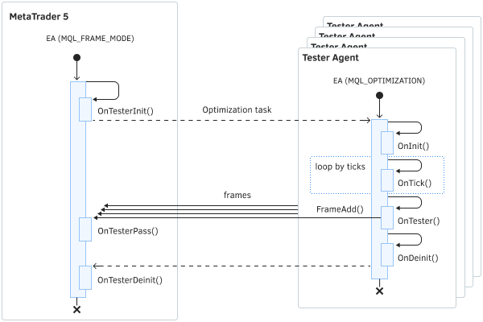

# Group of OnTester events for optimization control

There are three special events in MQL5 to manage the optimization process and transfer arbitrary applied results (in addition to trading indicators) from agents to the terminal: OnTesterInit, OnTesterDeinit, and OnTesterPass. Having described the handlers for them in the code, the programmer will be able to perform the actions they need before starting the optimization, after the optimization is completed, and at the end of each of the individual optimization passes (if application data has been received from the agent, more on that below).

All handlers are optional. As we have seen, optimization works without them. It should also be understood that all three events work only during optimization, but not in a single test.

The Expert Advisor with these handlers is automatically loaded on a separate chart of the terminal with the symbol and period specified in the tester. This Expert instance Advisor does not trade, but only performs service actions. All other event handlers, such as OnInit, OnDeinit, and OnTick do not work in it.

To find out whether an Expert Advisor is executed in the regular trading mode on the agent or in the service mode in the terminal, call the function MQLInfoInteger(MQL_FRAME_MODE) in its code and get true or false. This service mode is also referred to as the "frames" mode which applies to data packets that can be sent to the terminal from Expert Advisor instances on agents. We will see a little later how it is done.

During optimization, only one Expert Advisor instance works in the terminal and, if necessary, receives incoming frames. Don't forget that such an instance is launched only if the Expert Advisor code contains one of the three described event handlers.

The OnTesterInit event is generated when optimization is launched in the strategy tester before the very first pass. The handler has two versions: with return type int and void.

int OnTesterInit(void)

void OnTesterInit(void)

In the int return version, a zero value (INIT_SUCCEEDED) means successful initialization of the Expert Advisor launched on the chart in the terminal, which allows starting optimization. Any other value means an error code, and optimization will not start.

The second version of the function always implies successful preparation of the Expert Advisor for optimization.

A limited time is provided for the execution of OnTesterInit, after which the Expert Advisor will be forced to terminate, and the optimization itself will be canceled. In this case, a corresponding message will be displayed in the tester's log.

In the previous section, we saw an example of how the OnTesterInit handler was used to modify the optimization parameters using the ParameterGetRange/ParameterSetRange functions.

void OnTesterDeinit(void)

The OnTesterDeinit function is called upon completion of the Expert Advisor optimization.

The function is intended for the final processing of applied optimization results. For example, if a file was opened in OnTesterInit to write the contents of frames, then it needs to be closed in OnTesterDeinit.

void OnTesterPass(void)

The OnTesterPass event is automatically generated when a data frame arrives during optimization. The function allows the processing of application data received from Expert Advisor instances running on agents during optimization. A frame from the testing agent must be sent from the [OnTester](/en/book/automation/tester/tester_ontester) handler using the [FrameAdd](/en/book/automation/tester/tester_frameadd) function.

The diagram shows the sequence of events when optimizing Expert Advisors

A standard set of financial statistics about each test pass is sent from the agents to the terminal automatically. The Expert Advisor is not required to send anything using FrameAdd if it doesn't need it. If frames are not used, the OnTesterPass handler will not be called.

By using OnTesterPass, you can dynamically process the optimization results "on the go", for example, display them on a chart in the terminal or add them to a file for subsequent batch processing.

To demonstrate the capabilities of OnTester event handlers, we first need to learn the functions for working with frames. They are presented in the following sections.
