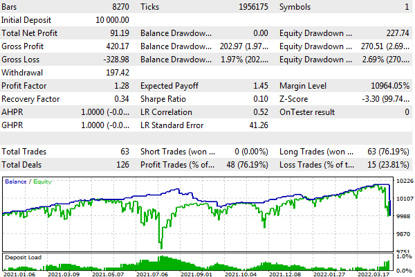

# Emulation of deposits and withdrawals

The MetaTrader 5 tester allows you to emulate deposit and withdrawal operations. This allows you to experiment with some money management systems.

bool TesterDeposit(double money)

The TesterDeposit function replenishes the account in the process of testing for the size of the deposited amount in the money parameter. The amount is indicated in the test deposit currency.

bool TesterWithdrawal(double money)

The TesterWithdrawal function makes withdrawals equal to money.

Both functions return true as a sign of success.

As an example, let's consider an Expert Advisor based on the "carry trade" strategy. For it, we need to select a symbol with large positive swaps in one of the trading directions, for example, buying AUDUSD. The Expert Advisor will open one or more positions in the specified direction. Unprofitable positions will be held for the sake of accumulating swaps on them. Profitable positions will be closed upon reaching a predetermined amount of profit per lot. Earned swaps will be withdrawn from the account. The source code is available in the CrazyCarryTrade.mq5 file.

In the input parameters, the user can select the direction of trade, the size of one trade (0 by default, which means the minimum lot), and the minimum profit per lot, at which a profitable position will be closed.

```
enum ENUM_ORDER_TYPE_MARKET
{
   MARKET_BUY = ORDER_TYPE_BUY,
   MARKET_SELL = ORDER_TYPE_SELL
};
   
input ENUM_ORDER_TYPE_MARKET Type;
input double Volume;
input double MinProfitPerLot = 1000;

```

First, let's test in the handler OnInit the performance of functions TesterWithdrawal and TesterDeposit. In particular, an attempt to withdraw a double balance will result in error 10019.

```
int OnInit()
{
   PRTF(TesterWithdrawal(AccountInfoDouble(ACCOUNT_BALANCE) * 2));
   /*
   not enough money for 20 000.00 withdrawal (free margin: 10 000.00)
   TesterWithdrawal(AccountInfoDouble(ACCOUNT_BALANCE)*2)=false / MQL_ERROR::10019(10019)
   */
   ...

```

But the subsequent withdrawals and crediting back of 100 units of the account currency will be successful.

```
   PRTF(TesterWithdrawal(100));
   /*
   deal #2 balance -100.00 [withdrawal] done
   TesterWithdrawal(100)=true / ok
   */
   PRTF(TesterDeposit(100)); // return the money 
   /*
   deal #3 balance 100.00 [deposit] done
   TesterDeposit(100)=true / ok
   */
   return INIT_SUCCEEDED;
}

```

In the OnTick handler, let's check the availability of positions using PositionFilter and fill the values array with their current profit/loss and accumulated swaps.

```
void OnTick()
{
   const double volume = Volume == 0 ?
      SymbolInfoDouble(_Symbol, SYMBOL_VOLUME_MIN) : Volume;
   ENUM_POSITION_PROPERTY_DOUBLE props[] = {POSITION_PROFIT, POSITION_SWAP};
   double values[][2];
   ulong tickets[];
   PositionFilter pf;
   pf.select(props, tickets, values, true);
   ...

```

When there are no positions, we open one in a predefined direction.

```
   if(ArraySize(tickets) == 0) // no positions 
   {
      MqlTradeRequestSync request1;
      (Type == MARKET_BUY ? request1.buy(volume) : request1.sell(volume));
   }
   else
   {
      ... // there are positions - see the next box
   }

```

When there are positions, we go through them in a cycle and close those for which there is sufficient profit (adjusted for swaps). While doing so, we also sum up the swaps of closed positions and total losses. Since swaps grow in proportion to time, we use them as an amplifying factor for closing "old" positions. Thus, it is possible to close with a loss.

```
      double loss = 0, swaps = 0;
      for(int i = 0; i < ArraySize(tickets); ++i)
      {
         if(values[i][0] + values[i][1] * values[i][1] >= MinProfitPerLot * volume)
         {
            MqlTradeRequestSync request0;
            if(request0.close(tickets[i]) && request0.completed())
            {
               swaps += values[i][1];
            }
         }
         else
         {
            loss += values[i][0];
         }
      }
      ...

```

If the total losses increase, we periodically open additional positions, but we do it less often when there are more positions, in order to somehow control the risks.

```
      if(loss / ArraySize(tickets) <= -MinProfitPerLot * volume * sqrt(ArraySize(tickets)))
      {
         MqlTradeRequestSync request1;
         (Type == MARKET_BUY ? request1.buy(volume) : request1.sell(volume));
      }
      ...

```

Finally, we remove swaps from the account.

```
      if(swaps >= 0)
      {
         TesterWithdrawal(swaps);
      }

```

In the OnDeinit handler, we display statistics on deductions.

```
void OnDeinit(const int)
{
   PrintFormat("Deposit: %.2f Withdrawals: %.2f",
      TesterStatistics(STAT_INITIAL_DEPOSIT),
      TesterStatistics(STAT_WITHDRAWAL));
}

```

For example, when running the Expert Advisor with default settings for the period from 2021 to the beginning of 2022, we get the following result for AUDUSD:

```
   final balance 10091.19 USD
   Deposit: 10000.00 Withdrawals: 197.42

```

Here is what the report and graph look like.



Expert report with withdrawals from the account

Thus, when trading a minimum lot and loading a deposit of no more than 1% for a little over a year, we managed to withdraw about 200 USD.
