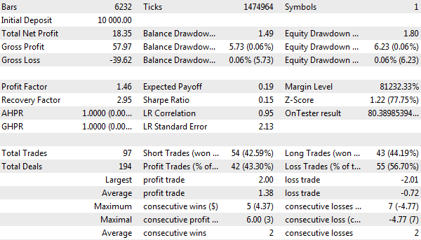
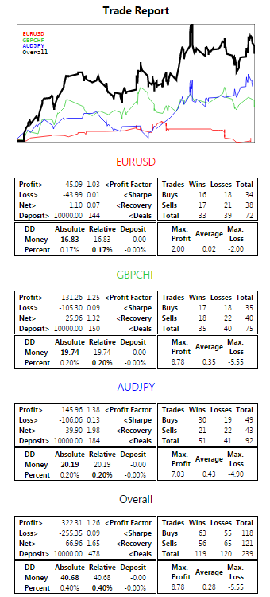
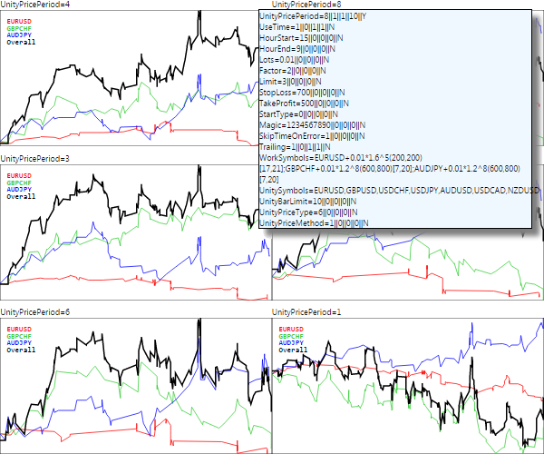

# Big Expert Advisor example

To generalize and consolidate knowledge about the capabilities of the tester, let's consider a large example of an Expert Advisor step by step. In this example, we will summarize the following aspects:

- Using multiple symbols, including the synchronization of bars
- Using an indicator from an Expert Advisor
- Using events
- Independent calculation of the main trading statistics
- Calculation of the R2 custom optimization criterion adjusted for variable lots
- Sending and processing frames with application data (trade reports broken down by symbols)

We will use [MultiMartingale.mq5](/en/book/automation/experts/experts_multisymbol) as the technical base for the Expert Advisor but we will make it less risky by switching to trading multi-currency overbought/oversold signals and increasing lots only as an optional addition. Previously, in [BandOsMA.mq5](/en/book/automation/tester/tester_testerstatistics), we have already seen how to operate based on indicator trading signals. This time we will use [UseUnityPercentPro.mq5](/en/book/applications/indicators_use/indicators_standard_use) as the signal indicator. However, we need to modify it first. Let's call the new version UnityPercentEvent.mq5.

UnityPercentEvent.mq5

Recall the essence of the Unity indicator. It calculates the relative strength of currencies or tickers included in a set of given instruments (it is assumed that all instruments have a common currency through which conversion is possible). On each bar, readings are formed for all currencies: some will be more expensive, some will be cheaper, and the two extreme elements are in a borderline state. Further along, two essentially opposite strategies can be considered for them:

- Further breakdown (confirmation and continuation of a strong movement to the sides)
- Pullback (reversal of movement towards the center due to overbought and oversold)

To trade any of these signals, we must make a working symbol of two currencies (or tickers in general), if there is something suitable for this combination in the Market Watch. For example, if the upper line of the indicator belongs to EUR and the lower line belongs to USD, they correspond to the EURUSD pair, and according to the breakout strategy we should buy it but according to the rebound strategy, we should sell it.

In a more general case, for example, when CFDs or commodities with a common quote currency are indicated in the indicator's basket of working instruments, it is not always possible to create a real instrument. For such cases, it would be necessary to make the Expert Advisor more complicated by introducing trading synthetics (compound positions), but we will not do this here and will limit ourselves to the Forex market, where almost all cross rates are usually available.

Thus, the Expert Advisor must not only read all indicator buffers but also find out the names of currencies, which correspond to the maximum and minimum values. And here we have a small obstacle.

MQL5 does not allow reading the names of third-party indicator buffers and in general, any line properties other than integer ones. There are three functions for setting properties: PlotIndexSetInteger, PlotIndexSetDouble, and PlotIndexSetString, but there is only one function for reading them: PlotIndexGetInteger.

In theory, when MQL programs compiled into a single trading complex are created by the same developer, this is not a big problem. In particular, we could separate a part of the indicator's source code into a header file and include it not only in the indicator but also in the Expert Advisor. Then in the Expert Advisor, it would be possible to repeat the analysis of the indicator's input parameters and restore the list of currencies, completely similar to that created by the indicator. Duplicating calculations is not very pretty, but it would work. However, a more universal solution is also required when the indicator has a different developer, and they do not want to disclose the algorithm or plan to change it in the future (then the compiled versions of the indicator and the Expert Advisor will become incompatible). Such a "docking" of other people's indicators with one's own, or an Expert Advisor ordered from a freelance service is a very common practice. Therefore, the indicator developer should make it as integration-friendly as possible.

One of the possible solutions is for the indicator to send messages with the numbers and names of buffers after initialization.

This is how it's done in the OnInit handler of the UnityPercentEvent.mq5 indicator (the code below is shown in a shorted form since almost nothing has changed).

```
int OnInit()
{
   // find the common currency for all pairs
   const string common = InitSymbols();
   ...
   // set up the displayed lines in the currency cycle
   int replaceIndex = -1;
   for(int i = 0; i <= SymbolCount; i++)
   {
      string name;
      // change the order so that the base (common) currency goes under index 0,
      // the rest depends on the order in which the pairs are entered by the user
      if(i == 0)
      {
         name = common;
         if(name != workCurrencies.getKey(i))
         {
            replaceIndex = i;
         }
      }
      else
      {
         if(common == workCurrencies.getKey(i) && replaceIndex > -1)
         {
            name = workCurrencies.getKey(replaceIndex);
         }
         else
         {
            name = workCurrencies.getKey(i);
         }
      }
    
      // set up rendering of buffers
      PlotIndexSetString(i, PLOT_LABEL, name);
      ...
      // send indexes and buffer names to programs where they are needed
      EventChartCustom(0, (ushort)BarLimit, i, SymbolCount + 1, name);
   }
   ...
}

```

Compared to the original version, only one line has been added here. It contains the EventChartCustom call. The input variable BarLimit is used as the identifier of the indicator copy (of which there may potentially be several). Since the indicator will be called from the Expert Advisor and will not be displayed to the user, it is enough to indicate a small positive number, at least 1, but we will have, for example, 10.

Now the indicator is ready and its signals can be used in third-party Expert Advisors. Let's start developing the Expert Advisor UnityMartingale.mq5. To simplify the presentation, we will divide it into 4 stages, gradually adding new blocks. We will have three preliminary versions and one final version.

UnityMartingaleDraft1.mq5

In the first stage, for the version UnityMartingaleDraft1.mq5, let's use MultiMartingale.mq5 as the basis and modify it.

We will rename the former input variable StartType which determined the direction of the first deal in the series into SignalType. It will be used to choose between the considered strategies BREAKOUT and PULLBACK.

```
enum SIGNAL_TYPE
{
   BREAKOUT,
   PULLBACK
};
...
input SIGNAL_TYPE StartType = 0; // SignalType

```

To set up the indicator, we need a separate group of input variables.

```
input group "U N I T Y   S E T T I N G S"
input string UnitySymbols = "EURUSD,GBPUSD,USDCHF,USDJPY,AUDUSD,USDCAD,NZDUSD";
input int UnityBarLimit = 10;
input ENUM_APPLIED_PRICE UnityPriceType = PRICE_CLOSE;
input ENUM_MA_METHOD UnityPriceMethod = MODE_EMA;
input int UnityPricePeriod = 1;

```

Please note that the UnitySymbols parameter contains a list of cluster instruments for building an indicator, and usually differs from the list of working instruments that we want to trade. Traded instruments are still set in the WorkSymbols parameter.

For example, by default, we pass a set of major Forex currency pairs to the indicator, and therefore we can indicate as trading not only the main pairs but also any crosses. It usually makes sense to limit this set to instruments with the best trading conditions (in particular, small or moderate spreads). In addition, it is desirable to avoid distortions, i.e., to keep an equal amount of each currency in all pairs, thereby statistically neutralizing the potential risks of choosing an unsuccessful direction for one of the currencies.

Next, we wrap the indicator control in the UnityController class. In addition to the indicator handle, the class fields store the following data:

- The number of indicator buffers, which will be received from messages from the indicator after its initialization
- The bar number from which the data is being read (usually the current incomplete is 0, or the last completed is 1)
- The data array with values read from indicator buffers on the specified bar
- The last read time lastRead
- Flag of operation by ticks or bars tickwise

In addition, the class uses the [MultiSymbolMonitor](/en/book/applications/indicators_make/indicators_newbars) object to synchronize the bars of all involved symbols.

```
class UnityController
{
   int handle;
   int buffers;
   const int bar;
   double data[];
   datetime lastRead;
   const bool tickwise;
   MultiSymbolMonitor sync;
   ...

```

In the constructor, which accepts all parameters for the indicator through arguments, we create the indicator and set up the sync object.

```
public:
   UnityController(const string symbolList, const int offset, const int limit,
      const ENUM_APPLIED_PRICE type, const ENUM_MA_METHOD method, const int period):
      bar(offset), tickwise(!offset)
   {
      handle = iCustom(_Symbol, _Period, "MQL5Book/p6/UnityPercentEvent",
         symbolList, limit, type, method, period);
      lastRead = 0;
      
      string symbols[];
      const int n = StringSplit(symbolList, ',', symbols);
      for(int i = 0; i < n; ++i)
      {
         sync.attach(symbols[i]);
      }
   }
   
   ~UnityController()
   {
      IndicatorRelease(handle);
   }
   ...

```

The number of buffers is set by the attached method. We will call it upon receiving a message from the indicator.

```
   void attached(const int b)
   {
      buffers = b;
      ArrayResize(data, buffers);
   }

```

A special method isReady returns true when the last bars of all symbols have the same time. Only in the state of such synchronization will we get the correct values of the indicator. It should be noted that the same schedule of trading sessions for all instruments is assumed here. If this is not the case, the timing analysis needs to be changed.

```
   bool isReady()
   {
      return sync.check(true) == 0;
   }

```

We define the current time in different ways depending on the indicator operation mode: when recalculating on each tick (tickwise equals true), we use the server time, and when recalculated once per bar, we use the opening time of the last bar.

```
   datetime lastTime() const
   {
      return tickwise ? TimeTradeServer() : iTime(_Symbol, _Period, 0);
   }

```

The presence of this method will allow us to exclude reading the indicator if the current time has not changed and, accordingly, the last read data stored in the data buffer is still relevant. And this is how the reading of indicator buffers is organized in the read method. We only need one value of each buffer for the bar with the bar index.

```
   bool read()
   {
      if(!buffers) return false;
      for(int i = 0; i < buffers; ++i)
      {
         double temp[1];
         if(CopyBuffer(handle, i, bar, 1, temp) == 1)
         {
            data[i] = temp[0];
         }
         else
         {
            return false;
         }
      }
      lastRead = lastTime();
      return true;
   }

```

In the end, we just save the reading time into the lastRead variable. If it is empty or not equal to the new current time, accessing the controller data in the following methods will cause the indicator buffers to be read using read.

The main external methods of the controller are getOuterIndices to get the indexes of the maximum and minimum values and the operator '[]' to read the values.

```
   bool isNewTime() const
   {
      return lastRead != lastTime();
   }
   
   bool getOuterIndices(int &min, int &max)
   {
      if(isNewTime())
      {
         if(!read()) return false;
      }
      max = ArrayMaximum(data);
      min = ArrayMinimum(data);
      return true;
   }
   
   double operator[](const int buffer)
   {
      if(isNewTime())
      {
         if(!read())
         {
            return EMPTY_VALUE;
         }
      }
      return data[buffer];
   }
};

```

Previously, the Expert Advisor [BandOsMA.mq5](/en/book/automation/tester/tester_testerstatistics) introduced the concept of the TradingSignal interface.

```
interface TradingSignal
{
   virtual int signal(void);
};

```

Based on it, we will describe the implementation of the signal using the UnityPercentEvent indicator. The controller object UnityController is passed to the constructor. It also indicates the indexes of currencies (buffers), the signals for which we want to track. We will be able to create an arbitrary set of different signals for the selected working symbols.

```
class UnitySignal: public TradingSignal
{
   UnityController *controller;
   const int currency1;
   const int currency2;
   
public:
   UnitySignal(UnityController *parent, const int c1, const int c2):
      controller(parent), currency1(c1), currency2(c2) { }
   
   virtual int signal(void) override
   {
      if(!controller.isReady()) return 0; // waiting for bars synchronization
      if(!controller.isNewTime()) return 0; // waitng for time to change
      
      int min, max;
      if(!controller.getOuterIndices(min, max)) return 0;
      
      // overbought
      if(currency1 == max && currency2 == min) return +1;
      // oversold
      if(currency2 == max && currency1 == min) return -1;
      return 0;
   }
};

```

The signal method returns 0 in an uncertain situation and +1 or -1 in overbought and oversold states of two specific currencies.

To formalize trading strategies, we used the TradingStrategy interface.

```
interface TradingStrategy
{
   virtual bool trade(void);
};

```

In this case, the UnityMartingale class is created on its basis, which largely coincides with SimpleMartingale from MultiMartingale.mq5. We will only show the differences.

```
class UnityMartingale: public TradingStrategy
{
protected:
   ...
   AutoPtr<TradingSignal> command;
   
public:
   UnityMartingale(const Settings &state, TradingSignal *signal)
   {
      ...
      command = signal;
   }
   virtual bool trade() override
   {
      ...
      int s = command[].signal(); // get controller signal
      if(s != 0)
      {
         if(settings.startType == PULLBACK) s *= -1; // reverse logic for bounce
      }
      ulong ticket = 0;
      if(position[] == NULL) // clean start - there were (and is) no positions
      {
         if(s == +1)
         {
            ticket = openBuy(settings.lots);
         }
         else if(s == -1)
         {
            ticket = openSell(settings.lots);
         }
      }
      else
      {
         if(position[].refresh()) // position exists
         {
            if((position[].get(POSITION_TYPE) == POSITION_TYPE_BUY && s == -1)
            || (position[].get(POSITION_TYPE) == POSITION_TYPE_SELL && s == +1))
            {
               // signal in the other direction - we need to close
               PrintFormat("Opposite signal: %d for position %d %lld",
                  s, position[].get(POSITION_TYPE), position[].get(POSITION_TICKET));
               if(close(position[].get(POSITION_TICKET)))
               {
                  // position = NULL; - save the position in the cache
               }
               else
               {
                  position[].refresh(); // control possible closing errors
               }
            }
            else
            {
               // the signal is the same or absent - "trailing"
               position[].update();
               if(trailing[]) trailing[].trail();
            }
         }
         else // no position - open a new one
         {
            if(s == 0) // no signals
            {
               // here is the full logic of the old Expert Advisor:
               // - reversal for martingale loss
               // - continuation by the initial lot in a profitable direction
               ...
            }
            else // there is a signal
            {
               double lots;
               if(position[].get(POSITION_PROFIT) >= 0.0)
               {
                  lots = settings.lots; // initial lot after profit
               }
               else // increase the lot after the loss
               {
                  lots = MathFloor((position[].get(POSITION_VOLUME) * settings.factor) / lotsStep) * lotsStep;
      
                  if(lotsLimit < lots)
                  {
                     lots = settings.lots;
                  }               
               }
               
               ticket = (s == +1) ? openBuy(lots) : openSell(lots);
            }
         }
      }
   }
   ...
}

```

The trading part is ready. It remains to consider the initialization. An autopointer to the UnityController object and the array with currency names are described at the global level. The pool of trading systems is completely similar to the previous developments.

```
AutoPtr<TradingStrategyPool> pool;
AutoPtr<UnityController> controller;
   
int currenciesCount;
string currencies[];

```

In the OnInit handler, we create the UnityController object and wait for the indicator to send the distribution of currencies by buffer indexes.

```
int OnInit()
{
   currenciesCount = 0;
   ArrayResize(currencies, 0);
   
   if(!StartUp(true)) return INIT_PARAMETERS_INCORRECT;
   
   const bool barwise = UnityPriceType == PRICE_CLOSE && UnityPricePeriod == 1;
   controller = new UnityController(UnitySymbols, barwise,
      UnityBarLimit, UnityPriceType, UnityPriceMethod, UnityPricePeriod);
   // waiting for messages from the indicator on currencies in buffers
   return INIT_SUCCEEDED;
}

```

If the price type PRICE_CLOSE and a single period are selected in the indicator input parameters, the calculation in the controller will be performed once per bar. In all other cases, the signals will be updated by ticks, but not more often than once per second (recall the implementation of the lastTime method in the controller).

The helper method StartUp generally does the same thing as the old OnInit handler in the Expert Advisor MultiMartingale. It fills the Settings structure with settings, checking them for correctness and creating a pool of trading systems TradingStrategyPool, consisting of objects of the UnityMartingale class for different trading symbols WorkSymbols. However, now this process is divided into two stages due to the fact that we need to wait for information about the distribution of currencies among buffers. Therefore, the StartUp function has an input parameter denoting a call from OnInit and later from OnChartEvent.

When analyzing the source code of StartUp, it is important to remember that the initialization is different for the cases when we trade only one instrument that matches the current chart and when a basket of instruments is specified. The first mode is active when WorkSymbols is an empty line. It is convenient for optimizing an Expert Advisor for a specific instrument. Having found the settings for several instruments, we can combine them in WorkSymbols.

```
bool StartUp(const bool init = false)
{
   if(WorkSymbols == "")
   {
      Settings settings =
      {
         UseTime, HourStart, HourEnd,
         Lots, Factor, Limit,
         StopLoss, TakeProfit,
         StartType, Magic, SkipTimeOnError, Trailing, _Symbol
      };
      
      if(settings.validate())
      {
         if(init)
         {
            Print("Input settings:");
            settings.print();
         }
      }
      else
      {
         if(init) Print("Wrong settings, please fix");
         return false;
      }
      if(!init)
      {
         ...// creating a trading system based on the indicator
      }
   }
   else
   {
      Print("Parsed settings:");
      Settings settings[];
      if(!Settings::parseAll(WorkSymbols, settings))
      {
         if(init) Print("Settings are incorrect, can't start up");
         return false;
      }
      if(!init)
      {
         ...// creating a trading system based on the indicator
      }
   }
   return true;
}

```

The StartUp function in OnInit is called with the true parameter, which means only checking the correctness of the settings. The creation of a trading system object is delayed until a message is received from the indicator in OnChartEvent.

```
void OnChartEvent(const int id,
   const long &lparam, const double &dparam, const string &sparam)
{
   if(id == CHARTEVENT_CUSTOM + UnityBarLimit)
   {
      PrintFormat("%lld %f '%s'", lparam, dparam, sparam);
      if(lparam == 0) ArrayResize(currencies, 0);
      currenciesCount = (int)MathRound(dparam);
      PUSH(currencies, sparam);
      if(ArraySize(currencies) == currenciesCount)
      {
         if(pool[] == NULL)
         {
            start up(); // indicator readiness confirmation
         }
         else
         {
            Alert("Repeated initialization!");
         }
      }
   }
}

```

Here we remember the number of currencies in the global variable currenciesCount and store them in the currencies array, after which we call StartUp with the false parameter (default value, therefore omitted). Messages arrive from the queue in the order in which they exist in the indicator's buffers. Thus, we get a match between the index and the name of the currency.

When StartUp is called again, an additional code is executed:

```
bool StartUp(const bool init = false)
{
   if(WorkSymbols == "") // one current symbol
   {
      ...
      if(!init) // final initialization after OnInit
      {
         controller[].attached(currenciesCount);
         // split _Symbol into 2 currencies from the currencies array [] 
         int first, second;
         if(!SplitSymbolToCurrencyIndices(_Symbol, first, second))
         {
            PrintFormat("Can't find currencies (%s %s) for %s",
               (first == -1 ? "base" : ""), (second == -1 ? "profit" : ""), _Symbol);
            return false;
         }
         // create a pool from a single strategy
         pool = new TradingStrategyPool(new UnityMartingale(settings,
            new UnitySignal(controller[], first, second)));
      }
   }
   else // symbol basket
   {
      ...
      if(!init) // final initialization after OnInit
      {
         controller[].attached(currenciesCount);
      
         const int n = ArraySize(settings);
         pool = new TradingStrategyPool(n);
         for(int i = 0; i < n; i++)
         {
            ...
            // split settings[i].symbol into 2 currencies from currencies[]
            int first, second;
            if(!SplitSymbolToCurrencyIndices(settings[i].symbol, first, second))
            {
               PrintFormat("Can't find currencies (%s %s) for %s",
                  (first == -1 ? "base" : ""), (second == -1 ? "profit" : ""),
                  settings[i].symbol);
            }
            else
            {
               // add a strategy to the pool on the next trading symbol
               pool[].push(new UnityMartingale(settings[i],
                  new UnitySignal(controller[], first, second)));
            }
         }
      }
   }

```

The helper function SplitSymbolToCurrencyIndices selects the base currency and profit currency of the passed symbol and finds their indexes in the currencies array. Thus, we get the reference data for generating signals in UnitySignal objects. Each of them will have its own pair of currency indexes.

```
bool SplitSymbolToCurrencyIndices(const string symbol, int &first, int &second)
{
   const string s1 = SymbolInfoString(symbol, SYMBOL_CURRENCY_BASE);
   const string s2 = SymbolInfoString(symbol, SYMBOL_CURRENCY_PROFIT);
   first = second = -1;
   for(int i = 0; i < ArraySize(currencies); ++i)
   {
      if(currencies[i] == s1) first = i;
      else if(currencies[i] == s2) second = i;
   }
   
   return first != -1 && second != -1;
}

```

In general, the Expert Advisor is ready.

You can see that in the last examples of Expert Advisors we have classes of strategies and classes of trading signals. We deliberately made them descendants of generic interfaces TradingStrategy and TradingSignal in order to subsequently be able to collect collections of compatible but different implementations that can be combined in the development of future Expert Advisors. Such unified concrete classes should usually be separated into separate header files. In our examples, we did not do this for the sake of simplifying the step-by-step modification.   

   

However, the described approach is standard for OOP. In particular, as we mentioned in the section on [creating Expert Advisor drafts](/en/book/automation/experts/experts_wizard), along with MetaTrader 5 comes a framework of header files with standard classes of trading operations, signal indicators, and money management, which are used in the MQL Wizard. Other similar solutions are published on the mql5.com site in the articles and the Code Base section.   

   

You can use the ready-made class hierarchies as the basis for your projects, provided they are suitable in terms of capabilities and ease of use.

To complete the picture, we wanted to introduce our own R2-based optimization criterion in the Expert Advisor. To avoid the contradiction between the linear regression in the R2 calculation formula and the variable lots that are included in our strategy, we will calculate the coefficient not for the usual balance line but for its cumulative increments normalized by lot sizes in each trade.

To do this, in the OnTester handler, we select deals with the types DEAL_TYPE_BUY and DEAL_TYPE_SELL and with the direction OUT. We will request all deal properties that form the financial result (profit/loss), i.e., DEAL_PROFIT, DEAL_SWAP, DEAL_COMMISSION, DEAL_FEE, as well as their DEAL_VOLUME volume.

```
#define STAT_PROPS 5 // number of requested deal properties
   
double OnTester()
{
   HistorySelect(0, LONG_MAX);
   
   const ENUM_DEAL_PROPERTY_DOUBLE props[STAT_PROPS] =
   {
      DEAL_PROFIT, DEAL_SWAP, DEAL_COMMISSION, DEAL_FEE, DEAL_VOLUME
   };
   double expenses[][STAT_PROPS];
   ulong tickets[]; // needed because of 'select' method prototype, but useful for debugging
   
   DealFilter filter;
   filter.let(DEAL_TYPE, (1 << DEAL_TYPE_BUY) | (1 << DEAL_TYPE_SELL), IS::OR_BITWISE)
      .let(DEAL_ENTRY, (1 << DEAL_ENTRY_OUT) | (1 << DEAL_ENTRY_INOUT) | (1 << DEAL_ENTRY_OUT_BY),
      IS::OR_BITWISE)
      .select(props, tickets, expenses);
   ...

```

Next, in the balance array, we accumulate profits/losses normalized by trading volumes and calculate the criterion R2 for it.

```
   const int n = ArraySize(tickets);
   double balance[];
   ArrayResize(balance, n + 1);
   balance[0] = TesterStatistics(STAT_INITIAL_DEPOSIT);
   
   for(int i = 0; i < n; ++i)
   {
      double result = 0;
      for(int j = 0; j < STAT_PROPS - 1; ++j)
      {
         result += expenses[i][j];
      }
      result /= expenses[i][STAT_PROPS - 1]; // normalize by volume
      balance[i + 1] = result + balance[i];
   }
   const double r2 = RSquaredTest(balance);
   return r2 * 100;
}

```

The first version of the Expert Advisor is basically ready. We have not included the check for the tick model using [TickModel.mqh](/en/book/automation/tester/tester_ticks). It is assumed that the Expert Advisor will be tested when generating ticks in the OHLC M1 mode or better. When the "open prices only" model is detected, the Expert Advisor will send a special frame with an error status to the terminal and unload itself from the tester. Unfortunately, this will only stop this pass, but the optimization will continue. Therefore, the copy of the Expert Advisor that runs in the terminal issues an "alert" for the user to interrupt the optimization manually.

```
void OnTesterPass()
{
   ulong   pass;
   string  name;
   long    id;
   double  value;
   uchar   data[];
   while(FrameNext(pass, name, id, value, data))
   {
      if(name == "status" && id == 1)
      {
         Alert("Please stop optimization!");
         Alert("Tick model is incorrect: OHLC M1 or better is required");
         // it would be logical if the next call would stop all optimization,
         // but it is not
         ExpertRemove();
      }
   }
}

```

You can optimize SYMBOL SETTINGS parameters for any symbol and repeat the optimization for different symbols. At the same time, the COMMON SETTINGS and UNITY SETTINGS groups should always contain the same settings, because they apply to all symbols and instances of trading systems. For example, Trailing must be either enabled or disabled for all optimizations. Also note that the input variables for a single symbol (i.e. the SYMBOL SETTINGS group) have an effect only while WorkSymbols contains an empty string. Therefore, at the optimization stage, you should keep it empty.

For example, to diversify risks, you can consistently optimize an Expert Advisor on completely independent pairs: EURUSD, AUDJPY, GBPCHF, NZDCAD, or in other combinations. Three set files with examples of private settings are connected to the source code.

```
#property tester_set "UnityMartingale-eurusd.set"
#property tester_set "UnityMartingale-gbpchf.set"
#property tester_set "UnityMartingale-audjpy.set"

```

In order to trade on three symbols at once, these settings should be "packed" into a common parameter WorkSymbols:

```
EURUSD+0.01*1.6^5(200,200)[17,21];GBPCHF+0.01*1.2^8(600,800)[7,20];AUDJPY+0.01*1.2^8(600,800)[7,20]

```

This setting is also included in a separate file.

```
#property tester_set "UnityMartingale-combo.set"

```

One of the problems with the current version of the Expert Advisor is that the tester report will provide general statistics for all symbols (more precisely, for all trading strategies, since we can include different classes in the pool), while it would be interesting for us to monitor and evaluate each component of the system separately.

To do this, you need to learn how to independently calculate the main financial indicators of trading, by analogy with how the tester does it for us. We will deal with this at the second stage of the Expert Advisor development.

UnityMartingaleDraft2.mq5

Statistics calculation might be needed quite frequently, so we will implement it in a separate header file TradeReport.mqh, where we organize the source code into the appropriate classes.

Let's call the main class TradeReport. Many trading variables depend on balance and free margin (equity) curves. Therefore, the class contains variables for tracking the current balance and profit, as well as a constantly updated array with the balance history. We will not store the history of equity, because it can change on every tick, and it is better to calculate it right on the go. We will see a little later the reason for having the balance curve.

```
class TradeReport
{
   double balance;     // current balance
   double floating;    // current floating profit
   double data[];      // full balance curve - prices
   datetime moments[]; // and date/time
   ...

```

Changing and reading class fields is done using methods, including the constructor, in which the balance is initialized by the ACCOUNT_BALANCE property.

```
   TradeReport()
   {
      balance = AccountInfoDouble(ACCOUNT_BALANCE);
   }
   
   void resetFloatingPL()
   {
      floating = 0;
   }
   
   void addFloatingPL(const double pl)
   {
      floating += pl;
   }
   
   void addBalance(const double pl)
   {
      balance += pl;
   }
   
   double getCurrent() const
   {
      return balance + floating;
   }
   ...

```

These methods will be needed to iteratively calculate equity drawdown (on the fly). The data balance array will be required for a one-time calculation of the balance drawdown (we will do this at the end of the test).

Based on the fluctuations of the curve (it does not matter, balance or equity), absolute and relative drawdown should be calculated using the same algorithm. Therefore, this algorithm and the internal variables necessary for it, which store intermediate states, are implemented in the nested structure DrawDown. The below code shows its main methods and properties.

```
   struct DrawDown
   {
      double
      series_start,
      series_min,
      series_dd,
      series_dd_percent,
      series_dd_relative_percent,
      series_dd_relative;
      ...
      void reset();
      void calcDrawdown(const double &data[]);
      void calcDrawdown(const double amount);
      void print() const;
   };

```

The first calcDrawdown method calculates drawdowns when we know the entire array and this will be used for balance. The second calcDrawdown method calculates the drawdown iteratively: each time it is called, it is told the next value of the series, and this will be used for equity.

In addition to the drawdown, as we know, there are a large number of standard statistics for reports, but we will support only a few of them to begin with. To do this, we describe the corresponding fields in another nested structure, GenericStats. It is inherited from DrawDown because we still need the drawdown in the report.

```
   struct GenericStats: public DrawDown
   {
      long deals;
      long trades;
      long buy_trades;
      long wins;
      long buy_wins;
      long sell_wins;
      
      double profits;
      double losses;
      double net;
      double pf;
      double average_trade;
      double recovery;
      double max_profit;
      double max_loss;
      double sharpe;
      ...

```

By the names of the variables, it is easy to guess what standard metrics they correspond to. Some metrics are redundant and therefore omitted. For example, given the total number of trades (trades) and the number of buy ones among them (buy_trades), we can easily find the number of sell trades (trades - sell_trades). The same goes for complementary win/loss statistics. Winning and losing streaks are not counted. Those who wish can supplement our report with these indicators.

For unification with the general statistics of the tester, there is the fillByTester method which fills all fields through the TesterStatistics function. We will use it later.

```
      void fillByTester()
      {
         deals = (long)TesterStatistics(STAT_DEALS);
         trades = (long)TesterStatistics(STAT_TRADES);
         buy_trades = (long)TesterStatistics(STAT_LONG_TRADES);
         wins = (long)TesterStatistics(STAT_PROFIT_TRADES);
         buy_wins = (long)TesterStatistics(STAT_PROFIT_LONGTRADES);
         sell_wins = (long)TesterStatistics(STAT_PROFIT_SHORTTRADES);
         
         profits = TesterStatistics(STAT_GROSS_PROFIT);
         losses = TesterStatistics(STAT_GROSS_LOSS);
         net = TesterStatistics(STAT_PROFIT);
         pf = TesterStatistics(STAT_PROFIT_FACTOR);
         average_trade = TesterStatistics(STAT_EXPECTED_PAYOFF);
         recovery = TesterStatistics(STAT_RECOVERY_FACTOR);
         sharpe = TesterStatistics(STAT_SHARPE_RATIO);
         max_profit = TesterStatistics(STAT_MAX_PROFITTRADE);
         max_loss = TesterStatistics(STAT_MAX_LOSSTRADE);
         
         series_start = TesterStatistics(STAT_INITIAL_DEPOSIT);
         series_min = TesterStatistics(STAT_EQUITYMIN);
         series_dd = TesterStatistics(STAT_EQUITY_DD);
         series_dd_percent = TesterStatistics(STAT_EQUITYDD_PERCENT);
         series_dd_relative_percent = TesterStatistics(STAT_EQUITY_DDREL_PERCENT);
         series_dd_relative = TesterStatistics(STAT_EQUITY_DD_RELATIVE);
      }
   };

```

Of course, we need to implement our own calculation for those separate balances and equity of trading systems that the tester cannot calculate. Prototypes of calcDrawdown methods have been presented above. During operation, they fill in the last group of fields with the "series_dd" prefix. Also, the TradeReport class contains a method for calculating the Sharpe ratio. As input, it takes a series of numbers and a risk-free funding rate. The complete source code can be found in the attached file.

```
   static double calcSharpe(const double &data[], const double riskFreeRate = 0);

```

As you might guess, when calling this method, the relevant member array of the TradeReport class with balances will be passed in the data parameter. The process of filling this array and calling the above methods for specific indicators occurs in the calcStatistics method (see below). An object filter of deals is passed to it as input (filter), initial deposit (start), and time (origin). It is assumed that the calling code will set up the filter in such a way that only trades of the trading system we are interested in fall under it.

The method returns a filled structure GenericStats, and in addition, it fills two arrays inside the TradeReport object, data, and moments, with balance values and time references of changes, respectively. We will need it in the final version of the Expert Advisor.

```
   GenericStats calcStatistics(DealFilter &filter,
      const double start = 0, const datetime origin = 0,
      const double riskFreeRate = 0)
   {
      GenericStats stats;
      ArrayResize(data, 0);
      ArrayResize(moments, 0);
      ulong tickets[];
      if(!filter.select(tickets)) return stats;
      
      balance = start;
      PUSH(data, balance);
      PUSH(moments, origin);
      
      for(int i = 0; i < ArraySize(tickets); ++i)
      {
         DealMonitor m(tickets[i]);
         if(m.get(DEAL_TYPE) == DEAL_TYPE_BALANCE) //deposit/withdrawal
         {
            balance += m.get(DEAL_PROFIT);
            PUSH(data, balance);
            PUSH(moments, (datetime)m.get(DEAL_TIME));
         }
         else if(m.get(DEAL_TYPE) == DEAL_TYPE_BUY 
            || m.get(DEAL_TYPE) == DEAL_TYPE_SELL)
         {
            const double profit = m.get(DEAL_PROFIT) + m.get(DEAL_SWAP)
               + m.get(DEAL_COMMISSION) + m.get(DEAL_FEE);
            balance += profit;
            
            stats.deals++;
            if(m.get(DEAL_ENTRY) == DEAL_ENTRY_OUT 
               || m.get(DEAL_ENTRY) == DEAL_ENTRY_INOUT
               || m.get(DEAL_ENTRY) == DEAL_ENTRY_OUT_BY)
            {
               PUSH(data, balance);
               PUSH(moments, (datetime)m.get(DEAL_TIME));
               stats.trades++;        // trades are counted by exit deals
               if(m.get(DEAL_TYPE) == DEAL_TYPE_SELL)
               {
                  stats.buy_trades++; // closing with a deal in the opposite direction
               }
               if(profit >= 0)
               {
                  stats.wins++;
                  if(m.get(DEAL_TYPE) == DEAL_TYPE_BUY)
                  {
                     stats.sell_wins++; // closing with a deal in the opposite direction
                  }
                  else
                  {
                     stats.buy_wins++;
                  }
               }
            }
            else if(!TU::Equal(profit, 0))
            {
               PUSH(data, balance); // entry fee (if any)
               PUSH(moments, (datetime)m.get(DEAL_TIME));
            }
            
            if(profit >= 0)
            {
               stats.profits += profit;
               stats.max_profit = fmax(profit, stats.max_profit);
            }
            else
            {
               stats.losses += profit;
               stats.max_loss = fmin(profit, stats.max_loss);
            }
         }
      }
      
      if(stats.trades > 0)
      {
         stats.net = stats.profits + stats.losses;
         stats.pf = -stats.losses > DBL_EPSILON ?
            stats.profits / -stats.losses : MathExp(10000.0); // NaN(+inf)
         stats.average_trade = stats.net / stats.trades;
         stats.sharpe = calcSharpe(data, riskFreeRate);
         stats.calcDrawdown(data);     // fill in all fields of the DrawDown substructure
         stats.recovery = stats.series_dd > DBL_EPSILON ?
            stats.net / stats.series_dd : MathExp(10000.0);
      }
      return stats;
   }
};

```

Here you can see how we call calcSharpe and calcDrawdown to get the corresponding indicators on the array data. The remaining indicators are calculated directly in the loop inside calcStatistics.

The TradeReport class is ready, and we can expand the functionality of the Expert Advisor to the version UnityMartingaleDraft2.mq5.

Let's add new members to the UnityMartingale class.

```
class UnityMartingale: public TradingStrategy
{
protected:
   ...
   TradeReport report;
   TradeReport::DrawDown equity;
   const double deposit;
   const datetime epoch;
   ...

```

We need the report object in order to call calcStatistics, where the balance drawdown will be included. The equity object is required for an independent calculation of equity drawdown. The initial balance and date, as well as the beginning of the equity drawdown calculation, are set in the constructor.

```
public:
   UnityMartingale(const Settings &state, TradingSignal *signal):
      symbol(state.symbol), deposit(AccountInfoDouble(ACCOUNT_BALANCE)),
      epoch(TimeCurrent())
   {
      ...
      equity.calcDrawdown(deposit);
      ...
   }

```

Continuation of the calculation of drawdown by equity is done on the go, with each call to the trade method.

```
   virtual bool trade() override
   {
      ...
      if(MQLInfoInteger(MQL_TESTER))
      {
         if(position[])
         {
            report.resetFloatingPL();
            // after reset, sum all floating profits
            // why we call addFloatingPL for each existing position,
            // but this strategy has a maximum of 1 position at a time
            report.addFloatingPL(position[].get(POSITION_PROFIT)
               + position[].get(POSITION_SWAP));
            // after taking into account all the amounts - update the drawdown
            equity.calcDrawdown(report.getCurrent());
         }
      }
      ...
   }

```

This is not all that is needed for a correct calculation. We should take into account the floating profit or loss on top of the balance. The above code part only shows the addFloatingPL call, but the TradeReport class has also a method for modifying the balance: addBalance. However, the balance changes only when the position is closed.

Thanks to the OOP concept, closing a position in our situation corresponds to deleting the position object of the PositionState class. So why can't we intercept it?

The PositionState class does not provide any means for this, but we can declare a derived class PositionStateWithEquity with a special constructor and destructor.

When creating an object, not only the position identifier is passed to the constructor, but also a pointer to the report object to which information will need to be sent.

```
class PositionStateWithEquity: public PositionState
{
   TradeReport *report;
   
public:
   PositionStateWithEquity(const long t, TradeReport *r):
      PositionState(t), report(r) { }
   ...

```

In the destructor, we find all deals by the closed position ID, calculate the total financial result (together with commissions and other deductions), and then call addBalance for related the report object.

```
   ~PositionStateWithEquity()
   {
      if(HistorySelectByPosition(get(POSITION_IDENTIFIER)))
      {
         double result = 0;
         DealFilter filter;
         int props[] = {DEAL_PROFIT, DEAL_SWAP, DEAL_COMMISSION, DEAL_FEE};
         Tuple4<double, double, double, double> overheads[];
         if(filter.select(props, overheads))
         {
            for(int i = 0; i < ArraySize(overheads); ++i)
            {
               result += NormalizeDouble(overheads[i]._1, 2)
                  + NormalizeDouble(overheads[i]._2, 2)
                  + NormalizeDouble(overheads[i]._3, 2)
                  + NormalizeDouble(overheads[i]._4, 2);
            }
         }
         if(CheckPointer(report) != POINTER_INVALID) report.addBalance(result);
      }
   }
};

```

It remains to clarify one point — how to create PositionStateWithEquity class objects for positions instead of PositionState. To do this, it is enough to change the new operator in a couple of places where it is called in the TradingStrategy class.

```
   position = MQLInfoInteger(MQL_TESTER) ?
      new PositionStateWithEquity(tickets[0], &report) : new PositionState(tickets[0]); 

```

Thus, we have implemented the collection of data. Now we need to directly generate a report, that is, to call calcStatistics. Here we need to expand our TradingStrategy interface: we add the statement method to it.

```
interface TradingStrategy
{
   virtual bool trade(void);
   virtual bool statement();
};

```

Then, in this current implementation, intended for our strategy, we will be able to bring the work to its logical conclusion.

```
class UnityMartingale: public TradingStrategy
{
   ...
   virtual bool statement() override
   {
      if(MQLInfoInteger(MQL_TESTER))
      {
         Print("Separate trade report for ", settings.symbol);
         // equity drawdown should already be calculated on the fly
         Print("Equity DD:");
         equity.print();
         
         // balance drawdown is calculated in the resulting report
         Print("Trade Statistics (with Balance DD):");
         // configure the filter for a specific strategy
         DealFilter filter;
         filter.let(DEAL_SYMBOL, settings.symbol)
            .let(DEAL_MAGIC, settings.magic, IS::EQUAL_OR_ZERO);
           // zero "magic" number is needed for the last exit deal
           // - it is done by the tester itself
         HistorySelect(0, LONG_MAX);
         TradeReport::GenericStats stats =
            report.calcStatistics(filter, deposit, epoch);
         stats.print();
      }
      return false;
   }
   ...

```

The new method will simply print out all the calculated indicators in the log. By forwarding the same method through the pool of trading systems TradingStrategyPool, let's request separate reports for all symbols from the handler OnTester.

```
double OnTester()
{
   ...
   if(pool[] != NULL)
   {
      pool[].statement(); // ask all trading systems to display their results
   }
   ...
}

```

Let's check the correctness of our report. To do this, let's run the Expert Advisor in the tester, one symbol at a time, and compare the standard report with our calculations. For example, to set up UnityMartingale-eurusd.set, trading on EURUSD H1 we will get such indicators for 2021.



Tester report for 2021, EURUSD H1

In the log, our version is displayed as two structures: DrawDown with equity drawdown and GenericStats with balance drawdown indicators and other statistics.

```
Separate trade report for EURUSD
Equity DD:
    [maxpeak] [minpeak] [series_start] [series_min] [series_dd] [series_dd_percent] »
[0]  10022.48  10017.03       10000.00      9998.20        6.23                0.06 »
» [series_dd_relative_percent] [series_dd_relative]
»                         0.06                 6.23
 
Trade Statistics (with Balance DD):
    [maxpeak] [minpeak] [series_start] [series_min] [series_dd] [series_dd_percent] »
[0]  10022.40  10017.63       10000.00      9998.51        5.73                0.06 »
» [series_dd_relative_percent] [series_dd_relative] »
»                         0.06                 5.73 »
» [deals] [trades] [buy_trades] [wins] [buy_wins] [sell_wins] [profits] [losses] [net] [pf] »
»     194       97           43     42         19          23     57.97   -39.62 18.35 1.46 »
» [average_trade] [recovery] [max_profit] [max_loss] [sharpe]
»            0.19       3.20         2.00      -2.01     0.15

```

It is easy to verify that these numbers match with the tester's report.

Now let's start trading on the same period for three symbols at once (setting UnityMartingale-combo.set).

In addition to EURUSD entries, structures for GBPCHF and AUDJPY will appear in the journal.

```
Separate trade report for GBPCHF
Equity DD:
    [maxpeak] [minpeak] [series_start] [series_min] [series_dd] [series_dd_percent] »
[0]  10029.50  10000.19       10000.00      9963.65       62.90                0.63 »
» [series_dd_relative_percent] [series_dd_relative]
»                         0.63                62.90
Trade Statistics (with Balance DD):
    [maxpeak] [minpeak] [series_start] [series_min] [series_dd] [series_dd_percent] »
[0]  10023.68   9964.28       10000.00      9964.28       59.40                0.59 »
» [series_dd_relative_percent] [series_dd_relative] »
»                         0.59                59.40 »
» [deals] [trades] [buy_trades] [wins] [buy_wins] [sell_wins] [profits] [losses] [net] [pf] »
»     600      300          154    141         63          78    394.53  -389.33  5.20 1.01 »
» [average_trade] [recovery] [max_profit] [max_loss] [sharpe]
»            0.02       0.09         9.10      -6.73     0.01
 
Separate trade report for AUDJPY
Equity DD:
    [maxpeak] [minpeak] [series_start] [series_min] [series_dd] [series_dd_percent] »
[0]  10047.14  10041.53       10000.00      9961.62       48.20                0.48 »
» [series_dd_relative_percent] [series_dd_relative]
»                         0.48                48.20
Trade Statistics (with Balance DD):
    [maxpeak] [minpeak] [series_start] [series_min] [series_dd] [series_dd_percent] »
[0]  10045.21  10042.75       10000.00      9963.62       44.21                0.44 »
» [series_dd_relative_percent] [series_dd_relative] »
»                         0.44                44.21 »
» [deals] [trades] [buy_trades] [wins] [buy_wins] [sell_wins] [profits] [losses] [net] [pf] »
»     332      166           91     89         54          35    214.79  -170.20 44.59 1.26 »
» [average_trade] [recovery] [max_profit] [max_loss] [sharpe]
»            0.27       1.01         7.58      -5.17     0.09

```

The tester report in this case will contain generalized data, so thanks to our classes, we have received previously inaccessible details.

However, looking at a pseudo-report in a log is not very convenient. Moreover, I would like to see a graphic representation of the balance line at the very least as its appearance often says more about the suitability of the system than dry statistics.

Let's improve the Expert Advisor by giving it the ability to generate visual reports in HTML format: after all, the tester's reports can also be exported to HTML, saved, and compared over time. In addition, in the future, such reports can be transmitted in frames to the terminal right during optimization, and the user will be able to start studying the reports of specific passes even before the completion of the entire process.

This will be the penultimate version of the example UnityMartingaleDraft3.mq5.

UnityMartingaleDraft3.mq5

Visualization of the trading report includes a balance line and a table with statistical indicators. We will not generate a complete report similar to the tester's report but will limit ourselves to the selected most important values. Our purpose is to implement a working mechanism that can then be customized in accordance with personal requirements.

We will arrange the basis of the algorithm in the form of the TradeReportWriter class (TradeReportWriter.mqh). The class will be able to store an arbitrary number of reports from different trading systems: each in a separate object DataHolder, which includes arrays of balance values and timestamps (data and when, respectively), the stats structure with statistics, as well as the title, color, and width of the line to display.

```
class TradeReportWriter
{
protected:
   class DataHolder
   {
   public:
      double data[];                   // balance changes
      datetime when[];                 // balance timestamps
      string name;                     // description
      color clr;                       // color
      int width;                       // line width
      TradeReport::GenericStats stats; // trading indicators
   };
   ...

```

We have an array of autopointers curves allocated for the objects of the DataHolder class. In addition, we will need common limits on amounts and terms to match the lines of all trading systems in the picture. This will be provided by the variables lower, upper, start, and stop.

```
   AutoPtr<DataHolder> curves[];
   double lower, upper;
   datetime start, stop;
   
public:
   TradeReportWriter(): lower(DBL_MAX), upper(-DBL_MAX), start(0), stop(0) { }
   ...

```

The addCurve method adds a balance line.

```
   virtual bool addCurve(double &data[], datetime &when[], const string name,
      const color clr = clrNONE, const int width = 1)
   {
      if(ArraySize(data) == 0 || ArraySize(when) == 0) return false;
      if(ArraySize(data) != ArraySize(when)) return false;
      DataHolder *c = new DataHolder();
      if(!ArraySwap(data, c.data) || !ArraySwap(when, c.when))
      {
         delete c;
         return false;
      }
   
      const double max = c.data[ArrayMaximum(c.data)];
      const double min = c.data[ArrayMinimum(c.data)];
      
      lower = fmin(min, lower);
      upper = fmax(max, upper);
      if(start == 0) start = c.when[0];
      else if(c.when[0] != 0) start = fmin(c.when[0], start);
      stop = fmax(c.when[ArraySize(c.when) - 1], stop);
      
      c.name = name;
      c.clr = clr;
      c.width = width;
      ZeroMemory(c.stats); // no statistics by default
      PUSH(curves, c);
      return true;
   }

```

The second version of the addCurve method adds not only a balance line but also a set of financial variables in the GenericStats structure.

```
   virtual bool addCurve(TradeReport::GenericStats &stats,
      double &data[], datetime &when[], const string name,
      const color clr = clrNONE, const int width = 1)
   {
      if(addCurve(data, when, name, clr, width))
      {
         curves[ArraySize(curves) - 1][].stats = stats;
         return true;
      }
      return false;
   }

```

The most important class method which visualizes the report is made abstract.

```
   virtual void render() = 0;

```

This makes it possible to implement many ways of displaying reports, for example, both, with recording to files of different formats, and with drawing directly on the chart. We will now restrict ourselves to the formation of HTML files since this is the most technologically advanced and widespread method.

The new class HTMLReportWriter has a constructor, the parameters of which specify the name of the file, as well as the size of the picture with balance curves. We will generate the image itself in the well-known SVG vector graphics format: it is ideal in this case since it is a subset of the XML language, which is HTML itself.

```
class HTMLReportWriter: public TradeReportWriter
{
   int handle;
   int width, height;
   
public:
   HTMLReportWriter(const string name, const int w = 600, const int h = 400):
      width(w), height(h)
   {
      handle = FileOpen(name,
         FILE_WRITE | FILE_TXT | FILE_ANSI | FILE_REWRITE);
   }
   
   ~HTMLReportWriter()
   {
      if(handle != 0) FileClose(handle);
   }
   
   void close()
   {
      if(handle != 0) FileClose(handle);
      handle = 0;
   }
   ...

```

Before turning to the main public render method, it is necessary to introduce the reader to one technology, which will be described in detail in the final Part 7 of the book. We are talking about [resources](/en/book/advanced/resources): files and arrays of arbitrary data connected to an MQL program for working with multimedia (sound and images), embedding compiled indicators, or simply as a repository of application information. It is the latter option that we will now use.

The point is that it is better to generate an HTML page not entirely from MQL code, but based on a template (page template), into which the MQL code will only insert the values of some variables. This is a well-known technique in programming that allows you to separate the algorithm and the external representation of the program (or the result of its work). Due to this, we can separately experiment with the HTML template and MQL code, working with each of the components in a familiar environment. Specifically, MetaEditor is still not very suitable for editing web pages and viewing them, just like a standard browser does not know anything about MQL5 (although this can be fixed).

We will store HTML report templates in text files connected to the MQL5 source code as resources. The connection is made using a special directive #resource. For example, there is the following line in the file TradeReportWriter.mqh.

```
#resource "TradeReportPage.htm" as string ReportPageTemplate

```

It means that next to the source code there should be the file TradeReportPage.htm, which will become available in the MQL code as a string ReportPageTemplate. By extension, you can understand that the file is a web page. Here are the contents of this file with abbreviations (we do not have the task of teaching the reader about web development, although, apparently, knowledge in this area can be useful for a trader as well). Indents are added to visually represent the nesting hierarchy of HTML tags; there are no indents in the file.

```
<!DOCTYPE html>
<html>
   <head>
      <title>Trade Report</title>
      <style>
         *{font: 9pt "Segoe UI";}
         .center{width:fit-content;margin:0 auto;}
         ...
      </style>
   </head>
   <body>
      <div class="center">
         <h1>Trade Report</h1>
         ~
      </div>
   </body>
   <script>
   ...
   </script>
</html>

```

The basics of the templates are chosen by the developer. There are a large number of ready-made HTML template systems, but they provide a lot of redundant features and are therefore too complex for our example. We will develop our own concept.

To begin with, let's note that most web pages have an initial part (header), a final part (footer), and useful information is located between them. The above draft report is no exception in this sense. It uses the tilde character '~' to indicate useful content. Instead, the MQL code will have to insert a balance image and a table with indicators. But the presence of '~' is not necessary, since the page can be a single whole, that is, the very useful middle part: after all, the MQL code can, if necessary, insert the result of processing one template into another.

To complete the digression regarding HTML templates, let's pay attention to one more thing. In theory, a web page consists of tags that perform essentially different functions. Standard HTML tags tell the browser what to display. In addition to them, there are cascading styles (CSS), which describe how to display it. Finally, the page can have a dynamic component in the form of JavaScript scripts that interactively control both the first and second.   

   

Usually, these three components are templatized independently, i.e., for example, an HTML template, strictly speaking, should contain only HTML but not CSS or JavaScript. This allows "unbinding" the content, appearance, and behavior of the web page, which facilitates development (it is recommended to follow the same approach in MQL5!).   

   

However, in our example, we have included all the components in the template. In particular, in the above template, we see the tag <style> with styles CSS and tag <script> with some JavaScript functions, which are omitted. This is done to simplify the example, with an emphasis on MQL5 features rather than web development.

Having a web page template in the ReportPageTemplate variable connected as a resource, we can write the render method.

```
   virtual void render() override
   {
      string headerAndFooter[2];
      StringSplit(ReportPageTemplate, '~', headerAndFooter);
      FileWriteString(handle, headerAndFooter[0]);
      renderContent();
      FileWriteString(handle, headerAndFooter[1]);
   }
   ...

```

It actually splits the page into upper and lower halves by the '~' character, displays them as is, and calls a helper method renderContent between them.

We have already described that the report will consist of a general picture with balance curves and tables with indicators of trading systems, so the implementation renderContent is natural.

```
private:
   void renderContent()
   {
      renderSVG();
      renderTables();
   }

```

Image generation inside renderSVG is based on yet another template file TradeReportSVG.htm, which binds to a string variable SVGBoxTemplate:

```
#resource "TradeReportSVG.htm" as string SVGBoxTemplate

```

The content of this template is the last one we list here. Those who wish can look into the source codes of the rest of the templates themselves.

```
<span id="params" style="display:block;width:%WIDTH%px;text-align:center;"></span>
<a id="main" style="display:block;text-align:center;">
   <svg width="%WIDTH%" height="%HEIGHT%" xmlns="http://www.w3.org/2000/svg">
      <style>.legend {font: bold 11px Consolas;}</style>
      <rect x="0" y="0" width="%WIDTH%" height="%HEIGHT%"
         style="fill:none; stroke-width:1; stroke: black;"/>
      ~
   </svg>
</a>

```

In the code of the renderSVG method, we'll see the familiar trick of splitting the content into two blocks "before" and "after" the tilde, but there's something new here.

```
   void renderSVG()
   {
      string headerAndFooter[2];
      if(StringSplit(SVGBoxTemplate, '~', headerAndFooter) != 2) return;
      StringReplace(headerAndFooter[0], "%WIDTH%", (string)width);
      StringReplace(headerAndFooter[0], "%HEIGHT%", (string)height);
      FileWriteString(handle, headerAndFooter[0]);
      
      for(int i = 0; i < ArraySize(curves); ++i)      
      {
         renderCurve(i, curves[i][].data, curves[i][].when,
            curves[i][].name, curves[i][].clr, curves[i][].width);
      }
      
      FileWriteString(handle, headerAndFooter[1]);
   }

```

At the top of the page, in the string headerAndFooter[0], we are looking for substrings of the special form "%WIDTH%" and "%HEIGHT%", and replacing them with the required width and height of the image. It is by this principle that value substitution works in our templates. For example, in this template, these substrings actually occur in the rect tag:

```
<rect x="0" y="0" width="%WIDTH%" height="%HEIGHT%" style="fill:none; stroke-width:1; stroke: black;"/>

```

Thus, if the report is ordered with a size of 600 by 400, the line will be converted to the following:

```
<rect x="0" y="0" width="600" height="400" style="fill:none; stroke-width:1; stroke: black;"/>

```

This will display a 1-pixel thick black border of the specified dimensions in the browser.

The generation of tags for drawing specific balance lines is handled by the renderCurve method, to which we pass all the necessary arrays and other settings (name, color, and thickness). We will leave this method and other highly specialized methods (renderTables, renderTable) for independent study.

Let's return to the main module of the UnityMartingaleDraft3.mq5 Expert Advisor. Set the size of the image of the balance graphs and connect TradeReportWriter.mqh.

```
#define MINIWIDTH  400
#define MINIHEIGHT 200
   
#include <MQL5Book/TradeReportWriter.mqh>

```

In order to "connect" the strategies with the report builder, you will need to modify the statement method in the TradingStrategy interface: pass a pointer to the TradeReportWriter object, which the calling code can create and configure.

```
interface TradingStrategy
{
   virtual bool trade(void);
   virtual bool statement(TradeReportWriter *writer = NULL);
};

```

Now let's add some lines in the specific implementation of this method in our UnityMartingale strategy class.

```
class UnityMartingale: public TradingStrategy
{
   ...
   TradeReport report;
   ...
   virtual bool statement(TradeReportWriter *writer = NULL) override
   {
      if(MQLInfoInteger(MQL_TESTER))
      {
         ...
         // it's already been done
         DealFilter filter;
         filter.let(DEAL_SYMBOL, settings.symbol)
            .let(DEAL_MAGIC, settings.magic, IS::EQUAL_OR_ZERO);
         HistorySelect(0, LONG_MAX);
         TradeReport::GenericStats stats =
            report.calcStatistics(filter, deposit, epoch);
         ...
         // adding this
         if(CheckPointer(writer) != POINTER_INVALID)
         {
            double data[];               // balance values
            datetime time[];             // balance points time to synchronize curves
            report.getCurve(data, time); // fill in the arrays and transfer to write to the file
            return writer.addCurve(stats, data, time, settings.symbol);
         }
         return true;
      }
      return false;
   }

```

It all comes down to getting an array of balance and a structure with indicators from the report object (class TradeReport) and passing to the TradeReportWriter object, calling addCurve.

Of course, the pool of trading strategies ensures the transfer of the same object TradeReportWriter to all strategies to generate a combined report.

```
class TradingStrategyPool: public TradingStrategy
{
   ...
   virtual bool statement(TradeReportWriter *writer = NULL) override
   {
      bool result = false;
      for(int i = 0; i < ArraySize(pool); i++)
      {
         result = pool[i][].statement(writer) || result;
      }
      return result;
   }

```

Finally, the OnTester handler has undergone the largest modification. The following lines would suffice to generate an HTML report of trading strategies.

```
double OnTester()
{
   ...
   const static string tempfile = "temp.html";
   HTMLReportWriter writer(tempfile, MINIWIDTH, MINIHEIGHT);
   if(pool[] != NULL)
   {
      pool[].statement(&writer); // ask strategies to report their results
   }
   writer.render(); // write the received data to a file
   writer.close();
}

```

However, for clarity and user convenience, it would be great to add to the report a general balance curve, as well as a table with general indicators. It makes sense to output them only when several symbols are specified in the Expert Advisor settings because otherwise, the report of one strategy coincides with the general one in the file.

This required a little more code.

```
double OnTester()
{
   ...
   // had it before
   DealFilter filter;
   // set up the filter and fill in the array of deals based on it tickets
   ...
   const int n = ArraySize(tickets);
   
   // add this
   const bool singleSymbol = WorkSymbols == "";
   double curve[];    // total balance curve
   datetime stamps[]; // date and time of total balance points
   
   if(!singleSymbol) // the total balance is displayed only if there are several symbols/strategies
   {
      ArrayResize(curve, n + 1);
      ArrayResize(stamps, n + 1);
      curve[0] = TesterStatistics(STAT_INITIAL_DEPOSIT);
      
      // MQL5 does not allow to know the test start time,
      // this could be found out from the first transaction,
      // but it is outside the filter conditions of a specific system,
      // so let's just agree to skip time 0 in calculations
      stamps[0] = 0;
   }
   
   for(int i = 0; i < n; ++i) // deal cycle
   {
      double result = 0;
      for(int j = 0; j < STAT_PROPS - 1; ++j)
      {
         result += expenses[i][j];
      }
      if(!singleSymbol)
      {
         curve[i + 1] = result + curve[i];
         stamps[i + 1] = (datetime)HistoryDealGetInteger(tickets[i], DEAL_TIME);
      }
      ...
   }
   if(!singleSymbol) // send the tester's statistics and the overall curve to the report 
   {
      TradeReport::GenericStats stats;
      stats.fillByTester();
      writer.addCurve(stats, curve, stamps, "Overall", clrBlack, 3);
   }
   ...
}

```

Let's see what we got. If we run the Expert Advisor with settings UnityMartingale-combo.set, we will have the temp.html file in the MQL5/Files folder of one of the agents. Here's what it looks like in the browser.



HTML report for Expert Advisor with multiple trading strategies/symbols

Now that we know how to generate reports on one test pass, we can send them to the terminal during optimization, select the best ones on the go, and present them to the user before the end of the whole process. All reports will be put in a separate folder inside MQL5/Files of the terminal. The folder will receive a name containing the symbol and timeframe from the tester's settings, as well as the name of the Expert Advisor.

UnityMartingale.mq5

As we know, to send a file to the terminal, it is enough to call the function FrameAdd. We have already generated the file within the framework of the previous version.

```
double OnTester()
{
   ...
   if(MQLInfoInteger(MQL_OPTIMIZATION))
   {
      FrameAdd(tempfile, 0, r2 * 100, tempfile);
   }
}

```

In the receiving Expert Advisor instance, we will perform the necessary preparation. Let's describe the structure Pass with the main parameters of each optimization pass.

```
struct Pass
{
   ulong id;          // pass number
   double value;      // optimization criterion value
   string parameters; // optimized parameters as list 'name=value'
   string preset;     // text to generate set-file (with all parameters)
};

```

In the parameters strings, "name=value" pairs are connected with the '&' symbol. This will be useful for the interaction of web pages of reports in the future (the '&' symbol is the standard for combining parameters in web addresses). We did not describe the format of set files, but the following source code that forms the preset string allows you to study this issue in practice.

As frames arrive, we will write improvements according to the optimization criterion to the TopPasses array. The current best pass will always be the last pass in the array and is also available in the BestPass variable.

```
Pass TopPasses[];     // stack of constantly improving passes (last one is best)
Pass BestPass;        // current best pass
string ReportPath;    // dedicated folder for all html files of this optimization

```

In the handler OnTesterInit let's create a folder name.

```
void OnTesterInit()
{
   BestPass.value = -DBL_MAX;
   ReportPath = _Symbol + "-" + PeriodToString(_Period) + "-"
      + MQLInfoString(MQL_PROGRAM_NAME) + "/";
}

```

In the OnTesterPass handler, we will sequentially select only those frames in which the indicator has improved, find for them the values of optimized and other parameters, and add all this information to the Pass array of structures.

```
void OnTesterPass()
{
   ulong   pass;
   string  name;
   long    id;
   double  value;
   uchar   data[];
   
   // input parameters for the pass corresponding to the current frame
   string  params[];
   uint    count;
   
   while(FrameNext(pass, name, id, value, data))
   {
      // collect passes with improved stats
      if(value > BestPass.value && FrameInputs(pass, params, count))
      {
         BestPass.preset = "";
         BestPass.parameters = "";
         // get optimized and other parameters for generating a set-file
         for(uint i = 0; i < count; i++)
         {
            string name2value[];
            int n = StringSplit(params[i], '=', name2value);
            if(n == 2)
            {
               long pvalue, pstart, pstep, pstop;
               bool enabled = false;
               if(ParameterGetRange(name2value[0], enabled, pvalue, pstart, pstep, pstop))
               {
                  if(enabled)
                  {
                     if(StringLen(BestPass.parameters)) BestPass.parameters += "&";
                     BestPass.parameters += params[i];
                  }
                  
                  BestPass.preset += params[i] + "||" + (string)pstart + "||"
                    + (string)pstep + "||" + (string)pstop + "||"
                    + (enabled ? "Y" : "N") + "<br>\n";
               }
               else
               {
                  BestPass.preset += params[i] + "<br>\n";
               }
            }
         }
      
         BestPass.value = value;
         BestPass.id = pass;
         PUSH(TopPasses, BestPass);
         // write the frame with the report to the HTML file
         const string text = CharArrayToString(data);
         int handle = FileOpen(StringFormat(ReportPath + "%06.3f-%lld.htm", value, pass),
            FILE_WRITE | FILE_TXT | FILE_ANSI);
         FileWriteString(handle, text);
         FileClose(handle);
      }
   }
}

```

The resulting reports with improvements are saved in files with names that include the value of the optimization criterion and the pass number.

Now comes the most interesting. In the OnTesterDeinit handler, we can form a common HTML file (overall.htm), which allows you to see all the reports at once (or, say, the top 100). It uses the same scheme with templates that we covered earlier.

```
#resource "OptReportPage.htm" as string OptReportPageTemplate
#resource "OptReportElement.htm" as string OptReportElementTemplate
   
void OnTesterDeinit()
{
   int handle = FileOpen(ReportPath + "overall.htm",
      FILE_WRITE | FILE_TXT | FILE_ANSI, 0, CP_UTF8);
   string headerAndFooter[2];
   StringSplit(OptReportPageTemplate, '~', headerAndFooter);
   StringReplace(headerAndFooter[0], "%MINIWIDTH%", (string)MINIWIDTH);
   StringReplace(headerAndFooter[0], "%MINIHEIGHT%", (string)MINIHEIGHT);
   FileWriteString(handle, headerAndFooter[0]);
   // read no more than 100 best records from TopPasses
   for(int i = ArraySize(TopPasses) - 1, k = 0; i >= 0 && k < 100; --i, ++k)
   {
      string p = TopPasses[i].parameters;
      StringReplace(p, "&", " ");
      const string filename = StringFormat("%06.3f-%lld.htm",
         TopPasses[i].value, TopPasses[i].id);
      string element = OptReportElementTemplate;
      StringReplace(element, "%FILENAME%", filename);
      StringReplace(element, "%PARAMETERS%", TopPasses[i].parameters);
      StringReplace(element, "%PARAMETERS_SPACED%", p);
      StringReplace(element, "%PASS%", IntegerToString(TopPasses[i].id));
      StringReplace(element, "%PRESET%", TopPasses[i].preset);
      StringReplace(element, "%MINIWIDTH%", (string)MINIWIDTH);
      StringReplace(element, "%MINIHEIGHT%", (string)MINIHEIGHT);
      FileWriteString(handle, element);
   }
   FileWriteString(handle, headerAndFooter[1]);
   FileClose(handle);
}

```

The following image shows what the overview web page looks like after optimizing UnityMartingale.mq5 by UnityPricePeriod parameter in multicurrency mode.



Overview web page with trading reports of the best optimization passes

For each report, we display only the upper part, where the balance chart falls. This part is the most convenient to get an estimate by just looking at it.

Lists of optimized parameters ("name=value&name=value...") are displayed above each graph. Pressing on a line opens a block with the text for the set file of all the settings of this pass. If you click inside a block, its contents will be copied to the clipboard. It can be saved in a text editor and thus get a ready-made set file.

Clicking on the chart will take you to the specific report page, along with the scorecards (given above).

At the end of the section, we touch on one more question. Earlier we promised to demonstrate the effect of the [TesterHideIndicators](/en/book/automation/tester/tester_testerhideindicators) function. The UnityMartingale.mq5 Expert Advisor currently uses the UnityPercentEvent.mq5 indicator. After any test, the indicator is displayed on the opening chart. Let's suppose that we want to hide from the user the mechanism of the Expert Advisor's work and from where it takes signals. Then you can call the function TesterHideIndicators (with the true parameter) in the handler OnInit, before creating the object UnityController, in which the descriptor is received through iCustom.

```
int OnInit()
{
   ...
   TesterHideIndicators(true);
   ...
   controller = new UnityController(UnitySymbols, barwise,
      UnityBarLimit, UnityPriceType, UnityPriceMethod, UnityPricePeriod);
   return INIT_SUCCEEDED;
}

```

This version of the Expert Advisor will no longer display the indicator on the chart. However, it is not very well hidden. If we look into the tester's log, we will see lines about loaded programs among a lot of useful information: first, a message about loading the Expert Advisor itself, and a little later, about loading the indicator.

```
...
expert file added: Experts\MQL5Book\p6\UnityMartingale.ex5.
...
program file added: \Indicators\MQL5Book\p6\UnityPercentEvent.ex5. 
...

```

Thus, a meticulous user can find out the name of the indicator. This possibility can be eliminated by the resource mechanism, which we have already mentioned in passing in the context of web page blanks. It turns out that the compiled indicator can also be embedded into an MQL program (in an Expert Advisor or another indicator) as a resource. And such resource programs are no longer mentioned in the tester's log. We will study the resources in detail in the 7th Part of the book, and now we will show the lines associated with them in the final version of our Expert Advisor.

First of all, let's describe the resource with the #resource indicator directive. In fact, it simply contains the path to the compiled indicator file (obviously, it must already be compiled beforehand), and here it is mandatory to use double backslashes as delimiters as forward single slashes in resource paths are not supported.

```
#resource "\\Indicators\\MQL5Book\\p6\\UnityPercentEvent.ex5"

```

Then, in the lines with the iCustom call, we replace the previous operator:

```
   UnityController(const string symbolList, const int offset, const int limit,
      const ENUM_APPLIED_PRICE type, const ENUM_MA_METHOD method, const int period):
      bar(offset), tickwise(!offset)
   {
      handle = iCustom(_Symbol, _Period,
         "MQL5Book/p6/UnityPercentEvent",                      // <---
         symbolList, limit, type, method, period);
      ...

```

By exactly the same, but with a link to the resource (note the syntax with a leading pair of colons '::' which is necessary to distinguish between ordinary paths in the file system and paths within resources).

```
   UnityController(const string symbolList, const int offset, const int limit,
      const ENUM_APPLIED_PRICE type, const ENUM_MA_METHOD method, const int period):
      bar(offset), tickwise(!offset)
   {
      handle = iCustom(_Symbol, _Period,
         "::Indicators\\MQL5Book\\p6\\UnityPercentEvent.ex5",  // <---
         symbolList, limit, type, method, period);
      ...

```

Now the compiled version of the Expert Advisor can be delivered to users on its own, without a separate indicator, since it is hidden inside the Expert Advisor. This does not affect its performance in any way, but taking into account the TesterHideIndicators challenge, the internal device is hidden. It should be remembered that if the indicator is then updated, the Expert Advisor will also need to be recompiled.
