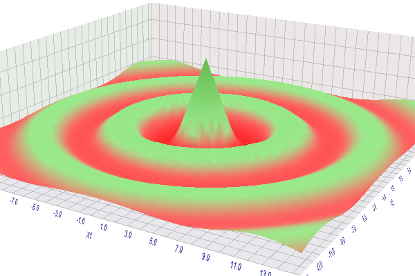

# Mathematical calculations

The tester in the MetaTrader 5 terminal can be used not only to test trading strategies but also for mathematical calculations. To do this, select the appropriate mode in the tester settings, in the Simulation drop-down list. This is the same list where we select the tick generation method, but in this case, the tester will not generate ticks or quotes, or even connect the trading environment (trading account and symbols).

The choice between the full enumeration of parameters and a genetic algorithm depends on the size of the search space. For the optimization criterion, select "Custom max". Other input fields in the tester settings (such as date range or delays) are not important and are therefore automatically disabled.

In the "Mathematical calculations" mode, each test agent run is performed with a call of only three functions: OnInit, OnTester, OnDeinit.

A typical mathematical problem for solving in the MetaTrader 5 tester is finding an extremum for a function of many variables. To solve it, it is necessary to declare the function parameters in the form of input variables and place the block for calculating its values in OnTester.

The value of the function for a specific set of input variables is returned as an output value of OnTester. Do not use any built-in functions other than math functions in calculations.

It must be remembered that when optimizing, the maximum value of the OnTester function is always sought. Therefore, if you need to find the minimum, you should return the inverse values or the values multiplied by -1 values.

To understand how this works, let's take as an example a relatively simple function of two variables with one maximum. Let's describe it in the MathCalc.mq5 Expert Advisor algorithm.

It is usually assumed that we do not know the representation of the function in an analytical form, otherwise, it would be possible to calculate its extrema. But now let's take a well-known formula to make sure the answer is correct.

```
input double X1;
input double X2;
   
double OnTester()
{
   const double r = 1 + sqrt(X1 * X1 + X2 * X2);
   return sin(r) / r;
}

```

The Expert Advisor is accompanied by the MathCalc.set file with parameters for optimization: arguments X1 and X2 are iterated in the ranges [-15, +15] with a step of 0.5.

Let's run the optimization and see the solution in the optimization table. The best pass gives the correct result:

```
  X1=0.0
  X2=0.0
OnTester result 0.8414709848078965

```

On the optimization chart, you can turn on the 3D mode and access the shape of the surface visually.



The result of optimization (maximization) of a function in the mathematical calculations mode

At the same time, the use of the tester in the mathematical calculations mode is not limited to purely scientific research. On its basis, in particular, it is possible to organize the optimization of trading systems using alternative well-known optimization methods, such as the "particle swarm" or "simulated annealing" method. Of course, to do this, you will need to upload the history of quotes or ticks to files and connect them to the tested Expert Advisor, as well as emulate the execution of trades, accounting for positions and funds. This routine work can be attractive due to the fact that you can freely customize the optimization process (as opposed to the built-in "black box" with a genetic algorithm) and control resources (primarily RAM).
