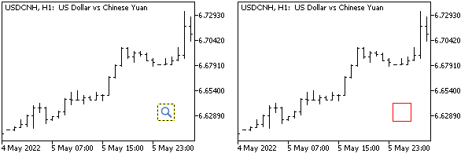

# Resource variables

The #resource directive has a special form with which external files can be declared as resource variables and accessed within the program as normal variables of the corresponding type. The declaration format is:

```
#resource "path_file_name" as resource_variable_type resource_variable_name

```

Here are some examples of declarations:

```
#resource "data.bin" as int Data[]           //array of int type with data from the file data.bin 
#resource "rates.dat" as MqlRates Rates[]    // array of MqlRates structures from the file rates.dat
#resource "data.txt" as string Message       // line with the contents of the file data.txt
#resource "image.bmp" as bitmap Bitmap1[]    // one-dimensional array with image pixels
                                             // from file image.bmp
#resource "image.bmp" as bitmap Bitmap2[][]  // two-dimensional array with the same image

```

Let's give some explanations. Resource variables are constants (they cannot be modified in MQL5 code). For example, to edit images before displaying on the screen, you should create copies of resource array variables.

For text files (resources of type string) the encoding is automatically determined by the presence of a [BOM header](/en/book/common/files/files_txt_codepage). If there is no BOM, then the encoding is determined by the contents of the file. ANSI, UTF-8, and UTF-16 encodings are supported. When reading data from files, all strings are converted to Unicode.

The use of resource string variables can greatly facilitate the writing of programs based not only on pure MQL5 but also on additional technologies. For example, you can write OpenCL code (which is supported in MQL5 as an extension) in a separate file and then include it as a string in the resources of an MQL program. In the [big Expert Advisor example](/en/book/automation/tester/tester_example_ea), we've already used resource strings to include HTML templates.

For images, a special bitmap type has been introduced; this type has several features.

The bitmap type describes a single dot or pixel in an image and is represented by a 4-byte unsigned integer (uint). The pixel contains 4 bytes that correspond to the color components in ARGB or XRGB format (one letter = one byte), where R is red, G is green, B is blue, A is transparency (alpha channel), X is an is ignored byte (no transparency). Transparency can be used for various effects when overlaying images on a chart and on top of each other.

We will study the definition of ARGB and XRGB formats in the section on dynamic creation of graphic resources (see [ResourceCreate](/en/book/advanced/resources/resources_resourcecreate)). For example, for ARGB, the hexadecimal number 0xFFFF0000 specifies a fully opaque pixel (highest byte is 0xFF) of red color (the next byte is also 0xFF), and the next bytes for the green and blue components are zero.

It is important to note that the pixel color encoding is different from the byte representation of type [color](/en/book/basis/builtin_types/colors). Let's recall that the value of type color can be written in hexadecimal form as follows: 0x00BBGGRR, where BB, GG, RR are the blue, green and red components, respectively (in each byte, the value 255 gives the maximum intensity of the component). With a similar record of a pixel, there is a reverse byte order: 0xAARRGGBB. Full transparency is obtained when the high byte (here denoted AA) is 0 and the value 255 is a solid color. The [ColorToARGB](/en/book/common/conversions/conversions_color) function can be used to convert color to ARGB.

BMP files can have various encoding methods (if you create or edit them in any editor, check this issue in the documentation of this program). MQL5 resources do not support all existing encoding methods. You can check if a particular file is supported using the [ResourceCreate](/en/book/advanced/resources/resources_resourcecreate) function. Specifying an unsupported BMP format file in the directive will result in a compilation error.

When loading a file with 24-bit color encoding, all pixels of the alpha channel component are set to 255 (opaque). When loading a file with a 32-bit color encoding without an alpha channel, it also implies no transparency, that is, for all image pixels, the alpha channel component is set to 255. When loading a 32-bit color-coded file with an alpha channel, no pixel manipulation takes place.

Images can be described by both one-dimensional and two-dimensional arrays. This only affects the addressing method, while the amount of memory occupied will be the same. In both cases, the array sizes are automatically set based on the data from the BMP file. The size of a one-dimensional array will be equal to the product of the height and the width of the image (height * width), and a two-dimensional array will get separate dimensions [height][width]: the first index is the line number, the second is a dot in the line.

Attention! When declaring a resource linked to a resource variable, the only way to access the resource is through that variable, and the standard way of reading through the name "::resource_name" (or more generally "path_file_name.ex5::resource_name") no longer works. This also means that such resources cannot be used as shared resources from other programs.

Let's consider two indicators as an example; both are bufferless. This MQL program type was chosen only for reasons of convenience because it can be applied to the chart without conflict in addition to other indicators while an Expert Advisor would require a chart without another Expert Advisor. In addition, they remain on the chart and are available for subsequent settings changes, unlike scripts.

The BmpOwner.mq5 indicator contains a description of three resources:

- An image "search1.bmp" with a simple #resource directive which is accessible from other programs
- An image "search2.bmp" as a resource array variable of type bitmap, inaccessible from the outside
- A text file "message.txt" as a resource string for displaying a warning to the user

Both images are not used in any way within this indicator. The warning line is required in the OnInit function to call Alert since the indicator is not intended for independent use but only acts as a provider of an image resource.

If the resource variable is not used in the source code, the compiler may not include the resource at all in the binary code of the program, but this does not apply to images.

```
#resource "search1.bmp"
#resource "search2.bmp" as bitmap image[]
#resource "message.txt" as string Message

```

All three files are located in the same directory where the indicator source is located: MQL5/Indicators/MQL5Book/p7/.

If the user tries to run the indicator, it displays a warning and immediately stops working. The warning is contained in the Message resource string variable.

```
int OnInit()
{
   Alert(Message); // equivalent to the following line of the code
   // Alert("This indicator is not intended to run, it holds a bitmap resource");
   
   // remove the indicator explicitly, because otherwise it remains "hanging" on the chart uninitialized
   ChartIndicatorDelete(0, 0, MQLInfoString(MQL_PROGRAM_NAME));
   return INIT_FAILED;
}

```

In the second indicator BmpUser.mq5, we will try to use the external resources specified in the input variables ResourceOff and ResourceOn, to display in the OBJ_BITMAP_LABEL object.

```
input string ResourceOff = "BmpOwner.ex5::search1.bmp";
input string ResourceOn = "BmpOwner.ex5::search2.bmp";

```

By default, the state of the object is disabled/released ("Off"), and the image for it is taken from the previous indicator "BmpOwner.ex5::search1.bmp". This path and resource name are similar to the full notation "\\Indicators\\MQL5Book\\p7\\BmpOwner.ex5::search1.bmp". The short form is acceptable here, given that the indicators are located next to each other. If you subsequently open the object properties dialog, you will see the full notation in the Bitmap file (On/Off) fields.

For the pressed state, in ResourceOn we should read the resource "BmpOwner.ex5::search2.bmp" (let's see what happens).

In other input variables, you can select the corner of the chart, relative to which the positioning of the image is set, and the horizontal and vertical indents.

```
input int X = 25;
input int Y = 25;
input ENUM_BASE_CORNER Corner = CORNER_RIGHT_LOWER;

```

The creation of the OBJ_BITMAP_LABEL object and the setting of its properties, including the resource name as a picture for OBJPROP_BMPFILE, are performed in OnInit.

```
const string Prefix = "BMP_";
const ENUM_ANCHOR_POINT Anchors[] =
{
   ANCHOR_LEFT_UPPER,
   ANCHOR_LEFT_LOWER,
   ANCHOR_RIGHT_LOWER,
   ANCHOR_RIGHT_UPPER
};
   
void OnInit()
{
   const string name = Prefix + "search";
   ObjectCreate(0, name, OBJ_BITMAP_LABEL, 0, 0, 0);
   
   ObjectSetString(0, name, OBJPROP_BMPFILE, 0, ResourceOn);
   ObjectSetString(0, name, OBJPROP_BMPFILE, 1, ResourceOff);
   ObjectSetInteger(0, name, OBJPROP_XDISTANCE, X);
   ObjectSetInteger(0, name, OBJPROP_YDISTANCE, Y);
   ObjectSetInteger(0, name, OBJPROP_CORNER, Corner);
   ObjectSetInteger(0, name, OBJPROP_ANCHOR, Anchors[(int)Corner]);
}

```

Recall that when specifying images in OBJPROP_BMPFILE, the pressed state is indicated by modifier 0, and the released (unpressed) state (by default) is indicated by modifier 1, which is somewhat unexpected.

The OnDeinit handler deletes the object when unloading the indicator.

```
void OnDeinit(const int)
{
   ObjectsDeleteAll(0, Prefix);
}

```

Let's compile both indicators and run BmpUser.ex5 with default settings. The image of the graphic file search1.bmp should appear on the chart (see on the left).



Normal (left) and wrong (right) display of graphic resources in an object on a chart

If you click on the picture, that is, switch it to the pressed state, the program will try to access the "BmpOwner.ex5::search2.bmp" resource (which is unavailable due to the resource array bitmap attached to it). As a result, we will see a red square, indicating an empty object without a picture (see above, on the right). A similar situation will always occur if the input parameter specifies a path or name with a knowingly non-existent or non-shared resource. You can create your own program, describe in it a resource that refers to some existing bmp file, and then specify in the indicator input parameters BmpUser. In this case, the indicator will be able to display the picture on the chart.
