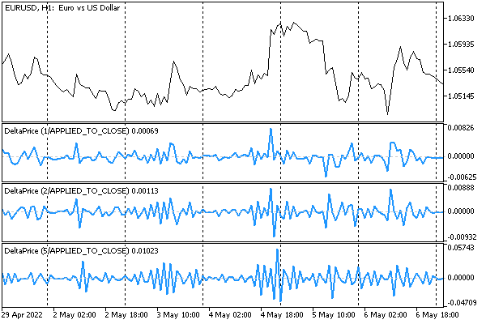

# Connecting custom indicators as resources

For operation, MQL programs may require one or more custom indicators. All of these can be included as resources in the ex5 executable, making it easy to distribute and install.

The #resource directive with the description of the nested indicator has the following format:

```
#resource "path_indicator_name.ex5"

```

The rules for setting and searching for the specified file are the same as for all [resources](/en/book/advanced/resources/resources_directive) generally.

We have already used this feature in the [big Expert Advisor example](/en/book/automation/tester/tester_example_ea), in the final version of UnityMartingale.mq5.

```
#resource "\\Indicators\\MQL5Book\\p6\\UnityPercentEvent.ex5"

```

In that Expert Advisor, instead of the indicator name, this resource was passed to the iCustom function: "::Indicators\\MQL5Book\\p6\\UnityPercentEvent.ex5".

The case when a custom indicator in the OnInit function creates one or more instances of itself requires separate consideration (if this technical solution itself seems strange, we will give a practical example after the introductory examples).

As we know, to use a resource from an MQL program, it must be specified in the following form: path_file_name.ex5::resource_name. For example, if the EmbeddedIndicator.ex5 indicator is included as a resource in another indicator MainIndicator.mq5 (more precisely, in its binary image MainIndicator.ex5), then the name specified when calling itself via iCustom can no longer be short, without a path, and the path must include the location of the "parent" indicator inside the MQL5 folder. Otherwise, the system will not be able to find the nested indicator.

Indeed, under normal circumstances, an indicator can call itself using, for example, the operator iCustom(_Symbol, _Period, myself,...), where myself is a string equal to either MQLInfoString(MQL_PROGRAM_NAME) or the name that was previously assigned to the INDICATOR_SHORTNAME property in the code. But when the indicator is located inside another MQL program as a resource, the name no longer refers to the corresponding file because the file that served as a prototype for the resource remained on the computer where the compilation was performed, and on the user's computer there is only the file MainIndicator.ex5. This will require some analysis of the program environment when starting the program.

Let's see this in practice.

To begin with, let's create an indicator NonEmbeddedIndicator.mq5. It is important to note that it is located in the folder MQL5/Indicators/MQL5Book/p7/SubFolder/, i.e. in a SubFolder relative to the folder p7 allocated for all indicators of this Part of the book. This is done intentionally to emulate a situation where the compiled file is not present on the user's computer. Now we will see how it works (or rather, demonstrates the problem).

The indicator has a single input parameter Reference. Its purpose is to count the number of copies of itself: when first created, the parameter equals 0, and the indicator will create its own copy with the parameter value of 1. The second copy, after "seeing" the value 1, will no longer create another copy (otherwise we would quickly run out of resources without the boundary condition for stopping reproduction).

```
input int Reference = 0;

```

The handle variable is reserved for the handle of the copy indicator.

```
int handle = 0;

```

In the handler OnInit, for clarity, we first display the name and path of the MQL program.

```
int OnInit()
{
   const string name = MQLInfoString(MQL_PROGRAM_NAME);
   const string path = MQLInfoString(MQL_PROGRAM_PATH);
   Print(Reference);
   Print("Name: " + name);
   Print("Full path: " + path);
   ...

```

Next comes the code suitable for self-launching a separate indicator (existing in the form of the familiar file NonEmbeddedIndicator.ex5).

```
   if(Reference == 0)
   {
      handle = iCustom(_Symbol, _Period, name, 1);
      if(handle == INVALID_HANDLE)
      {
         return INIT_FAILED;
      }
   }
   Print("Success");
   return INIT_SUCCEEDED;
}

```

We could successfully place such an indicator on the chart and receive entries of the following kind in the log (you will have your own file system paths):

```
0
Name: NonEmbeddedIndicator
Full path: C:\Program Files\MT5East\MQL5\Indicators\MQL5Book\p7\SubFolder\NonEmbeddedIndicator.ex5
Success
1
Name: NonEmbeddedIndicator
Full path: C:\Program Files\MT5East\MQL5\Indicators\MQL5Book\p7\SubFolder\NonEmbeddedIndicator.ex5
Success

```

The copy started successfully just by using the name "NonEmbeddedIndicator".

Let's leave this indicator for now and create a second one, FaultyIndicator.mq5, into which we will include the first indicator as a resource (pay attention to the specification of subfolder in the relative path of the resource; this is necessary because the FaultyIndicator.mq5 indicator is located in the folder one level up: MQL5/Indicators/MQL5Book/p7/).

```
// FaultyIndicator.mq5
#resource "SubFolder\\NonEmbeddedIndicator.ex5"
   
int handle;
   
int OnInit()
{
   handle = iCustom(_Symbol, _Period, "::SubFolder\\NonEmbeddedIndicator.ex5");
   if(handle == INVALID_HANDLE)
   {
      return INIT_FAILED;
   }
   return INIT_SUCCEEDED;
}

```

If you try to run the compiled FaultyIndicator.ex5, an error will occur:

```
0
Name: NonEmbeddedIndicator
Full path: C:\Program Files\MT5East\MQL5\Indicators\MQL5Book\p7\FaultyIndicator.ex5 »
»  ::SubFolder\NonEmbeddedIndicator.ex5
cannot load custom indicator 'NonEmbeddedIndicator' [4802]

```

When a copy of a nested indicator is launched, it is searched for in the folder of the main indicator, in which the resource is described. But there is no file NonEmbeddedIndicator.ex5 because the required resource is inside FaultyIndicator.ex5.

To solve the problem, we modify NonEmbeddedIndicator.mq5. First of all, let's give it another, more appropriate name, EmbeddedIndicator.mq5. In the source code, we need to add a helper function GetMQL5Path, which can isolate the relative part inside the MQL5 folder from the general path of the launched MQL program (this part will also contain the name of the resource if the indicator is launched from a resource).

```
// EmbeddedIndicator.mq5
string GetMQL5Path()
{
   static const string MQL5 = "\\MQL5\\";
   static const int length = StringLen(MQL5) - 1;
   static const string path = MQLInfoString(MQL_PROGRAM_PATH);
   const int start = StringFind(path, MQL5);
   if(start != -1)
   {
      return StringSubstr(path, start + length);
   }
   return path;
}

```

Taking into account the new function, we will change the iCustom call in the OnInit handler.

```
int OnInit()
{
   ...
   const string location = GetMQL5Path();
   Print("Location in MQL5:" + location);
   if(Reference == 0)
   {
      handle = iCustom(_Symbol, _Period, location, 1);
      if(handle == INVALID_HANDLE)
      {
         return INIT_FAILED;
      }
   }
   return INIT_SUCCEEDED;
}

```

Let's make sure that this edit did not break the launch of the indicator. Overlaying on a chart results in the expected lines appearing in the log:

```
0
Name: EmbeddedIndicator
Full path: C:\Program Files\MT5East\MQL5\Indicators\MQL5Book\p7\SubFolder\EmbeddedIndicator.ex5
Location in MQL5:\Indicators\MQL5Book\p7\SubFolder\EmbeddedIndicator.ex5
Success
1
Name: EmbeddedIndicator
Full path: C:\Program Files\MT5East\MQL5\Indicators\MQL5Book\p7\SubFolder\EmbeddedIndicator.ex5
Location in MQL5:\Indicators\MQL5Book\p7\SubFolder\EmbeddedIndicator.ex5
Success

```

Here we added debug output of the relative path that the GetMQL5Path function received. This line is now used in iCustom, and it works in this mode: a copy has been created.

Now let's embed this indicator as a resource into another indicator in the MQL5Book/p7 folder with the name MainIndicator.mq5. MainIndicator.mq5 is completely identical to FaultyIndicator.mq5 except for the connected resource.

```
// MainIndicator.mq5
#resource "SubFolder\\EmbeddedIndicator.ex5"
...
int OnInit()
{
   handle = iCustom(_Symbol, _Period, "::SubFolder\\EmbeddedIndicator.ex5");
   ...
}

```

Let's compile and run it. Entries appear in the log with a new relative path that includes the nested resource.

```
0
Name: EmbeddedIndicator
Full path: C:\Program Files\MT5East\MQL5\Indicators\MQL5Book\p7\MainIndicator.ex5 »
»  ::SubFolder\EmbeddedIndicator.ex5
Location in MQL5:\Indicators\MQL5Book\p7\MainIndicator.ex5::SubFolder\EmbeddedIndicator.ex5
Success
1
Name: EmbeddedIndicator
Full path: C:\Program Files\MT5East\MQL5\Indicators\MQL5Book\p7\MainIndicator.ex5 »
»  ::SubFolder\EmbeddedIndicator.ex5
Location in MQL5:\Indicators\MQL5Book\p7\MainIndicator.ex5::SubFolder\EmbeddedIndicator.ex5
Success

```

As we can see, this time the nested indicator successfully created a copy of itself, as it used a qualified name with a relative path and a resource name "\\Indicators\\MQL5Book\\p7\\MainIndicator.ex5::SubFolder\\EmbeddedIndicator.ex5".

During multiple experiments with launching this indicator, please note that nested copies are not immediately unloaded from the chart after the main indicator is removed. Therefore, restarts should be performed only after we waited for unloading to happen: otherwise, copies still running will be reused, and the above initialization lines will not appear in the log. To control the unloading, a printout of the Reference value has been added to the OnDeinit handler.

We promised to show that creating a copy of the indicator is not something extraordinary. As an applied demonstration of this technique, we use the indicator DeltaPrice.mq5 which calculates the difference in price increments of a given order. Order 0 means no differentiation (only to check the original time series), 1 means single differentiation, 2 means double differentiation, and so on.

The order is specified in the input parameter Differentiating.

```
input int Differencing = 1;

```

The difference series will be displayed in a single buffer in the subwindow.

```
#property indicator_separate_window
#property indicator_buffers 1
#property indicator_plots   1
   
#property indicator_type1 DRAW_LINE
#property indicator_color1 clrDodgerBlue
#property indicator_width1 2
#property indicator_style1 STYLE_SOLID
   
double Buffer[];

```

In the OnInit, handler we set up the buffer and create the same indicator, passing the value reduced by 1 in the input parameter.

```
#include <MQL5Book/AppliedTo.mqh> // APPLIED_TO_STR macro
 
int handle = 0;
   
int OnInit()
{
   const string label = "DeltaPrice (" + (string)Differencing + "/"
      + APPLIED_TO_STR() + ")";
   IndicatorSetString(INDICATOR_SHORTNAME, label);
   PlotIndexSetString(0, PLOT_LABEL, label);
   
   SetIndexBuffer(0, Buffer);
   if(Differencing > 1)
   {
      handle = iCustom(_Symbol, _Period, GetMQL5Path(), Differencing - 1);
      if(handle == INVALID_HANDLE)
      {
         return INIT_FAILED;
      }
   }
   return INIT_SUCCEEDED;
}

```

To avoid potential problems with embedding the indicator as a resource, we use the already proven function GetMQL5Path.

In the OnCalculate function, we perform the operation of subtracting neighboring values of the time series. When Differentiating equals 1, the operands are elements of the price array. With a larger value of Differentiating, we read the buffer of the indicator copy created for the previous order.

```
int OnCalculate(const int rates_total,
                const int prev_calculated,
                const int begin,
                const double &price[])
{
   for(int i = fmax(prev_calculated - 1, 1); i < rates_total; ++i)
   {
      if(Differencing > 1)
      {
         static double value[2];
         CopyBuffer(handle, 0, rates_total - i - 1, 2, value);
         Buffer[i] = value[1] - value[0];
      }
      else if(Differencing == 1)
      {
         Buffer[i] = price[i] - price[i - 1];
      }
      else
      {
         Buffer[i] = price[i];
      }
   }
   return rates_total;
}

```

The initial type of differentiated price is set in the indicator settings dialog in the Apply to drop-down list. By default, this is the Close price.

This is how several copies of the indicator look on the chart with different orders of differentiation.



Difference in Close prices of different orders
