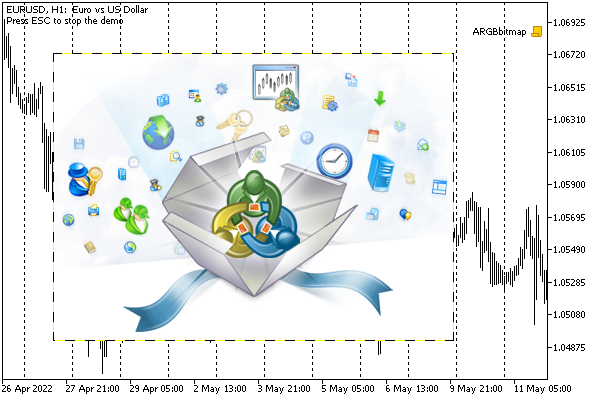
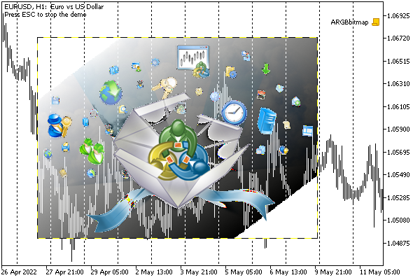
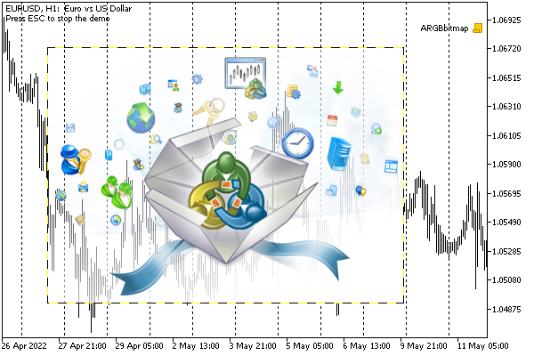

# Dynamic resource creation: ResourceCreate

The #resource directives embed resources into the program at the compilation stage, and therefore they can be called static. However, it often becomes necessary to generate resources (create completely new or modify existing ones) at the stage of program execution. For these purposes, MQL5 provides the ResourceCreate function. The resources created with the help of this function will be called dynamic.

The function has two forms: the first one allows you to load pictures and sounds from files, and the second one is designed to create bitmap images based on an array of pixels prepared in memory.

bool ResourceCreate(const string resource, const string filepath)

The function loads the resource named resource from a file located at filepath. If the path starts with a backslash '\' (in constant strings it should be doubled: "\\path\\name.ext"), then the file is searched at this path relative to the MQL5 folder in the terminal data directory (for example, "\\Files \\CustomSounds\\Hello.wav" refers to MQL5/Files/CustomSounds/Hello.wav). If there is no backslash, then the resource is searched starting from the folder where the executable file from which we call the function is located.

The path can point to a static resource hardwired into a third-party or current MQL program. For example, a certain script is able to create a resource based on a picture from the indicator BmpOwner.mq5 discussed in the section on [Resource variables](/en/book/advanced/resources/resources_variables).

```
ResourceCreate("::MyImage", "\\Indicators\\MQL5Book\\p7\\BmpOwner.ex5::search1.bmp");

```

The resource name in the resource parameter may contain an initial double colon (although this is not required, because if it is not present, the "::" prefix will be added to the name automatically). This ensures the unification of the use of one line for declaring a resource in the ResourceCreate call, as well as for subsequent access to it (for example, when setting the OBJPROP_BMPFILE property).

Of course, the above statement for creating a dynamic resource is redundant if we just want to load a third-party image resource into our object on the chart, since it is enough to directly assign the string "\\Indicators\\MQL5Book\\p7\\BmpOwner.ex5:" to the OBJPROP_BMPFILE property: search1.bmp". However, if you need to edit an image, a dynamic resource is indispensable. Next, we will show an example in the section [Reading and modifying resource data](/en/book/advanced/resources/resources_resourcereadimage).

Dynamic resources are publicly available from other MQL programs by their full name, which includes the path and name of the program that created the resource. For example, if the previous ResourceCreate call was produced by the script MQL5/Scripts/MyExample.ex5, then another MQL program can access the same resource using the full link "\\Scripts\\MyExample.ex5::MyImage", and any other script in the same folder can access the shorthand "MyExample.ex5::MyImage" (here the relative path is simply degenerate). The rules for writing full (from the MQL5 root folder) and relative paths were given above.

The ResourceCreate function returns a boolean indicator of success (true) or error (false) as a result of execution. The error code, as usual, can be found in the _LastError variable. Specifically, you are likely to receive the following errors:

- ERR_RESOURCE_NAME_DUPLICATED (4015) — matching names of the dynamic and static resources
- ERR_RESOURCE_NOT_FOUND (4016) — the given resource/file from the filepath parameter is not found
- ERR_RESOURCE_UNSUPPOTED_TYPE (4017) — unsupported resource type or size more than 2 GB
- ERR_RESOURCE_NAME_IS_TOO_LONG (4018) — resource name exceeds 63 characters

All this applies not only to the first form of the function but also to the second.

bool ResourceCreate(const string resource, const uint &data[], uint img_width, uint img_height, uint data_xoffset, uint data_yoffset, uint data_width, ENUM_COLOR_FORMAT color_format)

The resource parameter still means the name of the new resource, and the content of the image is given by the rest of the parameters.

The data array may be one-dimensional (data[]) or two-dimensional (data[][]): it passes dots (pixels) of the raster. The parameters img_width and img_height set the dimensions of the displayed image (in pixels). These sizes may be less than the physical size of the image in the data array, due to which the effect of framing is achieved when only a part of the original image is output. The data_xoffset and data_yoffset parameters determine the coordinate of the upper left corner of the "frame".

The data_width parameter means the full width of the original image (in the data array). A value of 0 implies that this width is the same as img_width. The data_width parameter makes sense only when specifying a one-dimensional array in the data parameter, since for a two-dimensional array its dimensions are known in both dimensions (in this case, the data_width parameter is ignored and is assumed equal to the second dimension of the data[][] array).

In the most common case, when you want to display the image in full ("as is"), use the following syntax:

```
ResourceCreate(name, data, width, height, 0, 0, 0, ...);

```

For example, if the program has a static resource described as a two-dimensional bitmap array:

```
#resource "static.bmp" as bitmap data[][]

```

Then the creation of a dynamic resource based on it can be performed in the following way:

```
ResourceCreate("dynamic", data, ArrayRange(data, 1), ArrayRange(data, 0), 0, 0, 0, ...);

```

Creating a dynamic resource based on a static one is in demand not only when direct editing is required, but also to control how colors are processed when displaying a resource. This mode is selected using the last parameter of the function: color_format. It uses the ENUM_COLOR_FORMAT enumeration.

| Identifier | Description |
| --- | --- |
| COLOR_FORMAT_XRGB_NOALPHA | The alpha channel component (transparency) is ignored |
| COLOR_FORMAT_ARGB_RAW | Color components are not processed by the terminal |
| COLOR_FORMAT_ARGB_NORMALIZE | Color components are processed by the terminal (see below) |

In the COLOR_FORMAT_XRGB_NOALPHA mode, the image is displayed without effects: each point is displayed in a solid color (this is the fastest way to draw). The other two modes display pixels taking into account the transparency in the high byte of each pixel but have different effects. In the case of COLOR_FORMAT_ARGB_NORMALIZE, the terminal performs the following transformations of the color components of each point when preparing the raster at the time of the ResourceCreate call:

```
R = R * A / 255
G = G * A / 255
B = B * A / 255
A = A

```

Static image resources in [#resource](/en/book/advanced/resources/resources_directive) directives are connected with the help of COLOR_FORMAT_ARGB_NORMALIZE.

In a dynamic resource, the array size is limited by the value of INT_MAX bytes (2147483647, 2 Gb), which significantly exceeds the limit imposed by the compiler when processing the static directive #resource: the file size cannot exceed 128 Mb.

If the second version of the function is called to create a resource with the same name, but with changing other parameters (the contents of the pixel array, width, height, or offset), then the new resource is not recreated, but the existing one is simply updated. Only the program owning the resource (the program that created it in the first place) can modify a resource in this way.

If, when creating dynamic resources from different copies of the program running on different charts, you need your own resource in each copy, you should add ChartID to the name of the resource.

To demonstrate the dynamic creation of images in various color schemes, we propose to disassemble the script ARGBbitmap.mq5.

The image "argb.bmp" is statically attached to it.

```
#resource "argb.bmp" as bitmap Data[][]

```

The user selects the color formatting method by the ColorFormat parameter.

```
input ENUM_COLOR_FORMAT ColorFormat = COLOR_FORMAT_XRGB_NOALPHA;

```

The name of the object in which the image will be displayed and the name of the dynamic resource are described by the variables BitmapObject and ResName.

```
const string BitmapObject = "BitmapObject";
const string ResName = "::image";

```

Below is the main function of the script.

```
void OnStart()
{
   ResourceCreate(ResName, Data, ArrayRange(Data, 1), ArrayRange(Data, 0),
      0, 0, 0, ColorFormat);
   
   ObjectCreate(0, BitmapObject, OBJ_BITMAP_LABEL, 0, 0, 0);
   ObjectSetInteger(0, BitmapObject, OBJPROP_XDISTANCE, 50);
   ObjectSetInteger(0, BitmapObject, OBJPROP_YDISTANCE, 50);
   ObjectSetString(0, BitmapObject, OBJPROP_BMPFILE, ResName);
   
   Comment("Press ESC to stop the demo");
   const ulong start = TerminalInfoInteger(TERMINAL_KEYSTATE_ESCAPE);
   while(!IsStopped()  // waiting for the user's command to end the demo
   && TerminalInfoInteger(TERMINAL_KEYSTATE_ESCAPE) == start)
   {
      Sleep(1000);
   }
   
   Comment("");
   ObjectDelete(0, BitmapObject);
   ResourceFree(ResName);
}

```

The script creates a new resource in the specified color mode and assigns it to the OBJPROP_BMPFILE property of an object of type OBJ_BITMAP_LABEL. Next, the script waits for the user to explicitly stop the script or press Esc and then deletes the object (by calling ObjectDelete) and the resource using the ResourceFree function. Note that deleting an object does not automatically delete the resource. That is why we need the ResourceFree function which we will discuss in the [next section](/en/book/advanced/resources/resources_resourcefree).

If we don't call ResourceFree, then dynamic resources remain in the terminal's memory even after the MQL program terminates, right up until the terminal is closed. This makes it possible to use them as repositories or a means for exchanging information between MQL programs.

A dynamic resource created using the second form of ResourceCreate does not have to carry an image. The data array may contain arbitrary data if we don't use it for rendering. In this case, it is important to set the COLOR_FORMAT_XRGB_NOALPHA scheme. We will show such an example at some point.

In the meantime, let's check how the ARGBbitmap.mq5 script works.

The above picture "argb.bmp" contains information about transparency: the upper left corner has a completely transparent background, and the transparency fades out diagonally towards the lower right corner.

The following images show the results of running the script in three different modes.



Image output in color format COLOR_FORMAT_XRGB_NOALPHA



Image output in color format COLOR_FORMAT_ARGB_RAW



Image output in color format COLOR_FORMAT_ARGB_NORMALIZE
