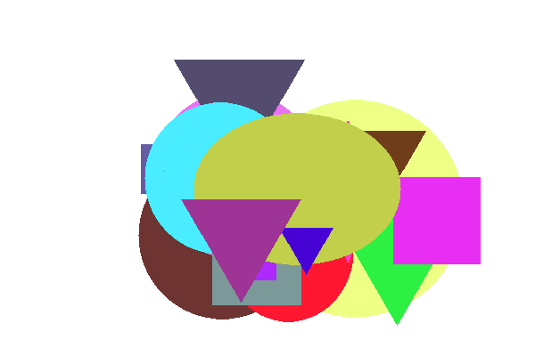
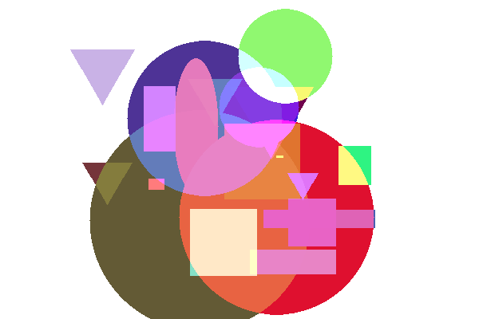

# Saving images to a file: ResourceSave

The MQL5 API allows you to write a resource to a BMP file using the ResourceSave function. The framework currently only supports image resources.

bool ResourceSave(const string resource, const string filename)

The resource and filename parameters specify the name of the resource and file, respectively. The resource name must start with "::". The file name may contain a path relative to the folder MQL5/Files. If necessary, the function will create all intermediate subdirectories. If the specified file exists, it will be overwritten.

The function returns true in case of success.

To test the operation of this function, it is desirable to create an original image. We have exactly the right image for this.

As part of the study of OOP, in the chapter [Classes and interfaces](/en/book/oop/classes_and_interfaces), we started a series of examples about graphic shapes: from the very first version Shapes1.mq5 in the section about [Class definition](/en/book/oop/classes_and_interfaces/classes_definition) to the last version Shapes6.mq5 in the section about [Nested types](/en/book/oop/classes_and_interfaces/classes_namespace_context). Drawing was not available to us then, until the chapter on graphical objects, where we were able to implement visualization in the script [ObjectShapesDraw.mq5](/en/book/applications/objects/objects_color_style). Now, after studying the graphical resources, it's time for another "upgrade".

In the new version of the script ResourceShapesDraw.mq5 we will draw the shapes. To make it easier to analyze the changes compared to the previous version, we will keep the same set of shapes: rectangle, square, oval, circle, and triangle. This is done to give an example, and not because something limits us in drawing: on the contrary, there is a potential for expanding the set of shapes, visual effects and labeling. We'll look at the features in a few examples, starting with the current one. However, please note that it is not possible to demonstrate the full range of applications within the scope of this book.

After the shapes are generated and drawn, we save the resulting resource to a file.

The basis of the shape class hierarchy is the Shape class which had a draw method.

```
class Shape
{
public:
   ...
   virtual void draw() = 0;
   ...
}

```

In derived classes, it was implemented on the basis of graphic objects, with calls to [ObjectCreate](/en/book/applications/objects/objects_create) and subsequent setup of objects using ObjectSet functions. The shared canvas of such a drawing was the chart itself.

Now we need to paint pixels in some shared resource according to the particular shape. It is desirable to allocate a common resource and methods for modifying pixels in it into a separate class or, better, an interface.

An abstract entity will allow us not to make links with the method of creating and configuring the resource. In particular, our next implementation will place the resource in an OBJ_BITMAP_LABEL object (as we have already done in this chapter), and for some, it may be enough to generate images in memory and save to disk without plotting (as many traders like to periodically capture states charts).

Let's call the interface Drawing.

```
interface Drawing
{
   void point(const float x1, const float y1, const uint pixel);
   void line(const int x1, const int y1, const int x2, const int y2, const color clr);
   void rect(const int x1, const int y1, const int x2, const int y2, const color clr);
};

```

Here are just three of the most basic methods for drawing, which are enough for this case.

The point method is public (which makes it possible to put a separate point), but in a sense, it is low-level since all the others will be implemented through it. That is why the coordinates in it are real, and the content of the pixel is a ready-made value of the uint type. This will allow, if necessary, to apply various anti-aliasing algorithms so that the shapes do not look stepped due to pixelation. Here we will not touch on this issue.

Taking into account an interface, the Shape::draw method turns into the following one:

```
virtual void draw(Drawing *drawing) = 0;

```

Then, in the Rectangle class, it's very easy to delegate the drawing of the rectangle to a new interface.

```
class Rectangle : public Shape
{
protected:
   int dx, dy; // size (width, height)
   ...
public:
   void draw(Drawing *drawing) override
   {
 // x, y - anchor point (center) in Shape
      drawing.rect(x — dx / 2, y — dy / 2, x + dx / 2, y + dy / 2, backgroundColor);
   }
};

```

More efforts are required to draw an ellipse.

```
class Ellipse : public Shape
{
protected:
   int dx, dy; // large and small radii
   ...
public:
   void draw(Drawing *drawing) override
   {
      // (x, y) - center
      const int hh = dy * dy;
      const int ww = dx * dx;
      const int hhww = hh * ww;
      int x0 = dx;
      int step = 0;
      
      // main horizontal diameter
      drawing.line(x - dx, y, x + dx, y, backgroundColor);
      
      // horizontal lines in the upper and lower half, symmetrically decreasing in length
      for(int j = 1; j <= dy; j++)
      {
         for(int x1 = x0 - (step - 1); x1 > 0; --x1)
         {
            if(x1 * x1 * hh + j * j * ww <= hhww)
            {
               step = x0 - x1;
               break;
            }
         }
         x0 -= step;
         drawing.line(x - x0, y - j, x + x0, y - j, backgroundColor);
         drawing.line(x - x0, y + j, x + x0, y + j, backgroundColor);
      }
   }
};

```

Finally, for the triangle, the rendering is implemented as follows.

```
class Triangle: public Shape
{
protected:
   int dx;  // one size, because triangles are equilateral 
   ...
public:
   virtual void draw(Drawing *drawing) override
   {
      // (x, y) - center
      // R = a * sqrt(3) / 3
      // p0: x, y + R
      // p1: x - R * cos(30), y - R * sin(30)
      // p2: x + R * cos(30), y - R * sin(30)
      // Pythagorean height: dx * dx = dx * dx / 4 + h * h
      // sqrt(dx * dx * 3/4) = h
      const double R = dx * sqrt(3) / 3;
      const double H = sqrt(dx * dx * 3 / 4);
      const double angle = H / (dx / 2);
      
      // main vertical line (triangle height)
      const int base = y + (int)(R - H);
      drawing.line(x, y + (int)R, x, base, backgroundColor);
      
      // smaller vertical lines left and right, symmetrical
      for(int j = 1; j <= dx / 2; ++j)
      {
         drawing.line(x - j, y + (int)(R - angle * j), x - j, base, backgroundColor);
         drawing.line(x + j, y + (int)(R - angle * j), x + j, base, backgroundColor);
      }
   }
};

```

Now let's turn to the MyDrawing class which is derived from the Drawing interface. This is MyDrawing that must, guided by calls to interface methods in shapes, ensure that a certain resource is displayed in a bitmap. Therefore the class describes variables for the names of the graphical object (object) and resource (sheet), as well as the data array of type uint to store the image. In addition, we moved the shapes array of shapes, which was previously declared in the OnStart handler. Since MyDrawing is responsible for drawing all shapes, it is better to manage their set here.

```
class MyDrawing: public Drawing
{
   const string object;     // object with bitmap
   const string sheet;      // resource
   uint data[];             // pixels
   int width, height;       // dimensions
   AutoPtr<Shape> shapes[]; // figures/shapes
   const uint bg;           // background color
   ...

```

In the constructor, we create a graphical object for the size of the entire chart and allocate memory for the data array. The canvas is filled with zeros (meaning "black transparency") or whatever value is passed in the background parameter, after which a resource is created based on it. By default, the resource name starts with the letter 'D' and includes the ID of the current chart, but you can specify something else.

```
public:
   MyDrawing(const uint background = 0, const string s = NULL) :
      object((s == NULL ? "Drawing" : s)),
      sheet("::" + (s == NULL ? "D" + (string)ChartID() : s)), bg(background)
   {
      width = (int)ChartGetInteger(0, CHART_WIDTH_IN_PIXELS);
      height = (int)ChartGetInteger(0, CHART_HEIGHT_IN_PIXELS);
      ArrayResize(data, width * height);
      ArrayInitialize(data, background);
   
      ResourceCreate(sheet, data, width, height, 0, 0, width, COLOR_FORMAT_ARGB_NORMALIZE);
      
      ObjectCreate(0, object, OBJ_BITMAP_LABEL, 0, 0, 0);
      ObjectSetInteger(0, object, OBJPROP_XDISTANCE, 0);
      ObjectSetInteger(0, object, OBJPROP_YDISTANCE, 0);
      ObjectSetInteger(0, object, OBJPROP_XSIZE, width);
      ObjectSetInteger(0, object, OBJPROP_YSIZE, height);
      ObjectSetString(0, object, OBJPROP_BMPFILE, sheet);
   }

```

The calling code can find out the name of the resource using the resource method.

```
   string resource() const
   {
      return sheet;
   }

```

The resource and object are removed in the destructor.

```
   ~MyDrawing()
   {
      ResourceFree(sheet);
      ObjectDelete(0, object);
   }

```

The push method fills the array of shapes.

```
   Shape *push(Shape *shape)
   {
      shapes[EXPAND(shapes)] = shape;
      return shape;
   }

```

The draw method draws the shapes. It simply calls the draw method of each shape in the loop and then updates the resource and the chart.

```
   void draw()
   {
      for(int i = 0; i < ArraySize(shapes); ++i)
      {
         shapes[i][].draw(&this);
      }
      ResourceCreate(sheet, data, width, height, 0, 0, width, COLOR_FORMAT_ARGB_NORMALIZE);
      ChartRedraw();
   }

```

Below are the most important methods which are the methods of the Drawing interface and which actually implement drawing.

Let's start with the point method, which we present in a simplified form for now (we will deal with the improvements later).

```
   virtual void point(const float x1, const float y1, const uint pixel) override
   {
      const int x_main = (int)MathRound(x1);
      const int y_main = (int)MathRound(y1);
      const int index = y_main * width + x_main;
      if(index >= 0 && index < ArraySize(data))
      {
         data[index] = pixel;
      }
   }

```

Based on point, it is easy to implement line drawing. When the coordinates of the start and end points match in one of the dimensions, we use the rect method to draw since a straight line is a degenerate case of a rectangle of unit thickness.

```
   virtual void line(const int x1, const int y1, const int x2, const int y2, const color clr) override
   {
      if(x1 == x2) rect(x1, y1, x1, y2, clr);
      else if(y1 == y2) rect(x1, y1, x2, y1, clr);
      else
      {
         const uint pixel = ColorToARGB(clr);
         double angle = 1.0 * (y2 - y1) / (x2 - x1);
         if(fabs(angle) < 1) // step along the axis with the largest distance, x
         {
            const int sign = x2 > x1 ? +1 : -1;
            for(int i = 0; i <= fabs(x2 - x1); ++i)
            {
               const float p = (float)(y1 + sign * i * angle);
               point(x1 + sign * i, p, pixel);
            }
         }
         else // or y-step
         {
            const int sign = y2 > y1 ? +1 : -1;
            for(int i = 0; i <= fabs(y2 - y1); ++i)
            {
               const float p = (float)(x1 + sign * i / angle);
               point(p, y1 + sign * i, pixel);
            }
         }
      }
   }

```

And here is the rect method.

```
   virtual void rect(const int x1, const int y1, const int x2, const int y2, const color clr) override
   {
      const uint pixel = ColorToARGB(clr);
      for(int i = fmin(x1, x2); i <= fmax(x1, x2); ++i)
      {
         for(int j = fmin(y1, y2); j <= fmax(y1, y2); ++j)
         {
            point(i, j, pixel);
         }
      }
   }

```

Now we need to modify the OnStart handler, and the script will be ready.

First, we set up the chart (hide all elements). In theory, this is not necessary: it is left to match with the prototype script.

```
void OnStart()
{
   ChartSetInteger(0, CHART_SHOW, false);
   ...

```

Next, we describe the object of the MyDrawing class, generate a predefined number of random shapes (everything remains unchanged here, including the addRandomShape generator and the FIGURES macro equal to 21), draw them in the resource, and display them in the object on the chart.

```
   MyDrawing raster;
   
   for(int i = 0; i < FIGURES; ++i)
   {
      raster.push(addRandomShape());
   }
   
   raster.draw(); // display the initial state
   ...

```

In the example ObjectShapesDraw.mq5, we started an endless loop in which we moved the pieces randomly. Let's repeat this trick here. Here we will need to add the MyDrawing class since the array of shapes is stored inside it. Let's write a simple method shake.

```
class MyDrawing: public Drawing
{
public:
   ...
   void shake()
   {
      ArrayInitialize(data, bg);
      for(int i = 0; i < ArraySize(shapes); ++i)
      {
         shapes[i][].move(random(20) - 10, random(20) - 10);
      }
   }
   ...
};

```

Then, in OnStart, we can use the new method in a loop until the user stops the animation.

```
void OnStart()
{
   ...
   while(!IsStopped())
   {
      Sleep(250);
      raster.shake();
      raster.draw();
   }
   ...
}

```

At this point, the functionality of the previous example is virtually repeated. But we need to add image saving to a file. So let's add an input parameter SaveImage.

```
input bool SaveImage = false;

```

When it is set to true, check the performance of the ResourceSave function.

```
void OnStart()
{
   ...
   if(SaveImage)
   {
      const string filename = "temp.bmp";
      if(ResourceSave(raster.resource(), filename))
      {
         Print("Bitmap image saved: ", filename);
      }
      else
      {
         Print("Can't save image ", filename, ", ", E2S(_LastError));
      }
   }
}

```

Also, since we are talking about input variables, let the user select a background and pass the resulting value to the MyDrawing constructor.

```
input color BackgroundColor = clrNONE;
void OnStart()
{
   ...
   MyDrawing raster(BackgroundColor != clrNONE ? ColorToARGB(BackgroundColor) : 0);
   ...
}

```

So, everything is ready for the first test.

If you run the script ResourceShapesDraw.mq5, the chart will form an image like the following.



Bitmap of a resource with a set of random shapes

When comparing this image with what we saw in the example [ObjectShapesDraw.mq5](/en/book/applications/objects/objects_color_style), it turns out that our new way of rendering is somewhat different from how the terminal displays objects. Although the shapes and colors are correct, the places where the shapes overlap are indicated in different ways.

Our script paints the shapes with the specified color, superimposing them on top of each other in the order they appear in the array. Later shapes overlap the earlier ones. The terminal, on the other hand, applies some kind of color mixing (inversion) in places of overlap.

Both methods have the right to exist, there are no errors here. However, is it possible to achieve a similar effect when drawing?

We have full control over the drawing process, so any effects can be applied to it not only the one from the terminal.

In addition to the original, simple way of drawing, let's implement a few more modes. All of them are summarized in the COLOR_EFFECT enumeration.

```
enum COLOR_EFFECT
{
   PLAIN,         // simple drawing with overlap (default)
   COMPLEMENT,    // draw with a complementary color (like in the terminal) 
   BLENDING_XOR,  // mixing colors with XOR '^'
   DIMMING_SUM,   // "darken" colors with '+'
   LIGHTEN_OR,    // "lighten" colors with '|'
};

```

Let's add an input variable to select the mode.

```
input COLOR_EFFECT ColorEffect = PLAIN;

```

Let's support modes in the MyDrawing class. First, let's describe the corresponding field and method.

```
class MyDrawing: public Drawing
{
   ...
   COLOR_EFFECT xormode;
   ...
public:
   void setColorEffect(const COLOR_EFFECT x)
   {
      xormode = x;
   }
   ...

```

Then we improve the point method.

```
   virtual void point(const float x1, const float y1, const uint pixel) override
   {
      ...
      if(index >= 0 && index < ArraySize(data))
      {
         switch(xormode)
         {
         case COMPLEMENT:
            data[index] = (pixel ^ (1 - data[index])); // blending with complementary color
            break;
         case BLENDING_XOR:
            data[index] = (pixel & 0xFF000000) | (pixel ^ data[index]); // direct mixing (XOR)
            break;
         case DIMMING_SUM:
            data[index] =  (pixel + data[index]); // "darkening" (SUM)
            break;
         case LIGHTEN_OR:
            data[index] =  (pixel & 0xFF000000) | (pixel | data[index]); // "lightening" (OR)
            break;
         case PLAIN:
         default:
            data[index] = pixel;
         }
      }
   }

```

You can try running the script in different modes and compare the results. Don't forget about the ability to customize the background. Here is an example of what lightening looks like.



Image of shapes with lightening color mixing

To visually see the difference in effects, you can turn off color randomization and shape movement. The standard way of overlapping objects corresponds to the COMPLEMENT constant.

As a final experiment, enable the SaveImage option. In the OnStart handler, when generating the name of the file with the image, we now use the name of the current mode. We need to get a copy of the image on the chart in the file.

```
   ...
   if(SaveImage)
   {
      const string filename = EnumToString(ColorEffect) + ".bmp";
      if(ResourceSave(raster.resource(), filename))
      ...

```

For more sophisticated graphic constructions of our interface, Drawing may not be enough. Therefore, you can use ready-made drawing classes supplied with MetaTrader 5 or available in the mql5.com codebase. In particular, take a look at the file MQL5/Include/Canvas/Canvas.mqh.
