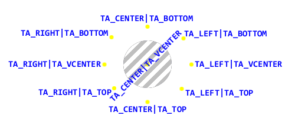
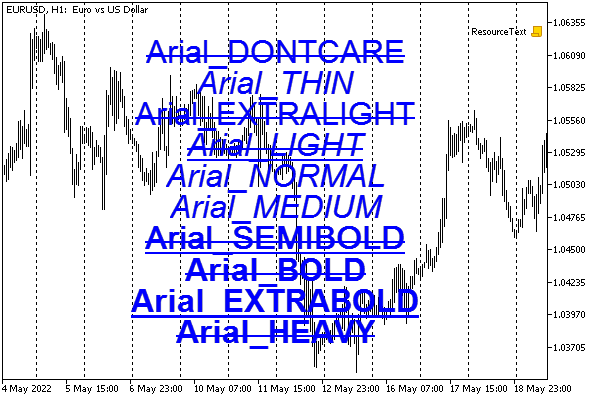
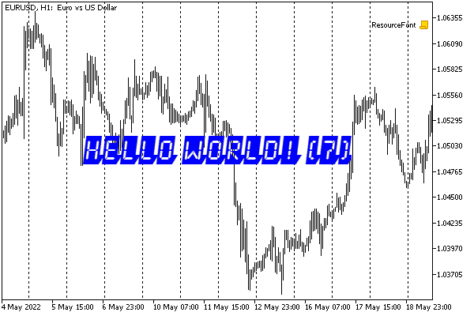
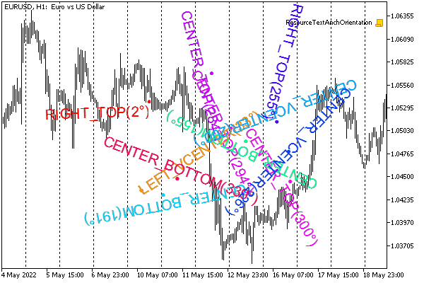
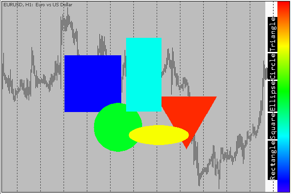

# Fonts and text output to graphic resources

In addition to rendering individual pixels in an array of a graphic resource, we can use built-in functions for displaying text. Functions allow you to change the current font and its characteristics (TextSetFont), get the dimensions of the rectangle in which the given string can be inscribed (TextGetSize), as well as directly insert the caption into the generated image (TextOut).

bool TextSetFont(const string name, int size, uint flags, int orientation = 0)

The function sets the font and its characteristics for subsequent drawing of text in the image buffer using the TextOut function (see further). The name parameter may contain the name of a built-in Windows font or a ttf font file (TrueType Font) connected by the resource directive (if the name starts with "::").

Size (size) can be specified in points (a typographic unit of measurement) or pixels (screen points). Positive values mean that the unit of measurement is a pixel, and negative values are measured in tenths of a point. Height in pixels will look different to users depending on the technical capabilities and settings of their monitors. The height in points will be approximately ("judging by eye") the same for everyone.

A typographical point is a physical unit of length, traditionally equal to 1/72nd of an inch. Hence, 1 point is equal to 0.352778 millimeters. A pixel on the screen is a virtual measure of length. Its physical size depends on the hardware resolution of the screen. For example, with a screen density of 96 DPI (dots per inch), 1 pixel will take 0.264583 millimeters or 0.75 points. However, most modern displays have much higher DPI values and therefore smaller pixels. Because of this, operating systems, including Windows, have long had settings to increase the visible scale of interface elements. Thus, if you specify a size in points (negative values), the size of the text in pixels will depend on the display and scale settings in the operating system (for example, "standard" 100%, "medium" 125%, or "large" 150%).   

   

Zooming in causes the displayed pixels to be artificially enlarged by the system. This is equivalent to reducing the screen size in pixels, and the system applies the effective DPI to achieve the same physical size. If scaling is enabled, then it is the effective DPI that is reported to programs, including the terminal and then MQL programs. If necessary, you can find out the DPI of the screen from the TERMINAL_SCREEN_DPI property (see [Screen specifications](/en/book/common/environment/env_screen)). However in reality, by setting the font size in points, we are relieved of the need to recalculate its size depending on the DPI, since the system will do it for us.

The default font is Arial and the default size is -120 (12 pt). Controls, in particular, built-in objects on charts also operate with font sizes in points. For example, if in an MQL program, you want to draw text of the same size as the text in the OBJ_LABEL object, which has a size of 10 points, you should use the parameter size equal to -100.

The flags parameter sets a combination of flags describing the style of the font. The combination is made up of a bitmask using the bitwise operator OR ('|'). Flags are divided into two groups: style flags and boldness flags.

The following table lists the style flags. They can be mixed.

| Flag | Description |
| --- | --- |
| FONT_ITALIC | Italics |
| FONT_UNDERLINE | Underline |
| FONT_STRIKEOUT | Strikethrough |

Boldness flags have relative weights corresponding to them (given to compare expected effects).

| Flag | Description |
| --- | --- |
| FW_DONTCARE | 0 (system default will be applied) |
| FW_THIN | 100 |
| FW_EXTRALIGHT, FW_ULTRALIGHT | 200 |
| FW_LIGHT | 300 |
| FW_NORMAL, FW_REGULAR | 400 |
| FW_MEDIUM | 500 |
| FW_SEMIBOLD, FW_DEMIBOLD | 600 |
| FW_BOLD | 700 |
| FW_EXTRABOLD, FW_ULTRABOLD | 800 |
| FW_HEAVY, FW_BLACK | 900 |

Use only one of these values in a combination of flags.

The orientation parameter specifies the angle of the text in relation to the horizontal, in tenths of a degree. For example, orientation = 0 means normal text output, while orientation = 450 will result in a 45-degree tilt (counterclockwise).

Note that settings made in one TextSetFont call will affect all subsequent TextOut calls until they are changed.

The function returns true if successful or false if problems occur (for example, if the font is not found).

We will consider an example of using this function, as well as the two others after describing all of them.

bool TextGetSize(const string text, uint &width, uint &height)

The function returns the width and height of the line at the current font settings (this can be the default font or the one specified in the previous call to TextSetFont).

The text parameter passes a string in which length and width in pixels are required. Dimension values are written by the function based on references in the width and height parameters.

It should be noted that the rotation (skew) of the displayed text specified by the orientation parameter when TextSetFont is called does not affect the sizing in any way. In other words, if the text is supposed to be rotated by 45 degrees, then the MQL program itself must calculate the minimum square in which the text can fit. The TextGetSize function calculates the text size in a standard (horizontal) position.

bool TextOut(const string text, int x, int y, uint anchor, uint &data[], uint width, uint height, uint color, ENUM_COLOR_FORMAT color_format)

The function draws text in the graphic buffer at the specified coordinates taking into account the color, format, and previous settings (font, style, and orientation).

The text is passed in the text parameter and must be in the form of one line.

The x and y coordinates specified in pixels define the point in the graphics buffer where text is displayed. Which place of the generated inscription will be at the point (x, y) depends on the binding method in the anchor parameter (see further).

The buffer is represented by the data array, and although the array is one-dimensional, it stores a two-dimensional "canvas" with dimensions of width x height points. This array can be obtained from the ResourceReadImage function, or allocated by an MQL program. After all editing operations are completed, including text output, you should create a new resource based on this buffer or apply it to an already existing resource. In both cases, you should call [ResourceCreate](/en/book/advanced/resources/resources_resourcecreate).

The color of the text and the way the color is handled are set by the parameters color and color_format (see [ENUM_COLOR_FORMAT](/en/book/advanced/resources/resources_resourcecreate)). Note that the type used for color is uint, i.e., to convey the color, it should be converted using ColorToARGB.

The anchoring method specified by the anchor parameter is a combination of two text positioning flags: vertical and horizontal.

Horizontal text position flags are:

- TA_LEFT — anchor to the left side of the bounding box
- TA_CENTER — anchor to the middle between the left and right sides of the rectangle
- TA_RIGHT — anchor to the right side of the bounding box

Vertical text position flags are:

- TA_TOP — anchor to the top side of the bounding box
- TA_VCENTER — anchor to the middle between the top and bottom side of the rectangle
- TA_BOTTOM — anchor to the bottom side of the bounding box

In total, there are 9 valid combinations of flags to describe the anchoring method.



The position of the output text relative to the anchor point

Here, the center of the picture contains a deliberately exaggerated large point in the generated image with coordinates (x, y). Depending on the flags, the text appears relative to this point at the specified positions (the content of the text corresponds to the applied anchoring method).

For ease of reference, all the inscriptions are made in the standard horizontal position. However, note that an angle could also be applied to any of them (orientation), and then the corresponding inscription would be rotated around the point. In this image, only the label centered on both dimensions is rotated.

These flags should not be confused with text alignment. The bounding box is always sized to fit the text, and its position relative to the anchor point is, in a sense, the opposite of the flag names.

Let's look at some examples using three functions.

To begin with, let's check the simplest options of setting the font boldness and style. The ResourceText.mq5 script allows you to select the name of the font, its size, as well as the colors of the background and text in the input variables. The labels will be displayed on the chart for the specified number of seconds.

```
input string Font = "Arial";             // Font Name
input int    Size = -240;                // Size
input color  Color = clrBlue;            // Font Color
input color  Background = clrNONE;       // Background Color
input uint   Seconds = 10;               // Demo Time (seconds)

```

The name of each gradation of boldness will be displayed in the label text, so to simplify the process (by using EnumToString) the ENUM_FONT_WEIGHTS enumeration is declared.

```
enum ENUM_FONT_WEIGHTS
{
   _DONTCARE = FW_DONTCARE,
   _THIN = FW_THIN,
   _EXTRALIGHT = FW_EXTRALIGHT,
   _LIGHT = FW_LIGHT,
   _NORMAL = FW_NORMAL,
   _MEDIUM = FW_MEDIUM,
   _SEMIBOLD = FW_SEMIBOLD,
   _BOLD = FW_BOLD,
   _EXTRABOLD = FW_EXTRABOLD,
   _HEAVY = FW_HEAVY,
};
 
const int nw = 10; // number of different weights

```

The inscription flags are collected in the rendering array and random combinations are selected from it.

```
   const uint rendering[] =
   {
      FONT_ITALIC,
      FONT_UNDERLINE,
      FONT_STRIKEOUT
   };
   const int nr = sizeof(rendering) / sizeof(uint);

```

To get a random number in a range, there is an auxiliary function Random.

```
int Random(const int limit)
{
   return rand() % limit;
}

```

In the main function of the script, we find the size of the chart and create an OBJ_BITMAP_LABEL object that spans the entire space.

```
void OnStart()
{
   ...
   const string name = "FONT";
   const int w = (int)ChartGetInteger(0, CHART_WIDTH_IN_PIXELS);
   const int h = (int)ChartGetInteger(0, CHART_HEIGHT_IN_PIXELS);
   
   // object for a resource with a picture filling the whole window
   ObjectCreate(0, name, OBJ_BITMAP_LABEL, 0, 0, 0);
   ObjectSetInteger(0, name, OBJPROP_XSIZE, w);
   ObjectSetInteger(0, name, OBJPROP_YSIZE, h);
   ...

```

Next, we allocate memory for the image buffer, fill it with the specified background color (or leave it transparent, by default), create a resource based on the buffer, and bind it to the object.

```
   uint data[];
   ArrayResize(data, w * h);
   ArrayInitialize(data, Background == clrNONE ? 0 : ColorToARGB(Background));
   ResourceCreate(name, data, w, h, 0, 0, w, COLOR_FORMAT_ARGB_RAW);
   ObjectSetString(0, name, OBJPROP_BMPFILE, "::" + name);
   ...

```

Just in case, note that we can set the OBJPROP_BMPFILE property without a modifier (0 or 1) in the ObjectSetString call unless the object is supposed to switch between two states.

All font weights are listed in the weights array.

```
   const uint weights[] =
   {
      FW_DONTCARE,
      FW_THIN,
      FW_EXTRALIGHT, // FW_ULTRALIGHT,
      FW_LIGHT,
      FW_NORMAL,     // FW_REGULAR,
      FW_MEDIUM,
      FW_SEMIBOLD,   // FW_DEMIBOLD,
      FW_BOLD,
      FW_EXTRABOLD,  // FW_ULTRABOLD,
      FW_HEAVY,      // FW_BLACK
   };
   const int nw = sizeof(weights) / sizeof(uint);

```

In the loop, in order, we set the next gradation of boldness for each line using TextSetFont, preselecting a random style. A description of the font, including its name and weight, is drawn in the buffer using TextOut.

```
   const int step = h / (nw + 2);
   int cursor = 0;    // Y coordinate of the current "text line"
   
   for(int weight = 0; weight < nw; ++weight)
   {
      // apply random style
      const int r = Random(8);
      uint render = 0;
      for(int j = 0; j < 3; ++j)
      {
         if((bool)(r & (1 << j))) render |= rendering[j];
      }
      TextSetFont(Font, Size, weights[weight] | render);
      
      // generate font description
      const string text = Font + EnumToString((ENUM_FONT_WEIGHTS)weights[weight]);
      
      // draw text on a separate "line"
      cursor += step;
      TextOut(text, w / 2, cursor, TA_CENTER | TA_TOP, data, w, h,
         ColorToARGB(Color), COLOR_FORMAT_ARGB_RAW);
   }
   ...

```

Now update the resource and chart.

```
   ResourceCreate(name, data, w, h, 0, 0, w, COLOR_FORMAT_ARGB_RAW);
   ChartRedraw();
   ...

```

The user can stop the demonstration in advance.

```
   const uint timeout = GetTickCount() + Seconds * 1000;
   while(!IsStopped() && GetTickCount() < timeout)
   {
      Sleep(1000);
   }

```

Finally, the script deletes the resource and the object.

```
   ObjectDelete(0, name);
   ResourceFree("::" + name);
}

```

The result of the script is shown in the following image.



Drawing text in different weights and styles

In the second example of ResourceFont.mq5, we will make the task more difficult by including a custom font as a resource and using text rotation in 90-degree increments.

The font file is located next to the script.

```
#resource "a_LCDNova3DCmObl.ttf"

```

The message can be changed in the input parameter.

```
input string Message = "Hello world!";   // Message

```

This time, the OBJ_BITMAP_LABEL will not occupy the entire window and is therefore centered both horizontally and vertically.

```
void OnStart()
{
   const string name = "FONT";
   const int w = (int)ChartGetInteger(0, CHART_WIDTH_IN_PIXELS);
   const int h = (int)ChartGetInteger(0, CHART_HEIGHT_IN_PIXELS);
   
   // object for a resource with a picture
   ObjectCreate(0, name, OBJ_BITMAP_LABEL, 0, 0, 0);
   ObjectSetInteger(0, name, OBJPROP_XDISTANCE, w / 2);
   ObjectSetInteger(0, name, OBJPROP_YDISTANCE, h / 2);
   ObjectSetInteger(0, name, OBJPROP_ANCHOR, ANCHOR_CENTER);
   ...

```

To begin with, the buffer of the minimum size is allocated, just to complete resource creation. Later we will expand it to fit the dimensions of the inscription, for which there are reserved variables width and height.

```
   uint data[], width, height;
   ArrayResize(data, 1);
   ResourceCreate(name, data, 1, 1, 0, 0, 1, COLOR_FORMAT_ARGB_RAW);
   ObjectSetString(0, name, OBJPROP_BMPFILE, "::" + name);
   ...

```

In a loop with the test time countdown, we need to change the orientation of the inscription, for which there is the angle variable (degrees will be scrolled in it). The orientation will change once per second, the count is in the remain variable.

```
   const uint timeout = GetTickCount() + Seconds * 1000;
   int angle = 0;
   int remain = 10;
   ...

```

In the loop, we constantly change the rotation of the text, and in the text itself, we display a countdown counter of seconds. For each new inscription, its size is calculated using TextGetSize, based on which the buffer is reallocated.

```
   while(!IsStopped() && GetTickCount() < timeout)
   {
      // apply new angle
      TextSetFont("::a_LCDNova3DCmObl.ttf", -240, 0, angle * 10);
      
      // form the text
      const string text = Message + " (" + (string)remain-- + ")";
      
      // get the text size, allocate the array
      TextGetSize(text, width, height);
      ArrayResize(data, width * height);
      ArrayInitialize(data, 0);            // transparency
      
      // for vertical orientation, swap sizes
      if((bool)(angle / 90 & 1))
      {
         const uint t = width;
         width = height;
         height = t;
      }
      
      // adjust the size of the object
      ObjectSetInteger(0, name, OBJPROP_XSIZE, width);
      ObjectSetInteger(0, name, OBJPROP_YSIZE, height);
      
      // draw text
      TextOut(text, width / 2, height / 2, TA_CENTER | TA_VCENTER, data, width, height,
         ColorToARGB(clrBlue), COLOR_FORMAT_ARGB_RAW);
      
      // update resource and chart
      ResourceCreate(name, data, width, height, 0, 0, width, COLOR_FORMAT_ARGB_RAW);
      ChartRedraw();
      
      // change angle
      angle += 90;
      
      Sleep(100);
   }
   ...

```

Note that if the text is vertical, the dimensions need to be swapped. More generally, with text rotated to an arbitrary angle, it took more math to get the buffer size to fit the entire text.

At the end, we also delete the object and resource.

```
   ObjectDelete(0, name);
   ResourceFree("::" + name);
}

```

One of the moments of the script execution is shown in the following screenshot.



Inscription with custom font

As a final example, let's take a look at the script ResourceTextAnchOrientation.mq5 showing various rotations and anchor points of the text.

The script generates the specified number of labels (ExampleCount) using the specified font.

```
input string Font = "Arial";             // Font Name
input int    Size = -150;                // Size
input int    ExampleCount = 11;          // Number of examples

```

Anchor points and rotations are chosen randomly.

To specify the names of anchor points in labels, there is the ENUM_TEXT_ANCHOR enumeration with all valid options declared. So, we can simply call EnumToString any randomly selected element.

```
enum ENUM_TEXT_ANCHOR
{
   LEFT_TOP = TA_LEFT | TA_TOP,
   LEFT_VCENTER = TA_LEFT | TA_VCENTER,
   LEFT_BOTTOM = TA_LEFT | TA_BOTTOM,
   CENTER_TOP = TA_CENTER | TA_TOP,
   CENTER_VCENTER = TA_CENTER | TA_VCENTER,
   CENTER_BOTTOM = TA_CENTER | TA_BOTTOM,
   RIGHT_TOP = TA_RIGHT | TA_TOP,
   RIGHT_VCENTER = TA_RIGHT | TA_VCENTER,
   RIGHT_BOTTOM = TA_RIGHT | TA_BOTTOM,
};

```

An array of these new constants is declared in the OnStart handler.

```
void OnStart()
{
   const ENUM_TEXT_ANCHOR anchors[] =
   {
      LEFT_TOP,
      LEFT_VCENTER,
      LEFT_BOTTOM,
      CENTER_TOP,
      CENTER_VCENTER,
      CENTER_BOTTOM,
      RIGHT_TOP,
      RIGHT_VCENTER,
      RIGHT_BOTTOM,
   };
   const int na = sizeof(anchors) / sizeof(uint);
   ...

```

Initial object and resource creation are similar to the example with ResourceText.mq5, so let's leave them out here. The most interesting thing happens in the loop.

```
   for(int i = 0; i < ExampleCount; ++i)
   {
      // apply a random angle
      const int angle = Random(360);
      TextSetFont(Font, Size, 0, angle * 10);
      
      // take random coordinates and an anchor point
      const ENUM_TEXT_ANCHOR anchor = anchors[Random(na)];
      const int x = Random(w / 2) + w / 4;
      const int y = Random(h / 2) + h / 4;
      const color clr = ColorMix::HSVtoRGB(angle);
      
     // draw a circle directly in that place of the image,
     // where the anchor point goes
      TextOut(ShortToString(0x2022), x, y, TA_CENTER | TA_VCENTER, data, w, h,
         ColorToARGB(clr), COLOR_FORMAT_ARGB_NORMALIZE);
      
      // form the text describing the anchor type and angle
      const string text =  EnumToString(anchor) +
         "(" + (string)angle + CharToString(0xB0) + ")";
   
      // draw text
      TextOut(text, x, y, anchor, data, w, h,
         ColorToARGB(clr), COLOR_FORMAT_ARGB_NORMALIZE);
   }
   ...

```

It remains only to update the picture and chart, and then wait for the user's command and free up resources.

```
   ResourceCreate(name, data, w, h, 0, 0, w, COLOR_FORMAT_ARGB_NORMALIZE);
   ChartRedraw();
   
   const uint timeout = GetTickCount() + Seconds * 1000;
   while(!IsStopped() && GetTickCount() < timeout)
   {
      Sleep(1000);
   }
   
   ObjectDelete(0, name);
   ResourceFree("::" + name);
}

```

Here's what we get as a result.



Text output with random coordinates, anchor points, and angles

Additionally, for an independent study, the book provides a toy graphics editor SimpleDrawing.mq5. It is designed as a bufferless indicator and uses in its work the classes of shapes considered earlier (see the example with [ResourceShapesDraw.mq5](/en/book/advanced/resources/resources_resourcesave)). They are put in the header file ShapesDrawing.mqh almost unchanged. Previously, the shapes were randomly generated by the script. Now the user can select and plot them on the chart. For this purpose, an interface with a color palette and a button bar has been implemented according to the number of registered shape classes. The interface is implemented by the SimpleDrawing class (SimpleDrawing.mqh).



Simple graphic editor

The panel and palette can be positioned along any border of the chart, demonstrating the ability to rotate labels.

Selecting the next shape to draw is done by pressing the button in the panel: the button "sticks" in the pressed state, and its background color indicates the selected drawing color. To change the color, click anywhere on the palette.

When one of the shape types is selected in the panel (one of the buttons is "active"), clicking in the drawing area (the rest of the chart, indicated by shading) draws a shape of predefined size at that location. At this point, the button "switches off". In this state, when all buttons are inactive, you can move the shapes around the workspace using the mouse. If we keep the key Ctrl pressed, instead of moving, the shape gets resized. The "hot spot" is located in the center of each shape (the size of the sensitive area is set by a macro in the source code and will probably need to be increased for very high DPI displays).

Note that the editor includes the plot ID (ChartID) in the names of the generated resources. This allows to run the editor in parallel on several charts.
