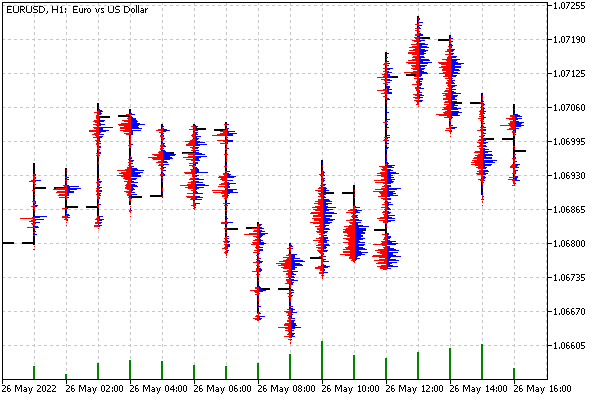

# Application of graphic resources in trading

Of course, beautifying is not the primary purpose of the resources. Let's see how to create a useful tool based on them. We will also eliminate one more omission: so far we have used resources only inside OBJ_BITMAP_LABEL objects, which are positioned in screen coordinates. However, graphic resources can also be embedded in OBJ_BITMAP objects with reference to quote coordinates: prices and time.

Earlier in the book, we have seen the [IndDeltaVolume.mq5](/en/book/applications/indicators_make/indicators_wait_none) indicator which calculates the delta volume (tick or real) for each bar. In addition to this representation of the delta volume, there is another one that is no less popular with users: the market profile. This is the distribution of volumes in the context of price levels. Such a histogram can be built for the entire window, for a given depth (for example, within a day), or for a single bar.

It is the last option that we implement in the form of a new indicator DeltaVolumeProfile.mq5. We have already considered the main technical details of the tick history request within the framework of the above indicator, so now we will focus mainly on the graphical component.

Flag ShowSplittedDelta in the input variable will control how volumes are displayed: broken down by buy/sell directions or collapsed.

```
input bool ShowSplittedDelta = true;

```

There will be no buffers in the indicator. It will calculate and display a histogram for a specific bar at the user's request, and specifically, by clicking on this bar. Thus, we will use the OnChartEvent handler. In this handler, we get screen coordinates, recalculate them into price and time, and call some helper function RequestData, which starts the calculation.

```
void OnChartEvent(const int id, const long &lparam, const double &dparam, const string &sparam)
{
   if(id == CHARTEVENT_CLICK)
   {
      datetime time;
      double price;
      int window;
      ChartXYToTimePrice(0, (int)lparam, (int)dparam, window, time, price);
      time += PeriodSeconds() / 2;
      const int b = iBarShift(_Symbol, _Period, time, true);
      if(b != -1 && window == 0)
      {
         RequestData(b, iTime(_Symbol, _Period, b));
      }
   }
   ...
}

```

To fill it, we need the DeltaVolumeProfile class, which is built to be similar to the class CalcDeltaVolume from IndDeltaVolume.mq5.

The new class describes variables that take into account the volume calculation method (tickType), the type of price on which the chart is built (barType), mode from the ShowSplittedDelta input variable (will be placed in a member variable delta), as well as a prefix for generated objects on the chart.

```
class DeltaVolumeProfile
{
   const COPY_TICKS tickType;
   const ENUM_SYMBOL_CHART_MODE barType;
   const bool delta;
   
   static const string prefix;
   ...
public:
   DeltaVolumeProfile(const COPY_TICKS type, const bool d) :
      tickType(type), delta(d),
      barType((ENUM_SYMBOL_CHART_MODE)SymbolInfoInteger(_Symbol, SYMBOL_CHART_MODE))
   {
   }
   
   ~DeltaVolumeProfile()
   {
      ObjectsDeleteAll(0, prefix, 0); // TODO: delete resources
   }
   ...
};
   
static const string DeltaVolumeProfile::prefix = "DVP";
   
DeltaVolumeProfile deltas(TickType, ShowSplittedDelta);

```

The tick type can be changed to the TRADE_TICKS value only for trading instruments for which real volumes are available. By default, the INFO_TICKS mode is enabled, which works on all instruments.

Ticks for a particular bar are requested by the createProfileBar method.

```
   int createProfileBar(const int i)
   {
      MqlTick ticks[];
      const datetime time = iTime(_Symbol, _Period, i);
      // prev and next - time limits of the bar
      const datetime prev = time;
      const datetime next = prev + PeriodSeconds();
      ResetLastError();
      const int n = CopyTicksRange(_Symbol, ticks, COPY_TICKS_ALL,
         prev * 1000, next * 1000 - 1);
      if(n > -1 && _LastError == 0)
      {
         calcProfile(i, time, ticks);
      }
      else
      {
         return -_LastError;
      }
      return n;
   }

```

Direct analysis of ticks and calculation of volumes is performed in the protected method calcProfile. In it, first of all, we find out the price range of the bar and its size in pixels.

```
   void calcProfile(const int b, const datetime time, const MqlTick &ticks[])
   {
      const string name = prefix + (string)(ulong)time;
      const double high = iHigh(_Symbol, _Period, b);
      const double low = iLow(_Symbol, _Period, b);
      const double range = high - low;
      
      ObjectCreate(0, name, OBJ_BITMAP, 0, time, high);
      
      int x1, y1, x2, y2;
      ChartTimePriceToXY(0, 0, time, high, x1, y1);
      ChartTimePriceToXY(0, 0, time, low, x2, y2);
      
      const int h = y2 - y1 + 1;
      const int w = (int)(ChartGetInteger(0, CHART_WIDTH_IN_PIXELS)
         / ChartGetInteger(0, CHART_WIDTH_IN_BARS));
      ...

```

Based on this information, we create an OBJ_BITMAP object, allocate an array for the image, and create a resource. The background of the whole picture is empty (transparent). Each object is anchored by the upper midpoint to the High price of its bar and has a width of one bar.

```
      uint data[];
      ArrayResize(data, w * h);
      ArrayInitialize(data, 0);
      ResourceCreate(name + (string)ChartID(), data, w, h, 0, 0, w, COLOR_FORMAT_ARGB_NORMALIZE);
         
      ObjectSetString(0, name, OBJPROP_BMPFILE, "::" + name + (string)ChartID());
      ObjectSetInteger(0, name, OBJPROP_XSIZE, w);
      ObjectSetInteger(0, name, OBJPROP_YSIZE, h);
      ObjectSetInteger(0, name, OBJPROP_ANCHOR, ANCHOR_UPPER);
      ...

```

This is followed by the calculation of volumes in ticks of the passed array. The number of price levels is equal to the height of the bar in pixels (h). Usually, it is less than the price range in points, and therefore the pixels act as a kind of basket for calculating statistics. If on a small timeframe, the range of points is smaller than the size in pixels, the histogram will be visually sparse. Volumes of purchases and sales are accumulated separately in plus and minus arrays.

```
      long plus[], minus[], max = 0;
      ArrayResize(plus, h);
      ArrayResize(minus, h);
      ArrayInitialize(plus, 0);
      ArrayInitialize(minus, 0);
      
      const int n = ArraySize(ticks);
      for(int j = 0; j < n; ++j)
      {
         const double p1 = price(ticks[j]); // returns Bid or Last
         const int index = (int)((high - p1) / range * (h - 1));
         if(tickType == TRADE_TICKS)
         {
            // if real volumes are available, we can take them into account
            if((ticks[j].flags & TICK_FLAG_BUY) != 0)
            {
               plus[index] += (long)ticks[j].volume;
            }
            if((ticks[j].flags & TICK_FLAG_SELL) != 0)
            {
               minus[index] += (long)ticks[j].volume;
            }
         }
         else // tickType == INFO_TICKS or tickType == ALL_TICKS
         if(j > 0)
         {
           // if there are no real volumes,
           // price movement up/down is an estimate of the volume type
            if((ticks[j].flags & (TICK_FLAG_ASK | TICK_FLAG_BID)) != 0)
            {
               const double d = (((ticks[j].ask + ticks[j].bid)
                              - (ticks[j - 1].ask + ticks[j - 1].bid)) / _Point);
               if(d > 0) plus[index] += (long)d;
               else minus[index] -= (long)d;
            }
         }
         ...

```

To normalize the histogram, we find the maximum value.

```
         if(delta)
         {
            if(plus[index] > max) max = plus[index];
            if(minus[index] > max) max = minus[index];
         }
         else
         {
            if(fabs(plus[index] - minus[index]) > max)
               max = fabs(plus[index] - minus[index]);
         }
      }
      ...

```

Finally, the resulting statistics are output to the graphics buffer data and sent to the resource. Buy volumes are displayed in blue, and sell volumes are shown in red. If the net mode is enabled, then the amount is displayed in green.

```
      for(int i = 0; i < h; i++)
      {
         if(delta)
         {
            const int dp = (int)(plus[i] * w / 2 / max);
            const int dm = (int)(minus[i] * w / 2 / max);
            for(int j = 0; j < dp; j++)
            {
               data[i * w + w / 2 + j] = ColorToARGB(clrBlue);
            }
            for(int j = 0; j < dm; j++)
            {
               data[i * w + w / 2 - j] = ColorToARGB(clrRed);
            }
         }
         else
         {
            const int d = (int)((plus[i] - minus[i]) * w / 2 / max);
            const int sign = d > 0 ? +1 : -1;
            for(int j = 0; j < fabs(d); j++)
            {
               data[i * w + w / 2 + j * sign] = ColorToARGB(clrGreen);
            }
         }
      }
      ResourceCreate(name + (string)ChartID(), data, w, h, 0, 0, w, COLOR_FORMAT_ARGB_NORMALIZE);
   }

```

Now we can return to the RequestData function: its task is to call the createProfileBar method and handle errors (if any).

```
void RequestData(const int b, const datetime time, const int count = 0)
{
   Comment("Requesting ticks for ", time);
   if(deltas.createProfileBar(b) <= 0)
   {
      Print("No data on bar ", b, ", at ", TimeToString(time),
         ". Sending event for refresh...");
      ChartSetSymbolPeriod(0, _Symbol, _Period); // request to update the chart
      EventChartCustom(0, TRY_AGAIN, b, count + 1, NULL);
   }
   Comment("");
}

```

The only error-handling strategy is to try requesting the ticks again because they might not have had time to load. For this purpose, the function sends a custom TRY_AGAIN message to the chart and processes it itself.

```
void OnChartEvent(const int id, const long &lparam, const double &dparam, const string &sparam)
{
   ...
   else if(id == CHARTEVENT_CUSTOM + TRY_AGAIN)
   {
      Print("Refreshing... ", (int)dparam);
      const int b = (int)lparam;
      if((int)dparam < 5)
      {
         RequestData(b, iTime(_Symbol, _Period, b), (int)dparam);
      }
      else
      {
         Print("Give up. Check tick history manually, please, then click the bar again");
      }
   }
}

```

We repeat this process no more than 5 times, because the tick history can have a limited depth, and it makes no sense to load the computer for no reason.

The DeltaVolumeProfile class also has the mechanism for processing the message CHARTEVENT_CHART_CHANGE in order to redraw existing objects in case of changing the size or scale of the chart. Details can be found in the source code.

The result of the indicator is shown in the following image.



Displaying per-bar histograms of separate volumes in graphic resources

Note that the histograms are not displayed immediately after drawing the indicator: you have to click on the bar to calculate its histogram.
