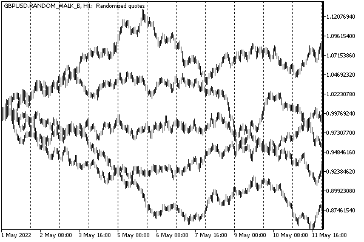
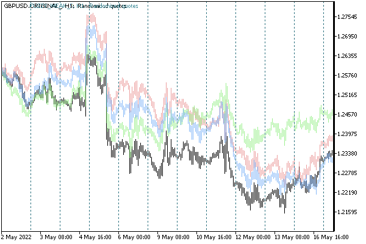
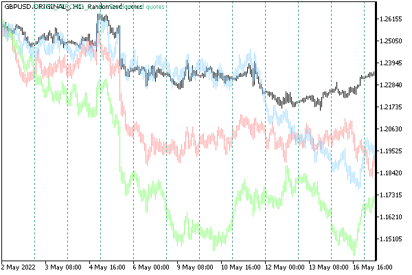

# Adding, replacing, and deleting quotes

A custom symbol is populated quotes by two built-in functions: CustomRatesUpdate and CustomRatesReplace. At the input, in addition to the name of the symbol, both expect an array of structures [MqlRates](/en/book/applications/timeseries/timeseries_mqlrates) for the M1 timeframe (higher timeframes are completed automatically from M1). CustomRatesReplace has an additional pair of parameters (from and to) that define the time range to which history editing is limited.

int CustomRatesUpdate(const string symbol, const MqlRates &rates[], uint count = WHOLE_ARRAY)

int CustomRatesReplace(const string symbol, datetime from, datetime to, const MqlRates &rates[], uint count = WHOLE_ARRAY)

CustomRatesUpdate adds missing bars to the history and replaces existing matching bars with data from the array.

CustomRatesReplace completely replaces the history in the specified time interval with the data from the array.

The difference between the functions is due to different scenarios of the intended application. The differences are listed in more detail in the following table.

| CustomRatesUpdate | CustomRatesReplace |
| --- | --- |
| Applies the elements of the passed MqlRates array to the history, regardless of their timestamps | Applies only those elements of the passed MqlRates array that fall within the specified range |
| Leaves untouched in the history those M1 bars that were already there before the function call and do not coincide in time with the bars in the array | Leaves untouched all history out of range |
| Replaces existing history bars with the bars from the array when timestamps match | Completely deletes existing history bars in the specified range |
| Inserts elements from the array as "new" bars if there are no matches with the old bars | Inserts the bars from the array that fall within the relevant range into the specified history range |

Data in the rates array must be represented by valid OHLC prices, and bar opening times must not contain seconds.

An interval within from and to is set inclusive: from is equal to the time of the first bar to be processed and to is equal to the time of the last.

The following diagram illustrates these rules more clearly. Each unique timestamp for a bar is designated by its own Latin letter. Available bars in the history are shown in capital letters, while bars in the array are shown in lowercase. The character '-' is a gap in the history or in the array for the corresponding time.

```
History                        ABC-EFGHIJKLMN-PQRST------    B
Array                          -------hijk--nopqrstuvwxyz    A
Result of CustomRatesUpdate    ABC-EFGhijkLMnopqrstuvwxyz    R
Result of CustomRatesReplace   ABC-E--hijk--nopqrstuvw---    S
                                    ^                ^
                                    |from          to|    TIME

```

The optional parameter count sets the number of elements in the rates array that should be used (others will be ignored). This allows you to partially process the passed array. The default value WHOLE_ARRAY means the entire array.

The quotes history of a custom symbol can be deleted entirely or partially using the CustomRatesDelete function.

int CustomRatesDelete(const string symbol, datetime from, datetime to)

Here, the parameters from and to also set the time range of removed bars. To cover the entire history, specify 0 and LONG_MAX.

All three functions return the number of processed bars: updated or deleted. In case of an error, the result is -1.

It should be noted that quotes of a custom symbol can be formed not only by adding ready-made bars but also by arrays of ticks or even a sequence of individual ticks. The relevant functions will be presented in the [next section](/en/book/advanced/custom_symbols/custom_symbols_ticks). When adding ticks, the terminal will automatically calculate bars based on them. The difference between these methods is that the custom tick history allows you to test MQL programs in the "real" ticks mode, while the history of bars only will force you to either limit yourself to the OHLC M1 or open price modes or rely on the tick emulation implemented by the tester.

In addition, adding ticks one at a time allows you to simulate standard events OnTick and OnCalculate on the chart of a custom symbol, which "animates" the chart similar to tools available online, and launches the corresponding handler functions in MQL programs if they are plotted on the chart. But we will talk about this in the next section.

As an example of using new functions, let's consider the script CustomSymbolRandomRates.mq5. It is designed to generate random quotes on the principle of "random walk" or noise existing quotes. The latter can be used to assess the stability of an Expert Advisor.

To check the correctness of the formation of quotes, we will also support the mode in which a complete copy of the original instrument is created, on the chart of which the script was launched.

All modes are collected in the RANDOMIZATION enumeration.

```
enum RANDOMIZATION
{
   ORIGINAL,
   RANDOM_WALK,
   FUZZY_WEAK,
   FUZZY_STRONG,
};

```

We implement quotes noise with two levels of intensity: weak and strong.

In the input parameters, you can choose, in addition to the mode, a folder in the symbol hierarchy, a date range, and a number to initialize the random generator (to be able to reproduce the results).

```
input string CustomPath = "MQL5Book\\Part7";    // Custom Symbol Folder
input RANDOMIZATION RandomFactor = RANDOM_WALK;
input datetime _From;                           // From (default: 120 days ago)
input datetime _To;                             // To (default: current time)
input uint RandomSeed = 0;

```

By default, when no dates are specified, the script generates quotes for the last 120 days. The value 0 in the RandomSeed parameter means random initialization.

The name of the symbol is generated based on the symbol of the current chart and the selected settings.

```
const string CustomSymbol = _Symbol + "." + EnumToString(RandomFactor)
   + (RandomSeed ? "_" + (string)RandomSeed : "");

```

At the beginning of OnStart we will prepare and check the data.

```
datetime From;
datetime To;
   
void OnStart()
{
   From = _From == 0 ? TimeCurrent() - 60 * 60 * 24 * 120 : _From;
   To = _To == 0 ? TimeCurrent() / 60 * 60 : _To;
   if(From > To)
   {
      Alert("Date range must include From <= To");
      return;
   }
   
   if(RandomSeed != 0) MathSrand(RandomSeed);
   ...

```

Since the script will most likely need to be run several times, we will provide the ability to delete the custom symbol created earlier, with a preliminary confirmation request from the user.

```
   bool custom = false;
   if(PRTF(SymbolExist(CustomSymbol, custom)) && custom)
   {
      if(IDYES == MessageBox(StringFormat("Delete custom symbol '%s'?", CustomSymbol),
         "Please, confirm", MB_YESNO))
      {
         if(CloseChartsForSymbol(CustomSymbol))
         {
            Sleep(500); // wait for the changes to take effect (opportunistically)
            PRTF(CustomRatesDelete(CustomSymbol, 0, LONG_MAX));
            PRTF(SymbolSelect(CustomSymbol, false));
            PRTF(CustomSymbolDelete(CustomSymbol));
         }
      }
   }
   ...

```

The helper function CloseChartsForSymbol is not shown here (those who wish can look at the attached source code): its purpose is to view the list of open charts and close those where the working symbol is the custom symbol being deleted (without this, the deletion will not work).

More important is to pay attention to calling CustomRatesDelete with a full range of dates. If it is not done, the data of the previous user symbol will remain on the disk for a while in the history database (folder bases/Custom/history/<symbol-name>). In other words, the CustomSymbolDelete call, which is shown in the last line above, is not enough to actually clear the custom symbol from the terminal.

If the user decides to immediately create a symbol with the same name again (and we provide such an opportunity in the code below), then the old quotes can be mixed into the new ones.

Further, upon the user's confirmation, the process of generating quotes is launched. This is done by the GenerateQuotes function (see further).

```
   if(IDYES == MessageBox(StringFormat("Create new custom symbol '%s'?", CustomSymbol),
      "Please, confirm", MB_YESNO))
   {
      if(PRTF(CustomSymbolCreate(CustomSymbol, CustomPath, _Symbol)))
      {
         if(RandomFactor == RANDOM_WALK)
         {
            CustomSymbolSetInteger(CustomSymbol, SYMBOL_DIGITS, 8);
         }
         
         CustomSymbolSetString(CustomSymbol, SYMBOL_DESCRIPTION, "Randomized quotes");
      
         const int n = GenerateQuotes();
         Print("Bars M1 generated: ", n);
         if(n > 0)
         {
            SymbolSelect(CustomSymbol, true);
            ChartOpen(CustomSymbol, PERIOD_M1);
         }
      }
   }

```

If successful, the newly created symbol is selected in Market Watch and a chart opens for it. Along the way, setting a pair of properties is demonstrated here: SYMBOL_DIGITS and SYMBOL_DESCRIPTION.

In the function GenerateQuotes it is required to request quotes of the original symbol for all modes except RANDOM_WALK.

```
int GenerateQuotes()
{
   MqlRates rates[];
   MqlRates zero = {};
   datetime start;     // time of the current bar
   double price;       // last closing price
   
   if(RandomFactor != RANDOM_WALK)
   {
      if(PRTF(CopyRates(_Symbol, PERIOD_M1, From, To, rates)) <= 0)
      {
         return 0; // error
      }
      if(RandomFactor == ORIGINAL)
      {
         return PRTF(CustomRatesReplace(CustomSymbol, From, To, rates));
      }
      ...

```

It is important to recall that CopyRates is affected by the limit on the number of bars on the chart, which is set in the terminal settings, affects.

In the case of ORIGINAL mode, we simply forward the resulting array rates into the CustomRatesReplace function. For noise modes, we set the specially selected price and start variables to the initial values of price and time from the first bar.

```
      price = rates[0].open;
      start = rates[0].time;
   }
   ...

```

In random walk mode, quotes are not needed, so we just allocate the rates array for future random M1 bars.

```
   else
   {
      ArrayResize(rates, (int)((To - From) / 60) + 1);
      price = 1.0;
      start = From;
   }
   ...

```

Further in the loop through the rates array, random values are added either to the noisy prices of the original symbol or "as is". In the RANDOM_WALK mode, we ourselves are responsible for increasing the time in the variable start. In other modes, the time is already in the initial quotes.

```
   const int size = ArraySize(rates);
   
   double hlc[3]; // future High Low Close (in unknown order)
   for(int i = 0; i < size; ++i)
   {
      if(RandomFactor == RANDOM_WALK)
      {
         rates[i] = zero;             // zeroing the structure
         rates[i].time = start += 60; // plus a minute to the last bar
         rates[i].open = price;       // start from the last price
         hlc[0] = RandomWalk(price);
         hlc[1] = RandomWalk(price);
         hlc[2] = RandomWalk(price);
      }
      else
      {
         double delta = 0;
         if(i > 0)
         {
            delta = rates[i].open - price; // cumulative correction
         }
         rates[i].open = price;
         hlc[0] = RandomWalk(rates[i].high - delta);
         hlc[1] = RandomWalk(rates[i].low - delta);
         hlc[2] = RandomWalk(rates[i].close - delta);
      }
      ArraySort(hlc);
      
      rates[i].high = fmax(hlc[2], rates[i].open);
      rates[i].low = fmin(hlc[0], rates[i].open);
      rates[i].close = price = hlc[1];
      rates[i].tick_volume = 4;
   }
   ...

```

Based on the closing price of the last bar, 3 random values are generated (using the RandomWalk function). The maximum and minimum of them become, respectively, the prices High and Low of a new bar. The average is the price Close.

At the end of the loop, we pass the array to CustomRatesReplace.

```
   return PRTF(CustomRatesReplace(CustomSymbol, From, To, rates));
}

```

In the RandomWalk function, an attempt was made to simulate a distribution with wide tails, which is typical for real quotes.

```
double RandomWalk(const double p)
{
   const static double factor[] = {0.0, 0.1, 0.01, 0.05};
   const static double f = factor[RandomFactor] / 100;
   const double r = (rand() - 16383.0) / 16384.0; // [-1,+1]
   const int sign = r >= 0 ? +1 : -1;
   if(r != 0)
   {
      return p + p * sign * f * sqrt(-log(sqrt(fabs(r))));
   }
   return p;
}

```

The scatter coefficients of random variables depend on the mode. For example, weak noise adds (or subtracts) a maximum of 1 hundredth of a percent, and strong noise adds 5 hundredths of a percent of the price.

While running, the script outputs a detailed log like this one:

```
Create new custom symbol 'GBPUSD.RANDOM_WALK'?
CustomSymbolCreate(CustomSymbol,CustomPath,_Symbol)=true / ok
CustomRatesReplace(CustomSymbol,From,To,rates)=171416 / ok
Bars M1 generated: 171416

```

Let's see what we get as a result.

The following image shows several implementations of a random walk (the visual overlay is done in a graphical editor, in reality, each custom symbol opens in a separate window as usual).



Quote options for custom symbols with random walk

And here is how noisy GBPUSD quotes look like (original in black, color with noise). First, in a weak version.



GBPUSD quotes with low noise

And then with strong noise.



GBPUSD quotes with strong noise

Larger discrepancies are obvious, though with the preservation of local features.
