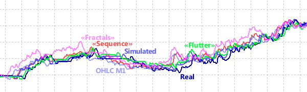
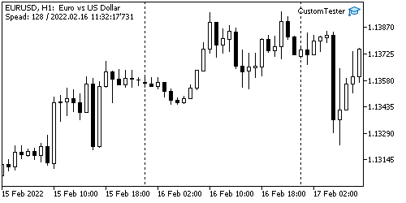
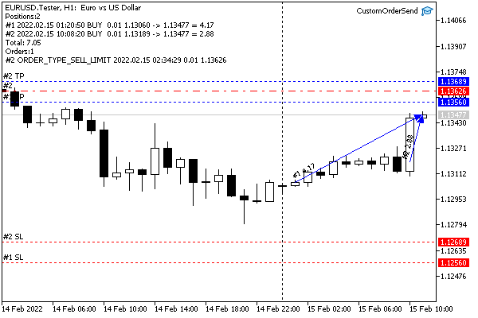
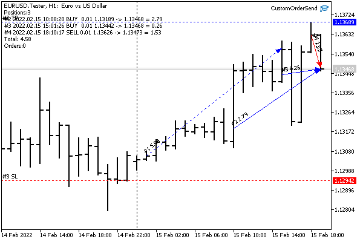

# Adding, replacing, and removing ticks

The MQL5 API allows you to generate the history of a custom symbol not only at the bar level but also at the tick level. Thus, it is possible to achieve greater realism when testing and optimizing Expert Advisors, as well as to emulate real-time updating of charts of custom symbols, broadcasting your ticks to them. The set of ticks transferred to the system is automatically taken into account when forming bars. In other words, there is no need to call the functions from the previous section that operate on structures MqlRates, if more detailed information about price changes for the same period is provided in the form of ticks, namely the [MqlTick](/en/book/applications/timeseries/timeseries_ticks_mqltick) arrays of structures. The only advantage of per-bar MqlRates quotes is the performance and memory efficiency.

There are two functions for adding ticks: CustomTicksAdd and CustomTicksReplace. The first one adds interactive ticks that arrive at the Market Watch window (from which they are automatically transferred by the terminal to the tick database) and that generate corresponding events in MQL programs. The second one writes ticks directly to the tick database.

int CustomTicksAdd(const string symbol, const MqlTick &ticks[], uint count = WHOLE_ARRAY)

The CustomTicksAdd function adds data from the ticks array to the price history of a custom symbol specified in symbol. By default, if the count setting is equal to WHOLE_ARRAY, the entire array is added. If necessary, you can specify a smaller number and download only a part of the ticks.

Please note that the custom symbol must be selected in the Market Watch window by the time of the function call. For symbols not selected in Market Watch, you need to use the CustomTicksReplace function (see further).

The array of tick data must be sorted by time in ascending order, i.e. it is required that the following conditions are met: ticks[i].time_msc <= ticks[j].time_msc for all i < j.

The function returns the number of added ticks or -1 in case of an error.

The CustomTicksAdd function broadcasts ticks to the chart in the same way as if they came from the broker's server. Usually, the function is applied for one or more ticks. In this case, they are "played" in the Market Watch window, from which they are saved in the tick database.

However, when a large amount of data is transferred in one call, the function changes its behavior to save resources. If more than 256 ticks are transmitted, they are divided into two parts. The first part (large) is immediately written directly to the tick database (as does CustomTicksReplace). The second part, consisting of the last (most recent) 128 ticks, is passed to the Market Watch window, and after that is saved by the terminal in the database.

The MqlTick structure has two fields with time values: time (tick time in seconds) and time_msc (tick time in milliseconds). Both values are dated starting from 01/01/1970. The filled (non-null) time_msc field takes precedence over time. Note that time is filled in seconds as a result of recalculation based on the formula time_msc / 1000. If the time_msc field is zero, the value from the time field is used, and the time_msc field in turn gets the value in milliseconds from the formula time * 1000. If both fields are equal to zero, the current server time (accurate to milliseconds) is put into a tick.

Of the two fields describing the volume, volume_real has a higher priority than volume.

Depending on what other fields are filled in a particular array element (structure MqlTick), the system sets flags for the saved tick in the flags field:

- ticks[i].bid — TICK_FLAG_BID (the tick changed the Bid price)
- ticks[i].ask — TICK_FLAG_ASK (the tick changed the Ask price)
- ticks[i].last — TICK_FLAG_LAST (the tick changed the price of the last trade)
- ticks[i].volume or ticks[i].volume_real — TICK_FLAG_VOLUME (the tick changed volume)

If the value of some field is less than or equal to zero, the corresponding flag is not written to the flags field.

The TICK_FLAG_BUY and TICK_FLAG_SELL flags are not added to the history of a custom symbol.

The CustomTicksReplace function completely replaces the price history of the custom symbol in the specified time interval with the data from the passed array.

int CustomTicksReplace(const string symbol, long from_msc, long to_msc,  

   const MqlTick &ticks[], uint count = WHOLE_ARRAY)

The interval is set by the parameters from_msc and to_msc, in milliseconds since 01/01/1970. Both values are included in the interval.

The array ticks must be ordered in chronological order of ticks' arrival, which corresponds to increasing, or rather, non-decreasing time since ticks with the same time often occur in a row in a stream with millisecond accuracy.

The count parameter can be used to process a part of the array.

The ticks are replaced sequentially day by day before the time specified in to_msc, or until an error occurs in the tick order. The first day in the specified range is processed first, then goes the next day, and so on. As soon as a discrepancy between the tick time and the ascending (non-decreasing) order is detected, the tick replacement process stops on the current day. In this case, the ticks for the previous days will be successfully replaced, while the current day (at the time of the wrong tick) and all remaining days in the specified interval will remain unchanged. The function will return -1, with the error code in _LastError being 0 ("no error").

If the ticks array does not have data for some period within the general interval between from_msc and to_msc (inclusive), then after executing the function, the history of the custom symbol will have a gap corresponding to the missing data.

If there is no data in the tick database in the specified time interval, CustomTicksReplace will add ticks to it from the array ticks.

The CustomTicksDelete function can be used to delete all ticks in the specified time interval.

int CustomTicksDelete(const string symbol, long from_msc, long to_msc)

The name of the custom symbol being edited is set in the symbol parameter, and the interval to be cleared is set by the parameters from_msc and to_msc (inclusive), in milliseconds.

The function returns the number of ticks removed or -1 in case of an error.

Attention! Deleting ticks with CustomTicksDelete leads to the automatic removal of the corresponding bars! However, calling CustomRatesDelete, i.e., removing bars, does not remove ticks!

To master the material in practice, we will solve several applied problems using the newly considered functions.

To begin with, let's touch on such an interesting task as creating a custom symbol based on a real symbol but with a reduced tick density. This will speed up testing and optimization, as well as reduce resource consumption (primarily RAM) compared to the mode based on real ticks while maintaining an acceptable, close to ideal, quality of the process.

Speeding up testing and optimization  

   

Traders often seek ways to speed up Expert Advisor optimization and testing processes. Among the possible solutions, there are obvious ones, for which you can simply change the settings (when it is allowed), and there are more time-consuming ones that require the adaptation of an Expert Advisor or a test environment.   

   

Among the first type of solutions are:   

   

· Reducing the optimization space by eliminating some parameters or reducing their step;  

· Reducing the optimization period;  

· Switching to the tick simulation mode of lower quality (for example, from real ones to OHLC M1);  

· Enabling profit calculation in points instead of money;  

· Upgrading the computer;  

· Using MQL Cloud or additional local network computers.  

   

 Among the second type of development-related solutions are:  

   

· Code profiling, on the basis of which you can eliminate "bottlenecks" in the code;  

· If possible, use the resource-efficient calculation of indicators, that is, without the [ #property tester_everytick_calculate](/en/book/applications/indicators_make/indicators_test) directive;  

· Transferring indicator algorithms (if they are used) directly into the Expert Advisor code: indicator calls impose certain overhead costs;  

· Eliminating graphics and objects;  

· Caching calculations, if possible;  

· Reducing the number of simultaneously open positions and placed orders (their calculation on each tick can become noticeable with a large number);  

· Full virtualization of settlements, orders, deals, and positions: the built-in accounting mechanism, due to its versatility, multicurrency support, and other features, has its own overheads, which can be eliminated by performing similar actions in the MQL5 code (although this option is the most time-consuming).  

   

 Tick density reduction belongs to an intermediate type of solution: it requires the programmatic creation of a custom symbol but does not affect the source code of the Expert Advisor.

A custom symbol with reduced ticks will be generated by the script CustomSymbolFilterTicks.mq5. The initial instrument will be the working symbol of the chart on which the script is launched. In the input parameters, you can specify the folder for the custom symbol and the start date for history processing. By default, if no date is given, the calculation is made for the last 120 days.

```
input string CustomPath = "MQL5Book\\Part7"; // Custom Symbol Folder
input datetime _Start;                       // Start (default: 120 days back)

```

The name of the symbol is formed from the name of the source instrument and the ".TckFltr" suffix. Later we will add to it the designation of the tick reducing method.

```
string CustomSymbol = _Symbol + ".TckFltr";
const uint DailySeconds = 60 * 60 * 24;
datetime Start = _Start == 0 ? TimeCurrent() - DailySeconds * 120 : _Start;

```

For convenience, in the OnStart handler, it is possible to delete a previous copy of a symbol if it already exists.

```
void OnStart()
{
   bool custom = false;
   if(PRTF(SymbolExist(CustomSymbol, custom)) && custom)
   {
      if(IDYES == MessageBox(StringFormat("Delete existing custom symbol '%s'?", CustomSymbol),
         "Please, confirm", MB_YESNO))
      {
         SymbolSelect(CustomSymbol, false);
         CustomRatesDelete(CustomSymbol, 0, LONG_MAX);
         CustomTicksDelete(CustomSymbol, 0, LONG_MAX);
         CustomSymbolDelete(CustomSymbol);
      }
      else
      {
         return;
      }
   }

```

Next, upon the consent of the user, a symbol is created. The history is filled with tick data in the auxiliary function GenerateTickData. If successful, the script adds a new symbol to Market Watch and opens the chart.

```
   if(IDYES == MessageBox(StringFormat("Create new custom symbol '%s'?", CustomSymbol),
      "Please, confirm", MB_YESNO))
   {
      if(PRTF(CustomSymbolCreate(CustomSymbol, CustomPath, _Symbol)))
      {
         CustomSymbolSetString(CustomSymbol, SYMBOL_DESCRIPTION, "Prunned ticks by " + EnumToString(Mode));
         if(GenerateTickData())
         {
            SymbolSelect(CustomSymbol, true);
            ChartOpen(CustomSymbol, PERIOD_H1);
         }
      }
   }
}

```

The GenerateTickData function processes ticks in a loop in portions, per day. Ticks per day are requested by calling CopyTicksRange. Then they need to be reduced in one way or another, which is implemented by the TickFilter class which we will show below. Finally, the tick array is added to the custom symbol history using CustomTicksReplace.

```
bool GenerateTickData()
{
   bool result = true;
   datetime from = Start / DailySeconds * DailySeconds; // round up to the beginning of the day
   ulong read = 0, written = 0;
   uint day = 0;
   const uint total = (uint)((TimeCurrent() - from) / DailySeconds + 1);
   MqlTick array[];
   
   while(!IsStopped() && from < TimeCurrent())
   {
      Comment(TimeToString(from, TIME_DATE), " ", day++, "/", total);
      
      const int r = CopyTicksRange(_Symbol, array, COPY_TICKS_ALL,
         from * 1000L, (from + DailySeconds) * 1000L - 1);
      if(r < 0)
      {
         Alert("Error reading ticks at ", TimeToString(from, TIME_DATE));
         result = false;
         break;
      }
      read += r;
      
      if(r > 0)
      {
         const int t = TickFilter::filter(Mode, array);
         const int w = CustomTicksReplace(CustomSymbol,
            from * 1000L, (from + DailySeconds) * 1000L - 1, array);
         if(w <= 0)
         {
            Alert("Error writing custom ticks at ", TimeToString(from, TIME_DATE));
            result = false;
            break;
         }
         written += w;
      }
      from += DailySeconds;
   }
   
   if(read > 0)
   {
      PrintFormat("Done ticks - read: %lld, written: %lld, ratio: %.1f%%",
         read, written, written * 100.0 / read);
   }
   Comment("");
   return result;
}

```

Error control and counting of processed ticks are implemented at all stages. It the end, we output to the log the number of initial and remaining ticks, as well as the "compression" factor.

Now let's turn directly to the tick reducing technique. Obviously, there can be many approaches, with each of them being better or worse suited to a specific trading strategy. We will offer 3 basic versions combined in the class TickFilter (TickFilter.mqh). Also, to complete the picture, the mode of copying ticks without reduction is also supported.

Thus, the following modes are implemented in the class:

- No reduction
- Skipping sequences of ticks with a monotonous price change without a reversal (a la "zig-zag")
- Skipping price fluctuations within the spread
- Recording only ticks with a fractal configuration when the Bid or Ask price represents an extremum between two adjacent ticks

These modes are described as elements of the FILTER_MODE enumeration.

```
class TickFilter
{
public:
   enum FILTER_MODE
   {
      NONE,
      SEQUENCE,
      FLUTTER,
      FRACTALS,
   };
   ...

```

Each of the modes is implemented by a separate static method that accepts as input an array of ticks that needs to be thinned out. Editing an array is performed in place (without allocating a new output array).

```
   static int filterBySequences(MqlTick &data[]);
   static int filterBySpreadFlutter(MqlTick &data[]);
   static int filterByFractals(MqlTick &data[]);

```

All methods return the number of ticks left (reduced array size).

To unify the execution of the procedure in different modes, the filter method is provided. For the mode NONE the data array stays the same.

```
   static int filter(FILTER_MODE mode, MqlTick &data[])
   {
      switch(mode)
      {
      case SEQUENCE: return filterBySequences(data);
      case FLUTTER: return filterBySpreadFlutter(data);
      case FRACTALS: return filterByFractals(data);
      }
      return ArraySize(data);
   }

```

For example, here is how filtering by monotonous sequences of ticks is implemented in the filterBySequences method.

```
   static int filterBySequences(MqlTick &data[])
   {
      const int size = ArraySize(data);
      if(size < 3) return size;
      
      int index = 2;
      bool dirUp = data[1].bid - data[0].bid + data[1].ask - data[0].ask > 0;
      
      for(int i = 2; i < size; i++)
      {
         if(dirUp)
         {
            if(data[i].bid - data[i - 1].bid + data[i].ask - data[i - 1].ask < 0)
            {
               dirUp = false;
               data[index++] = data[i];
            }
         }
         else
         {
            if(data[i].bid - data[i - 1].bid + data[i].ask - data[i - 1].ask > 0)
            {
               dirUp = true;
               data[index++] = data[i];
            }
         }
      }
      return ArrayResize(data, index);
   }

```

And here is what fractal thinning looks like.

```
   static int filterByFractals(MqlTick &data[])
   {
      int index = 1;
      const int size = ArraySize(data);
      if(size < 3) return size;
      
      for(int i = 1; i < size - 2; i++)
      {
         if((data[i].bid < data[i - 1].bid && data[i].bid < data[i + 1].bid)
         || (data[i].ask > data[i - 1].ask && data[i].ask > data[i + 1].ask))
         {
            data[index++] = data[i];
         }
      }
      
      return ArrayResize(data, index);
   }

```

Let's sequentially create a custom symbol for EURUSD in several tick density reduction modes and compare their performance, i.e., the degree of "compression", how fast the testing will be, and how the trading performance of the Expert Advisor will change.

For example, thinning out sequences of ticks gives the following results (for a one-and-a-half-year history on MQ Demo).

```
   Create new custom symbol 'EURUSD.TckFltr-SE'?
   Fixing SYMBOL_TRADE_TICK_VALUE: 0.0 <<< 1.0
   true  SYMBOL_TRADE_TICK_VALUE 1.0 -> SUCCESS (0)
   Fixing SYMBOL_TRADE_TICK_SIZE: 0.0 <<< 1e-05
   true  SYMBOL_TRADE_TICK_SIZE 1e-05 -> SUCCESS (0)
   Number of found discrepancies: 2
   Fixed
   Done ticks - read: 31553509, written: 16927376, ratio: 53.6%

```

For modes of smoothing fluctuations and for fractals, the indicators are different:

```
   EURUSD.TckFltr-FL will be updated
   Done ticks - read: 31568782, written: 22205879, ratio: 70.3%
   ...   
   Create new custom symbol 'EURUSD.TckFltr-FR'?
   ...
   Done ticks - read: 31569519, written: 12732777, ratio: 40.3%

```

For practical trading experiments based on compressed ticks, we need an Expert Advisor. Let's take the adapted version of BandOsMATicks.mq5, in which, compared to the [original](/en/book/automation/tester/tester_testerstatistics), trading on each tick is enabled (in the method SimpleStrategy::trade the lineif(lastBar == iTime(_Symbol, _Period, 0)) return false; is disabled), and the values of signal indicators are taken from bars 0 and 1 (previously there were only completed bars 1 and 2).

Let's run the Expert Advisor using the dates range from the beginning of 2021 to June 1, 2022. The settings are attached in the file MQL5/Presets/MQL5Book/BandOsMAticks.set. The general behavior of the balance curve in all modes is quite similar.



Combined charts of test balances in different modes by ticks

The shift of equivalent extremums of different curves horizontally is caused by the fact that the standard report chart uses not the time but the number of trades for the horizontal coordinate, which, of course, differs due to the accuracy of triggering trading signals for different tick bases.

The differences in performance metrics are shown in the following table (N - number of trades, $ - profit, PF - profit factor, RF - recovery factor, DD - drawdown):

| Mode | Ticks | Time  
 mm:ss.msec | Memory | N | $ | PF | RF | DD |
| --- | --- | --- | --- | --- | --- | --- | --- | --- |
| Real | 31002919 | 02:45.251 | 835 Mb | 962 | 166.24 | 1.32 | 2.88 | 54.99 |
| Emulation | 25808139 | 01:58.131 | 687 Mb | 928 | 171.94 | 1.34 | 3.44 | 47.64 |
| OHLC M1 | 2084820 | 00:11.094 | 224 Mb | 856 | 193.52 | 1.39 | 3.97 | 46.55 |
| Sequence | 16310236 | 01:24.784 | 559 Mb | 860 | 168.95 | 1.34 | 2.92 | 55.16 |
| Flutter | 21362616 | 01:52.172 | 623 Mb | 920 | 179.75 | 1.37 | 3.60 | 47.28 |
| Fractal | 12270854 | 01:04.756 | 430 Mb | 866 | 142.19 | 1.27 | 2.47 | 54.80 |

We will consider the test based on real ticks to be the most reliable and evaluate the rest by how close it is to this test. Obviously, the OHLC M1 mode showed the highest speed and lower resource costs due to a significant loss of accuracy (the mode at opening prices was not considered). It exhibits over-optimistic financial results.

Among the three modes with artificially compressed ticks, "Sequence" is the closest to the real one in terms of a set of indicators. It is 2 times faster than the real one in terms of time and is 1.5 times more efficient in terms of memory consumption. The "Flutter" mode seems to better preserve the original number of trades. The fastest and least memory-demanding fractal mode, of course, takes more time and resources than OHLC M1, but it does not overestimate trading scores.

Keep in mind that tick reduction algorithms may work differently or, conversely, give poor results with different trading strategies, financial instruments, and even the tick history of a particular broker. Conduct research with your Expert Advisors and in your work environment.

As part of the second example of working with custom symbols, let's consider an interesting feature provided by tick translation using CustomTicksAdd.

Many traders use trading panels — programs with interactive controls for performing arbitrary trading actions manually. You have to practice working with them mainly online because the tester imposes some restrictions. First of all, the tester does not support on-chart events and objects. This causes the controls to stop functioning. Also, in the tester, you cannot apply arbitrary objects for graphics markup.

Let's try to solve these problems.

We can generate a custom symbol based on historical ticks in slow motion. Then the chart of such a symbol will become an analog of a visual tester.

This approach has several advantages:

- Standard behavior of all chart events
- Interactive application and setting of indicators
- Interactive application and adjustment of objects
- Timeframe switching on the go
- Test on history up to the current time, including today (the standard tester does not allow testing today)

Regarding the last point, we note that the developers of MetaTrader 5 deliberately prohibited checking trading on the last (current) day, although it is sometimes needed to quickly find errors (in the code or in the trading strategy).

It is also potentially interesting to modify prices on the go (increasing the spread, for example).

Based on the chart of such a custom symbol, later we can implement a manual trading emulator on historical data.

The symbol generator will be the non-trading Expert Advisor CustomTester.mq5. In its input parameters, we will provide an indication of the placement of a new custom symbol in the symbol hierarchy, the start date in the past for tick translation (and building custom symbol quotes), as well as a timeframe for the chart, which will be automatically opened for visual testing.

```
input string CustomPath = "MQL5Book\\Part7"; // Custom Symbol Folder
input datetime _Start;                       // Start (120-day indent by default)
input ENUM_TIMEFRAMES Timeframe = PERIOD_H1;

```

The name of the new symbol is constructed from the symbol name of the current chart and the ".Tester" suffix.

```
string CustomSymbol = _Symbol + ".Tester";

```

If the start date is not specified in the parameters, the Expert Advisor will indent back by 120 days from the current date.

```
const uint DailySeconds = 60 * 60 * 24;
datetime Start = _Start == 0 ? TimeCurrent() - DailySeconds * 120 : _Start;

```

Ticks will be read from the history of real ticks of the working symbol in batches for the whole day at once. The pointer to the day being read is stored in the Cursor variable.

```
bool FirstCopy = true;
// additionally 1 day ago, because otherwise, the chart will not update immediately
datetime Cursor = (Start / DailySeconds - 1) * DailySeconds; // round off at the border of the day

```

The ticks of one day to be reproduced will be requested in the Ticks array, from where they will be translated in small batches of size step to the chart of a custom symbol.

```
MqlTick Ticks[];       // ticks for the "current" day in the past
int Index = 0;         // position in ticks within a day
int Step = 32;         // fast forward 32 ticks at a time (default)
int StepRestore = 0;   // remember the speed for the duration of the pause
long Chart = 0;        // created custom symbol chart
bool InitDone = false; // sign of completed initialization

```

To play ticks at a constant rate, let's start the timer in OnInit.

```
void OnInit()
{
   EventSetMillisecondTimer(100);
}
   
void OnTimer()
{
   if(!GenerateData())
   {
      EventKillTimer();
   }
}

```

The ticks will be generated by the GenerateData function. Immediately after launching, when the InitDone flag is reset, we will try to create a new symbol or clear the old quotes and ticks if the custom symbol already exists.

```
bool GenerateData()
{
   if(!InitDone)
   {
      bool custom = false;
      if(PRTF(SymbolExist(CustomSymbol, custom)) && custom)
      {
         if(IDYES == MessageBox(StringFormat("Clean up existing custom symbol '%s'?",
            CustomSymbol), "Please, confirm", MB_YESNO))
         {
            PRTF(CustomRatesDelete(CustomSymbol, 0, LONG_MAX));
            PRTF(CustomTicksDelete(CustomSymbol, 0, LONG_MAX));
            Sleep(1000);
            MqlRates rates[1];
            MqlTick tcks[];
            if(PRTF(CopyRates(CustomSymbol, PERIOD_M1, 0, 1, rates)) == 1
            || PRTF(CopyTicks(CustomSymbol, tcks) > 0))
            {
               Alert("Can't delete rates and Ticks, internal error");
               ExpertRemove();
            }
         }
         else
         {
            return false;
         }
      }
      else
      if(!PRTF(CustomSymbolCreate(CustomSymbol, CustomPath, _Symbol)))
      {
         return false;
      }
      ... // (A)

```

At this point, we'll omit something at (A) and come back to this point later.

After creating the symbol, we select it in Market Watch and open a chart for it.

```
 SymbolSelect(CustomSymbol, true);
      Chart = ChartOpen(CustomSymbol, Timeframe);
      ... // (B)
      ChartSetString(Chart, CHART_COMMENT, "Custom Tester");
      ChartSetInteger(Chart, CHART_SHOW_OBJECT_DESCR, true);
      ChartRedraw(Chart);
      InitDone = true;
   }
   ...

```

A couple of lines (B) are missing here too; they are related to future improvements, but not required yet.

If the symbol has already been created, we start broadcasting ticks in batches of Step ticks, but no more than 256. This limitation is related to the specifics of the CustomTicksAdd function.

```
   else
   {
      for(int i = 0; i <= (Step - 1) / 256; ++i)
      if(Step > 0 && !GenerateTicks())
      {
         return false;
      }
   }
   return true;
}

```

The helper function GenerateTicks broadcasts ticks in batches of Step ticks (but not more than 256), reading them from the daily array Ticks by offset Index. When the array is empty or we have read it to the end, we request the next day's ticks by calling FillTickBuffer.

```
bool GenerateTicks()
{
   if(Index >= ArraySize(Ticks)) // daily array is empty or read to the end
   {
      if(!FillTickBuffer()) return false; // fill the array with ticks per day
   }
   
   const int m = ArraySize(Ticks);
   MqlTick array[];
   const int n = ArrayCopy(array, Ticks, 0, Index, fmin(fmin(Step, 256), m));
   if(n <= 0) return false;
   
   ResetLastError();
   if(CustomTicksAdd(CustomSymbol, array) != ArraySize(array) || _LastError != 0)
   {
      Print(_LastError); // in case of ERR_CUSTOM_TICKS_WRONG_ORDER (5310)
      ExpertRemove();
   }
   Comment("Speed: ", (string)Step, " / ", STR_TIME_MSC(array[n - 1].time_msc));
   Index += Step; // move forward by 'Step' ticks
   return true;
}

```

The FillTickBuffer function uses [CopyTicksRange](/en/book/applications/timeseries/timeseries_ticks_mqltick) for operation.

```
bool FillTickBuffer()
{
   int r;
   ArrayResize(Ticks, 0);
   do
   {
      r = PRTF(CopyTicksRange(_Symbol, Ticks, COPY_TICKS_ALL, Cursor * 1000L,
         (Cursor + DailySeconds) * 1000L - 1));
      if(r > 0 && FirstCopy)
      {
         // NB: this pre-call is only needed to display the chart
         // from "Waiting for update" state
         PRTF(CustomTicksReplace(CustomSymbol, Cursor * 1000L,
            (Cursor + DailySeconds) * 1000L - 1, Ticks));
         FirstCopy = false;
         r = 0;
      }
      Cursor += DailySeconds;
   }
   while(r == 0 && Cursor < TimeCurrent()); // skip non-trading days
   Index = 0;
   return r > 0;
}

```

When the Expert Advisor is stopped, we will also close the dependent chart (so that it is not duplicated at the next start).

```
void OnDeinit(const int)
{
   if(Chart != 0)
   {
      ChartClose(Chart);
   }
   Comment("");
}

```

At this point, the Expert Advisor could be considered complete, but there is a problem. The thing is that, for one reason or another, the properties of a custom symbol are not copied "as is" from the original working symbol, at least in the current implementation of the MQL5 API. This applies even to very important properties, such as SYMBOL_TRADE_TICK_VALUE, SYMBOL_TRADE_TICK_SIZE. If we print the values of these properties immediately after calling CustomSymbolCreate(CustomSymbol, CustomPath, _Symbol), we will see zeros there.

To organize the checking of properties, their comparison and, if necessary, correction, we have written a special class CustomSymbolMonitor (CustomSymbolMonitor.mqh) derived from [SymbolMonitor](/en/book/automation/symbols/symbols_info). You can study its internal structure on your own, while here we will only present the public interface.

Constructors allow you to create a custom symbol monitor, specifying an exemplary working symbol (by name in a string, or from The SymbolMonitor object) which serves as a source of settings.

```
class CustomSymbolMonitor: public SymbolMonitor
{
public:
   CustomSymbolMonitor(); // sample - _Symbol
   CustomSymbolMonitor(const string s, const SymbolMonitor *m = NULL);
   CustomSymbolMonitor(const string s, const string other);
   
   //set/replace sample symbol   
   void inherit(const SymbolMonitor &m);
   
   // copy all properties from the sample symbol in forward or reverse order
   bool setAll(const bool reverseOrder = true, const int limit = UCHAR_MAX);
   
   // check all properties against the sample, return the number of corrections
   int verifyAll(const int limit = UCHAR_MAX);
   
   // check the specified properties with the sample, return the number of corrections
   int verify(const int &properties[]);
   
   // copy the given properties from the sample, return true if they all applied
   bool set(const int &properties[]);
   
   // copy the specific property from the sample, return true if applied
   template<typename E>
   bool set(const E e);
   
   bool set(const ENUM_SYMBOL_INFO_INTEGER property, const long value) const
   {
      return CustomSymbolSetInteger(name, property, value);
   }
   
   bool set(const ENUM_SYMBOL_INFO_DOUBLE property, const double value) const
   {
      return CustomSymbolSetDouble(name, property, value);
   }
   
   bool set(const ENUM_SYMBOL_INFO_STRING property, const string value) const
   {
      return CustomSymbolSetString(name, property, value);
   }
};

```

Since custom symbols, unlike standard symbols, allow you to set your own properties, a triple of set methods has been added to the class. In particular, they are used to batch transfer the properties of a sample and check the success of these actions in other class methods.

We can now return to the custom symbol generator and its source code snippet, as indicated earlier by the comment (A).

```
      // (A) check important properties and set them in "manual" mode
      SymbolMonitor sm; // _Symbol
      CustomSymbolMonitor csm(CustomSymbol, &sm);
      int props[] = {SYMBOL_TRADE_TICK_VALUE, SYMBOL_TRADE_TICK_SIZE};
      const int d1 = csm.verify(props); // check and try to fix
      if(d1)
      {
         Print("Number of found discrepancies: ", d1); // number of edits
         if(csm.verify(props)) // check again
         {
            Alert("Custom symbol can not be created, internal error!");
            return false; // symbol cannot be used without successful edits
         }
         Print("Fixed");
      }

```

Now you can run the CustomTester.mq5 Expert Advisor and observe how quotes are dynamically formed in the automatically opened chart as well as how ticks are forwarded from history in the Market Watch window.

However, this is done at a constant rate of 32 ticks per 0.1 second. It is desirable to change the playback speed on the go at the request of the user, both up and down. Such control can be organized, for example, from the keyboard.

Therefore, you need to add the OnChartEvent handler. As we know, for the CHARTEVENT_KEYDOWN event, the program receives the code of the pressed key in the lparam parameter, and we pass it to the CheckKeys function (see below). A fragment (C), closely related to (B), had to be postponed for the time being and we will return to it shortly.

```
void OnChartEvent(const int id, const long &lparam, const double &dparam, const string &sparam)
{
   ... // (C)
   if(id == CHARTEVENT_KEYDOWN) // these events only arrive while the chart is active!
   {
      CheckKeys(lparam);
   }
}

```

In the CheckKeys function, we are processing the "up arrow" and "down arrow" keys to increase and decrease the playback speed. In addition, the "pause" key allows you to completely suspend the process of "testing" (transmission of ticks). Pressing "pause" again resumes work at the same speed.

```
void CheckKeys(const long key)
{
   if(key == VK_DOWN)
   {
      Step /= 2;
      if(Step > 0)
      {
         Print("Slow down: ", Step);
         ChartSetString(Chart, CHART_COMMENT, "Speed: " + (string)Step);
      }
      else
      {
         Print("Paused");
         ChartSetString(Chart, CHART_COMMENT, "Paused");
         ChartRedraw(Chart);
      }
   }
   else if(key == VK_UP)
   {
      if(Step == 0)
      {
         Step = 1;
         Print("Resumed");
         ChartSetString(Chart, CHART_COMMENT, "Resumed");
      }
      else
      {
         Step *= 2;
         Print("Speed up: ", Step);
         ChartSetString(Chart, CHART_COMMENT, "Speed: " + (string)Step);
      }
   }
   else if(key == VK_PAUSE)
   {
      if(Step > 0)
      {
         StepRestore = Step;
         Step = 0;
         Print("Paused");
         ChartSetString(Chart, CHART_COMMENT, "Paused");
         ChartRedraw(Chart);
      }
      else
      {
         Step = StepRestore;
         Print("Resumed");
         ChartSetString(Chart, CHART_COMMENT, "Speed: " + (string)Step);
      }
   }
}

```

The new code can be tested in action after first making sure that the chart on which the Expert Advisor works is active. Recall that keyboard events only go to the active window. This is another problem of our tester.

Since the user must perform trading actions on the custom symbol chart, the generator window will almost always be in the background. Switching to the generator window to temporarily stop the flow of ticks and then resume it is not practical. Therefore, it is required in some way to organize interactive control from the keyboard directly from the custom symbol window.

For this purpose, a special indicator is suitable, which we can automatically add to the custom symbol window that opens. The indicator will intercept keyboard events in its own window (window with a custom symbol) and send them to the generator window.

The source code of the indicator is attached in the file KeyboardSpy.mq5. Of course, the indicator does not have charts. A pair of input parameters is dedicated to getting the chart ID HostID, where messages should be send and custom event code EventID, in which interactive events will be packed.

```
#property indicator_chart_window
#property indicator_plots 0
   
input long HostID;
input ushort EventID;

```

The main work is done in the OnChartEvent handler.

```
void OnChartEvent(const int id, const long &lparam, const double &dparam, const string &sparam)
{
   if(id == CHARTEVENT_KEYDOWN)
   {
      EventChartCustom(HostID, EventID, lparam,
         // this is always 0 when inside iCustom
         (double)(ushort)TerminalInfoInteger(TERMINAL_KEYSTATE_CONTROL),
         sparam);
   }
}

```

Note that all of the "hotkeys" we have chosen are simple, that is, they do not use shortcuts with keyboard status keys, such as Ctrl or Shift. This was done by force because inside the indicators created programmatically (in particular, through iCustom), the keyboard state is not read. In other words, calling TerminalInfoInteger(TERMINAL_KEYSTATE_XYZ) always returns 0. In the handler above, we've added it just for demonstration purposes, so that you can verify this limitation if you wish, by displaying the incoming parameters on the "receiving side".

However, single arrow and pause clicks will be transferred to the parent chart normally, and that's enough for us. The only thing left to do is to integrate the indicator with the Expert Advisor.

In the previously skipped fragment (B), during the initialization of the generator, we will create an indicator and add it to the custom symbol chart.

```
#define EVENT_KEY 0xDED // custom event
      ...
      // (B)
      const int handle = iCustom(CustomSymbol, Timeframe, "MQL5Book/p7/KeyboardSpy",
         ChartID(), EVENT_KEY);
      ChartIndicatorAdd(Chart, 0, handle);

```

Further along, in fragment (C), we will ensure the receipt of user messages from the indicator and their transfer to the already known CheckKeys function.

```
void OnChartEvent(const int id, const long &lparam, const double &dparam, const string &sparam)
{
   // (C)
   if(id == CHARTEVENT_CUSTOM + EVENT_KEY) // notifications from the dependent chart when it is active
   {
      CheckKeys(lparam); // "remote" processing of key presses
   }
   else if(id == CHARTEVENT_KEYDOWN) // these events are only fired while the chart is active!
   {
      CheckKeys(lparam); // standard processing
   }
}

```

Thus, the playback speed can now be controlled both on the chart with the Expert Advisor and on the chart of the custom symbol generated by it.

With the new toolkit, you can try interactive work with a chart that "lives in the past". A comment with the current playback speed or a pause mark is displayed on the graph.

On the chart with the Expert Advisor, the time of the "current" broadcast ticks is displayed in the comment.



An Expert Advisor that reproduces the history of ticks (and quotes) of a real symbol

There is basically nothing for the user to do in this window (if only the Expert Advisor is deleted and custom symbol generation is stopped). The tick translation process itself is not visible here. Moreover, since the Expert Advisor automatically opens a custom symbol chart (where historical quotes are updated), it is this one that becomes active. To get the above screenshot, we specifically needed to briefly switch to the original chart.

Therefore, let's return to the chart of the custom symbol. The way it is smoothly and progressively updated in the past is already great, but you can’t conduct trading experiments on it. For example, if you run your usual trading panel on it, its controls, although they will formally work, will not execute deals since the custom symbol does not exist on the server, and thus you will get errors. This feature is observed in any programs that are not specially adapted for custom symbols. Let's show an example of how trading with a custom symbol can be virtualized.

Instead of a trading panel (in order to simplify the example, but without loss of generality), we will take as a basis the simplest Expert Advisor, CustomOrderSend.mq5, which can perform several trading actions on keystrokes:

- 'B' — market buy
- 'S' — market sell
- 'U' — placing a limit buy order
- 'L' — placing a limit sell order
- 'C' — close all positions
- 'D' — delete all orders
- 'R' — output a trading report to the journal

In the Expert Advisor input parameters, we will set the volume of one trade (by default, the minimum lot) and the distance to the stop loss and take profit levels in points.

```
input double Volume;           // Volume (0 = minimal lot)
input int Distance2SLTP = 0;   // Distance to SL/TP in points (0 = no)
   
const double Lot = Volume == 0 ? SymbolInfoDouble(_Symbol, SYMBOL_VOLUME_MIN) : Volume;

```

If Distance2SLTP is left equal to zero, no protective levels are placed in market orders, and pending orders are not formed. When Distance2SLTP has a non-zero value, it is used as the distance from the current price when placing a pending order (either up or down, depending on the command).

Taking into account the previously presented classes from [MqlTradeSync.mqh](/en/book/automation/experts/experts_market_buy_sell), the above logic is converted to the following source code.

```
#include <MQL5Book/MqlTradeSync.mqh>
   
#define KEY_B 66
#define KEY_C 67
#define KEY_D 68
#define KEY_L 76
#define KEY_R 82
#define KEY_S 83
#define KEY_U 85
   
void OnChartEvent(const int id, const long &lparam, const double &dparam, const string &sparam)
{
   if(id == CHARTEVENT_KEYDOWN)
   {
      MqlTradeRequestSync request;
      const double ask = SymbolInfoDouble(_Symbol, SYMBOL_ASK);
      const double bid = SymbolInfoDouble(_Symbol, SYMBOL_BID);
      const double point = SymbolInfoDouble(_Symbol, SYMBOL_POINT);
   
      switch((int)lparam)
      {
      case KEY_B:
         request.buy(Lot, 0,
            Distance2SLTP ? ask - point * Distance2SLTP : Distance2SLTP,
            Distance2SLTP ? ask + point * Distance2SLTP : Distance2SLTP);
         break;
      case KEY_S:
         request.sell(Lot, 0,
            Distance2SLTP ? bid + point * Distance2SLTP : Distance2SLTP,
            Distance2SLTP ? bid - point * Distance2SLTP : Distance2SLTP);
         break;
      case KEY_U:
         if(Distance2SLTP)
         {
            request.buyLimit(Lot, ask - point * Distance2SLTP);
         }
         break;
      case KEY_L:
         if(Distance2SLTP)
         {
            request.sellLimit(Lot, bid + point * Distance2SLTP);
         }
         break;
      case KEY_C:
         for(int i = PositionsTotal() - 1; i >= 0; i--)
         {
            request.close(PositionGetTicket(i));
         }
         break;
      case KEY_D:
         for(int i = OrdersTotal() - 1; i >= 0; i--)
         {
            request.remove(OrderGetTicket(i));
         }
         break;
      case KEY_R:
 // there should be something here...
         break;
      }
   }
}

```

As we can see, both standard trading API functions and MqlTradeRequestSync methods are used here. The latter, indirectly, also ends up calling a lot of built-in functions. We need to make this Expert Advisor trade with a custom symbol.

The simplest, albeit time-consuming idea is to replace all standard functions with their own analogs that would count orders, deals, positions, and financial statistics in some structures. Of course, this is possible only in cases where we have the source code of the Expert Advisor, which should be adapted.

An experimental implementation of the approach is demonstrated in the attached file CustomTrade.mqh. You can familiarize yourself with the full code on your own, since within the framework of the book we will list only the main points.

First of all, we note that many calculations are made in a simplified form, many modes are not supported, and a complete check of the data for correctness is not performed. Use the source code as a starting point for your own developments.

The entire code is wrapped in the CustomTrade namespace to avoid conflicts.

The order, deal, and position entities are formalized as the corresponding classes CustomOrder, CustomDeal, and CustomPosition. All of them are inheritors of the class [MonitorInterface<I,D,S> ::TradeState](/en/book/automation/experts/experts_trade_state). Recall that this class already automatically supports the formation of arrays of integer, real, and string properties for each type of object and its specific triples of enumerations. For example, CustomOrder looks like that:

```
class CustomOrder: public MonitorInterface<ENUM_ORDER_PROPERTY_INTEGER,
   ENUM_ORDER_PROPERTY_DOUBLE,ENUM_ORDER_PROPERTY_STRING>::TradeState
{
   static long ticket; // order counter and ticket provider
   static int done;    // counter of executed (historical) orders
public:
   CustomOrder(const ENUM_ORDER_TYPE type, const double volume, const string symbol)
   {
      _set(ORDER_TYPE, type);
      _set(ORDER_TICKET, ++ticket);
      _set(ORDER_TIME_SETUP, SymbolInfoInteger(symbol, SYMBOL_TIME));
      _set(ORDER_TIME_SETUP_MSC, SymbolInfoInteger(symbol, SYMBOL_TIME_MSC));
      if(type <= ORDER_TYPE_SELL)
      {
         // TODO: no deferred execution yet
         setDone(ORDER_STATE_FILLED);
      }
      else
      {
         _set(ORDER_STATE, ORDER_STATE_PLACED);
      }
      
      _set(ORDER_VOLUME_INITIAL, volume);
      _set(ORDER_VOLUME_CURRENT, volume);
      
      _set(ORDER_SYMBOL, symbol);
   }
   
   void setDone(const ENUM_ORDER_STATE state)
   {
      const string symbol = _get<string>(ORDER_SYMBOL);
      _set(ORDER_TIME_DONE, SymbolInfoInteger(symbol, SYMBOL_TIME));
      _set(ORDER_TIME_DONE_MSC, SymbolInfoInteger(symbol, SYMBOL_TIME_MSC));
      _set(ORDER_STATE, state);
      ++done;
   }
   
   bool isActive() const
   {
      return _get<long>(ORDER_TIME_DONE) == 0;
   }
   
   static int getDoneCount()
   {
      return done;
   }
};

```

Note that in the virtual environment of the old "current" time, you cannot use the TimeCurrent function and the last known time of the custom symbol SymbolInfoInteger(symbol, SYMBOL_TIME) is taken instead.

During virtual trading, current objects and their history are accumulated in arrays of the corresponding classes.

```
AutoPtr<CustomOrder> orders[];
CustomOrder *selectedOrders[];
CustomOrder *selectedOrder = NULL;
AutoPtr<CustomDeal> deals[];
CustomDeal *selectedDeals[];
CustomDeal *selectedDeal = NULL;
AutoPtr<CustomPosition> positions[];
CustomPosition *selectedPosition = NULL;

```

The metaphor for selecting orders, deals, and positions was required to simulate a similar approach in built-in functions. For them, there are duplicates in the CustomTrade namespace that replace the originals using macro substitution directives.

```
#define HistorySelect CustomTrade::MT5HistorySelect
#define HistorySelectByPosition CustomTrade::MT5HistorySelectByPosition
#define PositionGetInteger CustomTrade::MT5PositionGetInteger
#define PositionGetDouble CustomTrade::MT5PositionGetDouble
#define PositionGetString CustomTrade::MT5PositionGetString
#define PositionSelect CustomTrade::MT5PositionSelect
#define PositionSelectByTicket CustomTrade::MT5PositionSelectByTicket
#define PositionsTotal CustomTrade::MT5PositionsTotal
#define OrdersTotal CustomTrade::MT5OrdersTotal
#define PositionGetSymbol CustomTrade::MT5PositionGetSymbol
#define PositionGetTicket CustomTrade::MT5PositionGetTicket
#define HistoryDealsTotal CustomTrade::MT5HistoryDealsTotal
#define HistoryOrdersTotal CustomTrade::MT5HistoryOrdersTotal
#define HistoryDealGetTicket CustomTrade::MT5HistoryDealGetTicket
#define HistoryOrderGetTicket CustomTrade::MT5HistoryOrderGetTicket
#define HistoryDealGetInteger CustomTrade::MT5HistoryDealGetInteger
#define HistoryDealGetDouble CustomTrade::MT5HistoryDealGetDouble
#define HistoryDealGetString CustomTrade::MT5HistoryDealGetString
#define HistoryOrderGetDouble CustomTrade::MT5HistoryOrderGetDouble
#define HistoryOrderGetInteger CustomTrade::MT5HistoryOrderGetInteger
#define HistoryOrderGetString CustomTrade::MT5HistoryOrderGetString
#define OrderSend CustomTrade::MT5OrderSend
#define OrderSelect CustomTrade::MT5OrderSelect
#define HistoryOrderSelect CustomTrade::MT5HistoryOrderSelect
#define HistoryDealSelect CustomTrade::MT5HistoryDealSelect

```

For example, this is how the MT5HistorySelectByPosition function is implemented.

```
bool MT5HistorySelectByPosition(long id)
{
   ArrayResize(selectedOrders, 0);
   ArrayResize(selectedDeals, 0);
  
   for(int i = 0; i < ArraySize(orders); i++)
   {
      CustomOrder *ptr = orders[i][];
      if(!ptr.isActive())
      {
         if(ptr._get<long>(ORDER_POSITION_ID) == id)
         {
            PUSH(selectedOrders, ptr);
         }
      }
   }
   
   for(int i = 0; i < ArraySize(deals); i++)
   {
      CustomDeal *ptr = deals[i][];
      if(ptr._get<long>(DEAL_POSITION_ID) == id)
      {
         PUSH(selectedDeals, ptr);
      }
   }
   return true;
} 

```

As you can see, all the functions of this group have the MT5 prefix, so that their dual purpose is immediately clear and it is easy to distinguish them from the functions of the second group.

The second group of functions in the CustomTrade namespace performs utilitarian actions: checks and updates the states of orders, deals and positions, creates new and deletes old objects in accordance with the situation. In particular, they include the CheckPositions and CheckOrders functions, which can be called on a timer or in response to user actions. But you can not do this if you use a couple of other functions designed to display the current and historical state of the virtual trading account:

- string ReportTradeState() returns a multiline text with a list of open positions and placed orders
- void PrintTradeHistory() displays the history of orders and deals in the log

These functions independently call CheckPositions and CheckOrders to provide you with up-to-date information.

In addition, there is a function for visualizing positions and active orders on the chart in the form of objects: DisplayTrades.

The header file CustomTrade.mqh should be included in the Expert Advisor before other headers so that macro substitution has an effect on all subsequent lines of source codes.

```
#include <MQL5Book/CustomTrade.mqh>
#include <MQL5Book/MqlTradeSync.mqh>

```

Now, the above algorithm CustomOrderSend.mq5 can start "trading" in the virtual environment based on the current custom symbol (which does not require a server or a standard tester) without any extra changes.

To quickly display the state, we will start a second timer and periodically change the comment, as well as display graphical objects.

```
int OnInit()
{
   EventSetTimer(1);
   return INIT_SUCCEEDED;
}
   
void OnTimer()
{
   Comment(CustomTrade::ReportTradeState());
   CustomTrade::DisplayTrades();
}

```

To build a report by pressing 'R', we add the OnChartEvent handler.

```
void OnChartEvent(const int id, const long &lparam, const double &dparam, const string &sparam)
{
   if(id == CHARTEVENT_KEYDOWN)
   {
      switch((int)lparam)
      {
      ...
      case KEY_R:
         CustomTrade::PrintTradeHistory();
         break;
      }
   }
}

```

Finally, everything is ready to test the new software package in action.

Run the custom symbol generator CustomTester.mq5 on EURUSD. On the "EURUSD.Tester" chart that opens, run CustomOrderSend.mq5 and start trading. Below is a picture of the testing process.



Virtual trading on a custom symbol chart

Here you can see two open long positions (with protective levels) and a pending sell limit order.

After some time, one of the positions is closed (indicated below by a dotted blue line with an arrow), and a pending sell order is triggered (red line with an arrow), resulting in the following picture.



Virtual trading on a custom symbol chart

After closing all positions (some by take profit, and the rest by the user's command), a report was ordered by pressing 'R'.

```
History Orders:
(1) #1 ORDER_TYPE_BUY 2022.02.15 01:20:50 -> 2022.02.15 01:20:50 L=0.01 @ 1.1306 
(4) #2 ORDER_TYPE_SELL_LIMIT 2022.02.15 02:34:29 -> 2022.02.15 18:10:17 L=0.01 @ 1.13626 [sell limit]
(2) #3 ORDER_TYPE_BUY 2022.02.15 10:08:20 -> 2022.02.15 10:08:20 L=0.01 @ 1.13189 
(3) #4 ORDER_TYPE_BUY 2022.02.15 15:01:26 -> 2022.02.15 15:01:26 L=0.01 @ 1.13442 
(1) #5 ORDER_TYPE_SELL 2022.02.15 15:35:43 -> 2022.02.15 15:35:43 L=0.01 @ 1.13568 
(2) #6 ORDER_TYPE_SELL 2022.02.16 09:39:17 -> 2022.02.16 09:39:17 L=0.01 @ 1.13724 
(4) #7 ORDER_TYPE_BUY 2022.02.16 23:31:15 -> 2022.02.16 23:31:15 L=0.01 @ 1.13748 
(3) #8 ORDER_TYPE_SELL 2022.02.16 23:31:15 -> 2022.02.16 23:31:15 L=0.01 @ 1.13742 
Deals:
(1) #1 [#1] DEAL_TYPE_BUY DEAL_ENTRY_IN 2022.02.15 01:20:50 L=0.01 @ 1.1306 = 0.00 
(2) #2 [#3] DEAL_TYPE_BUY DEAL_ENTRY_IN 2022.02.15 10:08:20 L=0.01 @ 1.13189 = 0.00 
(3) #3 [#4] DEAL_TYPE_BUY DEAL_ENTRY_IN 2022.02.15 15:01:26 L=0.01 @ 1.13442 = 0.00 
(1) #4 [#5] DEAL_TYPE_SELL DEAL_ENTRY_OUT 2022.02.15 15:35:43 L=0.01 @ 1.13568 = 5.08 [tp]
(4) #5 [#2] DEAL_TYPE_SELL DEAL_ENTRY_IN 2022.02.15 18:10:17 L=0.01 @ 1.13626 = 0.00 
(2) #6 [#6] DEAL_TYPE_SELL DEAL_ENTRY_OUT 2022.02.16 09:39:17 L=0.01 @ 1.13724 = 5.35 [tp]
(4) #7 [#7] DEAL_TYPE_BUY DEAL_ENTRY_OUT 2022.02.16 23:31:15 L=0.01 @ 1.13748 = -1.22 
(3) #8 [#8] DEAL_TYPE_SELL DEAL_ENTRY_OUT 2022.02.16 23:31:15 L=0.01 @ 1.13742 = 3.00 
Total: 12.21, Trades: 4

```

Parentheses indicate position identifiers and square brackets indicate tickets of orders for the corresponding deals (tickets of both types are preceded by a "hash" '#').

Swaps and commissions are not taken into account here. Their calculation can be added.

We will consider another example of working with custom symbol ticks in the section on [custom symbol trading specifics](/en/book/advanced/custom_symbols/custom_symbols_trade_specifics). We will talk about creating equivolume charts.
