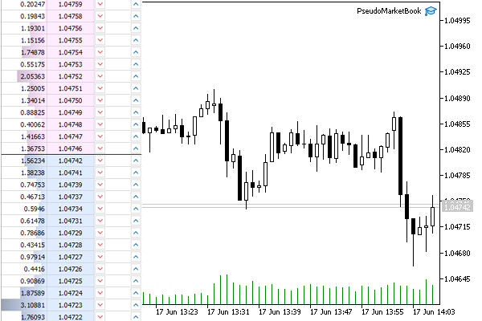

# Translation of order book changes

If necessary, an MQL program can generate an order book for a custom symbol using the CustomBookAdd function. This, in particular, can be useful for instruments from external exchanges, such as cryptocurrencies.

int CustomBookAdd(const string symbol, const MqlBookInfo &books[], uint count = WHOLE_ARRAY)

The function broadcasts the state of the [order book](/en/book/automation/marketbook) to the signed MQL programs for the custom symbol using data from the books array. The array describes the full state of the order book, that is, all buy and sell orders. The translated state completely replaces the previous one and becomes available through the [MarketBookGet](/en/book/automation/marketbook/marketbook_get) function.

Using the count parameter, you can specify the number of elements of the books array to be passed to the function. The entire array is used by default.

The function returns an indicator of success (true) or error (false).

To obtain order books generated by the CustomBookAdd function, an MQL program that requires them must, as usual, subscribe to the events using [MarketBookAdd](/en/book/automation/marketbook/marketbook_add_release).

The update of an order book does not update the Bid and Ask prices of the instrument. To update the required prices, add ticks using [CustomTicksAdd](/en/book/advanced/custom_symbols/custom_symbols_ticks).

The transmitted data is checked for correctness: prices and volumes must be greater than zero, and for each element, its type, price, and volume must be specified (fields volume and/or volume_real). If at least one element of the order book is described incorrectly, the function will return an error.

The Book Depth parameter (SYMBOL_TICKS_BOOKDEPTH) of the custom instrument is also checked. If the number of sell or buy levels in the translated order book exceeds this value, the extra levels are discarded.

Volume with increased accuracy volume_real takes precedence over normal volume. If both values are specified for the order book element, volume_real will be used.

Attention! In the current implementation, CustomBookAdd automatically locks the custom symbol as if it were subscribed to it made by MarketBookAdd, but at the same time, the OnBookEvent events do not arrive (in theory, the program that generates order books can subscribe to them by calling MarketBookAdd explicitly and controlling what other programs receive). You can remove this lock by calling MarketBookRelease.   

   

This may be required due to the fact that the symbols for which there are subscriptions to the order book cannot be hidden from Market Watch by any means (until all explicit or implicit subscriptions are canceled from the programs, and the order book window is closed). As a consequence, such symbols cannot be deleted.

As an example, let's create a non-trading Expert Advisor PseudoMarketBook.mq5, which will generate a pseudo-state of the order book from the nearest tick history. This can be useful for symbols for which the order book is not translated, in particular for Forex. If you wish, you can use such custom symbols for formal debugging of your own trading algorithms using the order book.

Among the input parameters, we indicate the maximum depth of the order book.

```
input uint CustomBookDepth = 20;

```

The name of the custom symbol will be formed by adding the suffix ".Pseudo" to the name of the current chart symbol.

```
string CustomSymbol = _Symbol + ".Pseudo";

```

In the OnInit handler, we create a custom symbol and set its formula to the name of the original symbol. Thus, we will get a copy of the original symbol automatically updated by the terminal, and we will not need to trouble ourselves with copying quotes or ticks.

```
int OnInit()
{
   bool custom = false;
   if(!PRTF(SymbolExist(CustomSymbol, custom)))
   {
      if(PRTF(CustomSymbolCreate(CustomSymbol, CustomPath, _Symbol)))
      {
         CustomSymbolSetString(CustomSymbol, SYMBOL_DESCRIPTION, "Pseudo book generator");
         CustomSymbolSetString(CustomSymbol, SYMBOL_FORMULA, "\"" + _Symbol + "\"");
      }
   }
   ...

```

If the custom symbol already exists, the Expert Advisor can offer the user to delete it and complete the work there (the user should first close all charts with this symbol).

```
   else
   {
      if(IDYES == MessageBox(StringFormat("Delete existing custom symbol '%s'?",
         CustomSymbol), "Please, confirm", MB_YESNO))
      {
         PRTF(MarketBookRelease(CustomSymbol));
         PRTF(SymbolSelect(CustomSymbol, false));
         PRTF(CustomRatesDelete(CustomSymbol, 0, LONG_MAX));
         PRTF(CustomTicksDelete(CustomSymbol, 0, LONG_MAX));
         if(!PRTF(CustomSymbolDelete(CustomSymbol)))
         {
            Alert("Can't delete ", CustomSymbol, ", please, check up and delete manually");
         }
         return INIT_PARAMETERS_INCORRECT;
      }
   }
   ...

```

A special feature of this symbol is setting the SYMBOL_TICKS_BOOKDEPTH property, as well as reading the contract size SYMBOL_TRADE_CONTRACT_SIZE, which will be required when generating volumes.

```
   if(SymbolInfoInteger(_Symbol, SYMBOL_TICKS_BOOKDEPTH) != CustomBookDepth
   && SymbolInfoInteger(CustomSymbol, SYMBOL_TICKS_BOOKDEPTH) != CustomBookDepth)
   {
      Print("Adjusting custom market book depth");
      CustomSymbolSetInteger(CustomSymbol, SYMBOL_TICKS_BOOKDEPTH, CustomBookDepth);
   }
   
   depth = (int)PRTF(SymbolInfoInteger(CustomSymbol, SYMBOL_TICKS_BOOKDEPTH));
   contract = PRTF(SymbolInfoDouble(CustomSymbol, SYMBOL_TRADE_CONTRACT_SIZE));
   
   return INIT_SUCCEEDED;
}

```

The algorithm is launched in the OnTick handler. Here we call the GenerateMarketBook function which is yet to be written. It will fill the array of structures MqlBookInfo passed by reference, and we'll send it to a custom symbol using CustomBookAdd.

```
void OnTick()
{
   MqlBookInfo book[];
   if(GenerateMarketBook(2000, book))
   {
      ResetLastError();
      if(!CustomBookAdd(CustomSymbol, book))
      {
         Print("Can't add market books, ", E2S(_LastError));
         ExpertRemove();
      }
   }
}

```

The GenerateMarketBook function analyzes the latest count ticks and, based on them, emulates the possible state of the order book, guided by the following hypotheses:

- What has been bought is likely to be sold
- What has been sold is likely to be bought

The division of ticks into those that correspond to purchases and sales, in the general case (in the absence of exchange flags) can be estimated by the movement of the price itself:

- The movement of the Ask price upwards is treated as a purchase
- The movement of the Bid price downwards is treated as a sale

As a result, we get the following algorithm.

```
bool GenerateMarketBook(const int count, MqlBookInfo &book[])
{
   MqlTick tick; // order book centre
   if(!SymbolInfoTick(_Symbol, tick)) return false;
   
   double buys[];  // buy volumes by price levels
   double sells[]; // sell volumes by price levels
   
   MqlTick ticks[];
   CopyTicks(_Symbol, ticks, COPY_TICKS_ALL, 0, count); // request tick history
   for(int i = 1; i < ArraySize(ticks); ++i)
   {
      // we believe that ask was pushed up by buys
      int k = (int)MathRound((tick.ask - ticks[i].ask) / _Point);
      if(ticks[i].ask > ticks[i - 1].ask)
      {
         // already bought, probably will take profit by selling
         if(k <= 0)
         {
            Place(sells, -k, contract / sqrt(sqrt(ArraySize(ticks) - i)));
         }
      }
      
      // believe that the bid was pushed down by sells
      k = (int)MathRound((tick.bid - ticks[i].bid) / _Point);
      if(ticks[i].bid < ticks[i - 1].bid)
      {
         // already sold, probably will take profit by buying
         if(k >= 0)
         {
            Place(buys, k, contract / sqrt(sqrt(ArraySize(ticks) - i)));
         }
      }
   }
   ...

```

The helper function Place fills buys and sells arrays, accumulating volumes in them by price levels. We will show this below. Indexes in arrays are defined as the distance in points from the current best prices (Bid or Ask). The size of the volume is inversely proportional to the age of the tick, i.e. ticks that are more distant in the past have less effect.

After the arrays are filled, an array of structures MqlBookInfo is formed based on them.

```
   for(int i = 0, k = 0; i < ArraySize(sells) && k < depth; ++i) // top half of the order book
   {
      if(sells[i] > 0)
      {
         MqlBookInfo info = {};
         info.type = BOOK_TYPE_SELL;
         info.price = tick.ask + i * _Point;
         info.volume = (long)sells[i];
         info.volume_real = (double)(long)sells[i];
         PUSH(book, info);
         ++k;
      }
   }
   
   for(int i = 0, k = 0; i < ArraySize(buys) && k < depth; ++i) // bottom half of the order book
   {
      if(buys[i] > 0)
      {
         MqlBookInfo info = {};
         info.type = BOOK_TYPE_BUY;
         info.price = tick.bid - i * _Point;
         info.volume = (long)buys[i];
         info.volume_real = (double)(long)buys[i];
         PUSH(book, info);
         ++k;
      }
   }
   
   return ArraySize(book) > 0;
}

```

The Place function is simple.

```
void Place(double &array[], const int index, const double value = 1)
{
   const int size = ArraySize(array);
   if(index >= size)
   {
      ArrayResize(array, index + 1);
      for(int i = size; i <= index; ++i)
      {
         array[i] = 0;
      }
   }
   array[index] += value;
}

```

The following screenshot shows a EURUSD chart with the PseudoMarketBook.mq5 Expert Advisor running on it, and the resulting version of the order book.



Synthetic order book of a custom symbol based on EURUSD
