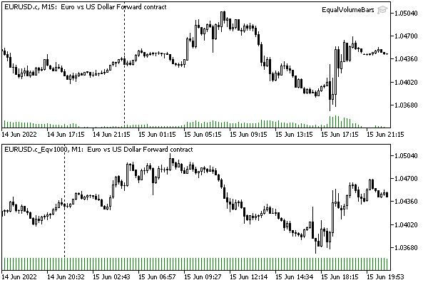
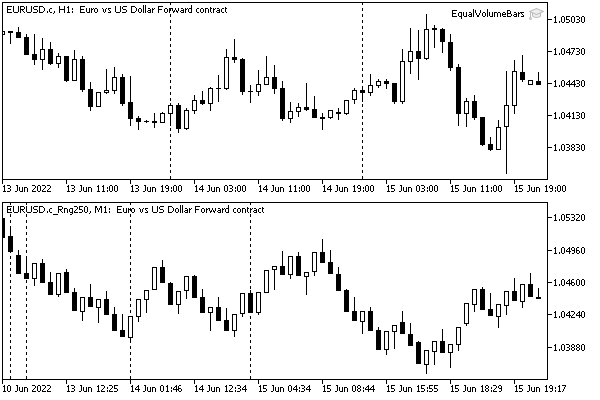
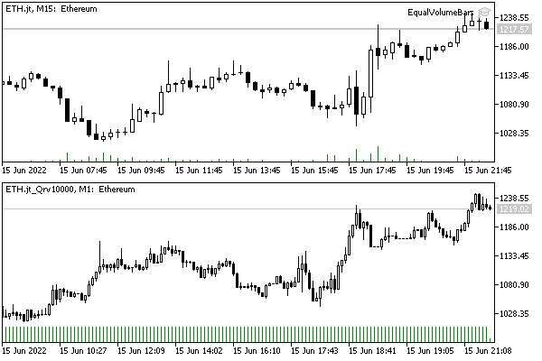
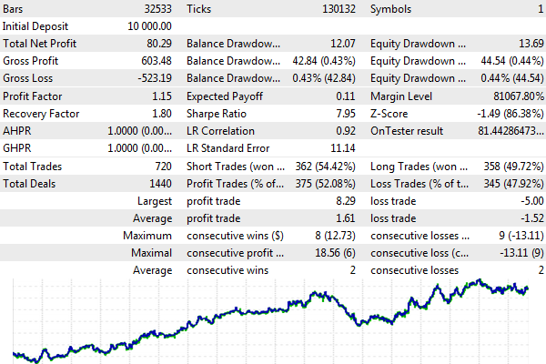
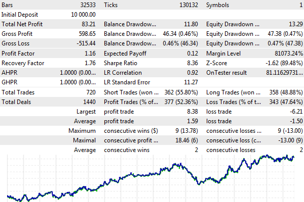
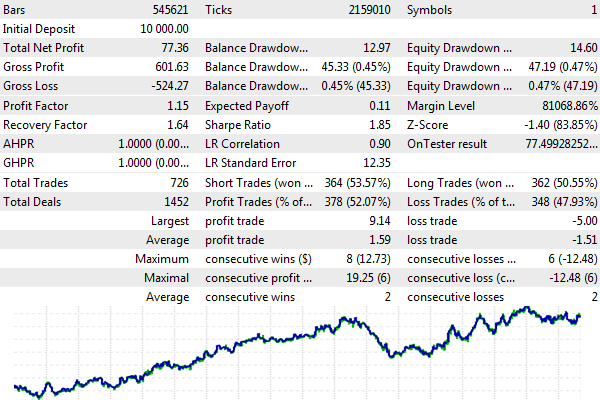

# Custom symbol trading specifics

The custom symbol is known only to the client terminal and is not available on the trade server. Therefore, if a custom symbol is built on the basis of some real symbol, then any Expert Advisor placed on the chart of such a custom symbol should generate trade orders for the original symbol.

As the simplest solution to this problem, you can place an Expert Advisor on the chart of the original symbol but receive signals (for example, from indicators) from the custom symbol. Another obvious approach is to replace the names of the symbols when performing trading operations. To test both approaches, we need a custom symbol and an Expert Advisor.

As an interesting practical example of custom symbols, let's take several different equivolume charts.

An equivolume (equal volume) chart is a chart of bars built on the principle of equality of the volume contained in them. On a regular chart, each new bar is formed at a specified frequency, coinciding with the timeframe size. On an equivolume chart, each bar is considered formed when the sum of ticks or real volumes reaches a preset value. At this moment, the program starts calculating the amount for the next bar. Of course, in the process of calculating volumes, price movements are controlled, and we get the usual sets of prices on the chart: Open, High, Low, and Close.

The equal-range bars are built in a similar way: a new bar opens there when the price passes a given number of points in any direction.

Thus, the EqualVolumeBars.mq5 Expert Advisor will support three modes, i.e., three chart types:

- EqualTickVolumes — equivolume bars by ticks
- EqualRealVolumes — equivolume bars by real volumes (if they are broadcast)
- RangeBars — equal range bars

They are selected using the input parameter WorkMode.

The bar size and history depth for calculation are specified in the parameters TicksInBar and StartDate.

```
input int TicksInBar = 1000;
input datetime StartDate = 0;

```

Depending on the mode, the custom symbol will receive the suffix "_Eqv", "_Qrv" or "_Rng", respectively, with the addition of the bar size.

Although the horizontal axis on an Equivolume/Equal-Range chart still represents chronology, the timestamps of each bar are arbitrary and depend on the volatility (number or size of trades) in each time frame. In this regard, the timeframe of the custom symbol chart should be chosen equal to the minimum M1.

The limitation of the platform is that all bars have the same nominal duration, but in the case of our "artificial" charts, it should be remembered that the real duration of each bar is different and can significantly exceed 1 minute or, on the contrary, be less. So, with a sufficiently small given volume for one bar, a situation may arise that new bars are formed much more often than once a minute, and then the virtual time of the custom symbol bars will run ahead of real time, into the future. To prevent this from happening, you should increase the volume of the bar (the TicksInBar parameter) or move old bars to the left.

Initialization and other auxiliary tasks for managing custom symbols (in particular, resetting an existing history, and opening a chart with a new symbol) are performed in a similar way as in other examples, and we will omit them. Let's turn to the specifics of an applied nature.

We will read the history of real ticks using built-in functions CopyTicks/CopyTicksRange: the first one is for swapping the history in batches of 10,000 ticks, and the second one is for requesting new ticks since the previous processing. All this functionality is packaged in the class TicksBuffer (full source code attached).

```
class TicksBuffer
{
private:
   MqlTick array[]; // internal array of ticks
   int tick;        // incremental index of the next tick for reading
public:
   bool fill(ulong &cursor, const bool history = false);
   bool read(MqlTick &t);
};

```

Public method fill is designed to fill the internal array with the next portion of ticks, starting from the cursor time (in milliseconds). At the same time, the time in cursor on each call moves forward based on the time of the last tick read into the buffer (note that the parameter is passed by reference).

Parameter history determines whether to use CopyTicks or CopyTicksRange. As a rule, online we will read one or more new ticks from the OnTick handler.

Method read returns one tick from the internal array and shifts the internal pointer (tick) to the next tick. If the end of the array is reached while reading, the method will return false, which means it's time to call the method fill.

Using these methods, the tick history bypass algorithm is implemented as follows (this code is indirectly called from OnInit via timer).

```
   ulong cursor = StartDate * 1000;
   TicksBuffer tb;
    
   while(tb.fill(cursor, true) && !IsStopped())
   {
      MqlTick t;
      while(tb.read(t))
      {
         HandleTick(t, true);
      }
   }

```

In the HandleTick function, it is required to take into account the properties of tick t in some global variables that control the number of ticks, the total trading volume (real, if any), as well as the price movement distance. Depending on the mode of operation, these variables should be analyzed differently for the condition of the formation of a new bar. So if in the equivolume mode, the number of ticks exceeded TicksInBar, we should start a new bar by resetting the counter to 1. In this case, the time of a new bar is taken as the tick time rounded to the nearest minute.

This group of global variables provides for storing the virtual time of the last ("current") bar on a custom symbol (now_time), its OHLC prices, and volumes.

```
datetime now_time;
double now_close, now_open, now_low, now_high;
long now_volume, now_real;

```

Variables are constantly updated both during history reading and later when the Expert Advisor starts processing online ticks in real-time (we will return to this a bit later).

In a somewhat simplified form, the algorithm inside HandleTick looks like this:

```
void HandleTick(const MqlTick &t, const bool history = false)
{
   now_volume++;               // count the number of ticks
   now_real += (long)t.volume; // sum up all real volumes
   
   if(!IsNewBar()) // continue the current bar
   {
      if(t.bid < now_low) now_low = t.bid;   // monitor price fluctuations downward
      if(t.bid > now_high) now_high = t.bid; // and upwards
      now_close = t.bid;                     // update the closing price
    
      if(!history)
      {
         // update the current bar if we are not in the history
         WriteToChart(now_time, now_open, now_low, now_high, now_close,
            now_volume - !history, now_real);
      }
   }
   else // new bar
   {
      do
      {
         // save the closed bar with all attributes
         WriteToChart(now_time, now_open, now_low, now_high, now_close,
            WorkMode == EqualTickVolumes ? TicksInBar : now_volume,
            WorkMode == EqualRealVolumes ? TicksInBar : now_real);
   
         // round up the time to the minute for the new bar
         datetime time = t.time / 60 * 60;
   
         // prevent bars with old or same time
         // if gone to the "future", we should just take the next count M1
         if(time <= now_time) time = now_time + 60;
   
         // start a new bar from the current price
         now_time = time;
         now_open = t.bid;
         now_low = t.bid;
         now_high = t.bid;
         now_close = t.bid;
         now_volume = 1;             // first tick in the new bar
         if(WorkMode == EqualRealVolumes) now_real -= TicksInBar;
         now_real += (long)t.volume; // initial real volume in the new bar
   
         // save new bar 0
         WriteToChart(now_time, now_open, now_low, now_high, now_close,
            now_volume - !history, now_real);
      }
      while(IsNewBar() && WorkMode == EqualRealVolumes);
   }
}

```

Parameter history determines whether the calculation is based on history or already in real-time (on incoming online ticks). If based on history, it is enough to form each bar once, while online, the current bar is updated with each tick. This allows you to speed up the processing of history.

The helper function IsNewBar returns true when the condition for closing the next bar according to the mode is met.

```
bool IsNewBar()
{
   if(WorkMode == EqualTickVolumes)
   {
      if(now_volume > TicksInBar) return true;
   }
   else if(WorkMode == EqualRealVolumes)
   {
      if(now_real > TicksInBar) return true;
   }
   else if(WorkMode == RangeBars)
   {
      if((now_high - now_low) / _Point > TicksInBar) return true;
   }
   
   return false;
}

```

The function WriteToChart creates a bar with the given characteristics by calling CustomRatesUpdate.

```
void WriteToChart(datetime t, double o, double l, double h, double c, long v, long m = 0)
{
   MqlRates r[1];
   
   r[0].time = t;
   r[0].open = o;
   r[0].low = l;
   r[0].high = h;
   r[0].close = c;
   r[0].tick_volume = v;
   r[0].spread = 0;
   r[0].real_volume = m;
   
   if(CustomRatesUpdate(SymbolName, r) < 1)
   {
      Print("CustomRatesUpdate failed: ", _LastError);
   }
}

```

The aforementioned loop of reading and processing ticks is performed during the initial access to the history, after the creation or complete recalculation of an already existing user symbol. When it comes to new ticks, the OnTick function uses a similar code but without the "historicity" flags.

```
void OnTick()
{
   static ulong cursor = 0;
   MqlTick t;
   
   if(cursor == 0)
   {
      if(SymbolInfoTick(_Symbol, t))
      {
         HandleTick(t);
         cursor = t.time_msc + 1;
      }
   }
   else
   {
      TicksBuffer tb;
      while(tb.fill(cursor))
      {
         while(tb.read(t))
         {
            HandleTick(t);
         }
      }
   }
   
   RefreshWindow(now_time);
}

```

The RefreshWindow function adds a custom symbol tick in the Market Watch.

Please note that tick forwarding increases the tick counter in the bar by 1, and therefore, when writing the tick counter to the 0th bar, we previously subtracted one (see the expression now_volume - !history when calling WriteToChart).

Tick generation is important because it triggers the OnTick event on custom instrument charts, which potentially allows Expert Advisors placed on such charts to trade. However, this technology requires some additional tricks, which we will consider later.

```
void RefreshWindow(const datetime t)
{
   MqlTick ta[1];
   SymbolInfoTick(_Symbol, ta[0]);
   ta[0].time = t;
   ta[0].time_msc = t * 1000;
   if(CustomTicksAdd(SymbolName, ta) == -1)
   {
      Print("CustomTicksAdd failed:", _LastError, " ", (long) ta[0].time);
      ArrayPrint(ta);
   }
}

```

We emphasize that the time of the generated custom tick is always set equal to the label of the current bar since we cannot leave the real tick time: if it has gone ahead by more than 1 minute and we will send such a tick to Market Watch, the terminal will create the next bar M1, which will violate our "equivolume" structure because our bars are formed not by time, but by volume filling (and we ourselves control this process).

In theory, we could add one millisecond to each tick, but we have no guarantee that the bar will not need to store more than 60,000 ticks (for example, if the user orders a chart with a certain price range that is unpredictable in terms of how many ticks will be required for such movement).

In modes by volume, it is theoretically possible to interpolate the second and millisecond components of the tick time using linear formulas:

- EqualTickVolumes — (now_volume - 1) * 60000 / TicksInBar;
- EqualRealVolumes — (now_real - 1) * 60000 / TicksInBar;

However, this is nothing more than a means of identifying ticks, and not an attempt to make the time of "artificial" ticks closer to the time of real ones. This is not only about the loss of unevenness of the real flow of ticks, which in itself will already lead to differences in price between the original symbol and the custom symbol generated on its basis.

The main problem is the need to round off the tick time along the border of the M1 bar and "pack" them within one minute (see the sidebar about special types of charts). For example, the next tick with real-time 12:37:05'123 becomes the 1001st tick and should form a new equivolume bar. However, bar M1 can only be timestamped to the minute, i.e. 12:37. As a result, the real price of the instrument at 12:37 will not match the price in the tick that provided the Open price for the equivolume bar 12:37. Also, if the next 1000 ticks stretch over several minutes, we will still be forced to "compress" their time so as not to reach the 12:38 mark.

The problem is of a systemic nature due to time quantization when special charts are emulated by a standard M1 timeframe chart. This problem cannot be completely solved on such charts. But when generating custom symbols with ticks in continuous time (for example, with synthetic quotes or based on streaming data from external services), this problem does not arise.

It is important to note that tick forwarding is done online only in this version of the generator, while custom ticks are not generated on history! This is done in order to speed up the creation of quotes. If you need to generate a tick history despite the slower process, the Expert Advisor EqualVolumeBars.mq5 should be adapted: exclude the WriteToChart function and perform the entire generation using CustomTicksReplace/CustomTicksAdd. At the same time, it should be remembered that the original time of ticks should be replaced by another one, within a minute bar, so as not to disturb the structure of the formed equivolume chart.

Let's see how EqualVolumeBars.mq5 works. Here is the working chart of EURUSD M15 with the Expert Advisor running in it. It has the equivolume chart, in which 1000 ticks are allotted for each bar.



Equivolume EURUSD chart with 1000 ticks per bar generated by the EqualVolumeBars Expert Advisor

Note that the tick volumes on all bars are equal, except for the last one, which is still forming (tick counting continues).

Statistics are displayed in the log.

```
Creating "EURUSD.c_Eqv1000"
Processing tick history...
End of CopyTicks at 2022.06.15 12:47:51
Bar 0: 2022.06.15 12:40:00 866 0
2119 bars written in 10 sec
Open "EURUSD.c_Eqv1000" chart to view results

```

Let's check another mode of operation: equal range. Below is a chart where the range of each bar is 250 points.



EURUSD equal range chart with 250 pips bars generated by EqualVolumeBars

For exchange instruments, the Expert Advisor allows the use of the real volume mode, for example, as follows:



Ethereum raw and equivolume chart with real volume of 10000 per bar

The timeframe of the working symbol when placing the Expert Advisor generator is not important, since the tick history is always used for calculations.

At the same time, the timeframe of the custom symbol chart must be equal to M1 (the smallest available in the terminal). Thus, the time of the bars, as a rule, corresponds as closely as possible (as far as possible) to the moments of their formation. However, during strong movements in the market, when the number of ticks or the size of volumes forms several bars per minute, the time of the bars will run ahead of the real one. When the market calms down, the situation with the time marks of the equi-volume bars will normalize. This does not affect the flow of online prices, so it is probably not particularly critical, since the whole point of using equal-volume or equal-range bars is to decouple from absolute time.

Unfortunately, the name of the original symbol and the custom symbol created on its basis cannot be linked in any way by means of the platform itself. It would be convenient to have a string field "origin" (source) among the properties of the custom symbol, in which we could write the name of the real working tool. By default, it would be empty, but if filled in, the platform could replace the symbol in all trade orders and history requests, and do it automatically and transparently for the user. In theory, among the properties of user-defined symbols, there is a SYMBOL_BASIS field that is suitable in terms of its meaning, but since we cannot guarantee that arbitrary generators of user-defined symbols (any MQL programs) will correctly fill it in or use it exactly for this purpose, we cannot rely on its use.

Since this mechanism is not in the platform, we will need to implement it ourselves. You will have to set the correspondence between the names of the source and user symbols using parameters.

To solve the problem, we developed the class CustomOrder (see the attached file CustomOrder.mqh). It contains wrapper methods for all MQL API functions related to sending trading orders and requesting history, which have a string parameter with the symbol name. In these methods, the custom symbol is replaced with the current working one or vice versa. Other API functions do not require "hooking". Below is a snippet.

```
class CustomOrder
{
private:
   static string workSymbol;
   
   static void replaceRequest(MqlTradeRequest &request)
   {
      if(request.symbol == _Symbol && workSymbol != NULL)
      {
         request.symbol = workSymbol;
         if(MQLInfoInteger(MQL_TESTER)
            && (request.type == ORDER_TYPE_BUY
            || request.type == ORDER_TYPE_SELL))
         {
            if(TU::Equal(request.price, SymbolInfoDouble(_Symbol, SYMBOL_ASK)))
               request.price = SymbolInfoDouble(workSymbol, SYMBOL_ASK);
            if(TU::Equal(request.price, SymbolInfoDouble(_Symbol, SYMBOL_BID)))
               request.price = SymbolInfoDouble(workSymbol, SYMBOL_BID);
         }
      }
   }
   
public:
   static void setReplacementSymbol(const string replacementSymbol)
   {
      workSymbol = replacementSymbol;
   }
   
   static bool OrderSend(MqlTradeRequest &request, MqlTradeResult &result)
   {
      replaceRequest(request);
      return ::OrderSend(request, result);
   }
   ...

```

Please note that the main working method replaceRequest replaces not only the symbol but also the current Ask and Bid prices. This is due to the fact that many custom tools, such as our Equivolume plot, have a virtual time that is different from the time of the real prototype symbol. Therefore, the prices of the custom instrument emulated by the tester are out of sync with the corresponding prices of the real instrument.

This artifact occurs only in the tester. When trading online, the custom symbol chart will be updated (at prices) synchronously with the real one, although the bar labels will differ (one "artificial" M1 bar has a real duration of more or less than a minute, and its countdown time is not a multiple of a minute). Thus, this price conversion is more of a precaution to avoid getting requotes in the tester. However, in the tester, we usually do not need to do symbol substitution, since the tester can trade with a custom symbol (unlike the broker's server). Further, just for the sake of interest, we will compare the results of tests run both with and without character substitution.

To minimize edits to the client source code, global functions and macros of the following form are provided (for all CustomOrder methods):

```
  bool CustomOrderSend(const MqlTradeRequest &request, MqlTradeResult &result)
  {
    return CustomOrder::OrderSend((MqlTradeRequest)request, result);
  }
  
  #define OrderSend CustomOrderSend

```

They allow the automatic redirection of all standard API function calls to the CustomOrder class methods. To do this, simply include CustomOrder.mqh into the Expert Advisor and set the working symbol, for example, in the WorkSymbol parameter:

```
  #include <CustomOrder.mqh>
  #include <Expert/Expert.mqh>
  ...
  input string WorkSymbol = "";
  
  int OnInit()
  {
    if(WorkSymbol != "")
    {
      CustomOrder::setReplacementSymbol(WorkSymbol);
      
      // initiate the opening of the chart tab of the working symbol (in the visual mode of the tester)
      MqlRates rates[1];
      CopyRates(WorkSymbol, PERIOD_CURRENT, 0, 1, rates);
    }
    ...
  }

```

It is important that the directive #include<CustomOrder.mqh> was the very first, before the others. Thus, it affects all source codes, including the standard libraries from the MetaTrader 5 distribution. If no substitution symbol is specified, the connected CustomOrder.mqh has no effect on the Expert Advisor and "transparently" transfers control to the standard API functions.

Now we have everything ready to test the idea of trading on a custom symbol, including the custom symbol itself.

Applying the technique shown above we modify the already familiar Expert Advisor BandOsMaPro, renaming it to BandOsMaCustom.mq5. Let's test it on the EURUSD equivolume chart with a bar size of 1000 ticks obtained using EqualVolumeBars.mq5.

Optimization or testing mode is set to OHLC M1 prices (more accurate methods do not make sense because we did not generate ticks and also because this version trades at the prices of formed bars). The date range is the entire 2021 and the first half of 2022. The file with the settings BandOsMACustom.set is attached.

In the tester settings, you should not forget to select the custom symbol EURUSD_Eqv1000 and the M1 timeframe, since it is on it that equi-volume bars are emulated.

When the WorkSymbol parameter is empty, the Expert Advisor trades a custom symbol. Here are the results:



Tester's report when trading on the EURUSD_Eqv1000 equivolume chart

If the WorkSymbol parameter equals EURUSD, the Expert Advisor trades the EURUSD pair, despite the fact that it works on the EURUSD_Eqv1000 chart. The results differ but not much.



Tester's report when trading EURUSD from the EURUSD_Eqv1000 equivolume chart

However, as it was already mentioned at the beginning of the section, there is an easier way for Expert Advisors which trade on indicator signals to support custom symbols. To do this, it is enough to create indicators on a custom symbol and place the Expert Advisor on the chart of a working symbol.

We can easily implement this option. Let's call it BandOsMACustomSignal.mq5.

The header file CustomOrder.mqh is no longer needed. Instead of the WorkSymbol input parameter, we add two new ones:

```
input string SignalSymbol = "";
input ENUM_TIMEFRAMES SignalTimeframe = PERIOD_M1;

```

They should be passed to the constructor of the BandOsMaSignal class which manages the indicators. Previously, _Symbol and _Period were used everywhere.

```
interface TradingSignal
{
   virtual int signal(void);
   virtual string symbol();
   virtual ENUM_TIMEFRAMES timeframe();
};
   
class BandOsMaSignal: public TradingSignal
{
   int hOsMA, hBands, hMA;
   int direction;
   const string _symbol;
   const ENUM_TIMEFRAMES _timeframe;
public:
   BandOsMaSignal(const string s, const ENUM_TIMEFRAMES tf,
      const int fast, const int slow, const int signal, const ENUM_APPLIED_PRICE price,
      const int bands, const int shift, const double deviation,
      const int period, const int x, ENUM_MA_METHOD method): _symbol(s), _timeframe(tf)
   {
      hOsMA = iOsMA(s, tf, fast, slow, signal, price);
      hBands = iBands(s, tf, bands, shift, deviation, hOsMA);
      hMA = iMA(s, tf, period, x, method, hOsMA);
      direction = 0;
   }
   ...
   virtual string symbol() override
   {
      return _symbol;
   }
   
   virtual ENUM_TIMEFRAMES timeframe() override
   {
      return _timeframe;
   }
}

```

Since the symbol and timeframe for signals can now differ from the symbol and period of the chart, we have expanded the TradingSignal interface by adding read methods. The actual values are passed to the constructor in OnInit.

```
int OnInit()
{
   ...
   strategy = new SimpleStrategy(
      new BandOsMaSignal(SignalSymbol != "" ? SignalSymbol : _Symbol,
         SignalSymbol != "" ? SignalTimeframe : _Period,
         p.fast, p.slow, SignalOsMA, PriceOsMA,
         BandsMA, BandsShift, BandsDeviation,
         PeriodMA, ShiftMA, MethodMA),
         Magic, StopLoss, Lots);
   return INIT_SUCCEEDED;
}

```

In the SimpleStrategy class, the trade method now checks for the occurrence of a new bar not according to the current chart, but according to the properties of the signal.

```
   virtual bool trade() override
   {
      // looking for a signal once at the opening of the bar of the desired symbol and timeframe
      if(lastBar == iTime(command[].symbol(), command[].timeframe(), 0)) return false;
      
      int s = command[].signal(); // get signal
      ...
   }

```

For a comparative experiment with the same settings, the Expert Advisor BandOsMACustomSignal.mq5 should be launched on EURUSD (you can use M1 or another timeframe), and EURUSD_Eqv1000 should be specified in the SignalSymbol parameter. SignalTimeframe should be left equal to PERIOD_M1 by default. As a result, we will get a similar report.



Tester's report when trading on the EURUSD chart based on signals from the EURUSD_Eqv1000 equivolume symbol

The number of bars and ticks is different here because EURUSD was chosen as the tested instrument and not the custom EURUSD_Eqv1000.

All three test results are slightly different. This is due to the "packing" of quotes into minute bars and a slight desynchronization of the price movements of the original and custom instruments. Which of the results is more accurate? This, most likely, depends on the specific trading system and the features of its implementation. In the case of our Expert Advisor BandOsMa with control over bar opening, the version with direct trading on EURUSD_Eqv1000 should have the most realistic results. In theory, the rule of thumb stating that of several alternative checks, the most reliable is the least profitable, is almost always satisfied.

So, we have analyzed a couple of techniques for adapting Expert Advisors for trading on custom symbols that have a prototype among the broker's working symbols. However, this situation is not mandatory. In many cases, custom symbols are generated based on data from external systems such as crypto exchanges. Trading on them must be done using their public API with MQL5 [network functions](/en/book/advanced/network).

Emulating special types of charts with custom symbols  

   

Many traders use special types of charts, in which continuous real-time is excluded from consideration. This includes not only equivolume and equal range bars, but also Renko, Point-And-Figure (PAF), Kagi, and others. Custom symbols allow these kinds of charts to be emulated in MetaTrader 5 using M1 timeframe charts but should be treated with caution when it comes to testing trading systems rather than technical analysis.   

   

For special types of charts, the actual bar opening time (accurate to milliseconds) almost always does not coincide exactly with the minute with which the M1 bar will be marked. Thus, the opening price of a custom bar differs from the opening price of the M1 bar of a standard symbol.   

   

Moreover, other OHLC prices will also differ because the real duration of the formation of the M1 bar on a special chart is not equal to one minute. For example, 1000 ticks for an equivolume chart can accumulate for longer than 5 minutes.  

   

The closing price of a custom bar also does not correspond to the real closing time because a custom bar is, technically, an M1 bar, i.e. it has a nominal duration of 1 minute.   

   

Special care should be taken when working with such types of charts as the classic Renko or PAF. The fact is that their reversal bars have an opening price with a gap from the closing of the previous bar. Thus, the opening price becomes a predictor of future price movement.   

   

The analysis of such charts is supposed to be carried out according to the formed bars, that is, their characteristic price is the closing price, however, when working by bar, the tester provides only the opening price for the current (last) bar (there is no mode by closing prices). Even if we take indicator signals from closed bars (usually from the 1st one), deals are made at the current price of the 0th bar anyway. And even if we turn to tick modes, the tester always generates ticks according to the usual rules, guided by reference points based on the configuration of each bar. The tester does not take into account the structure and behavior of special charts, which we are trying to visually emulate with M1 bars.   

   

Trading in the tester using such symbols in any mode (by opening prices, M1 OHLC, or by ticks) affects the accuracy of the results: they are too optimistic and can serve as a source of too high expectations. In this regard, it is essential to check the trading system not on a separate Renko or PAF chart, but in conjunction with the execution of orders on a real symbol.   

   

Custom symbols can also be used for second timeframes or tick charts. In this case, virtual time is also generated for bars and ticks, decoupled from real-time. Therefore, such charts are well suited for operational analysis but require additional attention when developing and testing trading strategies, especially multi-symbol ones.   

   

An alternative for any custom symbols is the independent calculation of arrays of bars and ticks inside an Expert Advisor or indicator. However, debugging and visualizing such structures requires additional effort.
