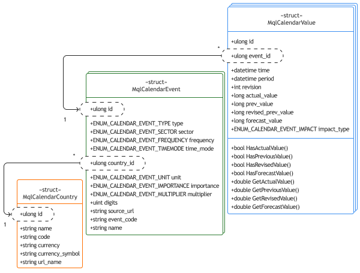

# Basic concepts of the calendar

When working with the calendar, we will operate with several concepts, for the formal description of which MQL5 defines special types of structures.

First of all, the events are related to specific countries, and each country is described using the MqlCalendarCountry structure.

```
struct MqlCalendarCountry
{ 
   ulong  id;              //country identifier according to ISO 3166-1 
   string name;            // text name of the country (in the current terminal encoding) 
   string code;            // two-letter country designation according to ISO 3166-1 alpha-2 
   string currency;        // international country currency code 
   string currency_symbol; // symbol/sign of the country's currency 
   string url_name;        // country name used in the URL on the mql5.com website 
};

```

How to get a list of countries available in the calendar and their attributes as an array of MqlCalendarCountry structures, we will find out in the next section.

For now, we just pay attention to the id field. It is important because it is the key to determining whether calendar events belong to a particular country. In each country (or a registered association of countries, such as the European Union) there is a specific, internationally known list of types of economic indicators and informational events that affect the market and are therefore included in the calendar.

Each event type is defined by the MqlCalendarEvent structure, in which the field country_id uniquely links the event to the country. We will consider the types of enumerations used below.

```
struct MqlCalendarEvent
{ 
   ulong                          id;         // event ID 
   ENUM_CALENDAR_EVENT_TYPE       type;       // event type 
   ENUM_CALENDAR_EVENT_SECTOR     sector;     // sector to which the event belongs 
   ENUM_CALENDAR_EVENT_FREQUENCY  frequency;  // frequency (periodicity) of the event 
   ENUM_CALENDAR_EVENT_TIMEMODE   time_mode;  // event time mode 
   ulong                          country_id; // country identifier 
   ENUM_CALENDAR_EVENT_UNIT       unit;       // indicator unit 
   ENUM_CALENDAR_EVENT_IMPORTANCE importance; // importance of the event 
   ENUM_CALENDAR_EVENT_MULTIPLIER multiplier; // indicator multiplier 
   uint                           digits;     // number of decimal places
   string                         source_url; // URL of the event publication source 
   string                         event_code; // event code
   string                         name;       // text name of the event in the terminal language 
};

```

It is important to understand that the MqlCalendarEvent structure describes exactly the type of event (for example, the publication of the Consumer Price Index, CPI) but not a specific event that may occur once a quarter, once a month, or according to another schedule. It contains the general characteristics of the event, including importance, frequency, relation to the sector of the economy, units of measurement, name, and source of information. As for the actual and forecast indicators, these will be provided in the calendar entries for each specific event of this type: these entries are stored as MqlCalendarValue structures, which will be discussed later. Functions for querying the supported types of events will be introduced in later sections.

The event type in the type field is specified as one of the ENUM_CALENDAR_EVENT_TYPE enumeration values.

| Identifier | Description |
| --- | --- |
| CALENDAR_TYPE_EVENT | Event (meeting, speech, etc.) |
| CALENDAR_TYPE_INDICATOR | Economic indicator |
| CALENDAR_TYPE_HOLIDAY | Holiday (weekend) |

The sector of the economy to which the event belongs is selected from the ENUM_CALENDAR_EVENT_SECTOR enumeration.

| Identifier | Description |
| --- | --- |
| CALENDAR_SECTOR_NONE | Sector is not set |
| CALENDAR_SECTOR_MARKET | Market, exchange |
| CALENDAR_SECTOR_GDP | Gross Domestic Product (GDP) |
| CALENDAR_SECTOR_JOBS | Labor market |
| CALENDAR_SECTOR_PRICES | Prices |
| CALENDAR_SECTOR_MONEY | Money |
| CALENDAR_SECTOR_TRADE | Trade |
| CALENDAR_SECTOR_GOVERNMENT | Government |
| CALENDAR_SECTOR_BUSINESS | Business |
| CALENDAR_SECTOR_CONSUMER | Consumption |
| CALENDAR_SECTOR_HOUSING | Housing |
| CALENDAR_SECTOR_TAXES | Taxes |
| CALENDAR_SECTOR_HOLIDAYS | Holidays |

The frequency of the event is indicated in the frequency field using the ENUM_CALENDAR_EVENT_FREQUENCY enumeration.

| Identifier | Description |
| --- | --- |
| CALENDAR_FREQUENCY_NONE | Publication frequency is not set |
| CALENDAR_FREQUENCY_WEEK | Weekly |
| CALENDAR_FREQUENCY_MONTH | Monthly |
| CALENDAR_FREQUENCY_QUARTER | Quarterly |
| CALENDAR_FREQUENCY_YEAR | Yearly |
| CALENDAR_FREQUENCY_DAY | Daily |

Event duration (time_mode) can be described by one of the elements of the ENUM_CALENDAR_EVENT_TIMEMODE enumeration.

| Identifier | Description |
| --- | --- |
| CALENDAR_TIMEMODE_DATETIME | The exact time of the event is known |
| CALENDAR_TIMEMODE_DATE | The event takes all day |
| CALENDAR_TIMEMODE_NOTIME | Time is not published |
| CALENDAR_TIMEMODE_TENTATIVE | Only the day is known in advance, but not the exact time of the event (the time is specified after the fact) |

The importance of the event is specified in the importance field using the ENUM_CALENDAR_EVENT_IMPORTANCE enumeration.

| Identifier | Description |
| --- | --- |
| CALENDAR_IMPORTANCE_NONE | Not set |
| CALENDAR_IMPORTANCE_LOW | Low |
| CALENDAR_IMPORTANCE_MODERATE | Moderate |
| CALENDAR_IMPORTANCE_HIGH | High |

The units of measurement in which event values are given are defined in the unit field as a member of the ENUM_CALENDAR_EVENT_UNIT enumeration.

| Identifier | Description |
| --- | --- |
| CALENDAR_UNIT_NONE | Unit is not set |
| CALENDAR_UNIT_PERCENT | Interest (%) |
| CALENDAR_UNIT_CURRENCY | National currency |
| CALENDAR_UNIT_HOUR | Number of hours |
| CALENDAR_UNIT_JOB | Number of workplaces |
| CALENDAR_UNIT_RIG | Drilling rigs |
| CALENDAR_UNIT_USD | U.S. dollars |
| CALENDAR_UNIT_PEOPLE | Number of people |
| CALENDAR_UNIT_MORTGAGE | Number of mortgage loans |
| CALENDAR_UNIT_VOTE | Number of votes |
| CALENDAR_UNIT_BARREL | Amount in barrels |
| CALENDAR_UNIT_CUBICFEET | Volume in cubic feet |
| CALENDAR_UNIT_POSITION | Net volume of speculative positions in contracts |
| CALENDAR_UNIT_BUILDING | Number of buildings |

In some cases, the values of an economic indicator require a multiplier according to one of the elements of the ENUM_CALENDAR_EVENT_MULTIPLIER enumeration.

| Identifier | Description |
| --- | --- |
| CALENDAR_MULTIPLIER_NONE | Multiplier is not set |
| CALENDAR_MULTIPLIER_THOUSANDS | Thousands |
| CALENDAR_MULTIPLIER_MILLIONS | Millions |
| CALENDAR_MULTIPLIER_BILLIONS | Billions |
| CALENDAR_MULTIPLIER_TRILLIONS | Trillions |

So, we have considered all the special data types used to describe the types of events in the MqlCalendarEvent structure.

A separate calendar entry is formed as a MqlCalendarValue structure. Its detailed description is given below, but for now, it is important to pay attention to the following nuance. MqlCalendarValue has the event_id field which points to the identifier of the event type, i.e., contains one of the existing id in MqlCalendarEvent structures.

As we saw above, the MqlCalendarEvent structure in turn is related to MqlCalendarCountry via the country_id field. Thus, having once entered information about a specific country or type of event into the calendar database, it is possible to register an arbitrary number of similar events for them. Of course, the information provider is responsible for filling the database, not the developers.

Let's summarize the subtotal: the system stores three internal tables separately:

- The MqlCalendarCountry structure table to describe countries
- The MqlCalendarEvent structure table with descriptions of types of events
- The MqlCalendarValue structure table with indicators of specific events of various types

By referencing event type identifiers, duplication of information is eliminated from records of specific events. For example, monthly publications of CPI values only refer to the same MqlCalendarEvent structure with the general characteristics of this event type. If it were not for the different tables, it would be necessary to repeat the same properties in each CPI calendar entry. This approach to establishing relationships between tables with data using identifier fields is called relational, and we will return to it in the chapter on [SQLite](/en/book/advanced/sqlite). All this is illustrated in the following diagram.



Diagram of links between structures by fields with identifiers

All tables are stored in the internal calendar database, which is constantly kept up to date while the terminal is connected to the server.

Calendar entries (specific events) are MqlCalendarValue structures. They are also identified by their own unique number in the id field (each of the three tables has its own id field).

```
struct MqlCalendarValue 
{ 
   ulong      id;                 // entry ID 
   ulong      event_id;           // event type ID 
   datetime   time;               // time and date of the event 
   datetime   period;             // reporting period of the event 
   int        revision;           // revision of the published indicator in relation to the reporting period 
   long       actual_value;       // actual value in ppm or LONG_MIN 
   long       prev_value;         // previous value in ppm or LONG_MIN 
   long       revised_prev_value; // revised previous value in ppm or LONG_MIN 
   long       forecast_value;     // forecast value in ppm or LONG_MIN 
   ENUM_CALENDAR_EVENT_IMPACT impact_type;  // potential impact on the exchange rate
    
 // functions for checking values
   bool HasActualValue(void) const;     // true if the actual_value field is filled 
   bool HasPreviousValue(void) const;   // true if the prev_value field is filled 
   bool HasRevisedValue(void) const;    // true if the revised_prev_value field is filled 
   bool HasForecastValue(void) const;   // true if the forecast_value field is filled
    
   // functions for getting values 
   double GetActualValue(void) const;   // actual_value or nan if value is not set 
   double GetPreviousValue(void) const; // prev_value or nan if value is not set 
   double GetRevisedValue(void) const;  // revised_prev_value or nan if value is not set 
   double GetForecastValue(void) const; // forecast_value or nan if value is not set 
};

```

For each event, in addition to the time of its publication (time), the following four values are also stored:

- Actual value (actual_value), which becomes known immediately after the publication of the news
- Previous value (prev_value), which became known in the last release of the same news
- Revised value of the previous indicator, revised_prev_value (if it has been modified since the last publication)
- Forecast value (forecast_value)

Obviously, not all the fields must be necessarily filled. So, the current value is absent (not yet known) for future events, and the revision of past values also does not always occur. In addition, all four fields make sense only for quantitative indicators, while the calendar also reflects regulators' speeches, meetings and holidays.

An empty field (no value) is indicated by the constant LONG_MIN (-9223372036854775808). If the value in the field is specified (not equal to LONG_MIN), then it corresponds to the real value of the indicator increased by a million times, that is, to obtain the indicator in the usual (real) form, it is necessary to divide the field value by 1,000,000.

For the convenience of the programmer, the structure defines 4 Has methods for checking the field is filled, as well as 4 Get methods that return the value of the corresponding field already converted to a real number, and in the case when it is not filled, the method will return [NaN](/en/book/common/maths/maths_nan) (Not A Number).

Sometimes, in order to obtain absolute values (if they are required for the algorithm), it is important to additionally analyze the multiplier property in the MqlCalendarEvent structure since some values are specified in multiple units according to the ENUM_CALENDAR_EVENT_MULTIPLIER enumeration. Besides, MqlCalendarEvent has the digits field, which specifies the number of significant digits in the received values for subsequent correct formatting (for example, in a call to NormalizeDouble).

The reporting period (for which the published indicator is calculated) is set in the period field as its first day. For example, if the indicator is calculated monthly, then the date '2022.05.01 00:00:00' means the month of May. The duration of the period (for example, month, quarter, year) is defined in the frequency field of the related structure MqlCalendarEvent: the type of this field is the special ENUM_CALENDAR_EVENT_FREQUENCY enumeration described above, along with other enumerations.

Of particular interest is the impact_type field, in which, after the release of the news, the direction of influence of the corresponding currency on the exchange rate is automatically set by comparing the current and forecast values. This influence can be positive (the currency is expected to appreciate) or negative (the currency is expected to depreciate). For example, a larger drop in sales than expected would be labeled as having a negative impact, and a larger drop in unemployment as positive. But this characteristic is interpreted unambiguously not for all events (some economic indicators are considered contradictory), and besides, one should pay attention to the relative numbers of changes.

The potential impact of an event on the national currency rate is indicated using the ENUM_CALENDAR_EVENT_IMPACT enumeration.

| Identifier | Description |
| --- | --- |
| CALENDAR_IMPACT_NA | Influence is not stated |
| CALENDAR_IMPACT_POSITIVE | Positive influence |
| CALENDAR_IMPACT_NEGATIVE | Negative influence |

Another important concept of the calendar is the fact of its change. Unfortunately, there is no special structure for change. The only property a change has is its unique ID, which is an integer assigned by the system each time the internal calendar base is changed.

As you know, the calendar is constantly modified by information providers: new upcoming events are added to it, and already published indicators and forecasts are corrected. Therefore, it is very important to keep track of any edits, the occurrence of which makes it possible to detect periodically increasing change numbers.

The edit time with a specific identifier and its essence are not available in MQL5. If necessary, MQL programs should implement periodic calendar state queries and record analysis themselves.

A set of MQL5 functions allows getting information about countries, types of events and specific calendar entries, as well as their changes. We will consider this in the following sections.

Attention! When accessing the calendar for the first time (if the Calendar tab in the terminal toolbar has not been opened before), it may take several seconds to synchronize the internal calendar database with the server.
